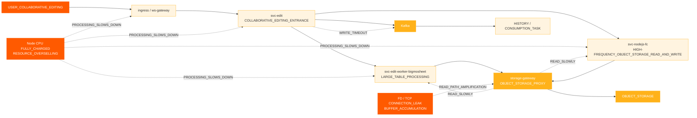
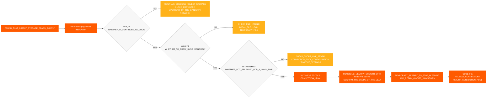
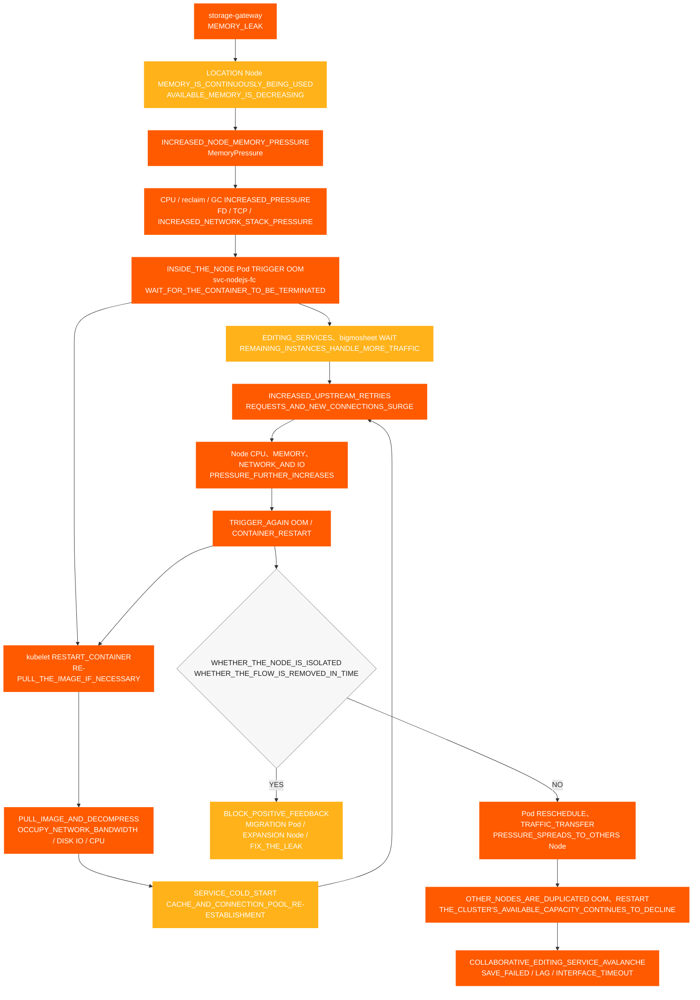

# Zusammenarbeitsbearbeitung Vorfall

[← ShimoDocs Suite Bereitstellungsdokumentation](../README.md)

## 1. Hintergrund des Falls 

Die Umgebung eines großen Unternehmens erlebte einen Vorfall vom Typ „Nichtverfügbarkeit bei kollaborativem Bearbeiten“, der die normale Bearbeitung und das Speichern einiger Tabellenkalkulationen und Dokumente durch die Nutzer beeinträchtigte. Während des Vorfalls stießen die Nutzer auf Phänomene wie fehlgeschlagene Speicherungen, Verzögerungen bei der Bearbeitung und Kafka Schreibzeitüberschreitungen; auf der Serverseite Probleme wie langsame Objektspeicher-Lesevorgänge, abnormale Knoten CPU Gebrauch und abnormal TCP/FD-Metriken traten ebenfalls auf. 

Dieser Fall zeigt, dass die Nichtverfügbarkeit der kollaborativen Bearbeitung nicht unbedingt direkt durch den Bearbeitungsdienst selbst verursacht wird. Sie kann auch kollektiv durch Probleme wie überverkaufte zugrunde liegende Ressourcen, konzentrierte Node-Planung, verlangsamte Middleware-Schreibvorgänge, abnormale Objekt-Speicher-Lesewege oder Verbindungslecks verstärkt werden. 

## 2. Manifestation des Vorfalls 

Die Hauptauswirkungen dieses Vorfalls waren: 

- Kollaborative Bearbeitungslinks wurden nicht verfügbar, verzögert oder hatten Interfacetimeouts. 
- Einige Tabellenkalkulationen oder Dokumente konnten nicht normal gespeichert werden. 
- Editierer-Seiten-Pop-ups wurden angezeigt `Kafka write timeout`. 
- Objektspeicher-Lesezeiten stiegen, was die Bearbeitungslink-Verarbeitung weiter beeinträchtigte. 
- Pod-Überwachung erschien normal, aber Benutzer meldeten kontinuierlich fehlgeschlagene Speicherung, Bearbeitungsverzögerungen und Interfacetimeouts. 

## 3. Vorläufiger Ermittlungsprozess 

### 3.1 Beginnend von Benutzerphänomenen in den Bearbeitungslink 

Der Kunde meldete zunächst Anomalien bei einigen Dokumenten, daher konzentrierte sich die anfängliche Untersuchung auf kollaborative Bearbeitungsprobleme: 
1. Überprüfen Sie den Bearbeitungs- und Speichern-Link. 
2. Überprüfen Sie relevante Serviceprotokolle. 

3. Überprüfen Sie Kafka Schreibstatus. 
4. Überprüfen Sie die Latenz des Objekt-Speichers bei Lesen/Schreiben. 

Während der Untersuchung wurden zwei wesentliche Anomalien festgestellt: 

- `Kafka write timeout` aufgetreten im Bearbeitungslink. 
- Abnormale Lese-Latenz des Objektspeichers. 

### 3.2 Vorläufige Bestätigung externer Abhängigkeiten 

Während der Untersuchung haben wir einzeln mit den Eigentümern der externen Abhängigkeiten bestätigt: 

- Mit der Objektspeicherseite bestätigt, keine offensichtlichen Probleme beim Cloud-Anbieter festgestellt. 
- Bestätigt mit Kafka Betrieb, keine offensichtlichen Probleme auf der Kafka Cluster-Seite gefunden. 

Daher kann das Problem nicht direkt dem Objektspeicher zugeschrieben werden oder Kafka Dienste selbst, und weitere Untersuchungen müssen in Richtung lokaler Geschäftsstellen, Gateways, Verbindungspools, Netzwerk- und Ressourcenschichten fortgesetzt werden. 

### 3.3 Wechsel von der Pod-Überwachung zur Node-Überwachung 

Anfangs, beim Überprüfen der Pod-Überwachung, beide CPU und der Speicher lagen in relativ sicheren Bereichen, aber der Kunde meldete, dass die Node-CPUs ausgelastet waren. 

Dies war der entscheidende Wendepunkt in der aktuellen Diagnose: 

- Bei Ressourcenüberbuchung kann die Pod-Überwachung möglicherweise den Druck auf die Node nicht genau widerspiegeln. 
- Sobald die Node CPU ist maximal ausgelastet, die Geschäftsbearbeitungskapazität innerhalb von Containern nimmt ab. 
- Nachdem die Geschäftsbearbeitung verlangsamt wurde, äußert sich dies weiter in langsamen Objekt-Storage-Lesevorgängen, langsamen Kafka Schreibvorgängen, Anfragenstau und fehlgeschlagenen Speicherungen. 

## 4. Fehlerauswirkungskette 

## 5. Wichtige Erkenntnisse 

### 5.1 Knoten CPU Abnormalitäten 

Mehrere Knoten haben erfahren CPU Anomalien in der Reihenfolge: 
- '10.142.191.54' startete eine Ausnahme um 18:20. 
- '10.76.176.65' startete eine Ausnahme um 18:30. 
- '10.76.238.202' startete eine Ausnahme um 18:40. 
- '10.142.206.216' startete die Anomalie um 18:42. 
- '10.142.175.191' startete die Anomalie um 18:45. 

Es ist zu erkennen, dass die erste Anomalie '10.142.191.54' war, gefolgt von CPU Problemen auf anderen Knoten, was dem Merkmal von Ein-Punkt-Ressourcenanomalien entspricht, die sich auf mehrere Knoten ausbreiten. 

### 5.2 CPU und Speicherüberschreitung 

Die Ressourcenauslastung vor und nach dem Ausfall ist wie folgt: 

| Szenario | Ressource | Cluster-Kapazität | Gesamtanforderung | Anforderungsanteil | Gesamtgrenze | Überschreitung |
| --- | --- | --- | --- | --- | --- | --- |
| nodejs-fc Pod 6 | CPU | 192 Kerne | 33,75 Kerne | 17.6% | 457 Kerne | 238.0% |
| nodejs-fc Pod 6 | Speicher | 768 GiB | 57,24 GiB | 7.5% | 884 GiB | 115.1% |
| nodejs-fc Pod 12 | CPU | 192 Kerne | 45,75 Kerne | 23.8% | 493 Kerne | 256.8% |
| nodejs-fc Pod 12 | Speicher | 768 GiB | 81,24 GiB | 10.6% | 980 GiB | 127.6% |
| nodejs-fc Pod 12 nach Skalierung | CPU | 320 Kerne | 45,75 Kerne | 14.3% | 493 Kerne | 154.1% |
| nodejs-fc Pod 12 nach Skalierung | Speicher | 1280 GiB | 81,24 GiB | 6.3% | 980 GiB | 76.6% |

Unter normalen Umständen CPU ist eine Überbuchung von etwa 150 % relativ akzeptabel. Vor dieser Skalierung CPU hatte die Überbuchung bereits 238 % erreicht, und nach Verdopplung des Umfangs erreichte sie 256,8 %, was ein hohes Risiko eines Verkehrsausbruchs darstellt. 

### 5,3 Pod-Planungskonzentration 

Die Standard- K8s Planungsstrategie in der Umgebung eines großen Unternehmens neigt dazu, einen Knoten zu füllen, bevor die verbleibenden Knoten genutzt werden. Während des Rollouts von Diensten oder temporärer Skalierung werden mehrere hoch belastete Dienste leicht auf wenige Knoten konzentriert. 

Hochrisiko-Kombinationen umfassen: 

- Mehrere `svc-nodejs-fc` Instanzen existieren auf einem einzelnen Knoten. 
- Ausführung `svc-edit-worker-bigmosheet` und `ingress` gleichzeitig auf demselben Knoten. 
- Überlagerung `storage-gateway` auf demselben Knoten führt zu Verbindungs-Lecks oder Speicherzunahme. 

### 5,4 Storage-Gateway-Verbindungen und Speicherlecks 

Nach weiterer Überprüfung der Knoten- TCP Überwachung und `storage-gateway` Pod-Metriken wurde festgestellt: 

- `total_fd` bleibt weiterhin erhöht. 
- `socket_fd` bleibt weiterhin erhöht. 
- TCP Verbindungen bleiben `ESTABLISHED` über einen langen Zeitraum bestehen. 
- Verbindungen werden nicht rechtzeitig freigegeben, und FDs werden nicht in den Verbindungspool zurückgeführt. 
- Pod RSS / Arbeitsmenge (Working Set) wächst weiterhin, und nach der Freigabe kann sie nicht auf normale Werte zurückkehren. 

Wenn `total_fd`, `socket_fd`, und die Speichernutzung steigen alle kontinuierlich gleichzeitig an, deutet dies darauf hin, dass Verbindungen nicht freigegeben werden und der Speicher weiter wächst, was als Verbindungs- und Speicherlecks behandelt werden sollte, wobei auf das Risiko des Knotens `MemoryPressure` und OOM geachtet werden sollte. 

### 5.5 Versionsunterschiede Einfluss 

In älteren Versionen wurden Bildanhangsdaten direkt in die Datentabelle geschrieben. In der neuen Version, um zu reduzieren MySQL Nutzungs- und Speicherkosten, die Bildanhangsinformationen werden in den Metadaten des Objektspeichers geschrieben, und der `/x` Leseweg, der direkt auf den Objektspeicher zugreift, wird verwendet. 

Im Proxy-Modus gibt die zugrunde liegende Funktion zur Bestimmung, ob ein Schlüssel im Objektspeicher existiert, die Verbindungen nicht korrekt frei, was zu Verbindungslecks führt. Dieses Problem, zusammen mit der Überallokation von Ressourcen und konzentrierter Planung, verstärkt sich zu einem Ausfall der Verfügbarkeit bei der kollaborativen Bearbeitung. 

### 5.6 Nachweis der Überwachung von Objektspeicher und Storage Gateway 

Um festzustellen, ob das Problem auf der Seite des Objektspeichers, der Business-Service-Seite oder der Proxy-Ebene liegt, wurde eine vergleichende Untersuchung des Objektspeichers und `storage-gateway` wurde durchgeführt: 

- Die Latenz beim Lesen des Objektspeichers stieg an, während die Schreiblatenz relativ normal blieb, wobei Anomalien hauptsächlich im Lesepfad konzentriert waren. 
- CPU, RSS / Arbeitsbereich und Wachstumsrate des Speichers von `storage-gateway` Pods stieg kontinuierlich an. 
- `total_fd` und `socket_fd` wuchs weiter, und TCP Verbindungen blieben für lange Zeit im `ESTABLISHED` Zustand. 
- Verbindungen wurden nicht rechtzeitig freigegeben, FDs wurden nicht an den Verbindungspool zurückgegeben, was Druck auf den Speicher verursachte und OOM ein Risiko auf dem Node darstellte. 
- Auf der Seite des Objektspeichers wurden keine serverseitigen Fehler gefunden, die dem Ausmaß der geschäftlichen Anomalien entsprechen, daher wurde der Untersuchungsfokus auf den `storage-gateway` Proxy-Leseweg gelegt. 

Umfassende Bewertung: Langsame Objektpeicher-Lesevorgänge sind nicht einfach auf Fehler im Objektspeicherdienst zurückzuführen, sondern resultieren aus angesammeltem FD, TCP Verbindungs-, Speicher- und Knotenressourcendruck, verursacht durch nicht freigegebene Verbindungen. `storage-gateway`  

### 5.7 FD/TCP Leak-Bestimmungsprozess 

Dieses Mal wurde die folgende Urteilskette verwendet, um zu bestätigen, dass `storage-gateway` Verbindungslecks vorhanden sind: 

Urteilsschluss: Wenn `total_fd`, `socket_fd`die Anzahl der `ESTABLISHED` Verbindungen und die Pod-Speichernutzung gleichzeitig innerhalb desselben Zeitfensters steigen, kann die Hauptursache als „FD/TCP und Speicherleck durch nicht freigegebene Verbindungen“ betrachtet werden; wenn die Objektpeicher-Lesegeschwindigkeit langsam ist, während das Schreiben normal ist und die oben genannten Indikatoren gleichzeitig abnormal sind, sollte zunächst der Proxy-Leseweg überprüft werden. 

## 6. Schlussfolgerung zur Hauptursache 

Die Ursachenkette dieses Fehlers lautet: 

1. Der Cluster hat eine signifikante CPU Überbelegung, wobei CPU die Überbelegung in bestimmten Phasen 250 % übersteigt. 
2. Während Service-Rolling-Updates oder temporärer Skalierungen ist die Pod-Planung konzentriert, was zu übermäßigem Ressourcendruck auf einzelnen Knoten führt. 
3. Hochlastdienste wie `svc-nodejs-fc`, `svc-edit-worker-bigmosheet`und `ingress` sind auf einigen Knoten konzentriert. 
4. `storage-gateway` hat ein Verbindungsfreigabeproblem im Objektpeicher-Proxy-Leseweg, was zu einem kontinuierlichen Anstieg von FD, TCP Verbindungen und Speichernutzung führt. 
5. Nach Auftreten von Speicherbelastung und OOM auf dem Knoten erhöhen Container-Neustarts, Image-Pulls, Service-Kaltstarts und Upstream-Wiederholungen den Druck weiter. CPU, Netzwerk- und Festplatten-IO-Druck, was zu langsamen Lesevorgängen und langsamen Kafka Schreibvorgängen im Objektspeicher führt. 
6. Langsame Lesevorgänge und Kafka Schreibzeitüberschreitungen im Objektspeicher zeigen sich letztlich in der Nichtverfügbarkeit bei der Zusammenarbeit beim Bearbeiten, Speicherausfällen und Bearbeitungsverzögerungen. 

## 7. Diagramm zur Ausbreitung von Node-Ressourcenlawinen 

Die an diesem Fehler beteiligten Geschäftsservices laufen alle in einem K8s Cluster. Der Speicherverlust in `storage-gateway` verbraucht zunächst den verfügbaren Speicher seines Nodes und bildet dann durch OOMContainer-Neustarts, Image-Pulls, Service-Kaltstarts und Upstream-Wiederholungen eine positive Rückkopplungsschleife des Ressourcenverbrauchs. Wenn der anomale Pod neu geplant wird oder der Traffic auf andere Nodes verschoben wird, breitet sich der Druck weiterhin auf gesunde Nodes aus und verursacht schließlich eine Cluster-weite Lawine. 

Das Diagramm erfordert die Fokussierung auf zwei Verstärkungsschleifen: 

1. **Intra-Node positive Rückkopplungsschleife**: OOM → kubelet startet neu oder zieht Images → Kaltstart → Upstream-Wiederholungen und neue Verbindungen nehmen zu → CPU, Speicher-, Netzwerk- und Festplatten-IO-Druck steigen weiter → OOM wieder. 
2. **Cross-Node-Diffusionsschleife**: Pods auf anomalen Nodes werden neu geplant, Ingress-Traffic verschoben oder verbleibende Instanzen übernehmen Anfragen → Last auf gesunden Nodes steigt → andere Nodes erleben OOM und starten wiederholt neu → verfügbare Clusterkapazität nimmt weiterhin ab. 

## 8. Handhabung und Reparatur 

### 8.1 Kurzfristige Handhabung 

- Entfernen Sie Gateway-Traffic für anomalen Ingress oder anomale Nodes, um zu verhindern, dass neuer Traffic in den Hochdruckpfad gelangt. 
- Starten Sie anomale Services mit FD, TCPoder kontinuierlich wachsendem Speicher neu. 
- Migrieren oder verteilen Sie hochbelastete Pods von Nodes mit hohem Druck. 
- Pods vertreiben oder Nodes mit voll ausgelasteten Ressourcen isolieren CPU. 
- Vermeiden Sie es, nur die Business-Pods zu skalieren, priorisieren Sie die Ergänzung der Node-Ressourcen. 
- Fügen Sie eine Schnellabbruch-Funktion für `svc-edit` Synchronisationsschnittstellen hinzu, um zu verhindern, dass Anfragen lange Zeit aufstauen. 

### 8.2 Langfristige Reparatur 

- Beheben Sie das Problem nicht freigegebener Verbindungen, wenn überprüft wird, ob ein Schlüssel im Objekt-Speicher-Proxy-Modus existiert. 
- Konfigurieren Sie Anti-Affinitätsrichtlinien für Kernservices, um zu vermeiden, dass Hochrisiko-Services auf demselben Node konzentriert werden. 
- Konfigurieren Sie Node-Ausschlussrichtlinien, um zu verhindern, dass Nodes weiterhin Kernservices ausführen, nachdem die Ressourcen erschöpft sind. 
- Einrichten von CPU und Speicher-Übersubskriptionsüberwachung. 
- Vor dem Skalieren eines Service müssen die Ressourcenniveaus der Kundenumgebung bewertet und der Skalierungsplan mit dem Projektleiter abgestimmt werden. 
- Richten Sie Warnungen für OOM, FD, TCP, langsame Anfragen, Kafka Rückstand und Lese-/Schreibverzögerungen im Objekt-Speicher für Kernservices ein. 

## 9. Zusammenfassung der Fallanalyse 

Dieser Ausfall zeigt, dass bei nicht verfügbarer kollaborativer Bearbeitung die Untersuchung nicht nur auf die Protokolle des Bearbeitungsdienstes fokussiert werden sollte. Wenn die zugrundeliegenden Node-Ressourcen bereits vollständig genutzt sind, verlangsamen sich die Business-Services insgesamt, was sich in mehreren Symptomen auf höherer Ebene wie Kafka Schreibzeitüberschreitung, langsame Objekt-Speicher-Lesevorgänge und Speicherfehler manifestiert. 

Bei der Behandlung ähnlicher Probleme in der Zukunft sollten zuerst Cluster- und Node-Ressourcen überprüft werden, danach Middleware, Business-Monitoring, Protokolle und Trace-Links Schritt für Schritt durchgegangen werden, um zu vermeiden, dass die Untersuchung von einem einzelnen Service-Protokoll gestartet wird und in eine lokale Fehlersuche gerät. 

---
