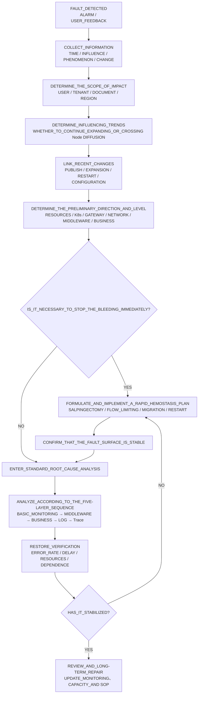
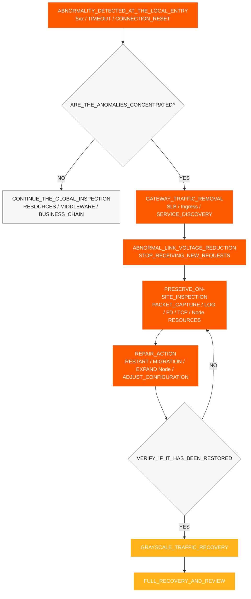
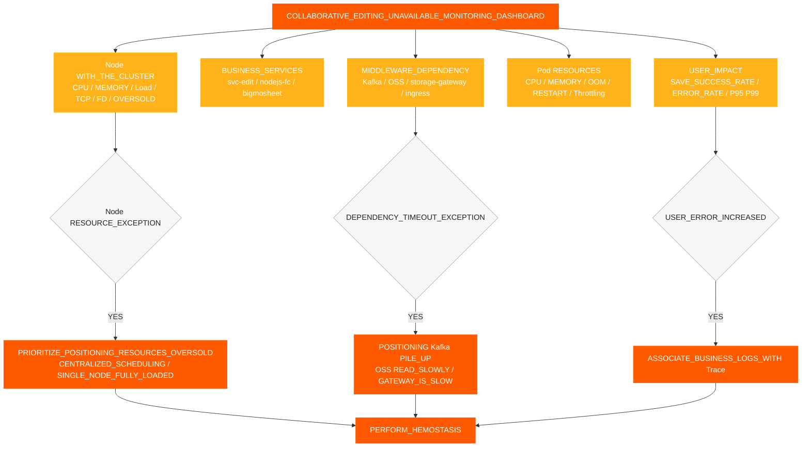
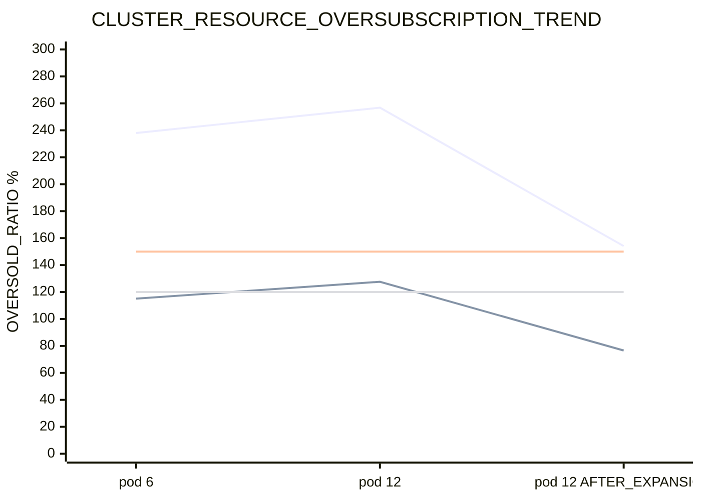
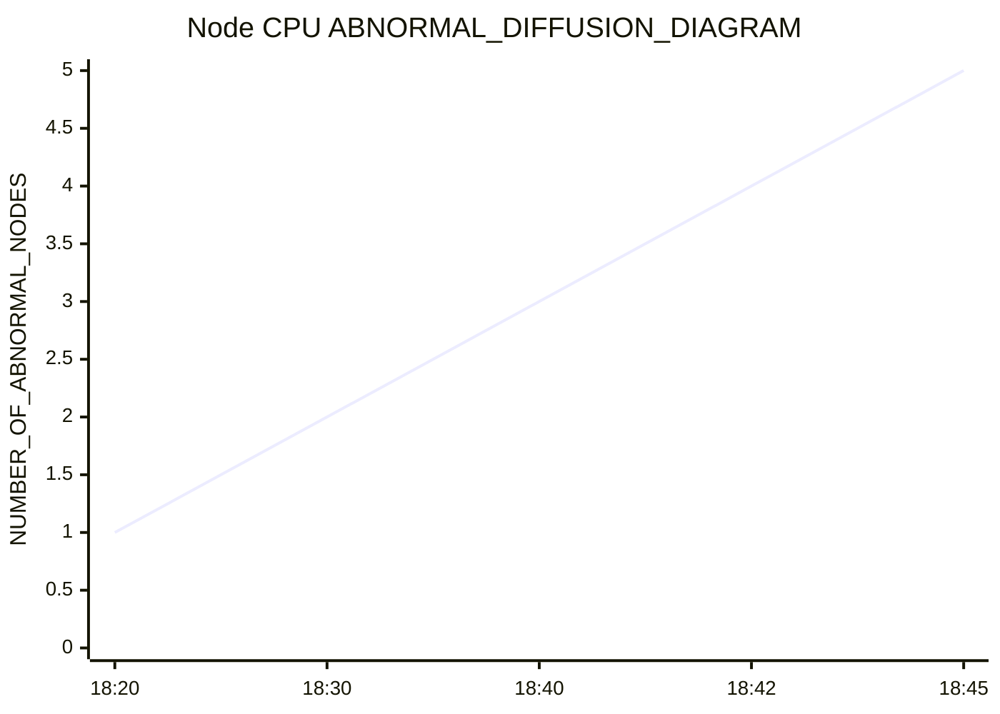
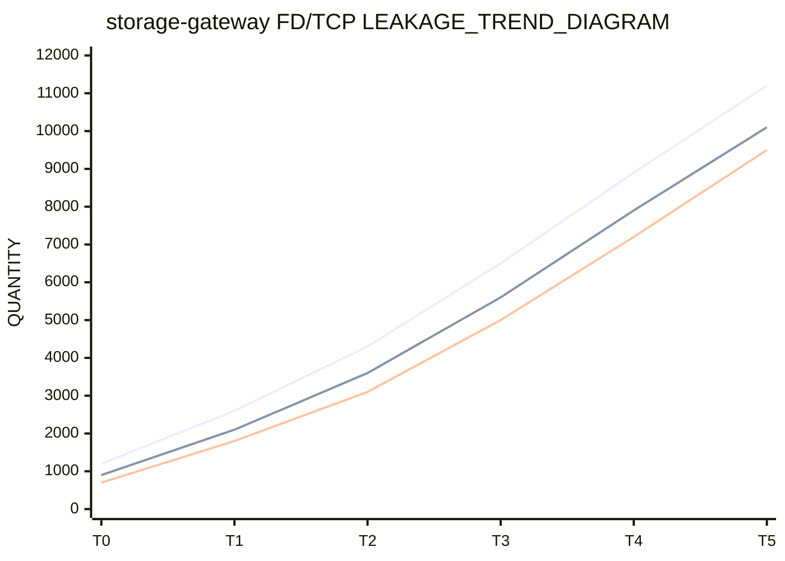
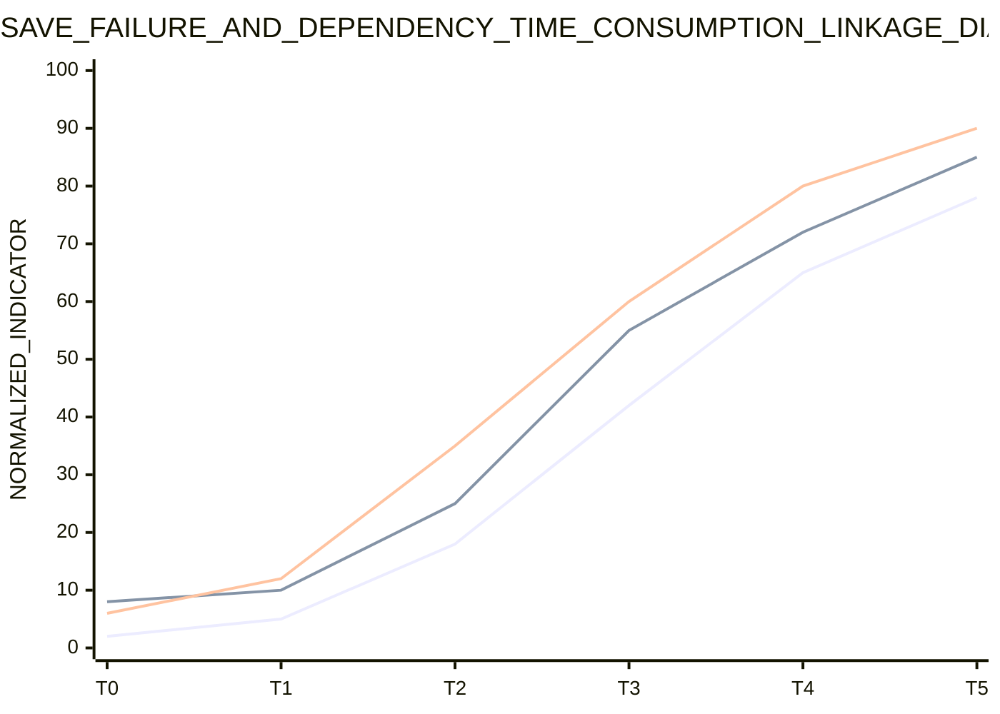
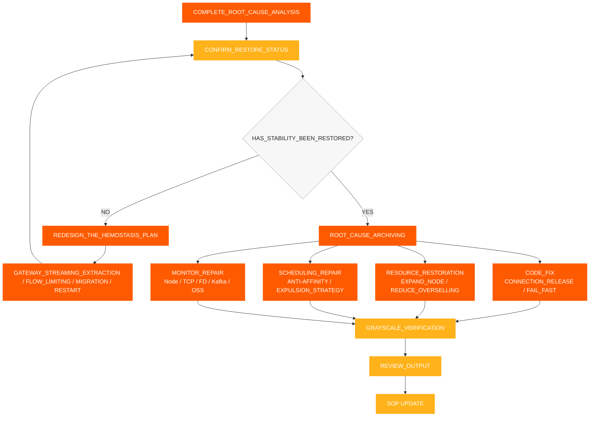

# Vorfallreaktion SOP

[← ShimoDocs Suite Bereitstellungsdokumentation](../README.md)

## 1. Informationssammlung

Nach Erhalt einer Störung zunächst die folgenden Informationen aufzeichnen:

- Auftrittszeit: erste Alarmzeit, erste Kundenrückmeldung, ob es mit einer Version oder Skalierung zusammenfällt.
- Auswirkungsbereich: Mieter, Dokumenttypen, Anzahl der Dateien, Anzahl der Benutzer, ob konzentriert in Tabellen oder großen Tabellen.
- Spezifische Symptome: Speicherfehler, Bearbeitungsfehler, Kafka Timeouts, langsame Object-Storage-Lesezugriffe, API Timeouts.
- Jüngste Änderungen: Service-Releases, Rolling Restarts, Pod-Skalierung, Node-Skalierung, Speicher- oder Kafka Änderungen.
- Schlüsselservices: `svc-nodejs-fc`, `svc-edit`, `svc-edit-worker-bigmosheet`, `storage-gateway`, `ingress`, `ws-gateway`.


## 2. Informationsbewertung und Fehlerklassifikation

Nach Abschluss der Informationssammlung zunächst den Fehlerbereich, die Entwicklungstendenz und die Hauptursachenrichtung anhand von Symptomen, Metriken, Ereignissen und Änderungsprotokollen beurteilen und dann entscheiden, ob sofortige Eindämmungsmaßnahmen erforderlich sind. Die Beurteilungsergebnisse sollten zu einer klaren Schlussfolgerung führen und dürfen sich nicht ausschließlich auf einen einzelnen Pod oder ein einzelnes Log stützen.

Wichtige Punkte für die Bewertung:

- Benutzerauswirkungsbereich: Benutzer, Mieter, Dokumenttypen, Regionen und betroffene Dienste.
- Auswirkungserscheinungen: Speicherfehler, Bearbeitungsverzögerungen, API Timeouts, Kafka Schreib-Timeouts, langsame Object-Storage-Lesezugriffe.
- Auswirkungstrend: ob sie weiterhin zunimmt, ob sie sich von einem einzelnen Pod oder Node auf mehrere Nodes ausbreitet.
- Änderungsbezug: ob es mit Service-Release, Pod-Skalierung, Node-Skalierung, Rolling Restart, Konfiguration oder Middleware-Änderungen zusammenhängt. 
- Vorläufige Richtung: Ressourcen, K8s Kontroll-Ebene, Gateway, Netzwerk, Middleware, Geschäftslogik oder Datenprobleme. 

Bestimmung des Fehlerlevels basierend auf dem Beurteilungsergebnis: 

| Level | Beurteilungskriterien | Reaktionsziel | 
| --- | --- | --- | 
| P0 | Weit verbreitete Bearbeitungsausfälle, kontinuierliche Speicherfehler, Batch-Anomalien in Kerndiensten | Stopp des Problems innerhalb von 15 Minuten, Klärung der Hauptursachenrichtung innerhalb von 30 Minuten | 
| P1 | Teilweise Mieter, teilweise Dokumente, teilweise Knoten abnormal, Fehlerquote deutlich erhöht | Den abnormalen Link innerhalb von 30 Minuten lokalisieren, Stabilität innerhalb von 60 Minuten wiederherstellen | 
| P2 | Einzelne Punkte oder kleinflächige langsame Anfragen, gelegentliche Speicherfehler | Vollständige Ursachenbestätigung und Fehlerbehebungsplan innerhalb von 1 Arbeitstag | 

Die Beurteilung sollte mindestens drei Fragen beantworten: Wie groß ist die aktuelle Auswirkung, breitet sich der Fehler aus, sollten wir zunächst die Blutung stoppen oder direkt mit der Ursachenanalyse fortfahren. 




## 3. Schnelle Blutstillung

Wenn auf der Benutzerseite weiterhin Fehler auftreten oder das Urteil zeigt, dass sich der Fehler ausbreitet, zuerst Eindämmungsmaßnahmen durchführen, dann mit der vertieften Analyse fortfahren. Ziel der Eindämmung ist es, den Fehlerbereich zu reduzieren, positive Rückkopplung von Ressourcen zu blockieren und gleichzeitig die Fehlerstelle so weit wie möglich zu erhalten.

1. Verkehr von abnormalen Gateways entfernen SLB Backends, Ingress-Einträge, Service-Instanzen oder Knoten, die verhindern, dass neue Anfragen weiterhin den abnormalen Pfad betreten.
2. Setze abnormale Knoten als nicht planbar oder isoliert, um zu verhindern, dass Pods weiterhin auf Knoten mit hohem Druck geplant werden.
3. Starte Pods neu, die OOMkontinuierlich wachsenden Speicher oder FD/TCP Lecks aufweisen, priorisierend `storage-gateway`, `svc-nodejs-fc`und `svc-edit-worker-bigmosheet`.
4. Verteile Pods mit hoher Auslastung, um zu vermeiden, `nodejs-fc`, `bigmosheet`, `ingress`und `storage-gateway` dass sie auf demselben Node konzentriert sind.
5. Pausiere das Skalieren ungültiger Business-Pods, priorisiere das Skalieren von Nodes oder die Wiederherstellung verfügbarer Ressourcen.
6. Implementieren Sie eine Drosselung der Rate oder ein schnelles Scheitern für Upstream-Wiederholungen, die Erstellung von Verbindungen und die Ansammlung von Anfragen, um zu verhindern, dass neue Verbindungen nach einem Kaltstart weiter ansteigen.
7. Zeichnen Sie den Knoten auf CPU, Speicher, OOM, FD, TCP, Fehlerrate und Schnittstellenlatenz vor und nach der Eindämmung des Problems.

### 3.1 Entfernung des Gateway-Verkehrs

Wenn ein Fehler sich als anormaler lokaler Knoten, lokaler Gateway-Eintrag oder lokale Service-Instanz zeigt, sollte zuerst der anomale Eintragverkehr entfernt werden, und dann sollten die Knoten und Pods behandelt werden. Ziel der Verkehrs-Entfernung ist es, den Druck auf die fehlerhafte Verbindung zu reduzieren und zu verhindern, dass anormale Instanzen weiterhin neue Anfragen erhalten. 

Auslösebedingungen: 

- Die Fehlerrate eines bestimmten Ingress, SLB Backends, Gateway-Pods oder Knotens ist deutlich höher als bei anderen Instanzen. 
- Gateway-5xx-Fehler, Upstream-Timeouts und Verbindungsresets konzentrieren sich auf wenige Einstiegspunkte. 
- Bestimmte Knoten CPU, Load-, TCP- und FD-Metriken sind offensichtlich abnormal, und neue Anfragen kommen weiterhin kontinuierlich. 
- Kernverbindungsinstanzen wie `svc-edit`, `ws-gateway`und `storage-gateway` haben bereits verlangsamt. 

Auszuführende Maßnahmen: 

1. Abnormale Backends von SLB, Ingress, Gateway-Routing oder Service Discovery entfernen. 
2. Anormale Knoten vorübergehend als nicht planbar markieren, um zu verhindern, dass neue Pods auf ihnen geplant werden. 
3. Paketaufzeichnung, Protokoll-, FD-/TCPund Ressourcenprüfungen auf Knoten oder Instanzen durchführen, von denen der Verkehr entfernt wurde. 
4. Nach Abschluss von Neustart, Migration, Skalierung oder Konfigurationsreparatur zuerst auf eine kleine Verkehrsbelastung wiederherstellen, dann vollständige Wiederherstellung durchführen. 
5. Vor der Wiederherstellung sicherstellen, dass Fehlerraten, Schnittstellen-Antwortzeiten, Knoten CPUund TCP/FD-Metriken wieder normal sind. 




## 4. Standardprozess zur Ursachenanalyse

Nach Abschluss der schnellen Blutstillung und der Bestätigung, dass die Fehleroberfläche stabil ist, fahren Sie mit der Ursachenanalyse fort. Die standardmäßige Fehlerbehebungsreihenfolge wird in einer 'von unten nach oben, von grob zu fein' Vorgehensweise durchgeführt:

1. Grundüberwachung: Cluster-Ressourcen, Node-Knoten, Pod-Ressourcen.
2. Middleware-Überwachung: Kafka, Objektspeicher, Gateway, Netzwerk.
3. Geschäftsüberwachung: Erfolgsrate beim Speichern, Schnittstellen-Antwortzeit und Fehlerquote.
4. Protokollüberwachung: Fehlerprotokolle, Timeout-Protokolle, OOM/ Neustartprotokolle.
5. Trace-Link-Verfolgung: Anforderungslinks, langsame Aufrufe, Ausnahme-Spans.

Kernanforderungen:

- Jede Ebene gibt zunächst das Beurteilungsurteil aus, bevor sie zur nächsten Ebene übergeht.
- Zuerst den Node betrachten, dann den Pod; zuerst den globalen Trend betrachten, dann die Protokolle eines einzelnen Dienstes.
- Überspringen Sie nicht die nachfolgenden Ebenen, nur weil auf einer bestimmten Ebene keine Auffälligkeiten festgestellt wurden.
- Überwachung, Protokolle und Traces müssen unter Verwendung desselben Zeitfensters, Pods, Nodes und Trace-ID korreliert werden.

Jede Ebene beantwortet nur eine Kernfrage:

- Grundüberwachung: Sind die Ressourcen bereits unzureichend, und tritt Overselling, zentrales Scheduling oder Node-übergreifende Verteilung auf?
- Middleware-Überwachung: Gibt es irgendwelche Verlangsamungen, Backlogs, Anforderungsablehnungen oder Verbindungsanomalien?
- Geschäftsüberwachung: Welcher Dienst, API, oder Dokumenttyp entspricht den Auswirkungen für den Benutzer?
- Protokollüberwachung: Gibt es eindeutige Hinweise auf Fehler, Timeouts, OOM, Neustarts oder Erschöpfung des Verbindungspools?
- Trace-Link-Verfolgung: Wo genau ist eine fehlgeschlagene Anforderung steckengeblieben – bei welchem Dienst, Node oder Span? 


### 4.1 Fehlerbehebung der Grundüberwachung 

Priorisieren Sie die Überprüfung der Node-Dimension anstatt nur der Pod-Dimension. Wenn Ressourcen überbeansprucht sind, könnten Pod-Monitoring-Werte innerhalb sicherer Grenzen liegen, aber der Node könnte bereits vollständig ausgelastet sein. 

Zu überprüfende Punkte: 

- Gesamt im Cluster CPU und Speicherkapazität und verfügbare Kapazität. 
- Node CPU, Speicher, Last, Festplatte, Netzwerk. 
- Pod CPU, Speicher, Neustarts, OOM, CPU Drosselung. 
- Ob mehrere hoch CPU oder IO-intensive Dienste auf einem einzigen Node konzentriert sind. 
- Ob nach einem Rolling-Release Pods überwiegend auf den ersten wenigen Nodes eingeplant werden. 
- Ob es an Anti-Affinity- und Eviction-Richtlinien mangelt. 

Wichtige Urteile: 

- Ob die gesamte CPU Limits / Cluster CPU Kapazität 150% übersteigt. 
- Ob die gesamte Speicherkapazität Limits / Cluster-Speicherkapazität 120% übersteigt. 
- Ob es einen Prozess gibt, bei dem ein Node zuerst ausfällt und anschließend andere Nodes allmählich eine erhöhte CPU Auslastung erfahren. 


### 4.2 Middleware-Überwachungs-Fehlerbehebung 

Die Middleware-Fehlerbehebung konzentriert sich hauptsächlich auf Kafka, Objektspeicher, Gateways und Netzwerke. Die spezifische Beurteilung für Kafka ist wie folgt; detaillierte Metriken und Beurteilungspunkte für Objektspeicher, `storage-gateway`, Gateways und Netzwerke sind einheitlich in Abschnitt 9.7 und der zugehörigen Checkliste aufgezeichnet. 

#### 4.2.1 Kafka 

Zu überprüfende Punkte: 

- Producer-Schreiblatenz und Ausfallrate. 
- Themen-Backlog. 
- Broker-seitig CPU, Festplatte, Netzwerk und Anfragelatenz. 
- Ob es vom Client zu Kafka. 
- wiederholte Übertragungen, Paketverlust oder Verbindungsstau gibt oder ob Timeouts nur bei den Business-Seiten-Schreibvorgängen auftreten, während es auf der Kafka Operations-Seite keine offensichtlichen Anomalien gibt. 

Beurteilungslogik: 

- Wenn keine Anomalie auf dem Kafka Betriebsseite, aber die Geschäftseite erlebt weiterhin Schreibzeitüberschreitungen, konzentrieren Sie sich darauf, den Geschäfts-Knoten zu überprüfen CPU, Netzwerkauslastung und die Verarbeitungskapazität des Clients. 
- Wenn Kafka Rückstände und Geschäftsfehler treten gleichzeitig auf, bestätigen Sie zunächst, ob der Rückstand durch langsame Verarbeitung des vorgelagerten Dienstes verursacht wird. 


### 4.3 Geschäftsüberwachung, Protokolle und Nachverfolgung 

#### 4.3.1 Geschäftsüberwachung 

Bestätigen Sie die abnormen Verbindungen basierend auf Kundenphänomenen: 

1. Ob Speicherfehler in Tabellen, großen Tabellen oder bestimmten Dokumenttypen konzentriert sind. 
2. Ob die Bearbeitungsschnittstelle Zeitüberschreitungen, langsame Anfragen oder erhöhte Fehlerraten aufweist. 
3. Überprüfen Sie, ob `Kafka write timeout` auftritt. 
4. Überprüfen Sie, ob das Lesen aus dem Objektspeicher langsam ist und ob das Schreiben normal ist. 
5. Überprüfen Sie, ob `bigmosheet operation oss_get` überschreitet 5 Sekunden. 
6. Überprüfen Sie, ob WebSocket-, kollaborative Bearbeitungs-, Verlaufs- und Objektspeicher-bezogene Dienste gleichzeitig erhöhte Latenzzeiten aufweisen. 

#### 4.3.2 Protokollüberwachung 

Zu überprüfende Schlüsselprotokolle: 

- Protokolle für fehlgeschlagene Speicherbearbeitungen. 
- Protokolle für Kafka Schreib-Zeitüberschreitungen. 
- Protokolle für langsame Objekt-Speicher-Lese- und Schreibvorgänge. 
- Protokolle für OOM, Neustarts, erschöpfte Verbindungspools und FD-Erschöpfung. 
- Protokolle für Gateway-5xx-Fehler, Upstream-Timeouts und Verbindungsresets. 

#### 4.3.3 Trace-Link-Tracking 

Verwenden Sie Trace, um eine einzelne fehlgeschlagene Anfrage zu verfolgen: 

- Überprüfen Sie, ob die Anfrage im Gateway, der kollaborativen Bearbeitung, im Objektspeicher, Kafkaoder in der Historienverbrauchskette stecken geblieben ist. 
- Überprüfen Sie, ob ein Span eine abnormale Latenz aufweist. 
- Überprüfen Sie, ob langsame Aufrufe auf einen bestimmten Dienst, Knoten oder Dokumenttyp konzentriert sind. 
- Vergleichen Sie die Linkunterschiede zwischen fehlgeschlagenen Anfragen und normalen Anfragen. 


## 5. Wiederherstellungsverifizierung 

Nach Abschluss der Blutungsstopp-Maßnahme müssen die folgenden Kennzahlen überprüft werden: 

- Der entfernte Gateway-Eintrag, SLB Backend- oder abnormale Instanzen haben keinen neuen Verkehr mehr erhalten. 
- Die Erfolgsrate beim Speichern ist wieder normal. 
- Die Fehlerrate der Bearbeitungsschnittstelle ist gesunken. 
- Kafka Die Schreiblatenz ist wieder normal. 
- Kafka Der Rückstand ist zurückgegangen. 
- Die Lese-Latenz des Objektspeichers ist wieder normal. 
- Node CPU, Speicher und Last sind gesunken. 
- `storage-gateway` FD und Socket-FD steigen nicht mehr kontinuierlich an. 
- Abnormale Knoten breiten sich nicht mehr aus. 
- Nach der Wiederherstellung des Verkehrs während der Graustufenfreigabe sind Gateway-5xx, Upstream-Timeouts und Verbindungsresets nicht erneut gestiegen. 


## 6. Überwachungs- und Alarmanforderungen 

Die folgenden Alarme müssen durchgeführt werden: 

- Node CPU, Speicher, Last, Festplatte und Netzwerk-Alarme. 
- Node TCP Verbindungsanzahl, Wiederübertragung, Paketverlust und `ESTABLISHED` Verbindungsanzahl-Alarme. 
- Pod OOM, Neustart und CPU Drosselungsalarme. 
- Kernservice OOM Alarme. 
- CPU Überverkaufsalarm: CPU Limit / Cluster CPU Kapazität 150% übersteigt. 
- Speicher-Überverkaufsalarm: Speicherlimit / Cluster-Speicherkapazität überschreitet 120%. 
- Kafka Rückstands-Alarm. 
- Kafka Schreib-Timeout-Alarm. 
- Bearbeitungs-Speicherfehler-Log-Alarm. 
- `bigmosheet operation oss_get > 5s` Alarm. 
- `storage-gateway` FD- und Socket-FD-kontinuierliche Zunahme Alarm. 
- `storage-gateway` RSS / Working Set kontinuierliche Zunahme und Knoten `MemoryPressure` Alarm. 


## 7. Überwachungs-Dashboard für Schlüsselkennzahlen 

Dieser Abschnitt ist ein Hilfsmittel und ändert die Hauptprozessreihenfolge nicht. Das Dashboard dient dazu, Trends zu beobachten und Richtungen zu lokalisieren, während `kubectl`, `jq`und PromQL werden verwendet, um spezifische Beweise zu erhalten; die Vor-Ort-Untersuchung sollte der detaillierten Checkliste in Abschnitt 9 folgen, wobei jeder Punkt ausgeführt und die Schlussfolgerungen dokumentiert werden. 

### 7.1 Dashboard-Schichtung 

Es wird empfohlen, das Dashboard für nicht verfügbare kollaborative Bearbeitung in 5 Schichten aufzuteilen und während der Untersuchung von oben nach unten Schicht für Schicht zu prüfen: 

| Schicht | Dashboard-Name | Kernmetriken | Zweck |
| --- | --- | --- | --- |
| L1 | User Impact Dashboard | Speichererfolgsrate, Bearbeitungsfehlerquote, Schnittstelle P95/P99, Online-Kollaborationsverbindungen | Bestimmen, ob Benutzer tatsächlich betroffen sind |
| L2 | Business Service Dashboard | QPS, Fehlerquote, Latenz und Neustartanzahl von `svc-edit`, `svc-nodejs-fc`, `bigmosheet` | Bestimmen, auf welchen Business-Service die Anomalie konzentriert ist |
| L3 | Middleware Dashboard | Kafka Schreiblatenz, Kafka Backlog, Objekt-Speicher Lese-/Schreiblatenz, Latenz des Upstream-Gateways | Bestimmen, ob Abhängigkeiten die Verlangsamung verursachen |
| L4 | Container Resource Dashboard | Pod CPU, Speicher, OOM, Neustarts, CPU Throttling | Bestimmen, ob der Container selbst abnormal ist |
| L5 | Node- und Cluster-Dashboard | Node CPU, Speicher, Last, TCP, FD, überprovisionierte Ressourcen, Pod-Verteilung | Bestimmen, ob die zugrunde liegenden Ressourcen den Geschäftsbetrieb unterstützen |

### 7.2 Übersichtsdarstellung der Schlüsselmetriken



### 7.3 Trenddiagramm der Ressourcen-Überbelegung

Dieses Diagramm wird verwendet, um zu beobachten, ob CPU und Speicherüberbelegung vor und nach der Erweiterung in Hochrisikobereiche gelangen. Im tatsächlichen Dashboard wird empfohlen, CPU die Überbelegung bei 150 % und die Speicherüberbelegung bei 120 % als Alarmgrenzlinien festzulegen.



### 7.4 Node CPU Diffusions-Trenddiagramm

Dieses Diagramm wird verwendet, um zu beobachten, ob es eine Diffusionscharakteristik gibt, bei der ein einzelner Knoten zuerst ausfällt, gefolgt davon, dass andere Knoten allmählich nach unten gezogen werden.



### 7.5 FD/TCP Leck-Trend-Diagramm

Dieses Diagramm wird verwendet, um festzustellen, ob `storage-gateway` Verbindungs- oder FD-Lecks vorhanden sind. Wenn `total_fd`, `socket_fd`, und die Anzahl der `ESTABLISHED` Verbindungen alle gleichzeitig kontinuierlich zunehmen, sollten Verbindungslecks vorrangig behandelt werden.



### 7.6 Diagramm zur Korrelation von Geschäftsfehlern und Abhängigkeitslatenz

Dieses Diagramm wird verwendet, um zu überprüfen, ob Benutzerspeicherfehler mit erhöhter Kafka Schreiblatenz und Leselatenz des Objektspeichers korreliert sind. Wenn alle drei gleichzeitig innerhalb desselben Zeitfensters zunehmen, sollte vorrangig die Verarbeitungskapazität des Geschäftsknotens und die Stauung der Abhängigkeitskette überprüft werden.



### 7.7 Empfohlene Alarmgrenzen

| Metrik | Empfohlene Schwelle | Aktion nach Auslösung |
| --- | --- | --- |
| Erfolgsrate der Speicherung | Unter 99 % für 5 aufeinanderfolgende Minuten | Bestätigung der geschäftlichen Auswirkungen durchführen, Fehlerprotokolle und Traces korrelieren |
| Schnittstelle bearbeiten P95 | Über dem Basiswert um das 2-fache für 5 aufeinanderfolgende Minuten | Überprüfen `svc-edit`, `nodejs-fc`, `bigmosheet` |
| Kafka Schreiblatenz | Über dem Basiswert um das 2-fache oder Schreibtimeout tritt auf | Überprüfen Kafka Rückstand, Geschäftsknoten CPU, Netzwerk-Neuübertragungen |
| Kafka Rückstand | Kontinuierliches Wachstum für 10 Minuten | Überprüfen der Verbrauchsaufgaben und der Schreibgeschwindigkeit der vorgelagerten Systeme |
| OSS Leselatenz | P95 Überschreitet 5 Sekunden | Überprüfen `storage-gateway`, Netzwerk, Objektspeicherseite |
| Node CPU | Über 90 % für 5 aufeinanderfolgende Minuten | Überprüfen der Pod-Verteilung, CPU Überbelegung, Dienste mit hoher Last |
| CPU Überbelegung | Überschreitet 150 % | Geschäfts-Pod-Skalierung aussetzen, Priorität auf Bewertung der Knotenskalierung |
| Speicherüberbelegung | Übersteigt 120% | Überprüfen OOM, Auslagerungsrisiko und Speicherlecks |
| `total_fd` / `socket_fd` | Monoton steigend für 10 Minuten | Überprüfen Sie FD/TCP Lecks, bei Bedarf neu starten, um Verlust zu stoppen |
| TCP Retransmissionsrate | Höher als der Basiswert um das 2-fache | Pakete erfassen, um Paketverlust, Überlastungen, Fensterprobleme zu bestätigen |
| Pod-Neustart / OOM | Jeder Core-Service tritt auf | Sofort Logs zuordnen und Änderungen freigeben |

### 7.8 Knoten CPU und Abfragebefehle zur Speicherüberlastung

Die folgenden Befehle gelten für Szenarien, in denen das Geschäft läuft in einer K8s Cluster. Vor der Ausführung bestätigen Sie, dass das aktuelle Kubeconfig auf den fehlerhaften Cluster umgeschaltet wurde, und ersetzen Sie `NODE_NAME` durch den Zielknotennamen.

#### 7.8.1 Überprüfen Sie die tatsächliche Nutzung des Knotens CPU und den Speicherverbrauch

```bash
# View the real-time CPU and memory usage of all Nodes
kubectl top nodes

# View the real-time usage of the specified Node
kubectl top node "$NODE_NAME"

# View the node's capacity, allocatable resources, and pressure status
kubectl describe node "$NODE_NAME" | sed -n '/Capacity:/,/Allocatable:/p'
kubectl describe node "$NODE_NAME" | sed -n '/Conditions:/,/Addresses:/p'

# Directly view the CPU/memory Requests, Limits, and usage ratio allocated to the Node
kubectl describe node "$NODE_NAME" | sed -n '/Allocated resources:/,/Events:/p'
```

Schwerpunkt: `CPU%`, `MEMORY%`, `MemoryPressure`, `DiskPressure`, `PIDPressure`. Wenn die tatsächliche Nutzung 90% überschreitet, ist es notwendig, sofort festzustellen, ob basierend auf der Pod-Verteilung und der Entfernung des Gateway-Verkehrs eine Blutungskontrolle erforderlich ist.

#### 7.8.2 Statistiken von CPU, Speicheranforderung und Limit für einen angegebenen Knoten

```bash
# Statistics of CPU/memory requests and limits for all Pod containers on the specified Node.
# Dependencies: kubectl, jq; memory is uniformly converted to MiB, CPU is uniformly converted to cores.
NODE_NAME="<TARGET_NODE_NAME>"

kubectl get pods -A --field-selector "spec.nodeName=${NODE_NAME}" -o json | jq '
  def cpu_core:
    if . == null then 0
    elif endswith("m") then (rtrimstr("m") | tonumber / 1000)
    else tonumber
    end;
  def mem_mib:
    if . == null then 0
    elif endswith("Ki") then (rtrimstr("Ki") | tonumber / 1024)
    elif endswith("Mi") then (rtrimstr("Mi") | tonumber)
    elif endswith("Gi") then (rtrimstr("Gi") | tonumber * 1024)
    elif endswith("Ti") then (rtrimstr("Ti") | tonumber * 1024 * 1024)
    elif endswith("K") then (rtrimstr("K") | tonumber / 1024)
    elif endswith("M") then (rtrimstr("M") | tonumber)
    elif endswith("G") then (rtrimstr("G") | tonumber * 1024)
    elif endswith("T") then (rtrimstr("T") | tonumber * 1024 * 1024)
    else (tonumber / 1024 / 1024)
    end;
  [ .items[]
    | ([(.spec.containers[]?, .spec.initContainers[]?) | .resources.requests.cpu? // "0"] | map(cpu_core) | add) as $cpu_req
    | ([(.spec.containers[]?, .spec.initContainers[]?) | .resources.limits.cpu? // "0"] | map(cpu_core) | add) as $cpu_limit
    | ([(.spec.containers[]?, .spec.initContainers[]?) | .resources.requests.memory? // "0"] | map(mem_mib) | add) as $mem_req
    | ([(.spec.containers[]?, .spec.initContainers[]?) | .resources.limits.memory? // "0"] | map(mem_mib) | add) as $mem_limit
    | {cpu_request: $cpu_req, cpu_limit: $cpu_limit, mem_request_mib: $mem_req, mem_limit_mib: $mem_limit}
  ]
  | {
      cpu_request_core: (map(.cpu_request) | add),
      cpu_limit_core: (map(.cpu_limit) | add),
      mem_request_mib: (map(.mem_request_mib) | add),
      mem_limit_mib: (map(.mem_limit_mib) | add)
    }'
```

Hinweis: Die offizielle K8s Planungsberechnung verwendet eine "Maximum nehmen"-Regel für `initContainers`. Der obige Befehl wird für eine schnelle Vor-Ort-Zusammenfassung verwendet und eignet sich zur Erkennung offensichtlicher Überbeanspruchung; beim Abgleich mit Ressourcen-Dashboards oder Scheduler-Daten sollten die vom System bereitgestellten Node-Ressourcenstatistiken als Standard verwendet werden. 

#### 7.8.3 Berechnung des Clusters CPU und Speicher-Überbestückungsverhältnis 

```bash
# Get the total Allocatable resources of all nodes in the cluster
kubectl get nodes -o json | jq '
  [ .items[].status.allocatable
    | {
        cpu_core: (if (.cpu | endswith("m"))
                   then (.cpu | rtrimstr("m") | tonumber / 1000)
                   else (.cpu | tonumber)
                   end),
        memory_bytes: (.memory | rtrimstr("Ki") | tonumber * 1024)
      }
  ]
  | {
      cpu_allocatable_core: (map(.cpu_core) | add),
      memory_allocatable_gib: (map(.memory_bytes) | add / 1024 / 1024 / 1024)
    }'

# Summarize the CPU/memory limits of all Pods for calculating the overcommit ratio
kubectl get pods -A -o json | jq '
  def cpu_core:
    if . == null then 0
    elif endswith("m") then (rtrimstr("m") | tonumber / 1000)
    else tonumber
    end;
  def mem_gib:
    if . == null then 0
    elif endswith("Ki") then (rtrimstr("Ki") | tonumber / 1024 / 1024)
    elif endswith("Mi") then (rtrimstr("Mi") | tonumber / 1024)
    elif endswith("Gi") then (rtrimstr("Gi") | tonumber)
    else (tonumber / 1024 / 1024 / 1024)
    end;
  [ .items[] | .spec.containers[]?
    | {
        cpu_limit_core: (.resources.limits.cpu? // "0" | cpu_core),
        memory_limit_gib: (.resources.limits.memory? // "0" | mem_gib)
      }
  ]
  | {
      cpu_limit_core: (map(.cpu_limit_core) | add),
      memory_limit_gib: (map(.memory_limit_gib) | add)
    }'
```

Berechnungsformel: `CPU overcommit ratio = Total CPU Limits of all Pods / Total CPU Allocatable of all Nodes × 100%`; `Memory overcommit ratio = Total Memory Limits of all Pods / Total Memory Allocatable of all Nodes × 100%`. Es wird empfohlen, CPU Overcommit bei 150 % und Memory-Overcommit bei 120 % als Hochrisiko-Referenzlinien anzusetzen, aber die endgültige Schwelle sollte gemäß der Basislinie der Kundenumgebung festgelegt werden. 

#### 7.8.4 Prometheus / Grafana Abfrageanweisungen

```promql
# Cluster CPU Limit Oversubscription Rate
100 * sum(kube_pod_container_resource_limits{resource="cpu", unit="core"})
  / sum(kube_node_status_allocatable{resource="cpu", unit="core"})

# Cluster Memory Limit Overcommit Rate
100 * sum(kube_pod_container_resource_limits{resource="memory", unit="byte"})
  / sum(kube_node_status_allocatable{resource="memory", unit="byte"})

# View CPU Limit Overcommit Rate by Node
100 * sum by (node) (kube_pod_container_resource_limits{resource="cpu", unit="core"})
  / on (node) kube_node_status_allocatable{resource="cpu", unit="core"}

# View Memory Limit Oversubscription Rate by Node
100 * sum by (node) (kube_pod_container_resource_limits{resource="memory", unit="byte"})
  / on (node) kube_node_status_allocatable{resource="memory", unit="byte"}

# Node Actual CPU Usage
100 * (1 - avg by (instance) (rate(node_cpu_seconds_total{mode="idle"}[5m])))

# Node actual memory usage
100 * (1 - node_memory_MemAvailable_bytes / node_memory_MemTotal_bytes)

# K8s node memory pressure status, 1 indicates MemoryPressure=True
kube_node_status_condition{condition="MemoryPressure", status="true"}
```

Wenn die Ressourcenmetrik `unit` und `node` Tag-Namen in Prometheus sind inkonsistent mit den obigen Aussagen, Sie sollten zuerst die tatsächlichen Tags in den Metrikdetails bestätigen, bevor Sie Anpassungen vornehmen. Das Oversubscription-Verhältnis kann nur ein potenzielles Risiko in den Ressourcendeklarationen anzeigen und kann die Bewertung des tatsächlichen Zustands des Nodes nicht ersetzen. CPU, Speicher, OOMund `MemoryPressure`.


## 8. Überprüfung und langfristige Abhilfeschleife




## 9. Detaillierte Inspektions-Checkliste 

Diese Checkliste wird in der Reihenfolge ausgeführt: "Benutzerphänomene → Grundlegende Ressourcen → K8s → Middleware → Protokolle und Links → Verarbeitung geschlossener Kreislauf." Jeder Punkt sollte Beobachtungszeit, Anomalieobjekte, Indikator-Screenshots oder Abfrageergebnisse aufzeichnen, um zu vermeiden, dass nur "normal/abnormal" ohne Überprüfung vermerkt wird. 

### 9.1 Bestätigung von Phänomen und Wirkungskreis 

| Inspektionsziele | Zu bestätigende Punkte | Anomalie-Bewertung | Vor-Ort-Aufzeichnungen / Schlussfolgerungen |
| --- | --- | --- | --- |
| Auswirkung auf Benutzer | Gemeinsames Bearbeiten nicht verfügbar, Speicherfehler, Bearbeitungsverzögerung, Schnittstellen-Timeout | Mehrere Benutzer, Mandanten oder Dokumente gleichzeitig abnormal, als Geschäftsausfall bestimmt | |
| Umfang der Ausfälle | Ist es auf Tabellen, große Tabellenkalkulationen, bestimmte Dokumenttypen, bestimmte Mandanten oder bestimmte Regionen konzentriert? | Bei offensichtlicher Konzentration Priorität auf Gruppierung nach Service-Route, Datentyp oder Knoten | |
| Fehlererscheinungen | Treten 'kafka writes timeout', Gateway 5xx, Verbindungsrücksetzung, Upstream-Timeout auf | Mehrere Fehlertypen treten innerhalb desselben Zeitfensters gleichzeitig auf, wobei öffentliche Abhängigkeiten und Ressourcenschichten prioritär behandelt werden | |
| Zeitliche Korrelation | Das Timing der ersten Warnung, des ersten Feedbacks und des Beginns einer Indikatoranomalie | Wenn es mit Freigabe, Skalierung, Rolling Restart oder Konfigurationsänderungen zusammenfällt, notieren Sie die Änderungsauftragsnummer | |
| Auswirkungsumfang | Fehleranforderungsvolumen, Fehlerquote, Anzahl der Online-Zusammenarbeitsverbindungen, betroffene Dienste und Replikate | Fehlerstufe erhöhen und zuerst die Blutung stoppen, wenn die Auswirkungen weiter zunehmen | |

### 9.2 Basis-Überwachungselemente: Knoten 

| Überwachungsobjekt | Schlüsselindikatoren | Wichtige Beurteilungen | Empfohlene Maßnahmen | Vor-Ort-Aufzeichnungen / Schlussfolgerungen |
| --- | --- | --- | --- | --- |
| CPU Verwendung | Node CPU Verwendung, Load 1/5/15, CPU steal, iowait, Soft-Interrupt | CPU konsequent >90%, Load nähert sich oder überschreitet die Anzahl der Kerne, unnatürlicher Anstieg von iowait/Soft-Interrupts | Überprüfen Sie Pods mit hoher Last, bei Bedarf Traffic entfernen, Pods migrieren oder Knoten skalieren | |
| Speichernutzung | Verwendet, Verfügbar, RSS, Seitenfehler, Swap, OOM Beenden | Verfügbar sinkt kontinuierlich, Swap-Nutzung, OOM, erhöhter Speicher-Rückforderungdruck | Auf Speicherlecks und speicherintensive Pods überprüfen, bestätigen `MemoryPressure`, bei Bedarf Knoten isolieren | |
| Speicher-Überschreibung | Speicherlimit/Allokierbar, Speicheranforderung/Allokierbar | Speicherlimit überschreitet 120% oder Anforderungen sind zu stark konzentriert | Geschäftsskalierung pausieren, Priorität auf Hinzufügen von Knoten setzen, Hochrisiko-Limits reduzieren oder Pods verteilen | |
| CPU Überbelegung | CPU Limit/Allokierbar, CPU Anforderung/Allokierbar | CPU Limit überschreitet 150% oder ressourcenintensive Pods konzentrieren sich auf demselben Knoten | Ressourcenkonfiguration, Anti-Affinität und Replikaverteilung anpassen |  |
| TCP Verbindung | Gesamt TCP Verbindungen, `ESTABLISHED`, `TIME_WAIT`, `CLOSE_WAIT`, Retransmissionsrate | Anzahl der Verbindungen steigt kontinuierlich, `CLOSE_WAIT` nicht lange freigegeben, Retransmissionsrate steigt | Verbindungslecks, Verbindungspool, Netzwerkkonfiguration und anomale Clients lokalisieren |  |
| netstat / Socket | Gesamtzahl der Sockets, lauschende Ports, Recv-Q, Send-Q, Anzahl fehlgeschlagener Verbindungen | Recv-Q/Send-Q akkumuliert kontinuierlich oder Listen-Warteschlange überläuft | Fehlerbehebung mit Packet Capture, Service Connection Pool und Kernel-Parametern |  |
| FD | Gesamt-FD, Socket-FD, Prozess-FD-Nutzung, `file-nr` | `total_fd`, `socket_fd` monoton ansteigend oder annähernd am Prozesslimit | Aktuellen Zustand speichern, den leckenden Service neu starten, Verbindung-Freigabelogik reparieren |  |
| Festplatte | Dateisystemnutzung, Inodes, Festplatten-Durchsatz, IOPS, Warteschlange, Auslastung, Schreiblatenz | Festplatte voll, Inodes voll, Warteschlange/Auslastung dauerhaft hoch | Temporäre Dateien oder Logs bereinigen, Festplatte erweitern und Image-Extraktion sowie Log-Schreiben prüfen |  |
| Netzwerk | NIC Bandbreite, Paketverlust, fehlerhafte Pakete, Retransmissionen, Soft-Interrupts, Connection-Tracking-Tabelle | Bandbreite vollständig genutzt, Paketverlust/Retransmissionen steigend, Conntrack erreicht Limit | Image-Pulling, Traffic zwischen Nodes, Gateway-Traffic und Netzwerkrichtlinien prüfen |  |
| Knotenstatus | `Ready`, `MemoryPressure`, `DiskPressure`, `PIDPressure` | Irgender Druckstatus ist True oder Node NotReady | Zuerst Node-Traffic entfernen, Scheduling verbieten und aktuellen Zustand bewahren |  |
| Pod-Verteilung | Sind hoch CPU/Memory-Dienste auf demselben Node konzentriert | `svc-nodejs-fc`, `svc-edit-worker-bigmosheet`, `ingress`, `storage-gateway` auf demselben Node | Gateway-Stream-Abkopplung, Migration oder Rescheduling durchführen |  |

### 9.3 Grundlegendes Element Monitoring: Pod

| Überwachungsobjekt | Schlüsselmetriken | Wichtige Beurteilungspunkte | Empfohlene Maßnahmen | Vor-Ort-Aufzeichnungen / Schlussfolgerungen |
| --- | --- | --- | --- | --- |
| CPU Verwendung | Pod/Container CPU Nutzung CPU Drosselung, gedrosselte Phasen | Hoch CPU Nutzung oder kontinuierlich zunehmende Drosselungsgrenzen | Überprüfen CPU Limits, Node-Überlastung und Anfragestau |  |
| Speichernutzung | Arbeitsset RSS, Heap, Container-Speichernutzung, Wachstumskurve | Kontinuierlicher Speicheranstieg, der nach einem Neustart wieder zurückgeht, vermutetes Leck | Heap-Informationen und Prozessmetriken sammeln, bei Bedarf zum Stoppen des Lecks neu starten |  |
| OOM und Neustart | `OOMKilled`, Neustartanzahl, Letzter Zustand, Neustartzeit | OOM tritt zusammen mit Geschäftsfehlern oder Node-Druck auf | Kubelet-Ereignisse, Container-Logs und Upstream-Neuversuche korrelieren |  |
| Netzwerkverbindungen | Pod TCP Verbindungen, `ESTABLISHED`, `TIME_WAIT`, `CLOSE_WAIT` | Plötzlicher Anstieg neuer Verbindungen oder nicht freigegebene Langzeitverbindungen | Verbindungspool, Timeouts, Wiederholungen und serverseitige Verbindungsbeendigung prüfen |  |
| netstat / Socket | Recv-Q, Send-Q, lauschende Ports, Socket-FD | Warteschlangenansammlung oder wachsendes Socket-FD synchron mit dem Speicher | Netzwerkblockierung oder Verbindungsleck bestimmen |  |
| Netzwerkverkehr | Eingehender/ausgehender Verkehr, fehlerhafte Pakete, Paketverlust, Knotenübergreifender Verkehr | Plötzlicher Verkehrsanstieg, abnormale Wiederholungen oder verstärkter Knotenübergreifender Verkehr | Gateway-Routing, Service Discovery und Wiederholungsrichtlinien prüfen |  |
| Betriebsstatus | Bereit, Container-Status, Prüfungsfehler, Startzeit | Prüfungsfehler, CrashLoopBackOff, Kaltstartverlangsamung | Zuerst Verkehr entfernen, dann Abhängigkeiten und Ressourcenwiederherstellung bestätigen, bevor schrittweise wiederhergestellt wird |  |
| Replikate und Scheduling | Verfügbare Replikate, gewünschte Replikate, Pending, Node-Verteilung | Unzureichende Replikate oder kontinuierlich zunehmende Pending-Pods | Unzureichende Ressourcen, Taints, Affinity/Anti-Affinity und Quoten prüfen |  |

### 9.4 K8s Überwachung

| Überwachungsobjekte | Wichtige Kennzahlen / Informationen | Wichtige Bewertungen | Empfohlene Maßnahmen | Vor-Ort-Aufzeichnungen / Schlussfolgerungen |
| --- | --- | --- | --- | --- |
| Ereignisinformationen | Pod OOM, Ausgebootet, Sonde fehlgeschlagen, Scheduling fehlgeschlagen, Rückzug, Knoten nicht bereit | Feststellen, ob es Batch-Neustarts, Ausweisungen, Scheduling-Fehler oder Sondenfehler gibt | Nach Zeit sortieren und mit Releases, Knoten und Geschäftsfehlern korrelieren |  |
| Scheduling-Status | Anzahl der ausstehenden Pods, Scheduling-Zeit, Gründe für unzureichende Ressourcen, Quotenverbrauch | Feststellen, ob Pods aufgrund von CPU/Speichermangel, Taints oder Affinitätsregeln nicht geplant werden können | Knoten erweitern, Scheduling-Strategien anpassen oder vorübergehend nicht-kernbezogene Lasten reduzieren |  |
| kubelet | kubelet-Fehler, PLEG Verzögerungen, Pod Start-/Stopp-Zeit, Image-Pull-Fehler | Ob Neustarts und Image-Pulls zu einer Quelle der Ressourcenausweitung geworden sind | Überprüfen Sie kubelet, Container-Runtime, Festplatte und Netzwerk |  |
| API Server | Anfrage QPS, P95/P99, 5xx, Anzahl der Ablehnungen, Arbeitswarteschlange | Ob die Steuerungsebene langsam reagiert oder Drosselung erfährt | Überprüfen Sie APIServer, etcd und Steuerungsebene-Netzwerk |  |
| etcd | Commit-Latenz, Fsync-Latenz, Führungswechsel, DB-Größe, Vorschlagsfehler, Backend-Commits, Festplattenauslastung | Ob Latenz, Führungswahl, Speicher oder Festplatten-I/O abnormal sind | Stellen Sie die Stabilität von etcd-Festplatte und Netzwerk sicher, vermeiden Sie blinde Neustarts bei Fehlern |  |
| Controller / Scheduler | Arbeiten-Warteschlangen-Tiefe, Scheduling-Fehler, Reconcile-Verzögerungen, Pod-Erstellungsrate | Ob Controller Rückstand haben oder die Wiederherstellung von Replikaten verzögert ist | Kontrollplane-Last und Ressourcengrenzen prüfen |  |
| Service / Endpunkt | Anzahl der Endpunkte, bereitstehende Adressen, EndpointSlice-Aktualisierungen, Latenz bei der Serviceerkennung | Ob die effektiven Backends aufgrund nicht bereiter Pods reduziert werden | Prüfen Sie Probes, Service-Selector und Gateway-Backend-Liste |  |
| Netzwerk-Plugin | CNI Fehler, Pod-Netzwerkschnittstellen DNS Latenz, CoreDNS QPS/Fehlerraten, NetworkPolicy-Verwerfungen | Ob es Netzwerk-Anomalien zwischen Pods, Nodes oder DNS | Überprüfen CNICoreDNS, NetworkPolicy und conntrack gibt |  |
| Gateway und Traffic | Ingress/SLB 5xx, Upstream-Timeout, Verbindungs-Reset, Backend-Gesundheits-Count QPS | Sind Anomalien auf ein bestimmtes Ingress, Backend oder Node konzentriert? | Anomale SLB Backends, Ingress-Einträge oder Gateway-Instanzen entfernen und Graustufen-Traffic während der Wiederherstellung leiten |  |

### 9.5 Middleware-Überwachung: MySQL

| Schlüsselmetriken | Wichtige Beurteilungen | Empfohlene Maßnahmen | Vor-Ort-Aufzeichnungen / Schlussfolgerungen |
| --- | --- | --- | --- |
| QPS, TPSAnzahl der Verbindungen, aktive Verbindungen, Verbindungsfehler | Gibt es Spitzen bei Verbindungen, Erschöpfung des Verbindungspools oder plötzliche Anfragenanstiege? | Prüfen Sie den Anwendung-Verbindungspool, Wiederholungen und langsame Anfragen |  |
| CPUSpeicher, Festplatten-I/O, Festplattenspeicher IOPSwarten | Sind Ressourcen maximal ausgelastet, was verursacht SQL eine Verlangsamung | Zuerst anomalen Traffic begrenzen oder entfernen, dann Skalierung bewerten |  |
| Anzahl langsamer Abfragen P95/P99Sperrwarten, Deadlocks, nicht abgeschlossene Transaktionen | Gibt es Sperren oder langsame SQL Verstärkung der Geschäftszeit | Lokalisieren SQLTransaktionen und Indizes; vermeiden Sie das direkte Beenden unbestätigter Transaktionen |  |
| Buffer-Pool-Trefferquote, Zeilensperren, temporäre Tabellen, Thread-Anzahl | Ist der Cache unzureichend oder ist die Sortierung/Konkurrierung zu hoch? | Überprüfen SQL und Instanzparameter |  |
| Master-Slave-Verzögerung, Replikationsthreads, Relay-Log, Binlog-Schreibverzögerung | Sind Lese-Schreib-Trennung oder Replikation abnormal | Replikationsverbindungen und Verkehrsumschaltung überprüfen |  |

### 9.6 Middleware-Überwachung: Redis

| Schlüsselmetriken | Wichtige Beurteilungen | Empfohlene Maßnahmen | Vor-Ort-Aufzeichnungen / Schlussfolgerungen |
| --- | --- | --- | --- |
| QPS, Befehlslatenz, P95/P99, langsame Abfragen | Ob sich die Befehlsausführung verlangsamt oder Anfragen zunehmen | Langsame Befehle, Batch-Befehle und Hot Keys lokalisieren | |
| Genutzter Speicher, RSS, Speicherfragmentierungsrate, maxmemory, ausgelöschte_Schlüssel | Ob der Speicher das Limit erreicht, Auslagerungen oder abnormale Fragmentierung vorliegen | Key-Lebenszyklus, Auslagerungspolitik und große Schlüssel prüfen |  |
| Verbundene Clients, blockierte_Clients, Verbindung verweigert | Ob der Verbindungspool erschöpft ist oder blockierte Befehle sich ansammeln | Verbindungspool, blockierte Befehle und Client-Wiederholungen prüfen |  |
| Trefferquote, Keyspace-Treffer/Fehlschläge, Big Key, Hot Key | Ob Cache-Ausfälle, Penetration oder Hotspot-Konzentration den Backend-Druck erhöhen | Erhöhung, TTLHotspot-Schutz oder Ratenbegrenzung |  |
| Master-Slave-Replikationsverzögerung, Failover, Cluster-Slot, Netzwerkverkehr | Ob Master-Slave-Wechsel oder Cluster-Shard-Ausnahme aufgetreten ist | Topologie und Client-Routing überprüfen |  |

### 9.7 Middleware-Überwachung: Objektspeicher und Storage Gateway

| Schlüsselindikatoren | Wichtige Beurteilungen | Empfohlene Maßnahmen | Vor-Ort-Notizen / Schlussfolgerungen |
| --- | --- | --- | --- |
| GET/PUT/HEAD Anfragenvolumen, Erfolgsquote, 4xx/5xx | Ob ein Leseweg-Ausnahmefall vorliegt oder eine spezifische Operation fehlschlägt | Zwischen Objektspeicher-Seite und Proxy-Seite Fehler unterscheiden |  |
| Lese-/Schreibvorgang, P50/P95/P99Erste-Byte-Latenz, Timeout-Anzahl | Ob ein 'langsam lesen, normal schreiben'-Merkmal vorliegt | Priorität beim Prüfen `storage-gateway` Leseweg und Knotenressourcen |  |
| Pod CPU, Working Set, RSS, GC, Neustarts/OOM | Ob es ein Speicherleck oder GC-Verstärkung gibt | Den Vorfallstatus speichern und neu starten, Heap- und GC-Informationen sammeln |  |
| `total_fd`, `socket_fd`, `ESTABLISHED`, `CLOSE_WAIT` | Ob es nicht freigegebene Verbindungen oder kontinuierlich wachsende FDs gibt | Verbindungspool, Timeout und Antwortschlusslogik prüfen |  |
| Verwendung des Verbindungspools, Warteanzahl, Rate der Verbindungs-Erstellung/Freigabe | Ob der Verbindungspool erschöpft ist oder ein Verbindungssturm vorliegt | Wiederholungen und Verbindungserstellung begrenzen, bei Bedarf Verkehr abkoppeln |  |
| Netzwerk-Neusendungen, Recv-Q/Send-Q, Objekt-Speicherfehler | Ob Netzüberlastung oder Anomalie der Upstream-Abhängigkeit vorliegt | Pakete erfassen und mit dem Objekt-Speicher-Monitoring vergleichen |  |

### 9.8 Middleware-Überwachung: Elasticsearch

| Schlüsselmetriken | Wichtige Beurteilungen | Empfohlene Maßnahmen | Vor-Ort-Aufzeichnungen / Schlussfolgerungen |
| --- | --- | --- | --- |
| Cluster-Gesundheit, Knotenzahl, Shard-Status, nicht zugewiesene Shards | Ob gelber/roter Status auftritt, Shard-Wiederherstellung oder Node offline | Knoten und Shard-Zuweisungsgründe prüfen |  |
| JVM Heap, Old-GC, GC-Pause, Circuit Breaker | Ob Heap-Druck oder GC zu Anfrage-Timeout führen | Abfragebelastung reduzieren, Aggregationen und große Ergebnissets prüfen |  |
| Suche/Index QPS, P95/P99, abgelehnt, Thread-Pool-Queue | Ob die Abfrage- oder Schreib-Thread-Pool-Queues überlastet sind | Langsame Abfragen, Batch-Schreibvorgänge und Thread-Pool-Ablehnungen lokalisieren |  |
| Festplattenspeicher, Festplatten-Wasserzeichen, IOPS, warten, Segment-Merge | Ob Wasserzeichen-Schutz oder IO-Engpässe ausgelöst werden | Ungültige Indizes bereinigen, Festplatten erweitern oder Schreibtempo anpassen |  |
| Refresh, Flush, Translog, Schreibfehler | Ob der Schreibpfad blockiert oder fehlerhaft ist | Index-Einstellungen, Batch-Größe und Node-Last prüfen |  |

### 9.9 Middleware-Überwachung: MongoDB

| Schlüsselmetriken | Wichtige Beurteilungen | Empfohlene Maßnahmen | Vor-Ort-Aufzeichnungen / Schlussfolgerungen |
| --- | --- | --- | --- |
| Betrieb, Verbindungen, Verbindungsnutzung, Verbindungsfehler | Ob der Verbindungspool erschöpft ist oder die Anfragen steigen | Überprüfen Sie den Anwendungs-Verbindungspool und Wiederholungsversuche |  |
| Abfrage-/Schreiblatenz, langsame Abfragen, Sperren, Warteschlangen | Ob es langsame Abfragen, Sperrwarten oder Warteschlangen gibt | Überprüfen Sie den Abfrageplan, Indizes und Parallelität |  |
| WiredTiger-Cache, Seitenfehler, schmutziger Cache, Auslagerung | Ob Cache-Druck und Verstärkungs-IO bei Auslagerung vorliegen | Überprüfen Sie die heißen Daten und den Arbeitsspeicher der Instanz |  |
| Festplattenspeicher, IOPS, await, Journal, Festplattenlatenz | Ob persistente IO sich verlangsamt | Bewerten Sie Festplattenerweiterung, IO-Fähigkeit und Schreibgeschwindigkeit |  |
| Replikationsverzögerung, Oplog-Fenster, Primärelection, Replikationsstatus | Ob es Replikationsverzögerungen oder häufige Primärwahlen gibt | Überprüfen Sie Netzwerk, Knotengesundheit und Status des Replikatsatzes |  |

### 9.10 Protokollüberwachung und Nachverfolgung

| Zu überprüfendes Objekt | Schlüsselinhalt | Schlüsselbewertung | Vor-Ort-Aufzeichnung / Schlussfolgerung |
| --- | --- | --- | --- |
| Gateway-Protokolle | 5xx, Upstream-Zeitüberschreitung, Verbindungsrücksetzung, Backend-Adresse, Anfragedauer | Ob Fehler auf einen bestimmten Zugriffspunkt, Knoten oder Backend konzentriert sind |  |
| Geschäftsprotokolle | Speicherfehler, Bearbeitungsschnittstellen-Zeitüberschreitung, `kafka write timeout`, `oss_get` langsame Aufrufe | Ob sich Benutzerphänomene und Abhängigkeitsausnahmen korrelieren lassen |  |
| Container-Protokolle | Protokolle vorher und nachher OOM, Startprotokolle, Erschöpfung des Verbindungspools, Wiederholungsprotokolle | Ob OOM, Kaltstart oder Wiederholungen bilden eine Zeitkette |  |
| K8s / kubelet-Protokolle | Ausgeschlossen, FailedScheduling, Image-Pull, Prüfungsfehler, Gründe für Container-Beendigung | Ob es verstärkende Faktoren auf der Plattformebene gibt |  |
| Middleware-Protokolle | MySQL/Redis/OSS/ES/Mongo Timeout, Ablehnung, Primärwahl, Replikation und Festplattenfehler | Ob die Abhängigkeitsseite wirklich Ausnahmen hat |  |
| Spur | Anforderungseintrag, Servicenode, langsamer Span, Fehler-Span, Anzahl der Wiederholungen | Welche Schicht der langsame Aufruf blockiert, ob er auf einem abnormalen Node konzentriert ist |  |
| Protokollkorrelation | Zeit, Trace-ID, Pod, Node, Tenant, Dokumenttyp | Ob eine einzelne fehlgeschlagene Anfrage bestimmte Ressourcen identifizieren kann |  |

### 9.11 Hämostase, Wiederherstellung und Postmortem-Schleife

| Phase | Zu überprüfende Punkte | Abschlusskriterien | Vor-Ort-Aufzeichnungen / Schlussfolgerungen |
| --- | --- | --- | --- |
| Verkehrsentfernung | SLB Backend, Ingress-Eintrag, Gateway-Instanzen, abnormale Nodes | Abnormale Instanzen erhalten keinen neuen Verkehr mehr, Fehlerrate steigt nicht mehr |  |
| Ressourcenhämostase | Hochdruck-Knoten, OOM Pods, leakende Services, Last beim Herunterladen von Images | Node CPU/Speicher/IO geht zurück, OOM tritt nicht mehr kontinuierlich auf |  |
| Service-Wiederherstellung | Replikanzahl, Bereit-Status, Probes, Cold-Start-Zeit, Verbindungspool | Kernservice-Replikas stabilisieren sich, API Erfolgsrate erholt sich |  |
| Abhängigkeitswiederherstellung | Kafka, MySQL, Redis, OSS, ES, Mongo | Latenz, Fehlerraten, Warteschlangen/Backlogs kehren zum Basiswert zurück |  |
| Schrittweise Verkehrssteigerung | Schrittweise Wiederherstellung nach Eintrag, Node, Mieter oder Instanz | Beobachten der Fehlerrate, P95Ressourcen und Wiederholungen in jeder Phase |  |
| Ursachenbestätigung | Metriken, Protokolle, Spuren, Änderungsaufzeichnungen und Vor-Ort-Beweise | Die Ursache erklärt Benutzerimpact, Ausbreitungsprozess und Wiederherstellungsergebnisse |  |
| Langfristige Lösung | Code, Ressourcen, Planung, Überwachung, Alarme und Kapazitätsplanung | Lösung abgeschlossen und durch schrittweise Bereitstellung oder Stresstests verifiziert |  |
| Dokumentation | Vorfall-Zeitachse, Auswirkungsbereich, Maßnahmen, Metrik-Screenshots, Verantwortlichkeiten | Postmortem-Bericht erstellen und diesen aktualisieren SOP |  |
