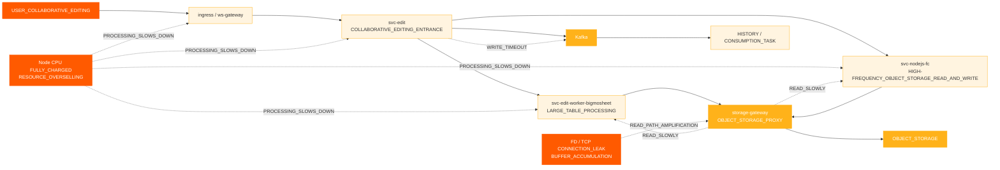
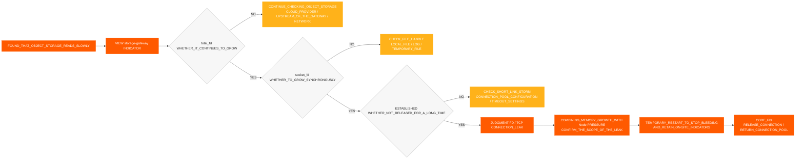
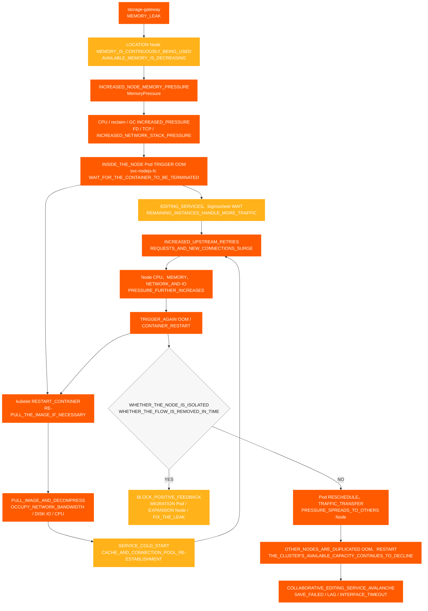

# Collaborative Editing Incident

[← ShimoDocs Suite Deployment Documentation](../README.md)

## 1. Case Background

The environment of a large company experienced an incident where collaborative editing became unavailable, affecting users' normal editing and saving of certain spreadsheets and documents. During the incident, users encountered failed saves, editing delays, and Kafka write timeout issues; on the server side, there were problems such as slow object storage reads, abnormal node usage, and abnormal CPU/FD metrics and TCP issues.

This case illustrates that unavailability of collaborative editing is not necessarily directly caused by the editing service itself. It may also be amplified by issues such as oversold underlying resources, concentrated node scheduling, slowed middleware writes, abnormal object storage read paths, or connection leaks.

## 2. Incident Manifestation

The main impacts of this incident were as follows:

- Collaborative editing links could not be used, were slow to respond, or the interface timed out.
- Some spreadsheets or documents cannot be saved properly.
- Edit-side pop-up appears. `Kafka write timeout`.
- Object storage read time has increased, further affecting the processing of edit links.
- Pod monitoring shows normal, but users continuously report save failures, edit delays, and interface timeouts.

## 3. Preliminary Investigation Process

### 3.1 Starting from User Phenomena to Investigate Edit Links

The customer initially reported anomalies in some documents, so the preliminary investigation focused on collaborative editing issues:
1. Check edit and save links.
2. Check related service logs.
3. Check Kafka write status.
4. Check object storage read/write latency.

During the investigation, two main anomalies were discovered:

- Abnormalities occurred in `Kafka write timeout` edit links.
- Object storage read latency is abnormal.

### 3.2 Preliminary Confirmation of External Dependencies 

During the investigation, we confirmed with the responsible parties for external dependencies one by one: 

- We have confirmed with the object storage provider that the cloud service provider did not find any obvious issues.
- We have confirmed with Kafka operations that no obvious issues were found on the cluster side. No obvious issues were found on the Kafka cluster side.

Therefore, this problem cannot be directly attributed to the object storage or the Kafka service itself, and further investigation is needed on local business nodes, gateways, connection pools, networks, and resource layers.

### 3.3 Shifting from Pod Monitoring to Node Monitoring 

Initially, when checking Pod monitoring, both CPU and memory appeared to be within relatively safe ranges, but the customer reported that node CPU had reached maximum usage.

This is the key turning point in the current diagnosis:

- In the case of over-allocated resources, Pod monitoring may not accurately reflect node pressure.
- Once the node CPU reaches maximum load, the business processing capability within the container will decline.
- After the business processing slows down, it further manifests as slow object storage reads, slow Kafka writes, request backlog, and save failures.

## 4. Failure Impact Chain

## 5. Main Findings

### 5.1 Node CPU Anomalies

Multiple nodes experienced sequential CPU anomalies:
- '10.142.191.54' had an anomaly at 18:20.
- '10.76.176.65' had an anomaly at 18:30.
- '10.76.238.202' had an anomaly at 18:40.
- '10.142.206.216' had an anomaly at 18:42.
- '10.142.175.191' had an anomaly at 18:45.

It can be seen that the first anomaly was on '10.142.191.54', followed by CPU issues on other nodes, which is consistent with the characteristics of a single-point resource anomaly spreading to multiple nodes.

### 5.2 CPU and Memory Oversubscription

The resource oversubscription status before and after the failure is as follows:

| Scenario | Resource | Cluster Capacity | Total Requests | Request Ratio | Total Limits | Overcommit |
| --- | --- | --- | --- | --- | --- | --- |
| nodejs-fc pod 6 | CPU | 192 cores | 33.75 cores | 17.6% | 457 cores | 238.0% |
| nodejs-fc pod 6 | Memory | 768 GiB | 57.24 GiB | 7.5% | 884 GiB | 115.1% |
| nodejs-fc pod 12 | CPU | 192 cores | 45.75 cores | 23.8% | 493 cores | 256.8% |
| nodejs-fc pod 12 | Memory | 768 GiB | 81.24 GiB | 10.6% | 980 GiB | 127.6% |
| nodejs-fc pod 12 after scaling | CPU | 320 cores | 45.75 cores | 14.3% | 493 cores | 154.1% |
| nodejs-fc pod 12 after scaling | Memory | 1280 GiB | 81.24 GiB | 6.3% | 980 GiB | 76.6% |

Under normal circumstances, controlling CPU overcommitment at around 150% is relatively acceptable. Before this scaling, CPU overcommitment had already reached 238%, and after doubling the scale, it reached 256.8%, posing a high risk of a sudden traffic avalanche.

### 5.3 Pod Scheduling Concentration

By default, the default scheduling strategy in large K8s company environments tends to fill up a node before using remaining nodes. During rolling deployment of services or temporary scaling, multiple high-load services are easily concentrated on a few nodes.

High-risk combinations include:

- Multiple `svc-nodejs-fc` instances on a single node.
- Running `svc-edit-worker-bigmosheet` and `ingress` simultaneously on the same node.
- Overlaying `storage-gateway` may lead to connection leaks or increased memory.

### 5.4 Storage Gateway Connections and Memory Leaks

Further inspection of the node TCP monitoring and `storage-gateway` Pod metrics revealed:

- `total_fd` continues to increase.
- `socket_fd` continues to increase.
- TCP connection maintains `ESTABLISHED` for a long time.  
- Connections not released in time, and FD did not return to the connection pool.  
- Pod RSS/work sets continue to grow and cannot return to normal levels after recycling.  

If `total_fd`, `socket_fd`, and all memory usage continues to increase simultaneously, this indicates that connections are not released and memory keeps growing. This should be treated as connection and memory leak, and attention should be paid to node `MemoryPressure` and OOM risks.  

### Impact of the 5.5 version difference 

In older versions, image attachment data was written directly to the data table. In the new version, to reduce MySQL usage and storage costs, image attachment information is written to the object storage metadata, and the direct access to object storage is used to read the `/x`.

Under the proxy mode, the underlying function used to determine whether an object storage key exists did not correctly release connections, leading to connection leaks. This issue, combined with excessive resource allocation and centralized scheduling, escalated into a failure that made collaborative editing unavailable. 

### 5.6 Evidence from Object Storage and Storage Gateway Monitoring 

To determine whether the problem originated from the object storage side, the business service side, or the proxy layer, a comparative investigation was conducted on object storage and `storage-gateway`: 

- Object storage read latency increased, while write latency remained relatively normal; the anomalies were mainly concentrated in the read path. 
- CPU, RSS / working set, and the memory growth rate of `storage-gateway` Pods continued to increase. 
- `total_fd` and `socket_fd` continued to grow, and TCP connections remained in the `ESTABLISHED` state for a long time.
- Connections were not released in a timely manner, and file descriptors were not returned to the connection pool, causing memory pressure and the risk of OOM on nodes.  
- No server-side failures matching the scale of business anomalies were found on the object storage side, so the investigation focus was prioritized on the `storage-gateway` proxy read path.  

Comprehensive judgment: The slow reading of object storage is not only due to object storage service failures, but is the result of FD accumulation, TCP connection, memory, and node resource pressure caused by... `storage-gateway` connections not being released.  

### 5.7 FD/TCP Leak Determination Process  

This time, the following reasoning chain was used to confirm that `storage-gateway` has connection leaks:

Judgment Conclusion: When `total_fd`, `socket_fd`, the number of `ESTABLISHED` connections and Pod memory usage increase simultaneously within the same time window, the main root cause can be considered as 'FD/TCP and memory leaks due to unreleased connections'; if object storage read speed is slow while write is normal, and the above indicators are abnormal at the same time, the proxy read path should be checked first. 

## 6. Root Cause Conclusion 

The root cause chain of this failure is:

1. The cluster has significant CPU overcommitment, with CPU over-allocation exceeding 250% at certain stages.
2. During service rolling updates or temporary scaling, Pod scheduling is concentrated, causing excessive resource pressure on individual nodes.
3. High-load services such as `svc-nodejs-fc`, `svc-edit-worker-bigmosheet`, and `ingress` are concentrated on certain nodes. 
4. `storage-gateway` has a connection release issue in the object storage proxy read path, causing FD, TCP connections, and memory usage to continue growing. 
5. After memory pressure and OOM, container restarts, image pulls, service cold starts, and upstream retries further increase CPU, network, and disk IO pressure, leading to slow object storage reads and slow Kafka writes. 
6. Slow object storage reads and Kafka write timeouts ultimately manifest as collaborative editing being unavailable, save failures, and editing delays. 

## 7. Node Resource Avalanche Propagation Diagram

The business services involved in this fault all run in the K8s cluster. The memory leak in `storage-gateway` first consumes the available memory of its node, and then through OOM container restarts, image pulling, service cold starts, and upstream retries, forms a positive feedback loop of resource consumption. When the abnormal Pod is rescheduled or traffic is transferred to other nodes, the pressure continues to spread to healthy nodes, ultimately triggering a cluster-level avalanche.

This diagram highlights two amplification loops to pay attention to: 

1. **Intra-node positive feedback loop**: OOM → kubelet restarts or pulls image → cold start → upstream retries and new connections increase → CPU, memory, network, and disk IO pressure continues to rise → OOM occurs again.
2. **Cross-node propagation loop**: Pods on abnormal nodes are rescheduled, ingress traffic is redirected, or remaining instances take over requests → load on healthy nodes increases → other nodes experience OOM and repeatedly restart → the cluster's available capacity continues to decline.

## 8. Handling and Repair

### 8.1 Short-term handling

- Remove gateway traffic for abnormal ingress or abnormal nodes to prevent new traffic from entering high-pressure paths.
- Restart abnormal services using FD, due to TCP or continuously growing memory.
- Migrate or spread high-load Pods away from high-pressure nodes.
- Evict Pods or isolate nodes with full CPU resources.  
- Avoid scaling business Pods alone; priority should be given to replenishing node resources.  
- Add fast-fail capability to the `svc-edit` synchronization interface to prevent requests from piling up for too long.  

### 8.2 Long-term Fixes  

- When checking whether the Key exists in object storage proxy mode, fix the issue of unreleased connections.  
- Configure anti-affinity policies for core services to avoid concentrating high-risk services on the same node.  
- Configure node eviction policies to prevent nodes from continuing to run core services after resources are exhausted.  
- Establish monitoring for CPU and memory over-allocation.  
- Before scaling services, evaluate the resource levels of the customer environment and confirm the scaling plan with the project leader.  
- Set up the following alerts: OOM, FD, TCP, slow requests, Kafka backlog, and object storage read/write latency for core services.  

## 9. Case Review Conclusions

This issue indicates that when collaborative editing is unavailable, investigations should not focus solely on the editing service logs. If the underlying node resources are fully utilized, the overall business service will slow down, manifesting in multiple upper-level symptoms such as Kafka write timeouts, slow object storage reads, and save failures.

In handling similar issues in the future, cluster and node resources should be confirmed first, followed by a step-by-step examination of middleware, business monitoring, logs, and trace links, to avoid starting the investigation from a single service log and falling into a local troubleshooting loop.

---
