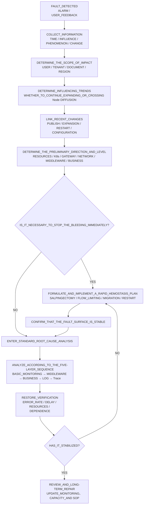
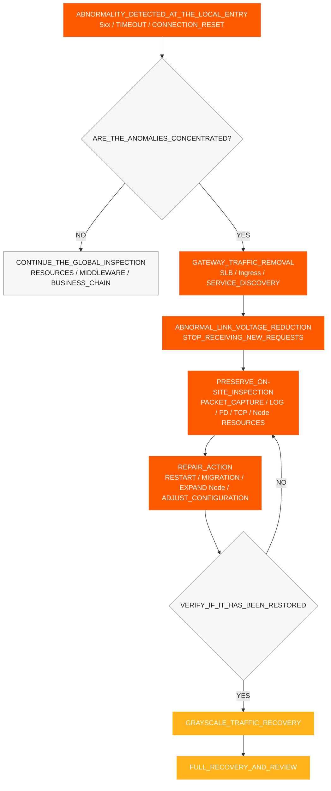
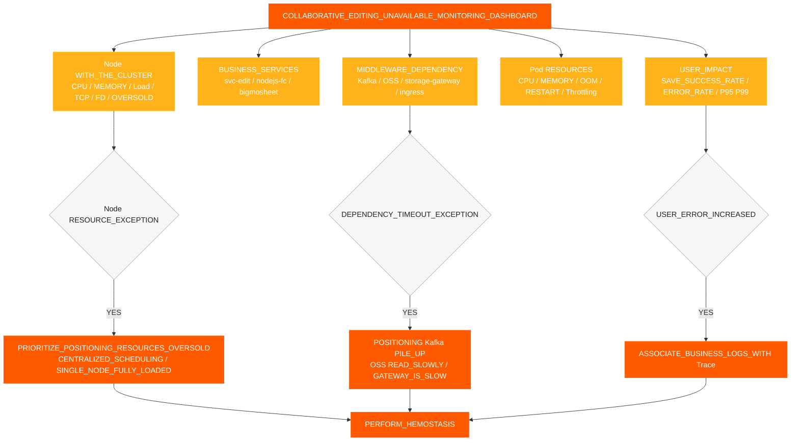
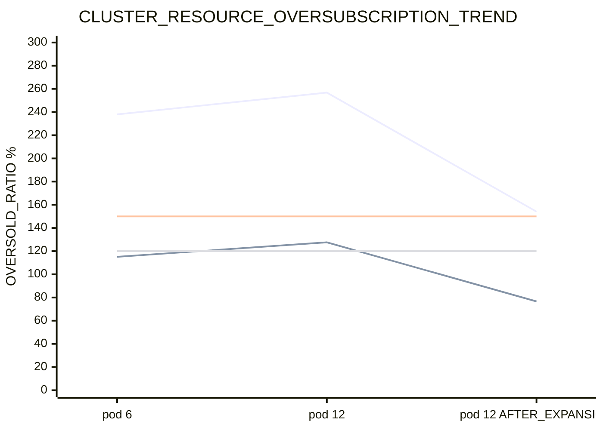
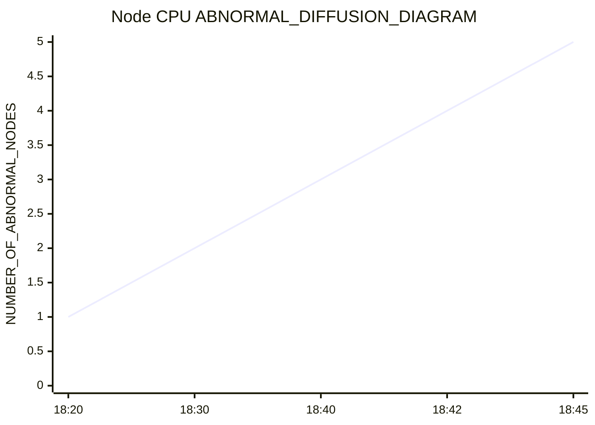
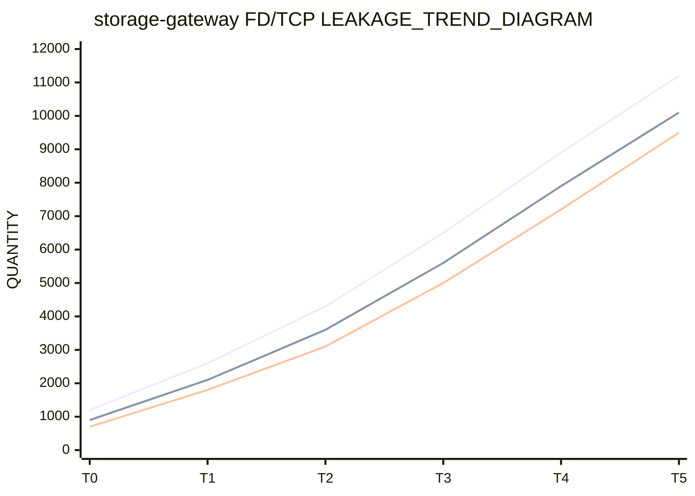
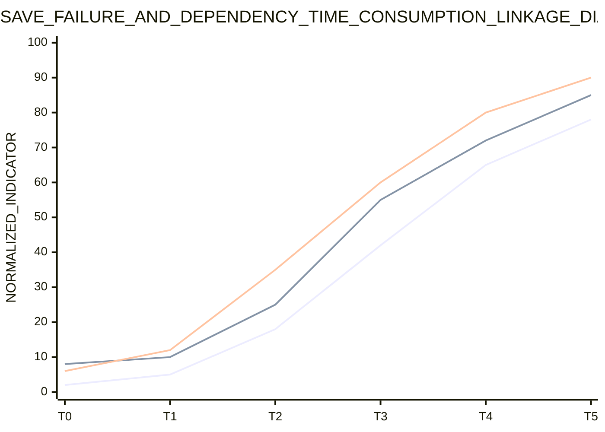
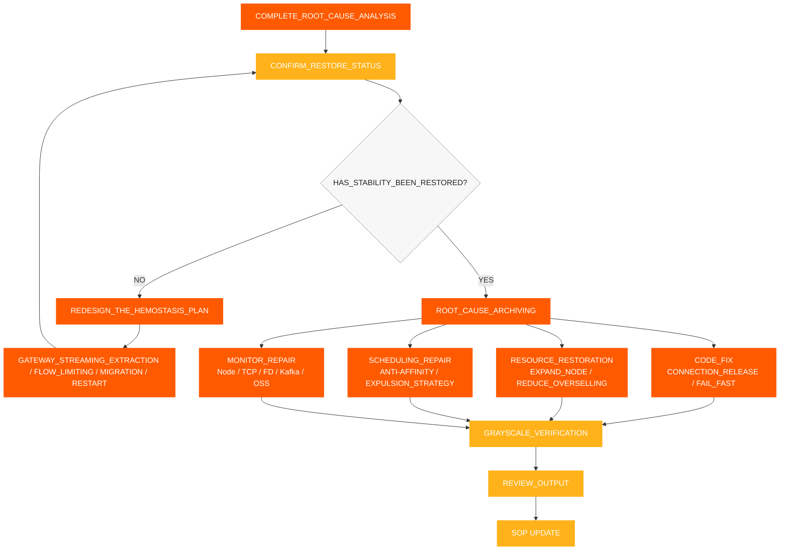

# Incident Response SOP

[← ShimoDocs Suite Deployment Documentation](../README.md)

## 1. Information Gathering

After receiving a fault, first record the following information:

- Time of occurrence: first alert time, first customer feedback time, whether it occurred simultaneously with a release or scaling
- Scope of impact: tenants, document types, number of files, number of users, whether concentrated in a sheet or large sheet
- Specific symptoms: save failure, edit errors, Kafka timeout, object storage read slow, API timeout
- Recent changes: service release, rolling restart, Pod scaling, node scaling, storage or Kafka changes
- Key services: `svc-nodejs-fc`, `svc-edit`, `svc-edit-worker-bigmosheet`, `storage-gateway`, `ingress`, `ws-gateway`.


## 2. Information Assessment and Fault Classification

After completing information collection, first determine the fault scope, development trend, and main cause direction based on symptoms, metrics, events, and change records, then decide whether immediate containment is required. The judgment results should form a clear conclusion and should not rely solely on a single Pod or a single log.

Key points of assessment:

- User impact scope: users, tenants, document types, regions, and affected services.
- Impact manifestations: save failures, editing delays, API timeouts, Kafka write timeouts, slow object storage reads.
- Impact trend: whether it continues to expand, whether it spreads from a single Pod or node to multiple nodes.
- Change correlation: whether it is related to service releases, Pod scaling, node scaling, rolling restarts, configuration or middleware changes.
- Preliminary direction: resource, K8s control plane, gateway, network, middleware, business code, or data issues.

Determine the fault level based on the judgment results:

| Level | Criteria | Response Objective |
| --- | --- | --- |
| P0 | Core services experience widespread editing unavailability, continuous save failures, batch anomalies | Stop the loss within 15 minutes, clarify the main cause direction within 30 minutes |
| P1 | Some tenants, some documents, some nodes are abnormal, error rate significantly increased | Locate the abnormal link within 30 minutes, restore stability within 60 minutes |
| P2 | Single points or small-scale requests are slow, occasional save failures | Complete cause confirmation and repair plan within 1 working day |

The judgment conclusion should answer at least three questions: how severe is the current impact, is the fault expanding, should we stop the loss first or directly perform root cause analysis




## 3. Rapid Hemostasis

If the user side continues to fail, or if the judgment result shows that the fault is spreading, first implement containment measures, then continue in-depth analysis. The goal of containment is to narrow the fault scope, block positive feedback of resources, while preserving the fault scene as much as possible.

1. Remove traffic from the abnormal gateway SLB backend, Ingress entries, service instances, or nodes to prevent new requests from continuing to enter the abnormal path.
2. Set abnormal nodes as unschedulable or isolate them to prevent Pods from continuing to be scheduled to high-pressure nodes.
3. Restart Pods that encounter OOM, continuous memory growth, or FD/TCP leaks, prioritizing `storage-gateway`, `svc-nodejs-fc`, and `svc-edit-worker-bigmosheet`.
4. Distribute high-load Pods to avoid `nodejs-fc`, `bigmosheet`, `ingress`, and `storage-gateway` concentrating on the same node.
5. Pause scaling of ineffective business Pods, and prioritize scaling nodes or restoring available resources.
6. Implement rate limiting or fast failure for upstream retries, connection creation, and request accumulation to prevent continuous surge of new connections after cold start.
7. Record node CPU, memory, OOM, FD, TCP, error rate, and interface latency before and after stopping the bleeding.

### 3.1 Gateway Traffic Removal

When a fault manifests as an abnormal local node, local gateway entry, or local service instance, abnormal ingress traffic should be cleared first before handling nodes and Pods. The purpose of clearing traffic is to alleviate pressure on the faulty link and prevent abnormal instances from continuing to receive new requests.

Trigger conditions:

- The error rate of a certain Ingress, with the number of SLB backends, gateway Pods, or nodes significantly higher than other instances. 
- Gateway 5xx errors, upstream timeouts, and connection resets are concentrated at a few entry points. 
- Certain nodes' CPU, load, TCP, and FD metrics are significantly abnormal, while new requests are still continuously coming in. 
- Core link instances such as `svc-edit`, `ws-gateway`, and `storage-gateway` have already slowed down.

Actions to be taken:

1. Remove abnormal backends from SLB, Ingress, gateway routing, or service discovery.
2. Temporarily mark the abnormal nodes as unschedulable to prevent new Pods from being scheduled on them.
3. Conduct packet capture, logs, FD/TCP checks, and resource inspections on nodes or instances that have had traffic removed.
4. After completing a restart, migration, scaling, or configuration repair, first restore to a low traffic load, then fully recover. 
5. Before recovery, confirm that the error rate, interface response time, and node/FD metrics have returned to normal. CPU and TCP




## 4. Standard Root Cause Analysis Process

After completing quick containment and confirming that the fault surface is stable, proceed with root cause analysis. The standard investigation sequence follows a "bottom-up, coarse-to-fine" approach:

1. Basic Monitoring: cluster resources, nodes, Pod resources.
2. Middleware Monitoring: Kafka object storage, gateway, network.
3. Business Monitoring: save success rate, interface response time, and error rate.
4. Log Monitoring: error logs, timeout logs, OOM/restart logs.
5. Trace Tracking: request chains, slow calls, abnormal spans.

Core Requirements:

- Each layer should first output a judgment conclusion before moving to the next layer.
- Check nodes first, then Pods; observe global trends first, then logs of individual services.
- Do not skip subsequent layers just because no anomalies are detected in the current layer.
- Monitoring, logs, and tracing need to be associated using the same time window, Pod, node, and trace ID.

Each layer only answers one core question:

- Basic Monitoring: Are resources already insufficient? Are there signs of overselling, centralized scheduling, or cross-node distribution?  
- Middleware Monitoring: Is there any performance degradation, backlog, request rejection, or connection exception?  
- Business Monitoring: Which service, API, or document type corresponds to the user impact?  
- Log Monitoring: Is there clear evidence of errors, timeouts, OOM restarts, or exhausted connection pools?  
- Trace Monitoring: Specifically, where do failed requests get stuck — which service, node, or span?  

### 4.1 Basic Monitoring Troubleshooting  

Prioritize checking at the node level, not just at the Pod level. When resources are over-allocated, Pod monitoring may appear within safe limits, but the node may already be fully utilized.  

Items to check:  

- Total cluster CPU and memory capacity and available capacity.  
- Node CPU, memory, load, disk, and network.  
- Pod CPU, memory, restart times, OOM, and CPU throttling status.
- Are there multiple high-CPU or high-IO services concentrated on a single node?  
- After a rolling release, are Pods mainly scheduled on the first few nodes?  
- Are anti-affinity and eviction policies missing?  

Key assessments:  

- Is the total CPU limit / cluster CPU capacity exceeding 150%?  
- Is the total memory limit / cluster memory capacity exceeding 120%?  
- Is there a process where one node fails first, followed by a gradual increase in usage on other nodes? CPU usage.  


### 4.2 Middleware Monitoring Troubleshooting  

Middleware troubleshooting mainly focuses on Kafka, object storage, gateways, and the network. The specific assessment for Kafka is as follows; detailed metrics and assessment items for object storage, `storage-gateway`, gateways, and the network are uniformly recorded in Section 9.7 and the related checklists.  

#### 4.2.1 Kafka  

Inspection items:

- Producer write latency and failure rate. 
- Topic backlog. 
- Broker-side CPU, disk, network, and request latency. 
- Whether the client experiences retransmissions, packet loss, or connection congestion. Kafka.
- Whether timeouts occur only on the business side writes, while the operational side has no obvious anomalies. Kafka operational side.

Judgment logic:

- If there are no anomalies on the operational side, but write timeouts persist on the business side, focus on checking the business node Kafka, network congestion, and client processing capability. When CPU backlog and business errors occur simultaneously, first confirm whether the backlog is caused by slow upstream service processing.
- If Kafka.

### 4.3 Business Monitoring, Logging, and Tracing

#### 4.3.1 Business Monitoring

Confirm the abnormal links based on customer phenomena:

1. Whether save failures are concentrated in certain tables, large tables, or specific document types.
2. Whether the editing interface experiences timeouts, slower requests, or an increased error rate.
3. Check whether `Kafka write timeout` occurs. 
4. Check if object storage reads are slow and writes are normal. 
5. Check whether `bigmosheet operation oss_get` exceeds 5 seconds. 
6. Check whether WebSocket, collaborative editing, history, and object storage related services all experience increased latency at the same time. 

#### 4.3.2 Log Monitoring 

Key logs to check: 

- Logs of failed edit saves. 
- Logs for Kafka write timeouts. 
- Logs of slow object storage reads and writes. 
- Logs for OOM, restarts, connection pool exhaustion, and FD exhaustion. 
- Gateway 5xx errors, upstream timeouts, and connection reset logs. 

#### 4.3.3 Trace Link Tracking 

Use Trace to track individual failed requests: 

- Check whether requests are stuck in the gateway, collaborative editing, object storage, Kafka, or historical consumption chain. 
- Check for any Spans showing abnormal latency. 
- Check whether slow calls are concentrated in specific services, nodes, or document types. 
- Compare link differences between failed requests and normal requests. 

## 5. Recovery Verification 

After completing the bleeding control operations, the following indicators must be verified:

- Removed gateway entries, SLB backends, or abnormal instances have stopped receiving new traffic.
- Save success rate has returned to normal.
- The error rate on the editing interface has decreased.
- Kafka write delays have returned to normal.
- Kafka backlog has decreased.
- Object storage read delays have returned to normal.
- Node CPU, memory, and load have decreased.
- `storage-gateway` FD and socket FDs are no longer continuously increasing.
- Abnormal nodes are no longer spreading.
- After recovering traffic in the grayscale release, gateway 5xx, upstream timeouts, and connection resets did not rise again. 

## 6. Monitoring and Alert Requirements 

The following alerts must be completed:

- Node CPU, memory, load, disk, and network alerts.
- Node TCP connection count, retransmissions, packet loss, and `ESTABLISHED` connection count alerts.
- Pod OOM restarts and CPU throttling alerts.
- Core service OOM alerts.
- CPU oversubscription alert: CPU limit / cluster CPU capacity exceeds 150%.
- Memory oversubscription alert: memory limit / cluster memory capacity exceeds 120%.
- Kafka backlog alerts.
- Kafka write timeout alerts.
- Edit save failure error log alerts.
- `bigmosheet operation oss_get > 5s` alerts.
- `storage-gateway` FD and socket FD increasing alert continuously. 
- `storage-gateway` RSS / working set increasing continuously and node `MemoryPressure` alert. 

## 7. Key Metrics Monitoring Dashboard

This section is an auxiliary tool and will not change the main process order. The dashboard is used to observe trends and locate directions, while `kubectl`, `jq`, and PromQL are used to obtain specific evidence; on-site investigation should follow the detailed checklist in Section 9, executing each item and recording conclusions.

### 7.1 Dashboard Layering

It is recommended to divide the collaborative editing unavailable fault dashboard into 5 layers, checking layer by layer from top to bottom during investigation:

| Level | Dashboard Name | Core Metrics | Purpose |
| --- | --- | --- | --- |
| L1 | User Impact Dashboard | Save success rate, edit error rate, interface P95/P99, online collaboration connection | Determine whether users are truly affected |
| L2 | Business Service Dashboard | QPS error rate, latency and restart count `svc-edit`, `svc-nodejs-fc`, `bigmosheet` | Determine which business service the anomaly is concentrated in |
| L3 | Middleware Dashboard | Kafka write latency, Kafka backlog, object storage read/write latency, upstream gateway latency | Determine whether dependencies are slowing down |
| L4 | Container Resource Dashboard | Pod CPU, memory, OOM restart count, CPU throttling | Determine whether the container itself is abnormal |
| L5 | Node and Cluster Dashboard | Node CPU, Memory, Load, TCP, FD, Over-allocated Resources, Pod Distribution | Determine whether underlying resources support business operations |

### 7.2 Key Metrics Overview Chart



### 7.3 Resource Over-allocation Trend Chart

This chart is used to observe whether the CPU and memory enter high-risk areas of over-allocation before and after scaling. In the actual dashboard, it is recommended to set the CPU over-allocation to 150% and the memory over-allocation to 120% as alert threshold lines.



### 7.4 Node CPU Diffusion Trend Chart

This chart is used to observe whether there is a diffusion feature, that is, a single node fails first, and then other nodes gradually get dragged down.



### 7.5 FD/TCP Leak Trend Chart

This chart is used to determine whether there is a `storage-gateway` connection or FD leak. If `total_fd`, `socket_fd`, and the number of `ESTABLISHED` connections are all continuously increasing at the same time, connection leaks should be prioritized for handling.



### 7.6 Business Errors and Dependency Latency Correlation Chart

This chart is used to verify whether client-side save failures are related to increases in Kafka write latency and object storage read latency. If the three metrics increase simultaneously within the same time window, priority should be given to checking the processing capacity of business nodes and congestion in the dependency chain.



### 7.7 Recommended Alarm Thresholds

| Metric | Recommended Threshold | Action After Trigger |
| --- | --- | --- |
| Save Success Rate | Below 99% for 5 consecutive minutes | Enter business impact confirmation, correlate error logs and traces |
| Edit API P95 | Above 2 times the baseline for 5 consecutive minutes | Check `svc-edit`, `nodejs-fc`, `bigmosheet` |
| Kafka Write Latency | Twice the baseline or write timeout occurs | Check Kafka backlog, business node CPU, network retransmissions |
| Kafka Backlog | Continuous growth for 10 minutes | Check consumer tasks and upstream write speed |
| OSS Read Latency | P95 exceeds 5 seconds | Check `storage-gateway`, network, and object storage side |
| Node CPU | Above 90% for 5 consecutive minutes | Check Pod distribution, CPU over-allocation, high-load services |
| CPU Over-allocation | Exceeds 150% | Pause business Pod scaling, prioritize assessing node expansion |
| Memory Over-allocation | Exceeds 120% | Check OOM, risk of eviction and memory leaks |
| `total_fd` / `socket_fd` | Monotonically increasing for 10 minutes | Check FD/TCP leaks, restart if necessary to stop bleeding |
| TCP Retransmission Rate | More than twice the baseline | Capture packets to confirm packet loss, congestion, or window issues |
| Pod Restart/ OOM | Occurs in any core service | Immediately correlate logs and release changes |

### 7.8 Commands to Query Node CPU and Memory Over-subscription

The following commands apply to scenarios where the business is running in the following K8s cluster. Before execution, confirm that the current kubeconfig has switched to the faulty cluster, and replace `NODE_NAME` with the target node name.

#### 7.8.1 Check the actual CPU and memory usage of the node

```bash
# View the real-time CPU and memory usage of all Nodes
kubectl top nodes

# View the real-time usage of the specified Node
kubectl top node "$NODE_NAME"

# View the node's capacity, allocatable resources, and pressure status
kubectl describe node "$NODE_NAME" | sed -n '/Capacity:/,/Allocatable:/p'
kubectl describe node "$NODE_NAME" | sed -n '/Conditions:/,/Addresses:/p'

# Directly view the CPU/memory Requests, Limits, and usage ratio allocated to the Node
kubectl describe node "$NODE_NAME" | sed -n '/Allocated resources:/,/Events:/p'
```

Key focus points: `CPU%`, `MEMORY%`, `MemoryPressure`, `DiskPressure`, `PIDPressure`. When the actual usage rate exceeds 90%, it is necessary to immediately determine whether rate limiting control is required based on Pod distribution and gateway traffic removal status.

#### 7.8.2 Statistical Data CPU, Memory Requests and Limits for Specified Nodes

```bash
# Statistics of CPU/memory requests and limits for all Pod containers on the specified Node.
# Dependencies: kubectl, jq; memory is uniformly converted to MiB, CPU is uniformly converted to cores.
NODE_NAME="<TARGET_NODE_NAME>"

kubectl get pods -A --field-selector "spec.nodeName=${NODE_NAME}" -o json | jq '
  def cpu_core:
    if . == null then 0
    elif endswith("m") then (rtrimstr("m") | tonumber / 1000)
    else tonumber
    end;
  def mem_mib:
    if . == null then 0
    elif endswith("Ki") then (rtrimstr("Ki") | tonumber / 1024)
    elif endswith("Mi") then (rtrimstr("Mi") | tonumber)
    elif endswith("Gi") then (rtrimstr("Gi") | tonumber * 1024)
    elif endswith("Ti") then (rtrimstr("Ti") | tonumber * 1024 * 1024)
    elif endswith("K") then (rtrimstr("K") | tonumber / 1024)
    elif endswith("M") then (rtrimstr("M") | tonumber)
    elif endswith("G") then (rtrimstr("G") | tonumber * 1024)
    elif endswith("T") then (rtrimstr("T") | tonumber * 1024 * 1024)
    else (tonumber / 1024 / 1024)
    end;
  [ .items[]
    | ([(.spec.containers[]?, .spec.initContainers[]?) | .resources.requests.cpu? // "0"] | map(cpu_core) | add) as $cpu_req
    | ([(.spec.containers[]?, .spec.initContainers[]?) | .resources.limits.cpu? // "0"] | map(cpu_core) | add) as $cpu_limit
    | ([(.spec.containers[]?, .spec.initContainers[]?) | .resources.requests.memory? // "0"] | map(mem_mib) | add) as $mem_req
    | ([(.spec.containers[]?, .spec.initContainers[]?) | .resources.limits.memory? // "0"] | map(mem_mib) | add) as $mem_limit
    | {cpu_request: $cpu_req, cpu_limit: $cpu_limit, mem_request_mib: $mem_req, mem_limit_mib: $mem_limit}
  ]
  | {
      cpu_request_core: (map(.cpu_request) | add),
      cpu_limit_core: (map(.cpu_limit) | add),
      mem_request_mib: (map(.mem_request_mib) | add),
      mem_limit_mib: (map(.mem_limit_mib) | add)
    }'
```

Note: Official K8s scheduling calculations use the "maximum value" rule `initContainers`. The above command is used for quick on-site summary and is suitable for detecting obvious over-allocation; when reconciling with resource dashboards or scheduler data, the node resource statistics provided by the platform should be used as the standard.

#### 7.8.3 Calculating Cluster CPU and Memory Over-allocation Ratios

```bash
# Get the total Allocatable resources of all nodes in the cluster
kubectl get nodes -o json | jq '
  [ .items[].status.allocatable
    | {
        cpu_core: (if (.cpu | endswith("m"))
                   then (.cpu | rtrimstr("m") | tonumber / 1000)
                   else (.cpu | tonumber)
                   end),
        memory_bytes: (.memory | rtrimstr("Ki") | tonumber * 1024)
      }
  ]
  | {
      cpu_allocatable_core: (map(.cpu_core) | add),
      memory_allocatable_gib: (map(.memory_bytes) | add / 1024 / 1024 / 1024)
    }'

# Summarize the CPU/memory limits of all Pods for calculating the overcommit ratio
kubectl get pods -A -o json | jq '
  def cpu_core:
    if . == null then 0
    elif endswith("m") then (rtrimstr("m") | tonumber / 1000)
    else tonumber
    end;
  def mem_gib:
    if . == null then 0
    elif endswith("Ki") then (rtrimstr("Ki") | tonumber / 1024 / 1024)
    elif endswith("Mi") then (rtrimstr("Mi") | tonumber / 1024)
    elif endswith("Gi") then (rtrimstr("Gi") | tonumber)
    else (tonumber / 1024 / 1024 / 1024)
    end;
  [ .items[] | .spec.containers[]?
    | {
        cpu_limit_core: (.resources.limits.cpu? // "0" | cpu_core),
        memory_limit_gib: (.resources.limits.memory? // "0" | mem_gib)
      }
  ]
  | {
      cpu_limit_core: (map(.cpu_limit_core) | add),
      memory_limit_gib: (map(.memory_limit_gib) | add)
    }'
```

Calculation formula: `CPU overcommit ratio = Total CPU Limits of all Pods / Total CPU Allocatable of all Nodes × 100%`; `Memory overcommit ratio = Total Memory Limits of all Pods / Total Memory Allocatable of all Nodes × 100%`. It is recommended to set CPU overcommit to 150% and memory overcommit to 120% as high-risk reference lines, but the final threshold should be determined based on the customer's environment baseline. 

#### 7.8.4 Prometheus / Grafana Query Statements

```promql
# Cluster CPU Limit Oversubscription Rate
100 * sum(kube_pod_container_resource_limits{resource="cpu", unit="core"})
  / sum(kube_node_status_allocatable{resource="cpu", unit="core"})

# Cluster Memory Limit Overcommit Rate
100 * sum(kube_pod_container_resource_limits{resource="memory", unit="byte"})
  / sum(kube_node_status_allocatable{resource="memory", unit="byte"})

# View CPU Limit Overcommit Rate by Node
100 * sum by (node) (kube_pod_container_resource_limits{resource="cpu", unit="core"})
  / on (node) kube_node_status_allocatable{resource="cpu", unit="core"}

# View Memory Limit Oversubscription Rate by Node
100 * sum by (node) (kube_pod_container_resource_limits{resource="memory", unit="byte"})
  / on (node) kube_node_status_allocatable{resource="memory", unit="byte"}

# Node Actual CPU Usage
100 * (1 - avg by (instance) (rate(node_cpu_seconds_total{mode="idle"}[5m])))

# Node actual memory usage
100 * (1 - node_memory_MemAvailable_bytes / node_memory_MemTotal_bytes)

# K8s node memory pressure status, 1 indicates MemoryPressure=True
kube_node_status_condition{condition="MemoryPressure", status="true"}
```

If the label names of the resource metrics `unit` and `node` in Prometheus are inconsistent with the above statements, you should first confirm the actual labels in the metric details before making adjustments. The overallocation ratio can only indicate potential risks in the resource declarations and cannot replace an assessment of the actual situation of the nodes. CPU, memory, OOM, and `MemoryPressure`.

## 8. Review and Long-term Rectification Cycle




## 9. Detailed Inspection Checklist

This checklist is executed in the order of 'User Symptoms → Basic Resources → K8s → Middleware → Logs and Traces → Handling Loop.' Each item should record observation time, abnormal objects, metric screenshots or query results to avoid only noting 'normal/abnormal' without review.

### 9.1 Confirmation of Symptoms and Impact Scope

| Inspection Item | Matters to Confirm | Abnormal Judgment | On-Site Record / Conclusion |
| --- | --- | --- | --- |
| User Impact | Collaborative editing unavailable, save failures, editing delays, interface timeout | If multiple users, tenants, or documents are abnormal at the same time, it is judged as a business failure | |
| Fault Scope | Is it concentrated on tables, large spreadsheets, specific document types, specific tenants, or specific regions? | When there is obvious concentration, prioritize grouping by service routing, data type, or nodes | |
| Error Manifestation | Whether 'Kafka write timeout', gateway 5xx, connection reset, or upstream timeout occurs | When multiple error types rise simultaneously within the same time window, prioritize attention to common dependencies and resource layers | |
| Time Correlation | The time points of first alert, first feedback, and when metric anomalies begin | If it occurs simultaneously with release, scaling, rolling restart, or configuration change, record the change work order number | |
| Impact Scope | Failed request volume, failure rate, online collaboration connection count, affected services and replicas | When the impact continues to expand, escalate the fault level and first perform loss containment operations | |

### 9.2 Basic Project Monitoring: Node 

| Monitoring Object | Key Metrics | Key Judgement | Recommended Operation | On-site Record / Conclusion |
| --- | --- | --- | --- | --- |
| CPU Usage | Node CPU usage, load 1/5/15, CPU steal, iowait, softirq | CPU sustained >90%, load close to or exceeding number of cores, abnormal increase in iowait/softirq | Check high-load Pods, if necessary remove traffic, migrate Pods, or scale nodes | |
| Memory Usage | Used, available, RSS, page faults, swap, OOM Kill | Available memory continuously decreasing, swap usage, OOM, increased memory reclamation pressure | Check for memory leaks and high-memory Pods, confirm `MemoryPressure`, isolate nodes if necessary | |
| Memory Overcommit | Memory limit/allocatable memory, memory request/allocatable memory | Memory limit exceeds 120% or requests are too concentrated | Pause business expansion, prioritize adding nodes, reduce high-risk limits or distribute Pods | |
| CPU Overcommit | CPU limit/allocatable memory, CPU request/allocatable memory | CPU limit exceeds 150%, or high-load Pods are concentrated on the same node | Adjust resource configuration, anti-affinity, and replica distribution | |
| TCP Connections | Total TCP connections, `ESTABLISHED`, `TIME_WAIT`, `CLOSE_WAIT`, retransmission rate | Connection count continuously increases, `CLOSE_WAIT` not released for a long time, retransmission rate rises | Locate connection leaks, connection pools, network congestion, and abnormal clients | |
| netstat / Socket | Total number of sockets, listening ports, Recv-Q, Send-Q, number of failed connections | Continuous accumulation of Recv-Q/Send-Q or overflow of the listening queue | Investigate through packet capture, service connection pool, and kernel parameters |  |
| File Descriptors (FD) | Total number of FDs, socket FDs, FD usage by processes, `file-nr` | `total_fd`, `socket_fd` monotonically increasing or approaching process limits | Save current state, restart the leaking service, fix connection release logic |  |
| Disk | File system usage, inode, disk throughput, IOPS, await, util, write latency | Disk full, inode full, await/util continuously high | Clean up temporary files or logs, expand disk, check image extraction and log writing |  |
| Network | NIC bandwidth, packet loss, erroneous packets, retransmissions, soft interrupts, connection tracking table | Bandwidth fully utilized, increase in packet loss/retransmissions, conntrack approaching limit | Check image pulls, cross-node traffic, gateway traffic, and network policies |  
| Node Status | `Ready`, `MemoryPressure`, `DiskPressure`, `PIDPressure` | Any pressure status is true, or node not ready | First remove node traffic, prevent scheduling, and retain current status |  
| Pod Distribution | Whether CPU/memory-intensive services are concentrated on the same node | `svc-nodejs-fc`, `svc-edit-worker-bigmosheet`, `ingress`, `storage-gateway` on the same node | Perform gateway flow separation, migration, or rescheduling |  |

### 9.3 Basic Item Monitoring: Pod

| Monitoring Target | Key Metrics | Key Judgment Points | Recommended Actions | On-Site Records / Conclusions |
| --- | --- | --- | --- | --- |
| CPU Usage | Pod/container CPU usage, CPU throttling, throttling period | High CPU usage or sustained increase in throttling | Check CPU limits, node overcommitment, and request backlog |  |
| Memory Usage | Working set, RSS heap, container memory usage, growth rate | Continuous memory increase and recovery after restart, suspect memory leak | Collect heap information and process metrics, restart if necessary to prevent failure |  |
| OOM and Restart | `OOMKilled` number of restarts, last status, restart time | OOM occurs alongside business errors or node pressure | Correlate kubelet events, container logs, and upstream retries |  |
| Network Connection | Pod TCP connections, `ESTABLISHED`, `TIME_WAIT`, `CLOSE_WAIT` | Sudden surge of new connections or long connections not released | Check connection pool, timeouts, retries, and server-side connection closures |  |
| netstat / Sockets | Recv-Q, Send-Q, listening ports, socket file descriptors | Queue backlog or socket file descriptors increasing with memory | Determine network blocking or connection leaks |  |
| Network Traffic | Inbound/Outbound traffic, error packets, packet loss, cross-node traffic | Sudden traffic spike, abnormal retries, or amplified cross-node traffic | Check gateway routing, service discovery, and retry policies |  |
| Operational Status | Ready, container status, probe failures, startup time | Probe failures, CrashLoopBackOff, slow cold start | First remove traffic, then confirm dependencies and resource recovery, then gradually restore |  |
| Replicas and Scheduling | Available replicas, desired replicas, pending, node distribution | Insufficient replicas or continuously increasing pending Pods | Check for resource shortages, taints, affinity/anti-affinity, and quotas |  |

### 9.4 K8s Monitoring

| Monitoring Object | Key Metrics / Information | Key Assessment | Recommended Actions | On-site Records / Conclusions |
| --- | --- | --- | --- | --- |
| Event Information | Pod OOM evicted, probe failure, scheduling failure, rollback, node not ready | Determine if there are bulk restarts, evictions, scheduling failures, or probe failures | Sort by time and correlate with releases, nodes, and business errors |  |
| Scheduling Status | Number of pending Pods, scheduling time, reasons for insufficient resources, quota usage | Determine the reason Pods cannot be scheduled: CPU/memory shortage, taints, or affinity rules | Expand nodes, adjust scheduling strategies, or temporarily reduce non-core workloads |  |
| kubelet | kubelet errors, PLEG latency, Pod start/stop times, image pull failures | Whether restarts and image pulls have become sources of resource amplification | Check kubelet, container runtime, disks, and network |  |
| API Server | Request QPS, P95/P99, 5xx, number of rejections, work queue | Whether the control plane is responding slowly or experiencing rate limiting | Check APIServer, etcd, and control plane network |  |
| etcd | Commit latency, fsync latency, leader changes, database size, proposal failures, backend commits, disk utilization | Whether latency, leader election, space, or disk I/O are abnormal | Ensure etcd disk and network stability, avoid blindly restarting during failures |  |
| Controller / Scheduler | Work queue depth, scheduling failures, reconciliation latency, Pod creation rate | Whether controllers are backlogged, or replica recovery is delayed | Check control plane load and resource quotas |  |
| Service / Endpoint | Number of endpoints, ready addresses, EndpointSlice updates, service discovery latency | Whether effective backends are reduced due to Pods not being ready | Check probes, service selectors, and gateway backend list |  |
| Network Plugin | CNI errors, Pod network interfaces, DNS latency, CoreDNS QPS/error rate, NetworkPolicy packet loss | Whether there are network anomalies between Pods and nodes, or DNS issues | Check CNI, CoreDNS, NetworkPolicy, and conntrack |  |
| Gateway and Traffic | Ingress traffic / SLB 5xx, upstream timeouts, connection resets, backend health count, QPS | Whether anomalies are concentrated on specific ingress, backend, or nodes | Remove abnormal SLB backends, ingress entries, or gateway instances, and release traffic gradually during recovery |  |

### 9.5 Middleware Monitoring: MySQL

| Key Metrics | Key Judgement | Recommended Action | On-site Record / Conclusion |
| --- | --- | --- | --- |
| QPS, TPS, number of connections, active connections, connection failures | Whether connections have peaked, connection pool exhausted, or requests surged | Check application connection pool, retries, and slow requests |  |
| CPU, memory, disk IO, disk space, IOPS, wait times | Whether resources have reached the limit causing SQL performance degradation | First limit or remove abnormal traffic, then evaluate scaling |  |
| Number of slow queries, P95/P99 lock waits, deadlocks, uncommitted transactions | Whether there are locks or slow SQL operations that amplify business time | Locate SQL, transactions, and indexes; avoid directly terminating unconfirmed transactions |  |
| Buffer pool hit rate, row locks, temporary tables, number of threads | Is it insufficient cache or excessive sorting/concurrency | Check SQL and instance parameters |  |
| Master-slave delay, replication threads, relay log, binary log write delay | Is there an abnormality in read-write separation or replication | Check replication links and traffic switching |  |

### 9.6 Middleware Monitoring: Redis

| Key Metrics | Key Judgement | Recommended Actions | On-site Records / Conclusions |
| --- | --- | --- | --- |
| QPS, command latency, P95/P99, slow queries | Whether command execution has slowed down or request surge | Identify slow commands, batch commands, and hot keys | |
| Memory usage, RSS, memory fragmentation rate, max memory, evicted_keys | Is memory approaching the limit, eviction or abnormal fragmentation occurring | Check key lifecycle, eviction policies, and large keys |  |
| Connected clients, blocked clients, connection refused | Whether the connection pool is exhausted or blocked commands are accumulating | Check the connection pool, blocked commands, and client retries |  |
| Hit rate, Keyspace hits/misses, large keys, hot keys | Whether cache breakdown, penetration, or hotspot concentration increases backend pressure | Increase TTL, hotspot protection, or rate limiting |  |
| Master-slave replication delay, failover, cluster slots, network traffic | Whether a master-slave switch or cluster shard exception has occurred | Check topology and client routing |  |

### 9.7 Middleware Monitoring: Object Storage and Storage Gateway

| Key Metrics | Key Judgments | Recommended Actions | On-site Records / Conclusion |
| --- | --- | --- | --- |
| GET/PUT/HEAD request volume, success rate, 4xx/5xx | Whether it is a read-only path exception, or a specific operation failure | Distinguish between object storage end and proxy end errors |  |
| Read/Write P50/P95/P99, first byte latency, timeout count | Whether there is a 'slow read, normal write' characteristic | Prioritize checking `storage-gateway` read path and node resources |  |
| Pod CPU, working set RSS, GC, restart/OOM | Whether there is a memory leak or GC amplification | Save event status and restart, collect heap and GC information |  |
| `total_fd`, `socket_fd`, `ESTABLISHED`, `CLOSE_WAIT` | Whether there are unreleased connections or FD sustained growth | Check connection pool, timeout, and response close logic |  |
| Connection pool usage, waiting count, connection creation/release rate | Whether the connection pool is exhausted or experiencing a connection storm | Limit retries and connection creation, and, if necessary, distribute traffic |  |
| Network retransmissions, Recv-Q/Send-Q, object storage errors | Whether there is network congestion or upstream dependency anomalies | Capture packets and compare with object storage monitoring |  |

### 9.8 Middleware Monitoring: Elasticsearch

| Key Metrics | Key Judgments | Recommended Actions | On-site Records / Conclusions |
| --- | --- | --- | --- |
| Cluster health, number of nodes, shard status, unassigned shards | Whether there is a yellow/red status, shard recovery, or node offline | Check the reasons for node and shard allocation |  |
| JVM heap memory, old generation GC, GC pause, circuit breaker | Whether heap memory pressure or GC causes request timeout | Reduce query pressure, check aggregation and large result sets |  |
| Search/index QPS, P95/P99, rejections, thread pool queue | Whether query or write operation thread pools are backlogged | Identify slow queries, batch writes, and thread pool rejections |  |
| Disk space, disk watermarks, IOPS, await, segment merging | Whether watermark protection or IO bottleneck is triggered | Clean up invalid indexes, expand disk, or adjust write speed |  |
| Refresh, flush, transaction logs, write failures | Whether the write path is blocked or failed | Check index settings, batch size, and node load |  |

### 9.9 Middleware Monitoring: MongoDB

| Key Metrics | Key Judgments | Recommended Actions | On-site Records / Conclusions |
| --- | --- | --- | --- |
| Operations, connections, connection usage, connection failures | Whether the connection pool is exhausted or there is a surge in requests | Check application connection pool and retry strategy |  |
| Query/write latency, slow queries, locks, queues | Whether there are slow queries, lock waits, or queuing | Check query plans, indexes, and concurrency |  |
| WiredTiger cache, page faults, dirty cache, eviction | Whether there is cache pressure and eviction-amplified IO | Check hot data and instance memory |  |
| Disk space, IOPS wait, logs, disk latency | Whether persistent IO is slowing down | Evaluate disk expansion, IO capacity, and write speed |  |
| Replication lag, Oplog window, primary node election, replication status | Whether there is replica lag or frequent primary elections | Check network, node health, and replica set status |  |

### 9.10 Log Monitoring and Tracing

| Inspection Object | Key Content | Key Judgment | On-site Record/Conclusion |
| --- | --- | --- | --- |
| Gateway Logs | 5xx, upstream timeout, connection reset, backend address, request duration | Whether errors are concentrated at a specific entry, node, or backend |  |
| Business Logs | Save failure, edit interface timeout `kafka write timeout`, `oss_get` slow calls | Whether user phenomena can be associated with dependent exceptions |  |
| Container Logs | Previous and current logs, OOM startup logs, connection pool exhaustion, retry logs | Whether OOM cold start or retries form a time chain |  |
| K8s / kubelet Logs | Evicted, scheduling failure, image pull failure, probe failure, container termination reason | Whether there are amplification factors at the platform level |  |
| Middleware Logs | MySQL/Redis/OSS/ES/Mongo timeouts, rejections, master node elections, replica and disk errors | Whether the dependency actually has an exception |  |
| Tracing | Request entry, service nodes, slow spans, error spans, retry counts | Which layer the slow call is stuck in, whether it is concentrated in abnormal nodes |  |
| Log Correlation | Time, Trace ID, Pod, Node, Tenant, Document Type | Whether a single failed request can identify a specific resource |  |

### 9.11 Hemostasis, Recovery, and Post-Mortem Analysis Cycle

| Stage | Mandatory Check Items | Completion Criteria | On-Site Records / Conclusions |
| --- | --- | --- | --- |
| Traffic Removal | SLB backend, Ingress entry, Gateway instances, abnormal nodes | Abnormal instances stop receiving new traffic, error rate no longer rises |  |
| Resource Hemostasis | High-pressure nodes OOM Pods, leaking services, image pull pressure | Node CPU/memory/IO alleviates OOM and no longer occurs continuously |  |
| Service Recovery | Replica count, Ready status, probes, cold start time, connection pool | Core service replicas stable, API success rate restored |  |
| Dependency Recovery | Kafka, MySQL, Redis, OSSES, Mongo | Latency, error rate, queue/backlog restored to baseline |  |
| Gradual Traffic Increase | Gradually restore by entry, node, tenant, or instance | Observe error rate, P95, resources, and retries at each stage |  |
| Root Cause Confirmation | Metrics, logs, traces, change records, and on-site evidence | Root cause explains user impact, propagation process, and recovery results |  |
| Long-term Fix | Code, resources, scheduling, monitoring, alerts, and capacity planning | Complete and verify the fix through progressive release or stress testing |  |
| Documentation | Event timeline, scope of impact, actions, metric screenshots, responsible person | Create a post-incident report and update this content SOP |  |
