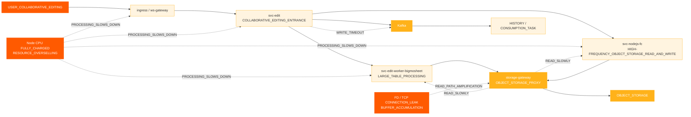
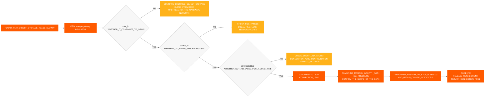
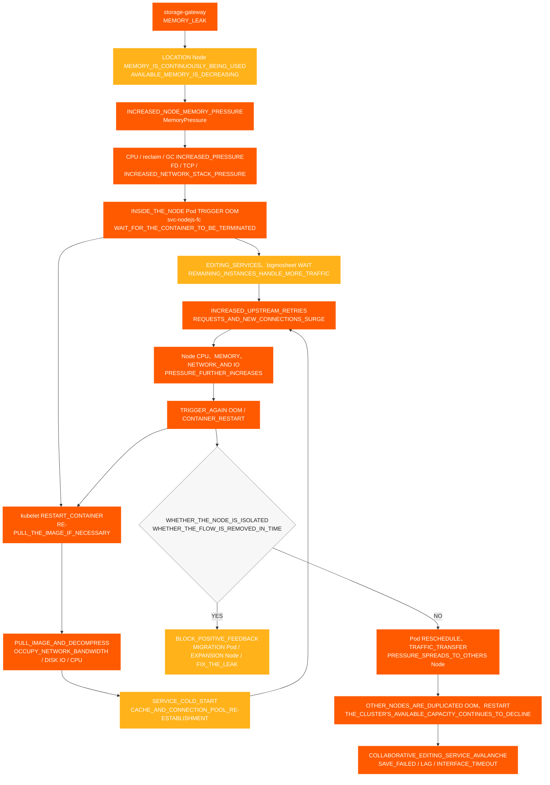

# Incidente de Edición Colaborativa

[← ShimoDocs Suite Documentación de implementación](../README.md)

## 1. Antecedentes del caso 

El entorno de una gran empresa experimentó un incidente de falta de disponibilidad en la edición colaborativa, afectando la edición y el guardado normales de algunas hojas de cálculo y documentos por parte de los usuarios. Durante el incidente, los usuarios encontraron fenómenos como fallos al guardar, retraso en la edición y Kafka tiempos de espera de escritura; en el lado del servicio, problemas como lecturas lentas del almacenamiento de objetos, uso anormal de nodos y CPU anormal TCP/FD métricas también ocurrieron. 

Este caso ilustra que la indisponibilidad de la edición colaborativa no es necesariamente causada directamente por el servicio de edición en sí. También puede ser amplificada colectivamente por problemas como recursos subyacentes sobrevendidos, programación concentrada de nodos, escrituras de middleware ralentizadas, rutas anormales de lectura del almacenamiento de objetos o fugas de conexión. 

## 2. Manifestación del Incidente 

Los principales impactos de este incidente fueron: 

- Los enlaces de edición colaborativa se volvieron indisponibles, lentos o con tiempos de espera de la interfaz. 
- Algunas hojas de cálculo o documentos no pudieron guardarse normalmente. 
- Se mostraron ventanas emergentes en el lado de edición `Kafka write timeout`. 
- Los tiempos de lectura del almacenamiento de objetos aumentaron, afectando aún más el procesamiento del enlace de edición. 
- La monitorización de los pods parecía normal, pero los usuarios informaban continuamente fallos al guardar, retrasos en la edición y tiempos de espera de la interfaz. 

## 3. Proceso de Investigación Preliminar 

### 3.1 Empezando desde los Fenómenos del Usuario hacia el Enlace de Edición 

El cliente primero reportó anomalías con algunos documentos, por lo que la investigación inicial se centró en problemas de edición colaborativa: 
1. Verificar el enlace de edición y guardado. 
2. Verificar los registros de servicio relevantes. 

3. Verifique Kafka Estado de escritura. 
4. Verificar la latencia de lectura/escritura del almacenamiento de objetos. 

Durante la investigación, se encontraron dos anomalías principales: 

- `Kafka write timeout` Ocurrió en el enlace de edición. 
- Latencia anormal de lectura del almacenamiento de objetos. 

### 3.2 Confirmación preliminar de dependencias externas 

Durante la investigación, confirmamos individualmente con los propietarios de dependencias externas: 

- Confirmado con el lado del almacenamiento de objetos, no se encontraron problemas evidentes en el lado del proveedor de la nube. 
- Confirmado con Kafka operaciones, no se encontraron problemas evidentes en el Kafka lado del clúster. 

Por lo tanto, el problema no puede atribuirse directamente al almacenamiento de objetos o Kafka los propios servicios, y se necesita continuar con una investigación más profunda hacia los nodos de negocios locales, las puertas de enlace, los grupos de conexiones, la red y las capas de recursos. 

### 3.3 Cambio de la monitorización de Pods a la monitorización de Nodos 

Inicialmente, al verificar la monitorización del Pod, ambos CPU y la memoria estaban dentro de rangos relativamente seguros, pero el cliente informó que las CPU del Nodo estaban al máximo. 

Este fue el punto clave en el diagnóstico actual: 

- Bajo sobreasignación de recursos, la monitorización del Pod puede no reflejar con precisión la presión del nodo. 
- Una vez que el Nodo CPU está al máximo, la capacidad de procesamiento comercial dentro de los contenedores disminuye. 
- Después de que el procesamiento comercial se ralentiza, se manifiesta además como lecturas lentas de almacenamiento de objetos, lentas Kafka escrituras, acumulación de solicitudes y fallos de guardado. 

## 4. Cadena de impacto de fallos 

## 5. Hallazgos clave 

### 5.1 Nodo CPU Anomalías 

Múltiples nodos han experimentado CPU anomalías en secuencia: 
- '10.142.191.54' inició una excepción a las 18:20. 
- '10.76.176.65' inició una excepción a las 18:30. 
- '10.76.238.202' inició una excepción a las 18:40. 
- '10.142.206.216' inició la anomalía a las 18:42. 
- '10.142.175.191' inició la anomalía a las 18:45. 

Se puede observar que la primera anomalía fue '10.142.191.54', seguida de CPU problemas en otros nodos, lo que coincide con la característica de anomalías de recurso de un solo punto que se extienden a múltiples nodos. 

### 5.2 CPU y Memoria Sobrevendida 

La sobreventa de recursos antes y después del fallo es la siguiente: 

| Escenario | Recurso | Capacidad del Clúster | Solicitud Total | Proporción de Solicitud | Límite Total | Sobrevendido |
| --- | --- | --- | --- | --- | --- | --- |
| nodejs-fc pod 6 | CPU | 192 núcleos | 33.75 núcleos | 17.6% | 457 núcleos | 238.0% |
| nodejs-fc pod 6 | Memoria | 768 GiB | 57.24 GiB | 7.5% | 884 GiB | 115.1% |
| nodejs-fc pod 12 | CPU | 192 núcleos | 45.75 núcleos | 23.8% | 493 núcleos | 256.8% |
| nodejs-fc pod 12 | Memoria | 768 GiB | 81.24 GiB | 10.6% | 980 GiB | 127.6% |
| nodejs-fc pod 12 después del escalado | CPU | 320 núcleos | 45.75 núcleos | 14.3% | 493 núcleos | 154.1% |
| nodejs-fc pod 12 después del escalado | Memoria | 1280 GiB | 81.24 GiB | 6.3% | 980 GiB | 76.6% |

Bajo circunstancias normales, CPU la sobre-suscripción controlada alrededor del 150% es relativamente aceptable. Antes de este escalado, CPU la sobre-suscripción ya había alcanzado el 238%, y después de duplicar la escala, alcanzó el 256.8%, representando un alto riesgo de avalancha de tráfico súbito. 

### 5.3 Concentración de programación de Pods 

La estrategia de K8s programación predeterminada en el entorno de una gran empresa tiende a llenar un nodo antes de usar los nodos restantes. Durante el despliegue gradual del servicio o el escalado temporal, múltiples servicios de alta carga se concentran fácilmente en unos pocos nodos. 

Combinaciones de alto riesgo incluyen: 

- Múltiples `svc-nodejs-fc` instancias existen en un solo nodo. 
- Ejecutándose `svc-edit-worker-bigmosheet` y `ingress` en el mismo nodo simultáneamente. 
- Superponiéndose `storage-gateway` en el mismo nodo lleva a fugas de conexión o aumento de memoria. 

### 5.4 Conexiones de Storage Gateway y fugas de memoria 

Después de revisar más a fondo la TCP monitorización de Nodos y `storage-gateway` métricas de Pods, se encontró: 

- `total_fd` continúa aumentando. 
- `socket_fd` continúa aumentando. 
- TCP las conexiones permanecen `ESTABLISHED` por un largo tiempo. 
- Las conexiones no se liberan a tiempo y los FDs no se devuelven al pool de conexiones. 
- Pod RSS / El conjunto de trabajo continúa creciendo, y después de la recuperación no puede volver a niveles normales. 

Si `total_fd`, `socket_fd`, y el uso de memoria aumenta continuamente al mismo tiempo, indica que las conexiones no se liberan y la memoria sigue creciendo, lo cual debería manejarse como fugas de conexión y memoria, mientras se presta atención al `MemoryPressure` y OOM riesgo del Nodo. 

### 5.5 Impacto de las Diferencias de Versión 

En versiones antiguas, los datos de los archivos adjuntos de imagen se escribían directamente en la tabla de datos. En la nueva versión, para reducir MySQL el uso y el costo de almacenamiento, la información de los archivos adjuntos de imagen se escribe en los Metadatos del almacenamiento de objetos, y se `/x` utiliza la ruta de lectura que accede directamente al almacenamiento de objetos. 

En el modo proxy, la función subyacente para determinar si existe una clave de almacenamiento de objetos no libera correctamente las conexiones, causando fugas de conexión. Este problema, combinado con la sobreasignación de recursos y la programación concentrada, se amplifica en una falla de inaccesibilidad para la edición colaborativa. 

### 5.6 Evidencia de Monitoreo de Almacenamiento de Objetos y Storage Gateway 

Para determinar si el problema se encuentra en el lado del almacenamiento de objetos, en el lado del servicio comercial o en la capa proxy, se realizó una investigación comparativa del almacenamiento de objetos y `storage-gateway` : 

- La latencia de lectura del almacenamiento de objetos aumentó, mientras que la latencia de escritura se mantuvo relativamente normal, con anomalías concentradas principalmente en la ruta de lectura. 
- CPU, RSS / Conjunto de trabajo y tasa de crecimiento de memoria de `storage-gateway` Pods aumentaron continuamente. 
- `total_fd` y `socket_fd` siguió creciendo, y TCP las conexiones permanecieron en el `ESTABLISHED` estado durante mucho tiempo. 
- Las conexiones no se liberaron a tiempo, los FDs no se devolvieron al grupo de conexiones, causando presión de memoria y OOM riesgo en el Nodo. 
- No se encontraron fallas del lado del servidor que coincidieran con la escala de anomalías comerciales en el almacenamiento de objetos, por lo que se priorizó el enfoque de la investigación en la `storage-gateway` ruta de lectura del proxy. 

Juicio integral: las lecturas lentas del almacenamiento de objetos no se deben simplemente a fallas del servicio de almacenamiento de objetos, sino que son el resultado de la acumulación de FD, TCP conexiones, memoria y presiones de recursos del nodo causadas por `storage-gateway` conexiones que no se liberan. 

### 5.7 FD/TCP Proceso de Determinación de Fugas 

Esta vez, se utilizó la siguiente cadena de juicio para confirmar que `storage-gateway` tiene fugas de conexión: 

Conclusión del juicio: Cuando `total_fd`, `socket_fd`, el número de `ESTABLISHED` conexiones y el uso de memoria del Pod aumentan de manera sincrónica dentro de la misma ventana de tiempo, la causa principal puede considerarse como un “FD/TCP y fuga de memoria causada por conexiones no liberadas”; si la lectura del almacenamiento de objetos es lenta mientras la escritura es normal y los indicadores anteriores son anormales al mismo tiempo, primero se debe revisar la ruta de lectura del proxy. 

## 6. Conclusión de la causa raíz 

La cadena de causa raíz de esta falla es: 

1. El clúster tiene un sobrecompromiso significativo, CPU con CPU sobrecompromiso que excede el 250% en ciertas fases. 
2. Durante las actualizaciones progresivas del servicio o la escalabilidad temporal, la programación de Pods se concentra, resultando en una presión excesiva de recursos en nodos individuales. 
3. Servicios de alta carga como `svc-nodejs-fc`, `svc-edit-worker-bigmosheet`, y `ingress` están concentrados en algunos nodos. 
4. `storage-gateway` tiene un problema de liberación de conexiones en la ruta de lectura del proxy de almacenamiento de objetos, causando un crecimiento continuo de FD, TCP conexiones y uso de memoria. 
5. Después de que la presión de memoria y OOM ocurren en el Nodo, los reinicios de contenedores, descargas de imágenes, arranques en frío del servicio y reintentos ascendentes aumentan aún más CPU, presión de red y de E/S de disco, lo que conduce a lecturas lentas de almacenamiento de objetos y escrituras lentas de Kafka . 
6. Lecturas lentas de almacenamiento de objetos y Kafka tiempos de espera de escritura se manifiestan finalmente como indisponibilidad en la edición colaborativa, fallos al guardar y retrasos en la edición. 

## 7. Diagrama de propagación de avalancha de recursos del nodo 

Los servicios empresariales involucrados en esta falla se ejecutan todos en un K8s clúster. La fuga de memoria en `storage-gateway` primero consume la memoria disponible de su nodo, y luego a través de OOM, reinicios de contenedores, descargas de imágenes, arranques en frío de servicios y reintentos ascendentes, forma un bucle de retroalimentación positiva de consumo de recursos. Cuando el Pod anormal se reprograma o el tráfico se desplaza a otros nodos, la presión continúa propagándose a nodos saludables, causando eventualmente una avalancha a nivel de clúster. 

El diagrama requiere enfocarse en dos bucles de amplificación: 

1. **Bucle de retroalimentación positiva dentro del nodo**: OOM → reinicios de kubelet o descargas de imágenes → arranque en frío → aumentan los reintentos ascendentes y las conexiones nuevas → CPU, presión de memoria, red y E/S de disco continúa aumentando → OOM nuevamente. 
2. **Bucle de difusión entre nodos**: Los Pods en nodos anormales se reprograman, el tráfico de ingreso se desplaza o las instancias restantes se hacen cargo de las solicitudes → aumenta la carga de nodos saludables → otros nodos experimentan OOM y se reinician repetidamente → la capacidad disponible del clúster continúa disminuyendo. 

## 8. Manejo y reparación 

### 8.1 Manejo a corto plazo 

- Eliminar el tráfico de gateway para ingreso anormal o nodos anormales para evitar que nuevo tráfico entre en la ruta de alta presión. 
- Reiniciar servicios anormales con FD, TCP, o memoria que crece continuamente. 
- Migrar o dispersar Pods de alta carga desde nodos de alta presión. 
- Expulsar Pods o aislar nodos con uso completo de recursos CPU. 
- Evitar escalar solo los Pods de negocio, priorizar complementar los recursos del Nodo. 
- Agregar capacidad de fallo rápido para `svc-edit` la interfaz de sincronización para evitar que las solicitudes se acumulen durante mucho tiempo. 

### 8.2 Reparación a largo plazo 

- Corregir el problema de conexiones no liberadas al verificar si una clave existe en el modo proxy de almacenamiento de objetos. 
- Configurar políticas de anti-afinidad para servicios centrales para evitar concentrar servicios de alto riesgo en el mismo nodo. 
- Configurar políticas de expulsión de nodos para evitar que los nodos continúen ejecutando servicios centrales después de agotar los recursos. 
- Establecer CPU y monitoreo de sobreasignación de memoria. 
- Antes de escalar un servicio, se deben evaluar los niveles de recursos del entorno del cliente y confirmar el plan de escalado con el líder del proyecto. 
- Configurar alertas para OOM, FD, TCP, solicitudes lentas, Kafka respaldo y latencia de lectura/escritura de almacenamiento de objetos para servicios centrales. 

## 9. Conclusiones de la revisión del caso 

Esta falla indica que cuando la edición colaborativa no está disponible, la investigación no debe centrarse únicamente en los registros del servicio de edición. Si los recursos subyacentes del nodo ya están completamente utilizados, los servicios de negocio se ralentizarán en general, manifestándose en múltiples síntomas de nivel superior como Kafka tiempo de espera en escritura, lecturas lentas de almacenamiento de objetos y fallos en la guardado. 

Al manejar problemas similares en el futuro, primero se deben confirmar los recursos del clúster y del Nodo, luego seguir paso a paso mediante middleware, monitoreo de negocio, registros y enlaces de trazas, para evitar comenzar la investigación desde un único registro de servicio y caer en un bucle de solución de problemas localizado. 

---
