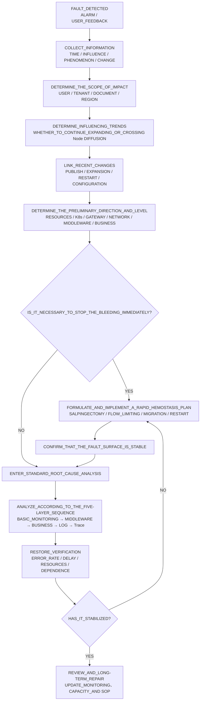
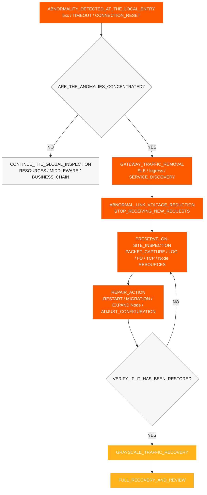
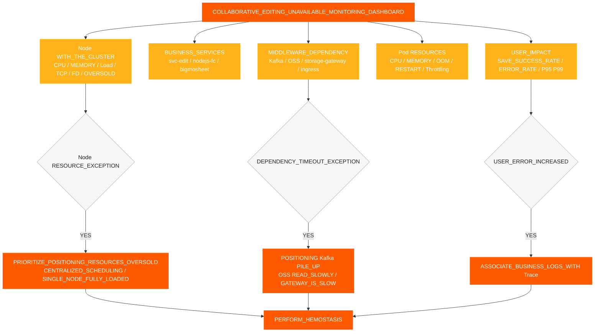
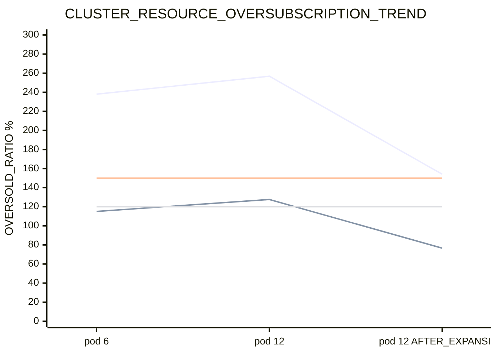
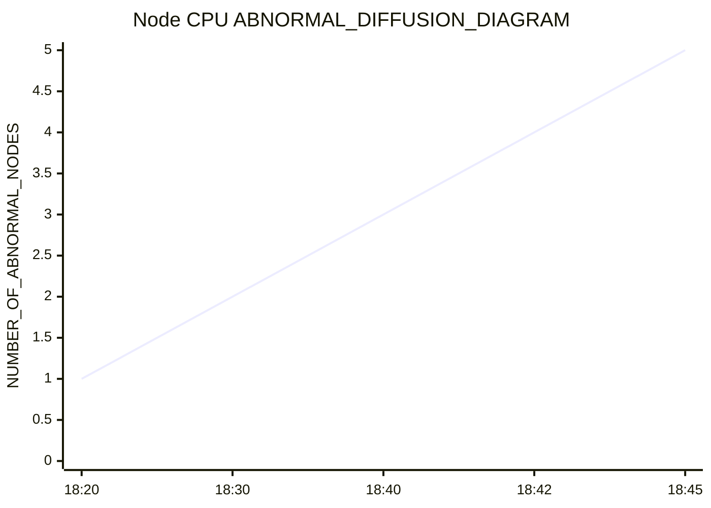
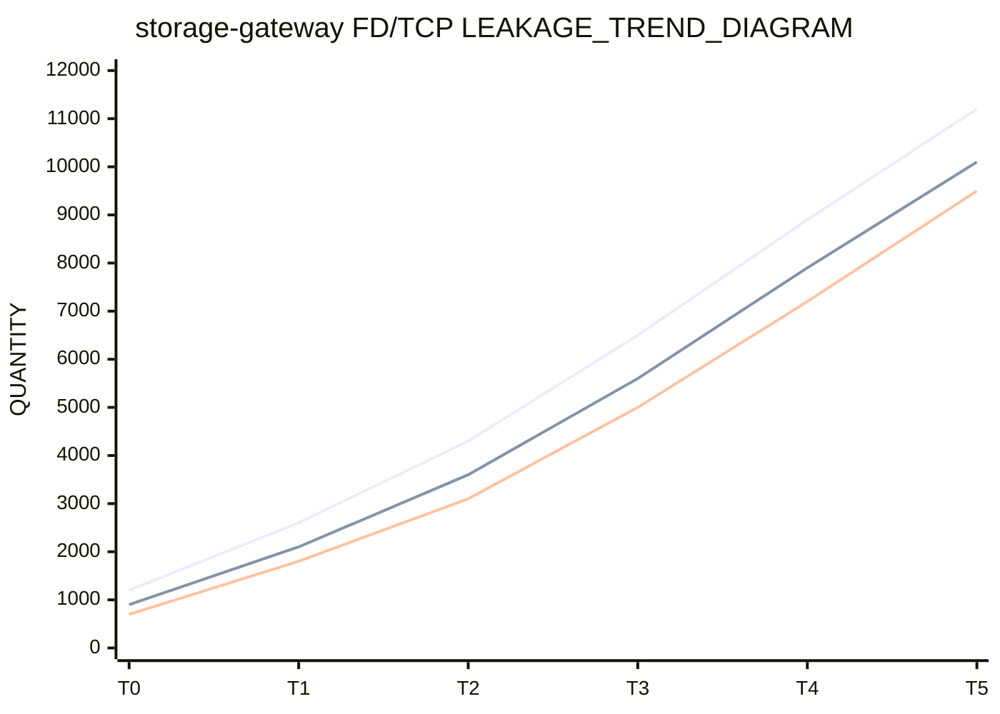
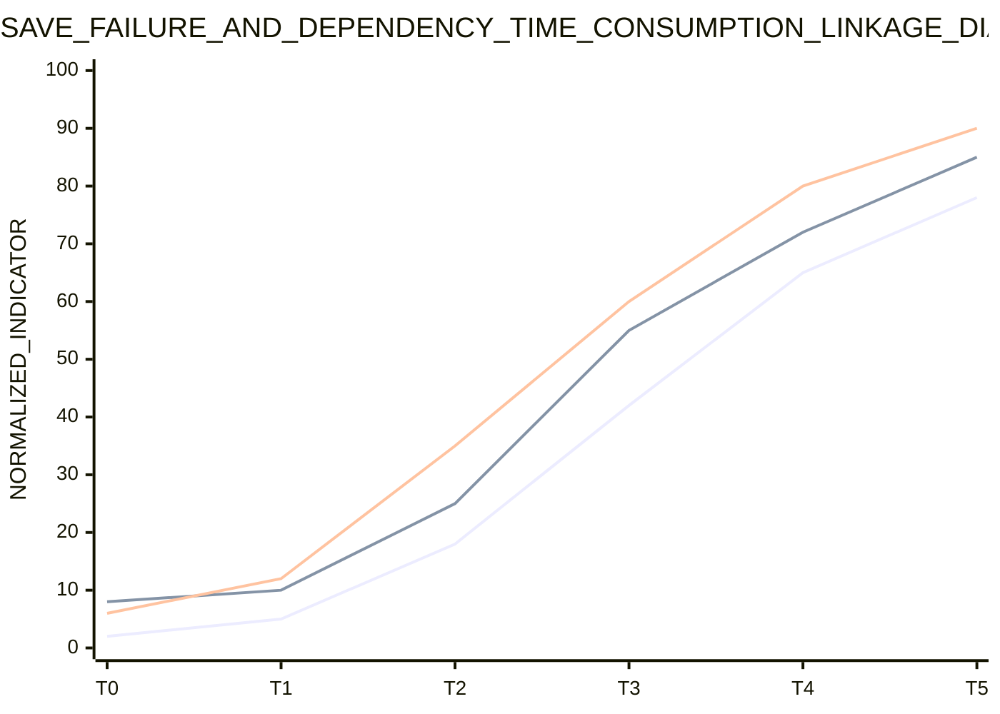
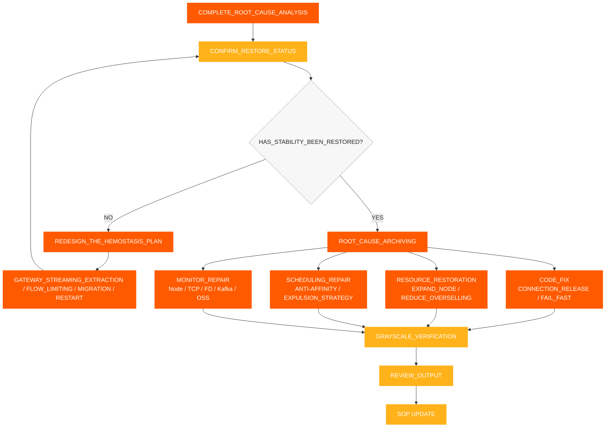

# Respuesta a Incidentes SOP

[← ShimoDocs Suite Documentación de implementación](../README.md)

## 1. Recolección de Información

Después de recibir un fallo, primero registre la siguiente información:

- Hora de ocurrencia: hora de la primera alerta, hora del primer comentario del cliente, si coincide con un lanzamiento o escalado.
- Alcance del impacto: inquilinos, tipos de documentos, número de archivos, número de usuarios, si está concentrado en tablas o tablas grandes.
- Síntomas específicos: fallos al guardar, errores de edición, Kafka tiempos de espera, lecturas lentas de almacenamiento de objetos, API tiempos de espera.
- Cambios recientes: versiones de servicio, reinicios continuos, escalado de Pods, escalado de nodos, almacenamiento o Kafka cambios.
- Servicios clave: `svc-nodejs-fc`, `svc-edit`, `svc-edit-worker-bigmosheet`, `storage-gateway`, `ingress`, `ws-gateway`.


## 2. Evaluación de información y clasificación de fallos

Después de completar la recopilación de información, juzgar primero el alcance del fallo, la tendencia de desarrollo y la dirección de la causa principal según los síntomas, métricas, eventos y registros de cambios, y luego decidir si se requiere contención inmediata. Los resultados del juicio deben formar una conclusión clara y no deben depender únicamente de un solo Pod o un solo registro.

Puntos clave para la evaluación:

- Alcance del impacto en los usuarios: usuarios, inquilinos, tipos de documentos, regiones y servicios afectados.
- Manifestaciones del impacto: fallos al guardar, retraso en la edición, API tiempos de espera, Kafka tiempos de espera de escritura, lecturas lentas de almacenamiento de objetos.
- Tendencia del impacto: si continúa expandiéndose, si se extiende de un solo Pod o Nodo a múltiples Nodos.
- Asociación con cambios: si está relacionado con la versión del servicio, escalado de Pods, escalado de nodos, reinicio continuo, configuración o cambios de middleware. 
- Dirección preliminar: recursos, K8s plano de control, puerta de enlace, red, middleware, código de negocio o problemas de datos. 

Determinar el nivel de fallo basado en el resultado del juicio: 

| Nivel | Criterios de juicio | Objetivo de respuesta | 
| --- | --- | --- | 
| P0 | Edición indisponible generalizada, fallos continuos al guardar, anomalías por lotes en servicios clave | Detener la pérdida de datos dentro de 15 minutos, aclarar la dirección de la causa principal dentro de 30 minutos | 
| P1 | Inquilinos parciales, documentos parciales, nodos parciales anormales, tasa de error significativamente incrementada | Localizar el enlace anormal dentro de 30 minutos, restaurar la estabilidad dentro de 60 minutos | 
| P2 | Solicitud lenta en un solo punto o de pequeña escala, fallos ocasionales al guardar | Confirmación completa de la causa y plan de reparación dentro de 1 día hábil | 

La conclusión del juicio debe al menos responder tres preguntas: ¿cuál es el impacto actual, se está expandiendo la falla, debemos primero detener la pérdida o proceder directamente al análisis de la causa raíz? 




## 3. Hemostasia rápida

Si el lado del usuario continúa fallando, o el resultado del juicio muestra que la falla se está expandiendo, primero ejecutar acciones de contención, luego continuar con análisis en profundidad. El objetivo de la contención es reducir el alcance de la falla, bloquear la retroalimentación positiva de recursos, mientras se preserva la escena de la falla tanto como sea posible.

1. Eliminar tráfico de gateways anormales, SLB backends, entradas de Ingress, instancias de servicio o Nodos, bloqueando que nuevas solicitudes continúen entrando en el camino anormal.
2. Establecer Nodos anormales como no programables o aislados para evitar que los Pods continúen siendo programados en nodos con alta presión.
3. Reiniciar Pods que experimentan OOM, crecimiento continuo de memoria o fugas de FD/TCP , priorizando `storage-gateway`, `svc-nodejs-fc`, y `svc-edit-worker-bigmosheet`.
4. Distribuir Pods de alta carga para evitar `nodejs-fc`, `bigmosheet`, `ingress`, y `storage-gateway` estar concentrados en el mismo Nodo.
5. Pausar la escalabilidad de Pods de negocio inválidos, priorizar la escalabilidad de Nodos o restaurar recursos disponibles.
6. Implementar limitación de tasa o falla rápida para reintentos upstream, creación de conexiones y acumulación de solicitudes para evitar que nuevas conexiones continúen aumentando después de un arranque en frío.
7. Registrar el Nodo CPU, memoria, OOM, FD, TCP, tasa de error y latencia de la interfaz antes y después de detener la pérdida de datos.

### 3.1 Eliminación de Tráfico del Gateway

Cuando una falla se manifiesta como un nodo local anormal, una entrada local de gateway o una instancia de servicio local, primero se debe eliminar el tráfico de entrada anormal y luego abordar los nodos y Pods. El objetivo de la eliminación de tráfico es reducir la presión sobre el enlace defectuoso y evitar que las instancias anormales sigan recibiendo nuevas solicitudes. 

Condiciones de activación: 

- La tasa de error de un cierto Ingress, SLB backend, Pod de gateway o Nodo es significativamente mayor que en otras instancias. 
- Errores 5xx del gateway, tiempos de espera upstream y reinicios de conexión se concentran en pocos puntos de entrada. 
- Ciertos nodos CPU, métricas de Load, TCPy FD son claramente anormales, y siguen llegando nuevas solicitudes continuamente. 
- Instancias de enlace central como `svc-edit`, `ws-gateway`, y `storage-gateway` ya se han ralentizado. 

Acciones a ejecutar: 

1. Eliminar backends anormales de SLB, Ingress, enrutamiento de gateway o descubrimiento de servicios. 
2. Marcar temporalmente nodos anormales como no programables para evitar que nuevos Pods se programen en ellos. 
3. Realizar captura de paquetes, verificación de registros, FD/TCPy recursos en nodos o instancias de los cuales se ha eliminado el tráfico. 
4. Después de completar reinicio, migración, escalado o reparación de configuración, primero restaurar a una carga pequeña de tráfico, luego restauración completa. 
5. Antes de la restauración, confirmar que las tasas de error, los tiempos de respuesta de la interfaz, las métricas de Nodo CPU, y TCP/FD han vuelto a la normalidad. 




## 4. Proceso Estándar de Análisis de la Causa Raíz

Después de completar la hemostasia rápida y confirmar que la superficie de falla es estable, proceda al análisis de la causa raíz. La secuencia estándar de resolución de problemas se realiza de manera 'de abajo hacia arriba, de lo grueso a lo fino':

1. Monitoreo básico: recursos del clúster, nodos Node, recursos de Pod.
2. Monitoreo de middleware: Kafka, almacenamiento de objetos, gateway, red.
3. Monitoreo de negocio: tasa de éxito de guardado, tiempo de respuesta de la interfaz y tasa de error.
4. Monitoreo de logs: registros de errores, registros de tiempo de espera, OOM/reinicio de registros.
5. Seguimiento de enlaces de traza: enlaces de solicitud, llamadas lentas, spans con excepciones.

Requisitos principales:

- Cada capa primero emite la conclusión del juicio, luego entra en la siguiente capa.
- Primero mirar el Node, luego el Pod; primero mirar la tendencia global, luego los logs de un solo servicio.
- No omita niveles posteriores simplemente porque no se hayan detectado anomalías en una cierta capa.
- Monitoreo, registros y trazas necesitan correlacionarse usando la misma ventana de tiempo, Pod, Node y Trace ID.

Cada capa solo responde una pregunta principal:

- Monitoreo básico: ¿Los recursos ya son insuficientes, y está ocurriendo sobreventa, programación centralizada o dispersión entre nodos?
- Monitoreo de middleware: ¿Hay ralentizaciones, acumulaciones, rechazos de solicitudes o anomalías de conexión?
- Monitoreo de negocio: ¿Qué servicio, API, o tipo de documento corresponde al impacto del usuario?
- Monitoreo de logs: ¿Hay evidencia clara de errores, tiempos de espera, OOM, reinicios o agotamiento del pool de conexiones?
- Seguimiento de enlaces de traza: ¿Dónde exactamente se quedó atascada una solicitud fallida—en qué servicio, nodo o span? 


### 4.1 Resolución de problemas de monitoreo básico 

Priorizar la comprobación de la dimensión del Nodo en lugar de solo la dimensión del Pod. Cuando los recursos están sobresuscritos, la monitorización del Pod podría mostrar valores dentro de límites seguros, pero el nodo ya podría estar completamente utilizado. 

Elementos a verificar: 

- Total del clúster CPU y capacidad de memoria y capacidad disponible. 
- Nodo CPU, memoria, carga, disco, red. 
- Pod CPU, memoria, reinicios, OOM, CPU estrangulamiento. 
- Si múltiples servicios de alto CPU o de alto IO están concentrados en un solo nodo. 
- Si después de un despliegue progresivo, los Pods se programan principalmente en los primeros nodos. 
- Si hay falta de políticas de anti-afinidad y desalojo. 

Juicios clave: 

- Si el total CPU Límites / capacidad del clúster CPU excede el 150%. 
- Si el total de límites de memoria / capacidad de memoria del clúster excede el 120%. 
- Si existe un proceso donde un nodo falla primero, seguido de otros nodos que gradualmente experimentan un aumento de CPU uso. 


### 4.2 Solución de problemas de monitoreo de middleware 

La solución de problemas de middleware se centra principalmente en Kafka, almacenamiento de objetos, gateways y redes. El juicio específico para Kafka es el siguiente; las métricas detalladas y los elementos de juicio para almacenamiento de objetos, `storage-gateway`, gateways y redes se registran de manera uniforme en la Sección 9.7 y en la lista de verificación relacionada. 

#### 4.2.1 Kafka 

Elementos a verificar: 

- Latencia de escritura del productor y tasa de fallos. 
- Acumulación de temas. 
- Del lado del broker CPU, disco, red y latencia de solicitudes. 
- Si hay retransmisiones, pérdida de paquetes o congestión de conexión desde el cliente hacia Kafka. 
- Si ocurren tiempos de espera solo en las escrituras del lado de negocios mientras no hay anomalías evidentes en el Kafka lado de operaciones. 

Lógica de juicio: 

- Si no hay anomalía en la Kafka lado de operaciones, pero el lado comercial continúa experimentando tiempos de espera de escritura, enfoque en revisar el nodo comercial CPU, congestión de la red y capacidad de procesamiento del cliente. 
- Si Kafka Se producen simultáneamente retrasos acumulados y errores de negocio, primero confirme si el retraso acumulado es causado por un procesamiento lento del servicio ascendente. 


### 4.3 Monitoreo de Negocios, Registros y Seguimiento 

#### 4.3.1 Monitoreo de Negocios 

Confirme los enlaces anormales basándose en los fenómenos del cliente: 

1. Si los fallos de guardado se concentran en tablas, tablas grandes o tipos de documentos específicos. 
2. Si la interfaz de edición experimenta tiempos de espera, solicitudes lentas o tasas de error aumentadas. 
3. Verifique si `Kafka write timeout` ocurre. 
4. Verifique si las lecturas del almacenamiento de objetos son lentas y si las escrituras son normales. 
5. Verifique si `bigmosheet operation oss_get` excede los 5 segundos. 
6. Verifique si WebSocket, la edición colaborativa, el historial y los servicios relacionados con el almacenamiento de objetos experimentan simultáneamente un aumento en la latencia. 

#### 4.3.2 Monitoreo de registros 

Registros clave para verificar: 

- Registros de fallos al guardar ediciones. 
- Registros de Kafka tiempos de espera de escritura. 
- Registros de lecturas y escrituras lentas en el almacenamiento de objetos. 
- Registros de OOM, reinicios, agotamiento de los grupos de conexiones y agotamiento de FD. 
- Registros de errores 5xx de la puerta de enlace, tiempos de espera de upstream y reinicios de conexión. 

#### 4.3.3 Seguimiento de enlaces de Trace 

Use Trace para seguir una sola solicitud fallida: 

- Verifique si la solicitud está atascada en la puerta de enlace, edición colaborativa, almacenamiento de objetos, Kafkao cadena de consumo de historial. 
- Verifique si algún Span tiene latencia anormal. 
- Verifique si las llamadas lentas se concentran en un servicio específico, nodo o tipo de documento. 
- Compare las diferencias de enlaces entre solicitudes fallidas y solicitudes normales. 


## 5. Verificación de Recuperación 

Después de completar la acción de detener el sangrado, se deben verificar las siguientes métricas: 

- La entrada de gateway eliminada, SLB backend, o instancias anormales han dejado de recibir nuevo tráfico. 
- La tasa de éxito de guardado ha vuelto a la normalidad. 
- La tasa de errores de la interfaz de edición ha disminuido. 
- Kafka La latencia de escritura ha vuelto a la normalidad. 
- Kafka La acumulación de tareas pendientes ha disminuido. 
- La latencia de lectura del almacenamiento de objetos ha vuelto a la normalidad. 
- Nodo CPU, memoria y carga han disminuido. 
- `storage-gateway` FD y socket FD ya no están aumentando continuamente. 
- Los nodos anormales ya no se están expandiendo. 
- Después de restaurar el tráfico durante el lanzamiento en escala de grises, los errores 5xx del gateway, el tiempo de espera del upstream y los reinicios de conexión no han vuelto a aumentar. 


## 6. Requisitos de Monitoreo y Alertas 

Se deben completar las siguientes alertas: 

- Nodo CPU, memoria, carga, disco y alertas de red. 
- Nodo TCP conteo de conexiones, retransmisión, pérdida de paquetes y `ESTABLISHED` alertas de conteo de conexiones. 
- Pod OOM, reinicio, y CPU alertas de limitación. 
- alertas del servicio OOM principal. 
- CPU alerta de sobreventa: CPU Límite / clúster CPU excede el 150%. 
- Alerta de sobreventa de memoria: límite de memoria / capacidad de memoria del clúster excede el 120%. 
- Kafka alerta de acumulación. 
- Kafka alerta de tiempo de espera de escritura. 
- alerta de registro de error de fallo al guardar edición. 
- `bigmosheet operation oss_get > 5s` alerta. 
- `storage-gateway` alerta de FD y socket FD aumentando continuamente. 
- `storage-gateway` RSS / Conjunto de trabajo aumentando continuamente y Nodo `MemoryPressure` alerta. 


## 7. Panel de Control de Métricas Clave 

Esta sección es una herramienta auxiliar y no cambia el orden principal del proceso. El panel de control se utiliza para observar tendencias y localizar direcciones, mientras `kubectl`, `jq`, y PromQL se utilizan para obtener evidencia específica; la investigación in situ debe seguir la lista detallada en la Sección 9, ejecutando cada elemento y registrando las conclusiones. 

### 7.1 Capas del Panel 

Se recomienda dividir el panel de fallas de edición colaborativa no disponible en 5 capas y verificar capa por capa de arriba hacia abajo durante la investigación: 

| Capa | Nombre del Panel | Métricas Clave | Propósito |
| --- | --- | --- | --- |
| L1 | Panel de Impacto en el Usuario | Tasa de éxito de guardado, tasa de errores de edición, interfaz P95/P99, conexiones de colaboración en línea | Determinar si los usuarios están realmente afectados |
| L2 | Panel de Servicios de Negocio | QPS, tasa de errores, latencia y cantidad de reinicios de `svc-edit`, `svc-nodejs-fc`, `bigmosheet` | Determinar en qué servicio de negocio se concentra la anomalía |
| L3 | Panel de Middleware | Kafka latencia de escritura, Kafka acumulación de tareas pendientes, latencia de lectura/escritura de almacenamiento de objetos, latencia de puerta de enlace ascendente | Determinar si las dependencias están ralentizando |
| L4 | Panel de Recursos del Contenedor | Pod CPU, memoria, OOM, reinicios, CPU limitación de recursos | Determinar si el contenedor en sí es anormal |
| L5 | Panel de Nodos y Clúster | Nodo CPU, memoria, carga, TCP, FD, recursos sobredimensionados, distribución de Pods | Determinar si los recursos subyacentes soportan la operación del negocio |

### 7.2 Gráfico de Resumen de Métricas Clave



### 7.3 Gráfico de Tendencia de Sobreasignación de Recursos

Este gráfico se utiliza para observar si CPU y la sobreasignación de memoria entran en áreas de alto riesgo antes y después de la expansión. En el panel real, se recomienda establecer CPU sobreasignación al 150% y sobreasignación de memoria al 120% como líneas de umbral de alerta.



### 7.4 Nodo CPU Gráfico de Tendencia de Difusión

Este gráfico se utiliza para observar si existe una característica de difusión donde un solo nodo falla primero, seguido de otros nodos que se ven arrastrados gradualmente.



### 7.5 FD/TCP Gráfico de Tendencia de Fugas

Este gráfico se utiliza para determinar si `storage-gateway` tiene conexiones o fugas de FD. Si `total_fd`, `socket_fd`, y el número de `ESTABLISHED` conexiones aumenta continuamente de forma simultánea, se debe abordar primero las fugas de conexión.



### 7.6 Gráfico de Correlación entre Errores de Negocio y Latencia de Dependencia

Este gráfico se utiliza para verificar si los fallos de guardado del lado del usuario están correlacionados con un aumento de Kafka latencia de escritura y latencia de lectura del almacenamiento de objetos. Si los tres aumentan simultáneamente dentro de la misma ventana de tiempo, se debe dar prioridad a revisar la capacidad de procesamiento del nodo de negocio y la congestión de la cadena de dependencias.



### 7.7 Umbrales de Alarma Recomendados

| Métrica | Umbral Recomendado | Acción Tras Activarse |
| --- | --- | --- |
| Tasa de Éxito de Guardado | Por debajo del 99% durante 5 minutos consecutivos | Ingresar a confirmación de impacto en negocio, correlacionar registros de errores y rastreos |
| Editar Interfaz P95 | Superior al doble de la línea base durante 5 minutos consecutivos | Verificar `svc-edit`, `nodejs-fc`, `bigmosheet` |
| Kafka Latencia de Escritura | Superior al doble de la línea base o se produce un tiempo de espera de escritura | Verificar Kafka acumulado, nodo de negocio CPU, retransmisión de red |
| Kafka Acumulado | Crecimiento continuo durante 10 minutos | Verificar tareas de consumidores y velocidad de escritura en la fuente |
| OSS Latencia de Lectura | P95 supera los 5 segundos | Verificar `storage-gateway`, red, lado del almacenamiento de objetos |
| Nodo CPU | Por encima del 90% durante 5 minutos consecutivos | Verificar distribución de Pods, CPU sobrecompromiso, servicios de alta carga |
| CPU Sobrecompromiso | Supera el 150% | Suspender escalado de Pods de negocio, priorizar evaluación de escalado de Nodo |
| Exceso de Compromiso de Memoria | Supera el 120% | Verificar OOM, riesgo de desalojo y fugas de memoria |
| `total_fd` / `socket_fd` | Aumentando monotonamente durante 10 minutos | Verificar FD/TCP fugas, reiniciar si es necesario para detener la pérdida |
| TCP Tasa de Retransmisión | Más alta que la línea base en 2x | Capturar paquetes para confirmar pérdida de paquetes, congestión, problemas de ventana |
| Reinicio de Pod / OOM | Cualquier servicio central ocurre | Asociar inmediatamente los registros y liberar cambios |

### Nodo 7.8 CPU y Comandos de Consulta de Sobresuscripción de Memoria

Los siguientes comandos se aplican a escenarios donde el negocio se ejecuta en una K8s cluster. Antes de la ejecución, confirme que el kubeconfig actual se ha cambiado al clúster defectuoso y reemplace `NODE_NAME` con el nombre del nodo objetivo.

#### 7.8.1 Verificar Nodo Real CPU y Uso de Memoria

```bash
# View the real-time CPU and memory usage of all Nodes
kubectl top nodes

# View the real-time usage of the specified Node
kubectl top node "$NODE_NAME"

# View the node's capacity, allocatable resources, and pressure status
kubectl describe node "$NODE_NAME" | sed -n '/Capacity:/,/Allocatable:/p'
kubectl describe node "$NODE_NAME" | sed -n '/Conditions:/,/Addresses:/p'

# Directly view the CPU/memory Requests, Limits, and usage ratio allocated to the Node
kubectl describe node "$NODE_NAME" | sed -n '/Allocated resources:/,/Events:/p'
```

Enfoque clave: `CPU%`, `MEMORY%`, `MemoryPressure`, `DiskPressure`, `PIDPressure`. Cuando el uso real supera el 90%, es necesario determinar de inmediato si se necesita control de fugas en función de la distribución de Pods y la eliminación del tráfico del gateway.

#### 7.8.2 Estadísticas de CPU, Solicitud de memoria y Límite para un Nodo especificado

```bash
# Statistics of CPU/memory requests and limits for all Pod containers on the specified Node.
# Dependencies: kubectl, jq; memory is uniformly converted to MiB, CPU is uniformly converted to cores.
NODE_NAME="<TARGET_NODE_NAME>"

kubectl get pods -A --field-selector "spec.nodeName=${NODE_NAME}" -o json | jq '
  def cpu_core:
    if . == null then 0
    elif endswith("m") then (rtrimstr("m") | tonumber / 1000)
    else tonumber
    end;
  def mem_mib:
    if . == null then 0
    elif endswith("Ki") then (rtrimstr("Ki") | tonumber / 1024)
    elif endswith("Mi") then (rtrimstr("Mi") | tonumber)
    elif endswith("Gi") then (rtrimstr("Gi") | tonumber * 1024)
    elif endswith("Ti") then (rtrimstr("Ti") | tonumber * 1024 * 1024)
    elif endswith("K") then (rtrimstr("K") | tonumber / 1024)
    elif endswith("M") then (rtrimstr("M") | tonumber)
    elif endswith("G") then (rtrimstr("G") | tonumber * 1024)
    elif endswith("T") then (rtrimstr("T") | tonumber * 1024 * 1024)
    else (tonumber / 1024 / 1024)
    end;
  [ .items[]
    | ([(.spec.containers[]?, .spec.initContainers[]?) | .resources.requests.cpu? // "0"] | map(cpu_core) | add) as $cpu_req
    | ([(.spec.containers[]?, .spec.initContainers[]?) | .resources.limits.cpu? // "0"] | map(cpu_core) | add) as $cpu_limit
    | ([(.spec.containers[]?, .spec.initContainers[]?) | .resources.requests.memory? // "0"] | map(mem_mib) | add) as $mem_req
    | ([(.spec.containers[]?, .spec.initContainers[]?) | .resources.limits.memory? // "0"] | map(mem_mib) | add) as $mem_limit
    | {cpu_request: $cpu_req, cpu_limit: $cpu_limit, mem_request_mib: $mem_req, mem_limit_mib: $mem_limit}
  ]
  | {
      cpu_request_core: (map(.cpu_request) | add),
      cpu_limit_core: (map(.cpu_limit) | add),
      mem_request_mib: (map(.mem_request_mib) | add),
      mem_limit_mib: (map(.mem_limit_mib) | add)
    }'
```

Nota: El cálculo de programación oficial de K8s utiliza una regla de "tomar el máximo" para `initContainers`. El comando anterior se utiliza para un resumen rápido in situ, adecuado para detectar sobrecompromisos evidentes; al conciliar con los paneles de recursos o datos del programador, se deben usar las estadísticas de recursos del Nodo proporcionadas por la plataforma como estándar. 

#### 7.8.3 Cálculo del Clúster CPU y la Tasa de Sobrecompromiso de Memoria 

```bash
# Get the total Allocatable resources of all nodes in the cluster
kubectl get nodes -o json | jq '
  [ .items[].status.allocatable
    | {
        cpu_core: (if (.cpu | endswith("m"))
                   then (.cpu | rtrimstr("m") | tonumber / 1000)
                   else (.cpu | tonumber)
                   end),
        memory_bytes: (.memory | rtrimstr("Ki") | tonumber * 1024)
      }
  ]
  | {
      cpu_allocatable_core: (map(.cpu_core) | add),
      memory_allocatable_gib: (map(.memory_bytes) | add / 1024 / 1024 / 1024)
    }'

# Summarize the CPU/memory limits of all Pods for calculating the overcommit ratio
kubectl get pods -A -o json | jq '
  def cpu_core:
    if . == null then 0
    elif endswith("m") then (rtrimstr("m") | tonumber / 1000)
    else tonumber
    end;
  def mem_gib:
    if . == null then 0
    elif endswith("Ki") then (rtrimstr("Ki") | tonumber / 1024 / 1024)
    elif endswith("Mi") then (rtrimstr("Mi") | tonumber / 1024)
    elif endswith("Gi") then (rtrimstr("Gi") | tonumber)
    else (tonumber / 1024 / 1024 / 1024)
    end;
  [ .items[] | .spec.containers[]?
    | {
        cpu_limit_core: (.resources.limits.cpu? // "0" | cpu_core),
        memory_limit_gib: (.resources.limits.memory? // "0" | mem_gib)
      }
  ]
  | {
      cpu_limit_core: (map(.cpu_limit_core) | add),
      memory_limit_gib: (map(.memory_limit_gib) | add)
    }'
```

Fórmula de cálculo: `CPU overcommit ratio = Total CPU Limits of all Pods / Total CPU Allocatable of all Nodes × 100%`; `Memory overcommit ratio = Total Memory Limits of all Pods / Total Memory Allocatable of all Nodes × 100%`. Se recomienda tomar CPU sobrecompromiso de CPU al 150% y sobrecompromiso de memoria al 120% como líneas de referencia de alto riesgo, pero el umbral final debe determinarse según la línea base del entorno del cliente. 

#### 7.8.4 Declaraciones de consulta de Prometheus / Grafana

```promql
# Cluster CPU Limit Oversubscription Rate
100 * sum(kube_pod_container_resource_limits{resource="cpu", unit="core"})
  / sum(kube_node_status_allocatable{resource="cpu", unit="core"})

# Cluster Memory Limit Overcommit Rate
100 * sum(kube_pod_container_resource_limits{resource="memory", unit="byte"})
  / sum(kube_node_status_allocatable{resource="memory", unit="byte"})

# View CPU Limit Overcommit Rate by Node
100 * sum by (node) (kube_pod_container_resource_limits{resource="cpu", unit="core"})
  / on (node) kube_node_status_allocatable{resource="cpu", unit="core"}

# View Memory Limit Oversubscription Rate by Node
100 * sum by (node) (kube_pod_container_resource_limits{resource="memory", unit="byte"})
  / on (node) kube_node_status_allocatable{resource="memory", unit="byte"}

# Node Actual CPU Usage
100 * (1 - avg by (instance) (rate(node_cpu_seconds_total{mode="idle"}[5m])))

# Node actual memory usage
100 * (1 - node_memory_MemAvailable_bytes / node_memory_MemTotal_bytes)

# K8s node memory pressure status, 1 indicates MemoryPressure=True
kube_node_status_condition{condition="MemoryPressure", status="true"}
```

Si la métrica de recurso `unit` y `node` los nombres de las etiquetas en Prometheus son inconsistentes con las declaraciones anteriores, primero debe confirmar las etiquetas reales en los detalles de la métrica antes de realizar ajustes. La proporción de sobreasignación solo puede indicar un riesgo potencial en las declaraciones de recursos y no puede reemplazar la evaluación del estado real del Nodo CPU, memoria, OOM, y `MemoryPressure`.


## 8. Revisión y ciclo de remediación a largo plazo




## 9. Lista de Verificación de Inspección Detallada 

Esta lista de verificación se ejecuta en el orden de "Fenómenos del Usuario → Recursos Básicos → K8s → Middleware → Registros y Enlaces → Procesamiento de Bucle Cerrado." Cada elemento debe registrar el tiempo de observación, objetos anómalos, capturas de pantalla de indicadores o resultados de consultas para evitar registrar solamente "normal/anormal" sin revisión. 

### 9.1 Confirmación del Fenómeno y del Alcance del Impacto 

| Objetivos de Inspección | Elementos a Confirmar | Juicio de Anomalía | Registros / Conclusiones en el Sitio |
| --- | --- | --- | --- |
| Impacto en el Usuario | Edición Colaborativa No Disponible, Fallo al Guardar, Retraso en la Edición, Tiempo de Espera de la Interfaz | Múltiples Usuarios, Inquilinos o Documentos Anormales al Mismo Tiempo, Determinado como Fallo del Negocio | |
| Alcance de los Fallos | ¿Está concentrado en tablas, hojas de cálculo grandes, tipos de documentos específicos, inquilinos específicos o regiones específicas? | Cuando hay una concentración obvia, priorizar la agrupación por ruta de servicio, tipo de datos o nodo | |
| Manifestaciones de Errores | Si ocurre 'kafka writes timeout', gateway 5xx, reinicio de conexión, tiempo de espera ascendiente | Múltiples tipos de errores aumentan simultáneamente dentro de la misma ventana, priorizando dependencias públicas y capas de recursos | |
| Correlación de Tiempo | El momento de la primera alerta, el primer feedback y el inicio de una anomalía del indicador | Cuando coincide con lanzamiento, escalado, reinicio controlado o cambios de configuración, registre el número de orden de cambio | |
| Escala de impacto | Volumen de solicitudes fallidas, tasa de fallos, número de conexiones colaborativas en línea, servicios y réplicas afectadas | Actualizar el nivel de falla y realizar detener la hemorragia primero cuando el impacto continúe expandiéndose | |

### 9.2 Monitoreo de Elementos Básicos: Nodo 

| Sujeto de Monitoreo | Indicadores Clave | Juicios Clave | Acciones Recomendadas | Registros / Conclusiones en el Sitio |
| --- | --- | --- | --- | --- |
| CPU Uso | Nodo CPU Uso, Carga 1/5/15, CPU steal, iowait, interrupción suave | CPU Consistentemente >90%, Carga acercándose o superando el número de núcleos, aumento anormal en iowait/interrupciones suaves | Verificar Pods de alta carga, si es necesario eliminar tráfico, migrar Pods o escalar Nodos | |
| Uso de Memoria | Usada, Disponible, RSS, Fallo de página, Swap, OOM Matar | Disponible disminuyendo continuamente, uso de Swap, OOM, presión aumentada de recuperación de memoria | Verificar fugas de memoria y Pods de alta memoria, confirmar `MemoryPressure`, aislar nodos si es necesario | |
| Sobreasignación de Memoria | Límite de Memoria/Asignable, Solicitud de Memoria/Asignable | El límite de Memoria excede 120% o las solicitudes están demasiado concentradas | Pausar escalado de negocio, priorizar agregar Nodos, reducir Límites de alto riesgo o distribuir Pods | |
| CPU overcommit | CPU Límite/Asignable, CPU Solicitud/Asignable | CPU Límite excede 150%, o Pods de alta carga están concentrados en el mismo Nodo | Ajustar configuración de recursos, anti-afinidad y distribución de réplicas |  |
| TCP Conexión | Total TCP conexiones, `ESTABLISHED`, `TIME_WAIT`, `CLOSE_WAIT`, tasa de retransmisión | Número de conexiones aumentando continuamente, `CLOSE_WAIT` no liberadas durante mucho tiempo, tasa de retransmisión en aumento | Localizar fugas de conexión, pool de conexiones, congestión de red y clientes anormales |  |
| netstat / socket | Número total de sockets, puertos de escucha, Recv-Q, Send-Q, número de conexiones fallidas | Recv-Q/Send-Q acumulándose continuamente o desbordamiento de la cola de escucha | Solucionar problemas con captura de paquetes, pool de conexiones del servicio y parámetros del kernel |  |
| FD | FD total, FD de socket, uso de FD de proceso, `file-nr` | `total_fd`, `socket_fd` aumentando monotonamente o acercándose al límite del proceso | Guardar el estado actual, reiniciar el servicio con fuga, corregir la lógica de liberación de conexiones |  |
| Disco | Uso del sistema de archivos, inodos, rendimiento del disco, IOPS, await, util, latencia de escritura | Disco lleno, inodos llenos, await/util persistentemente altos | Limpiar archivos temporales o registros, expandir disco y verificar extracción de imágenes y escritura de registros |  |
| Red | NIC ancho de banda, pérdida de paquetes, paquetes erróneos, retransmisiones, interrupciones suaves, tabla de seguimiento de conexiones | Ancho de banda completamente utilizado, pérdida de paquetes/retransmisiones en aumento, conntrack acercándose al límite | Verificar extracción de imágenes, tráfico entre nodos, tráfico de gateway y políticas de red |  |
| Estado del nodo | `Ready`, `MemoryPressure`, `DiskPressure`, `PIDPressure` | Cualquier estado de presión es True, o Nodo No Listo | Primero eliminar tráfico del nodo, prohibir programación y preservar el estado actual |  |
| Distribución de Pods | Son altos CPU/memoria servicios concentrados en el mismo Nodo | `svc-nodejs-fc`, `svc-edit-worker-bigmosheet`, `ingress`, `storage-gateway` en el mismo nodo | Realizar separación de flujo de gateway, migración o reprogramación |  |

### 9.3 Monitoreo de Elementos Básicos: Pod

| Objeto de Monitoreo | Métricas Clave | Puntos Clave de Juicio | Acciones Recomendadas | Registros / Conclusiones en el Sitio |
| --- | --- | --- | --- | --- |
| CPU Uso | Pod/Contenedor CPU uso, CPU estrangulamiento, períodos de estrangulamiento | Alto CPU uso o aumento continuo de los límites de estrangulamiento | Verificar CPU , sobreasignación de nodos y acumulación de solicitudes |  |
| Uso de Memoria | Conjunto de trabajo, RSS, Heap, uso de memoria del contenedor, pendiente de crecimiento | Aumento continuo de memoria que se recupera después del reinicio, posible fuga | Recoger información del heap y métricas del proceso, reiniciar si es necesario para detener la fuga |  |
| OOM y Reinicio | `OOMKilled`, Conteo de reinicios, Último estado, Hora de reinicio | OOM ocurre junto con errores de negocio o presión en el nodo | Correlacionar eventos de kubelet, registros del contenedor y reintentos upstream |  |
| Conexiones de red | Pod TCP conexiones, `ESTABLISHED`, `TIME_WAIT`, `CLOSE_WAIT` | Aumento repentino de nuevas conexiones o conexiones largas no liberadas | Verificar pool de conexiones, tiempos de espera, reintentos y cierre de conexiones en el servidor |  |
| netstat / socket | Recv-Q, Send-Q, puertos de escucha, FD de socket | Acumulación en la cola o FD de socket creciendo junto con la memoria | Determinar bloqueo de red o fuga de conexiones |  |
| Tráfico de red | Tráfico entrante/saliente, paquetes con error, pérdida de paquetes, tráfico entre nodos | Aumento repentino del tráfico, reintentos anormales o tráfico amplificado entre nodos | Verificar enrutamiento de gateway, descubrimiento de servicios y políticas de reintento |  |
| Estado de ejecución | Listo, estado del contenedor, fallos de sonda, tiempo de inicio | Fallo de sonda, CrashLoopBackOff, arranque en frío ralentizado | Primero eliminar el tráfico, luego confirmar dependencias y recuperación de recursos antes de restaurar gradualmente |  |
| Réplicas y programación | Réplicas disponibles, réplicas deseadas, Pendiente, distribución de nodos | Réplicas insuficientes o aumento continuo de Pods pendientes | Verificar recursos insuficientes, taints, afinidad/anti-afinidad y cuotas |  |

### 9.4 K8s Monitoreo

| Monitoreo de objetos | Métricas / información clave | Evaluaciones clave | Acciones recomendadas | Registros / conclusiones en el sitio |
| --- | --- | --- | --- | --- |
| Información del evento | Pod OOM, Expulsado, Sonda fallida, Programación fallida, Retroceso, Nodo no listo | Determinar si hay reinicios por lotes, expulsiones, fallas de programación o fallas de sonda | Ordenar por tiempo y correlacionar con lanzamientos, nodos y errores de negocio |  |
| Estado de la programación | Número de Pods pendientes, tiempo de programación, razones de recursos insuficientes, uso de cuota | Determinar si los Pods no se pueden programar debido a CPU/escasez de memoria, taints o reglas de afinidad | Expandir nodos, ajustar estrategias de programación o reducir temporalmente cargas de trabajo no esenciales |  |
| kubelet | Errores de kubelet, PLEG retrazos, tiempo de inicio/parada de Pod, fallas al obtener imágenes | Si los reinicios y obtención de imágenes se han convertido en una fuente de amplificación de recursos | Comprobar kubelet, runtime de contenedores, disco y red |  |
| API Servidor | Solicitud QPS, P95/P99, 5xx, número de rechazos, cola de trabajo | Si el plano de control responde lentamente o experimenta limitaciones | Comprobar APIServer, etcd y red del plano de control |  |
| etcd | Latencia de commits, latencia de fsync, cambios de líder, tamaño de DB, fallas de propuesta, commits de backend, utilización del disco | Si la latencia, elección del líder, espacio o IO de disco es anormal | Garantizar la estabilidad del disco y la red de etcd, evitar reinicios ciegos durante fallas |  |
| Controlador / Programador | Profundidad de la cola de trabajo, fallas de programación, retrasos en reconciliación, tasa de creación de Pods | Si los controladores están retrasados, si la recuperación de réplicas se demora | Comprobar carga del plano de control y cuotas de recursos |  |
| Servicio / Punto final | Número de endpoints, direcciones listas, actualizaciones de EndpointSlice, latencia de descubrimiento de servicios | Si los backends efectivos se reducen debido a que los Pods no están listos | Verificar sondas, selector de Servicio y lista de backends del gateway |  |
| Plugin de red | CNI errores, interfaces de red de Pod, DNS latencia, CoreDNS QPS/tasas de error, NetworkPolicy drops | Si hay anomalías de red entre Pods, Nodos, o DNS | Verificar CNI, CoreDNS, NetworkPolicy y conntrack |  |
| Gateway y Tráfico | Ingress/SLB 5xx, tiempo de espera upstream, reinicio de conexión, conteo de salud de backend, QPS | ¿Las anomalías se concentran en un ingress, backend o Nodo específico? | Eliminar anomalías SLB backends, entradas de Ingress o instancias de gateway, y tráfico de lanzamiento gris durante la recuperación |  |

### 9.5 Monitoreo de Middleware: MySQL

| Métricas Clave | Juicios Clave | Acciones Recomendadas | Registros / Conclusiones en el Sitio |
| --- | --- | --- | --- |
| QPS, TPS, número de conexiones, conexiones activas, fallas de conexión | ¿Hay picos en conexiones, agotamiento del pool de conexiones o aumentos repentinos de solicitudes? | Verificar el pool de conexiones de la aplicación, reintentos y solicitudes lentas |  |
| CPU, memoria, IO de disco, espacio en disco, IOPS, espera | ¿Los recursos están al máximo causando SQL ralentización | Primero limitar o eliminar tráfico anómalo, luego evaluar escalamiento |  |
| Número de consultas lentas, P95/P99, esperas de bloqueo, deadlocks, transacciones no confirmadas | ¿Hay bloqueos o consultas lentas? SQL ampliando el tiempo de negocio | Ubicar SQL, transacciones e índices; evitar terminar directamente transacciones no confirmadas |  |
| Tasa de aciertos del Buffer Pool, bloqueos de filas, tablas temporales, conteo de hilos | ¿La caché es insuficiente o la clasificación/concurrencia es demasiado alta? | Verificar SQL y parámetros de instancia |  |
| Retraso maestro-esclavo, hilos de replicación, Relay Log, retraso de escritura de Binlog | ¿Es anormal la separación de lectura-escritura o la replicación | Verificar enlaces de replicación y conmutación de tráfico |  |

### 9.6 Monitoreo de Middleware: Redis

| Métricas Clave | Juicios Clave | Acciones Recomendadas | Registros / Conclusiones en el Sitio |
| --- | --- | --- | --- |
| QPS, latencia de comandos, P95/P99, consultas lentas | Si la ejecución de comandos se ralentiza o las solicitudes aumentan | Ubicar comandos lentos, comandos por lotes y claves calientes | |
| Memoria utilizada, RSS, tasa de fragmentación de memoria, maxmemory, claves desalojadas_claves | Si la memoria se acerca al límite, desalojos o fragmentación anormal | Verificar el ciclo de vida de las llaves, política de desalojo y llaves grandes |  |
| Clientes conectados, bloqueados_clientes, conexión rechazada | Si la piscina de conexiones está agotada o los comandos bloqueados se están acumulando | Verificar la piscina de conexiones, comandos bloqueados y reintentos de clientes |  |
| Tasa de aciertos, aciertos/fallos del espacio de llaves, Llave grande, Llave caliente | Si la descomposición de la caché, la penetración o la concentración de puntos calientes amplifica la presión del backend | Aumentar TTL, protección contra puntos calientes o limitación de velocidad |  |
| Retraso de replicación maestro-esclavo, conmutación por error, ranura de clúster, tráfico de red | Si ocurrió un cambio de maestro-esclavo o una excepción de fragmento de clúster | Verificar topología y enrutamiento del cliente |  |

### 9.7 Monitoreo de Middleware: Almacenamiento de Objetos y Gateway de Almacenamiento

| Indicadores Clave | Juicios Clave | Acciones Recomendadas | Notas / Conclusiones en el sitio |
| --- | --- | --- | --- |
| GET/PUT/HEAD Volumen de solicitudes, tasa de éxito, 4xx/5xx | Si se trata de una excepción de ruta de solo lectura o de fallo de operación específico | Distinguir entre errores del lado de almacenamiento de objetos y del lado del proxy |  |
| Lectura/Escritura P50/P95/P99, latencia del primer byte, conteo de tiempos de espera | Si existe la característica de 'lectura lenta, escritura normal' | Priorizar la verificación `storage-gateway` Ruta de lectura y recursos del nodo |  |
| Pod CPU, Conjunto de trabajo, RSS, GC, reinicios/OOM | Si hay una fuga de memoria o amplificación de GC | Guardar el estado del incidente y reiniciar, recopilar información de heap y GC |  |
| `total_fd`, `socket_fd`, `ESTABLISHED`, `CLOSE_WAIT` | Si hay conexiones no liberadas o FDs en crecimiento continuo | Verificar el pool de conexiones, tiempo de espera y lógica de cierre de respuesta |  |
| Uso del pool de conexiones, count de espera, tasa de creación/liberación de conexiones | Si el pool de conexiones está agotado o hay una tormenta de conexiones | Limitar reintentos y creación de conexiones, desvincular tráfico si es necesario |  |
| Retransmisiones de red, Recv-Q/Send-Q, errores de almacenamiento de objetos | Si hay congestión de red o anomalía de dependencia upstream | Capturar paquetes y comparar con monitoreo de almacenamiento de objetos |  |

### 9.8 Monitoreo de Middleware: Elasticsearch

| Métricas Clave | Juicios Clave | Acciones Recomendadas | Registros / Conclusiones en el Sitio |
| --- | --- | --- | --- |
| Salud del clúster, cantidad de nodos, estado de shard, shards no asignados | Si ocurre estado Amarillo/Rojo, recuperación de shard o nodo fuera de línea | Verificar nodos y razones de asignación de shard |  |
| JVM Heap, Old GC, Pausa de GC, Circuit Breaker | Si la presión del heap o el GC causa tiempo de espera en solicitudes | Reducir presión de consultas, verificar agregaciones y sets de resultados grandes |  |
| Búsqueda/Índice QPS, P95/P99, Rechazado, Cola del Thread Pool | Si la consulta o el thread pool de escritura está atrasado | Localizar consultas lentas, escrituras por lotes y rechazos del thread pool |  |
| Espacio en disco, marcas de agua de disco, IOPS, espera, fusión de segmentos | Si la protección de marca de agua o cuellos de botella de IO se activan | Limpiar índices inválidos, expandir discos o ajustar ritmo de escritura |  |
| Actualización, Flush, Translog, fallos de escritura | Si la ruta de escritura está bloqueada o fallando | Verificar configuración de índice, tamaño de lote y carga de nodo |  |

### 9.9 Monitoreo de Middleware: MongoDB

| Métricas Clave | Juicios Clave | Acciones Recomendadas | Registros en sitio / Conclusiones |
| --- | --- | --- | --- |
| Operaciones, Conexiones, Uso de Conexión, Fallos de Conexión | Si el grupo de conexiones está agotado o hay un aumento de solicitudes | Verificar el grupo de conexiones de la aplicación y reintentos |  |
| Latencia de Consulta/Escritura, Consultas Lentas, Bloqueos, Colas | Si hay consultas lentas, esperas de bloqueo o encolamiento | Verificar Plan de Consulta, índices y concurrencia |  |
| Caché de WiredTiger, Fallos de Página, Caché Sucia, Expulsión | Si hay presión en la caché y amplificación de IO por expulsión | Verificar datos calientes y memoria de la instancia |  |
| Espacio en disco, IOPS, espera, Diario, latencia de disco | Si la IO persistente se ralentiza | Evaluar expansión de disco, capacidad de IO y ritmo de escritura |  |
| Retraso de Replicación, Ventana de Oplog, Elección de Primario, Estado de Replicación | Si hay retraso en la replicación o elecciones primarias frecuentes | Verificar red, salud del nodo y estado del conjunto de réplicas |  |

### 9.10 Monitoreo de Logs y Trazas

| Objeto a Verificar | Contenido Clave | Juicio Clave | Registro en Sitio / Conclusión |
| --- | --- | --- | --- |
| Logs de Gateway | 5xx, tiempo de espera upstream, restablecimiento de conexión, dirección del backend, duración de la solicitud | Si los errores se concentran en una entrada, nodo o backend específico |  |
| Logs de Negocio | Fallos de guardado, tiempo de espera en interfaz de edición, `kafka write timeout`, `oss_get` llamadas lentas | Si los fenómenos del usuario y excepciones de dependencias pueden correlacionarse |  |
| Logs de Contenedor | Logs antes y después OOM, logs de inicio, agotamiento del grupo de conexiones, logs de reintento | Si OOM, inicio en frío, o reintentos forman una cadena temporal |  |
| K8s / Logs de kubelet | Expulsado, Programación Fallida, extracción de imagen, fallo de sondeo, razones de terminación de contenedor | Si hay factores de amplificación en la capa de plataforma |  |
| Logs de Middleware | MySQL/Redis/OSS/ES/Mongo tiempo de espera, rechazo, elección primaria, replicación y errores de disco | Si el lado de la dependencia realmente tiene excepciones |  |
| Rastro | Entrada de solicitud, nodo de servicio, Span lento, Span de error, contador de reintentos | En qué capa se atasca la llamada lenta, si se concentra en un Nodo anormal |  |
| Correlación de registros | Tiempo, ID de rastro, Pod, Nodo, Inquilino, Tipo de documento | Si una sola solicitud fallida puede identificar recursos específicos |  |

### 9.11 Hemostasia, Recuperación y Bucle Postmortem

| Etapa | Elementos que deben verificarse | Criterios de finalización | Registros en sitio / Conclusiones |
| --- | --- | --- | --- |
| Eliminación de tráfico | SLB backend, entrada de Ingress, instancias de gateway, Nodos anormales | Las instancias anormales dejan de recibir tráfico nuevo, la tasa de errores ya no aumenta |  |
| Hemostasia de recursos | Nodos de alta presión, OOM Pods, servicios con fugas, presión de extracción de imágenes | Nodo CPU/memoria/IO disminuye, OOM ya no ocurre de manera continua |  |
| Recuperación del servicio | Cantidad de réplicas, estado Listo, sondas, tiempo de inicio en frío, pool de conexiones | Las réplicas del servicio central se estabilizan, API la tasa de éxito se recupera |  |
| Recuperación de dependencias | Kafka, MySQL, Redis, OSS, ES, Mongo | Latencia, tasas de error, colas/acumulaciones vuelven a la línea base |  |
| Aumento gradual del tráfico | Restaurar gradualmente por entrada, Nodo, inquilino o instancia | Observar la tasa de errores, P95, recursos y reintentos en cada etapa |  |
| Confirmación de la causa raíz | Métricas, registros, rastros, registros de cambios y evidencia en sitio | La causa raíz explica el impacto en el usuario, el proceso de propagación y los resultados de la recuperación |  |
| Solución a largo plazo | Código, recursos, programación, monitoreo, alertas y planificación de capacidad | Solución completada y verificada mediante despliegue gradual o pruebas de estrés |  |
| Documentación | Cronología del incidente, alcance del impacto, acciones, capturas de pantalla de métricas, responsabilidades | Crear informe postmortem y actualizar esto SOP |  |
