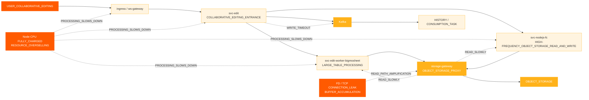
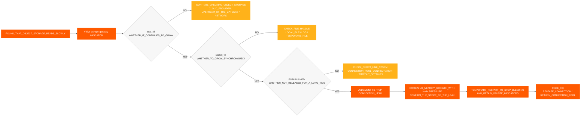
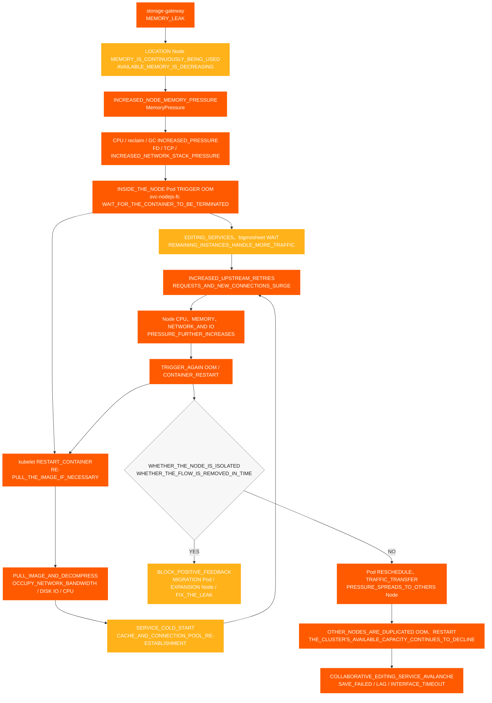

# Incident de modification collaborative

[← ShimoDocs Suite documentation de déploiement](../README.md)

## 1. Contexte du cas 

L'environnement d'une grande entreprise a rencontré un incident de type indisponibilité d'édition collaborative, affectant la modification et la sauvegarde normales de certains tableurs et documents par les utilisateurs. Pendant l'incident, les utilisateurs ont rencontré des phénomènes tels que des sauvegardes échouées, des retards dans l'édition et des Kafka dépassements de temps d'écriture; côté service, des problèmes tels que des lectures lentes du stockage d'objets, une utilisation anormale des nœuds et des anomalies CPU  TCP/FD les métriques sont également apparues. 

Ce cas illustre que l’indisponibilité de l’édition collaborative n’est pas nécessairement directement causée par le service d’édition lui-même. Elle peut également être amplifiée collectivement par des problèmes tels que des ressources sous-jacentes survendues, une planification concentrée des nœuds, des écritures middleware ralenties, des chemins de lecture anormaux du stockage d’objets ou des fuites de connexion. 

## 2. Manifestation de l’incident 

Les principaux impacts de cet incident étaient : 

- Les liens de l’édition collaborative sont devenus indisponibles, lents ou présentaient des délais d’attente de l’interface. 
- Certaines feuilles de calcul ou documents ne pouvaient pas être sauvegardés normalement. 
- Des pop-ups côté édition s’affichaient `Kafka write timeout`. 
- Les temps de lecture du stockage d’objets ont augmenté, affectant davantage le traitement des liens d’édition. 
- La surveillance des pods semblait normale, mais les utilisateurs ont continuellement signalé des échecs de sauvegarde, des ralentissements de l’édition et des délais d’attente de l’interface. 

## 3. Processus d’enquête préliminaire 

### 3.1 À partir des phénomènes utilisateur vers le lien d’édition 

Le client a d’abord signalé des anomalies avec certains documents, donc l’enquête initiale s’est concentrée sur les problèmes d’édition collaborative : 
1. Vérifier le lien d’édition et de sauvegarde. 
2. Vérifier les journaux de service pertinents. 

3. Vérifiez Kafka État d’écriture. 
4. Vérifier la latence de lecture/écriture du stockage d’objets. 

Lors de l’enquête, deux anomalies majeures ont été trouvées : 

- `Kafka write timeout` survenues dans le lien d’édition. 
- Latence de lecture du stockage d’objets anormale. 

### 3.2 Confirmation préliminaire des dépendances externes 

Lors de l’enquête, nous avons confirmé individuellement avec les propriétaires de dépendances externes : 

- Confirmation avec le côté stockage d’objets, aucun problème évident n’a été trouvé chez le fournisseur cloud. 
- Confirmation avec Kafka les opérations, aucun problème évident n’a été trouvé du côté du Kafka cluster. 

Par conséquent, le problème ne peut pas être directement attribué au stockage des objets ou Kafka les services eux-mêmes, et une enquête plus approfondie doit se poursuivre vers les nœuds commerciaux locaux, les passerelles, les pools de connexion, le réseau et les couches de ressources. 

### 3.3 Passer de la surveillance des Pods à la surveillance des Nœuds 

Initialement, lors de la vérification de la surveillance des Pods, les deux CPU et la mémoire étaient dans des plages relativement sûres, mais le client a signalé que les CPU du nœud étaient saturés. 

Ceci a été le point tournant clé dans le diagnostic actuel : 

- En cas de sur-engagement des ressources, la surveillance des Pods peut ne pas refléter avec précision la pression sur le nœud. 
- Une fois que le nœud CPU est saturé, la capacité de traitement des affaires à l'intérieur des conteneurs diminue. 
- Après le ralentissement du traitement des affaires, cela se manifeste davantage par des lectures lentes du stockage d'objets, des écritures lentes, un arriéré de requêtes et des enregistrements échoués. Kafka  

## 4. Chaîne d'impact des fautes 

## 5. Principales conclusions 

### 5.1 Nœud CPU Anomalies 

Plusieurs nœuds ont connu CPU anomalies en séquence : 
- '10.142.191.54' a déclenché une exception à 18:20. 
- '10.76.176.65' a déclenché une exception à 18:30. 
- '10.76.238.202' a déclenché une exception à 18:40. 
- '10.142.206.216' a déclenché l'anomalie à 18:42. 
- '10.142.175.191' a déclenché l'anomalie à 18:45. 

Il peut être observé que la première anomalie était '10.142.191.54', suivie de CPU problèmes sur d'autres nœuds, ce qui correspond à la caractéristique des anomalies de ressources à point unique se propageant à plusieurs nœuds. 

### 5.2 CPU et Mémoire Survendue 

La survendue de ressources avant et après la défaillance est la suivante : 

| Scénario | Ressource | Capacité du Cluster | Total des Demandes | Proportion de Demande | Limite Totale | Survendue |
| --- | --- | --- | --- | --- | --- | --- |
| pod nodejs-fc 6 | CPU | 192 cœurs | 33,75 cœurs | 17.6% | 457 cœurs | 238.0% |
| pod nodejs-fc 6 | Mémoire | 768 Gio | 57,24 Gio | 7.5% | 884 Gio | 115.1% |
| pod nodejs-fc 12 | CPU | 192 cœurs | 45,75 cœurs | 23.8% | 493 cœurs | 256.8% |
| pod nodejs-fc 12 | Mémoire | 768 Gio | 81,24 Gio | 10.6% | 980 Gio | 127.6% |
| pod nodejs-fc 12 après mise à l’échelle | CPU | 320 cœurs | 45,75 cœurs | 14.3% | 493 cœurs | 154.1% |
| pod nodejs-fc 12 après mise à l’échelle | Mémoire | 1280 Gio | 81,24 Gio | 6.3% | 980 Gio | 76.6% |

Dans des circonstances normales, CPU une surallocation contrôlée autour de 150 % est relativement acceptable. Avant cette mise à l’échelle, CPU la surallocation avait déjà atteint 238 %, et après avoir doublé l’échelle, elle a atteint 256,8 %, présentant un risque élevé d’avalanche de trafic par rafales. 

### 5.3 Concentration de planification des Pod 

La stratégie de planification par défaut K8s dans l’environnement d’une grande entreprise tend à remplir un nœud avant d’utiliser les nœuds restants. Lors du déploiement en continu des services ou de la mise à l’échelle temporaire, plusieurs services à forte charge se trouvent facilement concentrés sur quelques nœuds. 

Les combinaisons à haut risque incluent : 

- Plusieurs `svc-nodejs-fc` instances existent sur un seul nœud. 
- Fonctionnant `svc-edit-worker-bigmosheet` et `ingress` sur le même nœud simultanément. 
- Se superposant `storage-gateway` sur le même nœud entraînent des fuites de connexion ou une augmentation de la mémoire. 

### 5.4 Connexions de passerelle de stockage et fuites de mémoire 

Après contrôle supplémentaire du TCP monitoring du nœud et `storage-gateway` des métriques du Pod, il a été constaté : 

- `total_fd` continue d’augmenter. 
- `socket_fd` continue d’augmenter. 
- TCP les connexions restent `ESTABLISHED` pendant longtemps. 
- Les connexions ne sont pas libérées à temps, et les FD ne sont pas retournés au pool de connexions. 
- Pod RSS / Le Working Set continue de croître, et après récupération, ne peut pas revenir à des niveaux normaux. 

Si `total_fd`, `socket_fd`, et l'utilisation de la mémoire augmentent toutes simultanément de façon continue, cela indique que les connexions ne sont pas libérées et que la mémoire continue de croître, ce qui doit être traité comme des fuites de connexion et de mémoire, tout en faisant attention au risque `MemoryPressure` et OOM du Node. 

### 5.5 Impact des différences de version 

Dans les anciennes versions, les données des pièces jointes d'image étaient écrites directement dans la table de données. Dans la nouvelle version, pour réduire MySQL Coût d'utilisation et de stockage, les informations de pièce jointe de l'image sont écrites dans les métadonnées du stockage d'objets, et le `/x` chemin de lecture qui accède directement au stockage d'objets est utilisé. 

En mode proxy, la fonction sous-jacente pour déterminer si une clé de stockage d'objet existe ne libère pas correctement les connexions, ce qui entraîne des fuites de connexion. Ce problème, combiné à une sur-allocation des ressources et à une planification concentrée, se traduit par une indisponibilité de l'édition collaborative. 

### 5.6 Surveillance du stockage d'objets et du gateway de stockage - Évidences 

Pour déterminer si le problème se situe du côté du stockage d'objets, du côté du service métier, ou de la couche proxy, une enquête comparative sur le stockage d'objets et `storage-gateway` a été réalisé : 

- La latence de lecture du stockage d'objets a augmenté, tandis que la latence d'écriture est restée relativement normale, avec des anomalies principalement concentrées sur le chemin de lecture. 
- CPU, RSS / Ensemble de travail, et le taux de croissance de la mémoire de `storage-gateway` les Pods a continué à augmenter. 
- `total_fd` et `socket_fd` a continué à croître, et TCP les connexions sont restées dans l'état `ESTABLISHED` pendant une longue période. 
- Les connexions n'ont pas été libérées à temps, les FDs n'ont pas été retournés au pool de connexions, provoquant une pression sur la mémoire et OOM un risque sur le nœud. 
- Aucune défaillance côté serveur correspondant à l'ampleur des anomalies commerciales n'a été trouvée du côté du stockage d'objets, donc l'accent de l'enquête a été mis en priorité sur le `storage-gateway` chemin de lecture du proxy. 

Jugement global : les lectures lentes du stockage d'objets ne sont pas simplement dues à des défaillances du service de stockage d'objets, mais sont le résultat de pressions accumulées sur les FD, TCP les connexions, la mémoire et les ressources des nœuds causées par `storage-gateway` des connexions non libérées. 

### 5.7 FD/TCP Processus de détermination des fuites 

Cette fois, la chaîne de jugement suivante a été utilisée pour confirmer que `storage-gateway` présente des fuites de connexion : 

Conclusion du jugement : Lorsque `total_fd`, `socket_fd`, le nombre de `ESTABLISHED` connexions, et l'utilisation de la mémoire du Pod augmentent de manière synchrone dans la même fenêtre temporelle, la cause principale peut être considérée comme un « FD/TCP et fuite de mémoire causée par des connexions non libérées ; si la lecture du stockage objet est lente alors que l’écriture est normale et que les indicateurs ci-dessus sont anormaux en même temps, le chemin de lecture du proxy doit être vérifié en premier. 

## 6. Conclusion sur la cause principale 

La chaîne de cause de cette défaillance est la suivante : 

1. Le cluster présente un surengagement significatif, CPU avec CPU un surengagement dépassant 250 % à certaines phases. 
2. Lors des mises à jour progressives des services ou du scaling temporaire, la planification des Pods est concentrée, entraînant une pression excessive sur les ressources des nœuds individuels. 
3. Les services à forte charge tels que `svc-nodejs-fc`, `svc-edit-worker-bigmosheet`, et `ingress` sont concentrés sur certains nœuds. 
4. `storage-gateway` a un problème de libération de connexion dans le chemin de lecture du proxy de stockage objet, entraînant une croissance continue des FD, TCP des connexions et de l’utilisation de la mémoire. 
5. Après que la pression mémoire et OOM se manifestent sur le nœud, les redémarrages de conteneurs, les pulls d’images, les démarrages à froid des services et les nouvelles tentatives en amont augmentent encore plus CPU, réseau et pression d'E/S disque, entraînant des lectures lentes du stockage d'objets et des écritures Kafka lentes. 
6. Lectures lentes du stockage des objets et Kafka les délais d'écriture se traduisent finalement par une indisponibilité dans l'édition collaborative, des échecs d'enregistrement et un retard dans l'édition. 

## 7. Diagramme de propagation de l'avalanche des ressources des nœuds 

Les services commerciaux impliqués dans cette panne s'exécutent tous dans un K8s cluster. La fuite de mémoire dans `storage-gateway` consomme d'abord la mémoire disponible de son nœud, puis à travers OOM, les redémarrages de conteneurs, les extractions d'images, les démarrages à froid des services et les tentatives répétées en amont forment une boucle de rétroaction positive de consommation des ressources. Lorsque le Pod anormal est replanifié ou que le trafic est transféré vers d'autres nœuds, la pression continue de se propager aux nœuds sains, provoquant finalement une avalanche au niveau du cluster. 

Le diagramme nécessite de se concentrer sur deux boucles d'amplification : 

1. **Boucle de rétroaction positive intra-noeud**: OOM → redémarrages de kubelet ou récupération d'images → démarrage à froid → les tentatives en amont et les nouvelles connexions augmentent → CPU, la pression sur la mémoire, le réseau et l'E/S disque continue d'augmenter → OOM à nouveau. 
2. **Boucle de diffusion inter-nœuds**: Les Pods sur des nœuds anormaux sont replanifiés, le trafic entrant est redirigé, ou les instances restantes prennent en charge les requêtes → la charge des nœuds sains augmente → d'autres nœuds subissent OOM et redémarrent à plusieurs reprises → la capacité disponible du cluster continue de diminuer. 

## 8. Gestion et réparation 

### 8.1 Gestion à court terme 

- Supprimer le trafic de la passerelle pour les entrées anormales ou les nœuds anormaux afin d'empêcher l'arrivée de nouveau trafic sur le chemin à haute pression. 
- Redémarrer les services anormaux avec FD, TCP, ou mémoire en croissance continue. 
- Migrer ou disperser les Pods à haute charge à partir des nœuds à haute pression. 
- Expulser les Pods ou isoler les nœuds dont les ressources sont entièrement utilisées CPU. 
- Éviter de ne dimensionner que les Pods métier, prioriser le renforcement des ressources du nœud. 
- Ajouter une capacité d'échec rapide pour `svc-edit` l'interface de synchronisation afin d'empêcher les requêtes de s'accumuler pendant longtemps. 

### 8.2 Réparation à long terme 

- Corriger le problème des connexions non libérées lors de la vérification de l'existence d'une clé en mode proxy de stockage d'objets. 
- Configurer des politiques d'anti-affinité pour les services principaux afin d'éviter de concentrer des services à haut risque sur le même nœud. 
- Configurer des politiques d'expulsion des nœuds pour empêcher les nœuds de continuer à exécuter les services principaux après épuisement des ressources. 
- Établir CPU et une surveillance de la surallocation de la mémoire. 
- Avant de dimensionner un service, il faut évaluer les niveaux de ressources de l'environnement du client et confirmer le plan de dimensionnement avec le chef de projet. 
- Mettre en place des alertes pour OOM, FD, TCP, requêtes lentes, Kafka retard de traitement, et latence de lecture/écriture du stockage d'objets pour les services principaux. 

## 9. Conclusions de l'analyse de cas 

Cette défaillance indique que lorsque l'édition collaborative n'est pas disponible, l'enquête ne doit pas se concentrer uniquement sur les journaux du service d'édition. Si les ressources du nœud sous-jacent sont déjà entièrement utilisées, les services métier ralentiront globalement, se manifestant par plusieurs symptômes de niveau supérieur tels que Kafka timeout d'écriture, lectures lentes du stockage d'objets et échecs d'enregistrement. 

Lors du traitement de problèmes similaires à l'avenir, il faut d'abord confirmer les ressources du cluster et du nœud, puis passer en revue le middleware, la surveillance métier, les journaux et les liens de traçage, afin d'éviter de commencer l'enquête à partir d'un seul journal de service et de tomber dans une boucle de dépannage localisée. 

---
