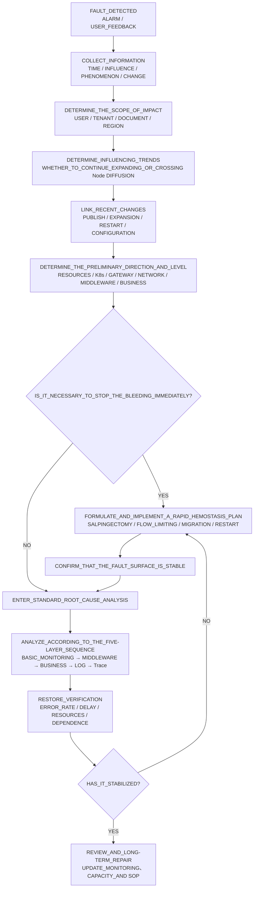
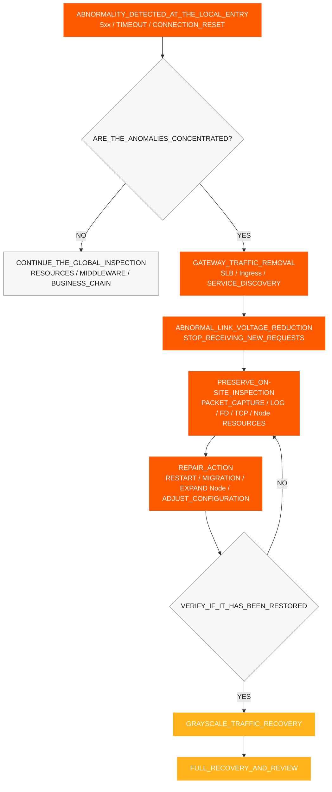
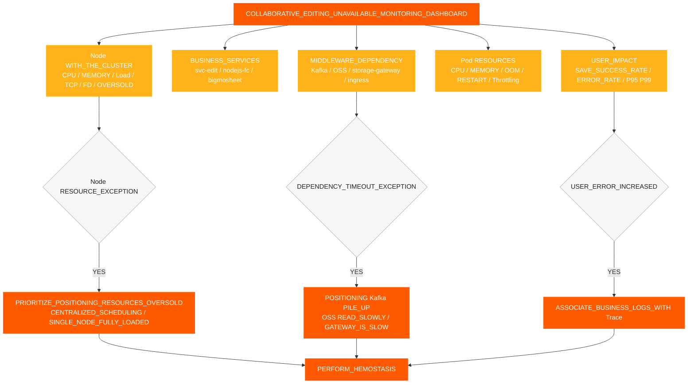
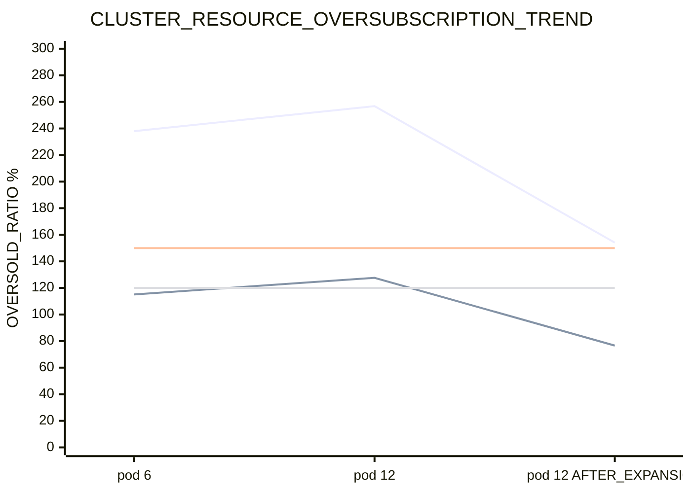
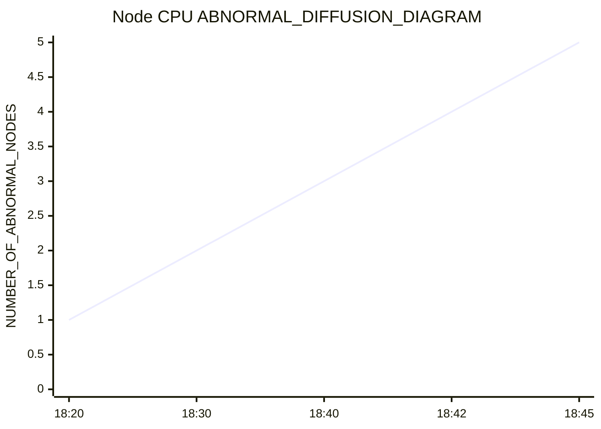
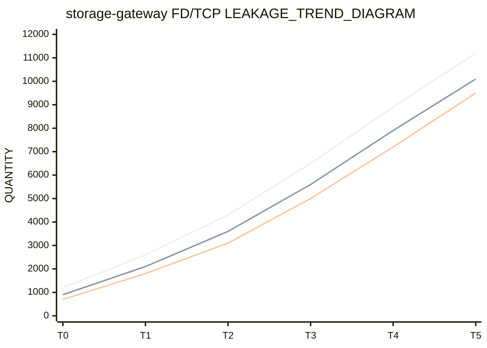
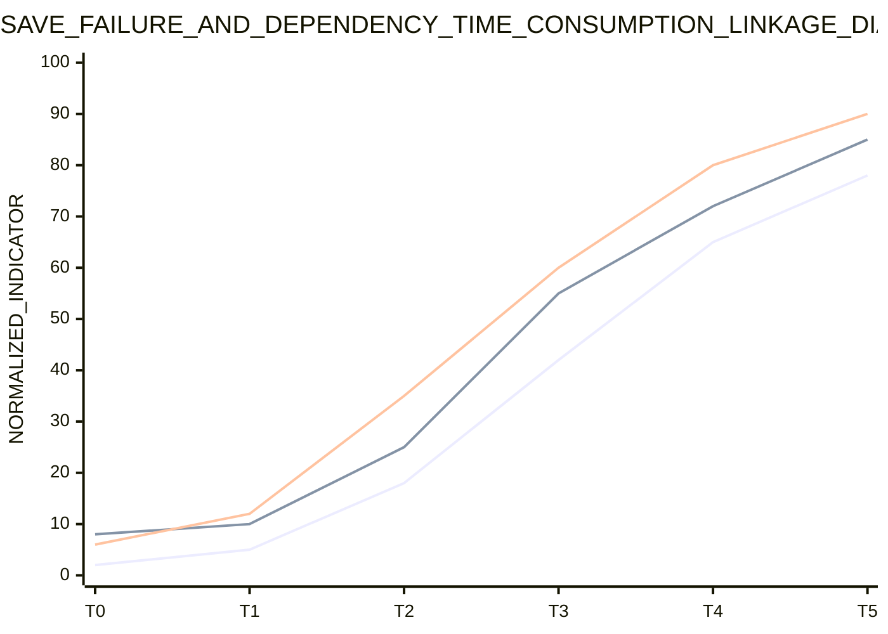
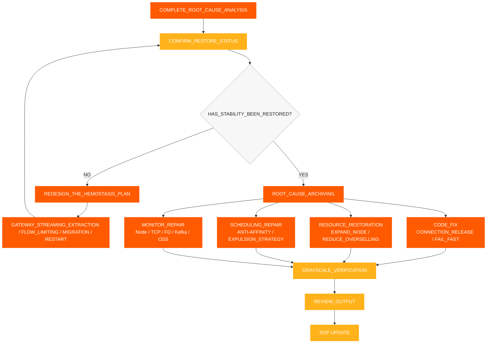

# Réponse aux incidents SOP

[← ShimoDocs Suite documentation de déploiement](../README.md)

## 1. Collecte d'informations

Après réception d'une panne, enregistrez d'abord les informations suivantes :

- Heure d'occurrence : première alerte, premier retour client, si elle coïncide avec une publication ou une mise à l'échelle.
- Portée de l'impact : locataires, types de documents, nombre de fichiers, nombre d'utilisateurs, si concentré dans des tables ou de grandes tables.
- Symptômes spécifiques : échecs d'enregistrement, erreurs de modification, Kafka temps d'attente expirés, lectures lentes du stockage d'objets, API temps d'attente expirés.
- Changements récents : versions de service, redémarrages progressifs, mise à l'échelle des Pods, mise à l'échelle des nœuds, stockage ou Kafka changements.
- Services clés : `svc-nodejs-fc`, `svc-edit`, `svc-edit-worker-bigmosheet`, `storage-gateway`, `ingress`, `ws-gateway`.


## 2. Évaluation des informations et classification des pannes

Après avoir complété la collecte d'informations, juger d'abord de la portée de la panne, de la tendance de développement et de la direction principale de la cause en se basant sur les symptômes, les métriques, les événements et les enregistrements de changement, puis décider si une contention immédiate est nécessaire. Les résultats du jugement doivent former une conclusion claire et ne doivent pas se baser uniquement sur un seul Pod ou un seul journal.

Points clés pour l'évaluation :

- Portée de l'impact utilisateur : utilisateurs, locataires, types de documents, régions et services affectés.
- Manifestations de l'impact : échecs d'enregistrement, retard dans la modification, API temps d'attente expirés, Kafka temps d'écriture expirés, lectures lentes du stockage d'objets.
- Tendance de l'impact : si elle continue à s'étendre, si elle se propage d'un seul Pod ou Nœud à plusieurs Nœuds.
- Association avec les changements : si elle est liée à la version de service, à la mise à l'échelle des Pods, à la mise à l'échelle des nœuds, au redémarrage progressif, à la configuration ou aux changements de middleware. 
- Direction préliminaire : problème de ressources, K8s plan de contrôle, passerelle, réseau, middleware, code métier ou données. 

Déterminer le niveau de panne en fonction du résultat du jugement : 

| Niveau | Critères de jugement | Cible de réponse | 
| --- | --- | --- | 
| P0 | Indisponibilité généralisée de l'édition, échecs d'enregistrement continus, anomalies de lot dans les services principaux | Arrêter l'hémorragie en 15 minutes, clarifier la direction principale de la cause en 30 minutes | 
| P1 | Locataires partiels, documents partiels, nœuds partiellement anormaux, taux d'erreur fortement augmenté | Localiser le lien anormal dans les 30 minutes, restaurer la stabilité dans les 60 minutes | 
| P2 | Requêtes lentes à point unique ou à petite échelle, échecs occasionnels de sauvegarde | Confirmation complète de la cause et plan de réparation dans un délai d'un jour ouvrable | 

La conclusion du jugement doit répondre au moins à trois questions : quelle est l'ampleur de l'impact actuel, la panne est-elle en expansion, faut-il d'abord arrêter l'hémorragie ou passer directement à l'analyse de la cause profonde. 




## 3. Hémostase rapide

Si le côté utilisateur continue d'échouer, ou si le résultat du jugement montre que la panne se propage, effectuer d'abord des actions de confinement, puis continuer l'analyse approfondie. L'objectif du confinement est de réduire la portée de la panne, bloquer la rétroaction positive des ressources, tout en conservant autant que possible la scène de panne.

1. Retirer le trafic des passerelles anormales, SLB des backends, des entrées Ingress, des instances de service ou des nœuds, empêchant de nouvelles requêtes de continuer à entrer sur le chemin anormal.
2. Définir les nœuds anormaux comme non programmables ou isolés pour empêcher les Pods de continuer à être programmés sur des nœuds surchargés.
3. Redémarrer les Pods connaissant OOM, croissance continue de la mémoire, ou fuites de FD/TCP , en donnant la priorité à `storage-gateway`, `svc-nodejs-fc`, et `svc-edit-worker-bigmosheet`.
4. Distribuer les Pods à charge élevée afin d'éviter `nodejs-fc`, `bigmosheet`, `ingress`, et `storage-gateway` d'être concentrés sur le même nœud.
5. Mettre en pause le scaling des Pods d'activité invalide, donner la priorité au scaling des nœuds ou à la restauration des ressources disponibles.
6. Mettre en œuvre une limitation du débit ou un échec rapide pour les nouvelles tentatives en amont, la création de connexions et l'accumulation de requêtes afin d'empêcher les nouvelles connexions de continuer à augmenter après un démarrage à froid.
7. Enregistrer le nœud CPU, la mémoire, OOM, FD, TCP, taux d'erreur et latence de l'interface avant et après l'arrêt de la fuite.

### 3.1 Suppression du trafic de la passerelle

Lorsqu'un défaut se manifeste par un nœud local anormal, une entrée de passerelle locale ou une instance de service locale, le trafic d'entrée anormal doit d'abord être supprimé, puis les nœuds et les Pods doivent être pris en compte. L'objectif de la suppression du trafic est de réduire la pression sur le lien défaillant et d'empêcher les instances anormales de continuer à recevoir de nouvelles requêtes. 

Conditions de déclenchement : 

- Le taux d'erreur d'un certain Ingress, SLB backend, Pod de passerelle ou Node est significativement plus élevé que les autres instances. 
- Les erreurs 5xx de la passerelle, les délais d'attente en amont et les réinitialisations de connexion sont concentrés sur quelques points d'entrée. 
- Certain Node CPU, Load, TCP, et les métriques FD sont évidemment anormales, et de nouvelles requêtes continuent d'arriver. 
- Les instances de liens principaux telles que `svc-edit`, `ws-gateway`, et `storage-gateway` ont déjà ralenti. 

Actions à exécuter : 

1. Supprimer les backends anormaux de SLB, Ingress, routage de passerelle ou découverte de service. 
2. Marquer temporairement les nœuds anormaux comme non programmables pour empêcher que de nouveaux Pods y soient planifiés. 
3. Effectuer la capture de paquets, les journaux, les contrôles FD/TCPet les vérifications de ressources sur les nœuds ou instances dont le trafic a été supprimé. 
4. Après avoir terminé le redémarrage, la migration, la mise à l'échelle ou la réparation de la configuration, restaurer d'abord à une petite charge de trafic, puis la restauration complète. 
5. Avant la restauration, confirmer que les taux d'erreur, les temps de réponse de l'interface, les métriques Node CPU, et TCP/FD sont revenus à la normale. 




## 4. Processus standard d'analyse des causes profondes

Après avoir effectué une hémostase rapide et confirmé que la surface de défaillance est stable, procédez à l'analyse des causes profondes. La séquence standard de dépannage est réalisée de manière 'du bas vers le haut, du grossier au fin' :

1. Surveillance de base : ressources du cluster, nœuds Node, ressources des Pods.
2. Surveillance des middlewares : Kafka, stockage d'objets, passerelle, réseau.
3. Surveillance commerciale : taux de réussite des enregistrements, temps de réponse des interfaces et taux d'erreur.
4. Surveillance des journaux : journaux d'erreurs, journaux de délais d'attente, OOM/redémarrage des journaux.
5. Suivi des liens de trace : liens de requête, appels lents, intervalles d'exception.

Exigences de base :

- Chaque couche produit d'abord la conclusion du jugement, puis entre dans la couche suivante.
- Regardez d'abord le nœud, puis le Pod ; regardez d'abord la tendance globale, puis les journaux d'un seul service.
- Ne sautez pas les niveaux suivants simplement parce qu'aucune anomalie n'a été détectée dans une certaine couche.
- La surveillance, les journaux et les traces doivent être corrélés en utilisant la même fenêtre temporelle, le même Pod, le même nœud et le même ID de trace.

Chaque couche ne répond qu'à une question principale :

- Surveillance de base : Les ressources sont-elles déjà insuffisantes, et y a-t-il un survente, une planification centralisée ou une répartition inter-nœuds ?
- Surveillance des middleware : Y a-t-il des ralentissements, des accumulations, des rejets de requêtes ou des anomalies de connexion ?
- Surveillance métier : Quel service, API, ou type de document correspond à l'impact utilisateur ?
- Surveillance des journaux : Existe-t-il des preuves claires d'erreurs, de délais d'attente, OOM, de redémarrages ou d'épuisement du pool de connexions ?
- Trace Link Tracing : Où exactement une requête échouée a-t-elle été bloquée—dans quel service, nœud ou segment ? 


### 4.1 Résolution des problèmes de surveillance de base 

Donnez la priorité à la vérification de la dimension du nœud plutôt qu'à celle du pod. Lorsque les ressources sont surutilisées, la surveillance du pod peut afficher des valeurs dans des limites sûres, mais le nœud peut déjà être entièrement utilisé. 

Éléments à vérifier : 

- Total du cluster CPU et capacité en mémoire ainsi que capacité disponible. 
- Nœud CPU, mémoire, charge, disque, réseau. 
- Pod CPU, mémoire, redémarrages, OOM, CPU limitation. 
- Que plusieurs hauts CPU ou les services à entrée/sortie élevée sont concentrés sur un seul nœud. 
- Que, après une mise à jour continue, les Pods sont principalement programmés sur les premiers nœuds. 
- Qu'il y a un manque de politiques d'anti-affinité et d'éviction. 

Jugements clés : 

- Que le total CPU Limites / cluster CPU la capacité dépasse 150%. 
- Que les limites de mémoire totale / la capacité de mémoire du cluster dépassent 120 %. 
- S'il existe un processus où un nœud tombe en panne en premier, suivi par d'autres nœuds qui connaissent progressivement une augmentation CPU de l'utilisation. 


### 4.2 Dépannage de la surveillance des middleware 

Le dépannage des middleware se concentre principalement sur Kafka, stockage d'objets, passerelles et réseaux. Le jugement spécifique pour Kafka est le suivant ; les métriques détaillées et les éléments de jugement pour le stockage d'objets, `storage-gateway`, passerelles et réseaux sont enregistrés uniformément dans la Section 9.7 et la liste de contrôle associée. 

#### 4.2.1 Kafka 

Éléments à vérifier : 

- Latence d'écriture du producteur et taux d'échec. 
- Retard du sujet. 
- Côté courtier CPU, disque, réseau et latence des requêtes. 
- S'il y a des retransmissions, des pertes de paquets ou une congestion de connexion du client vers Kafka. 
- Si des délais d'attente se produisent uniquement sur les écritures côté entreprise alors qu'il n'y a pas d'anomalies évidentes côté Kafka opérations. 

Logique de jugement : 

- S'il n'y a aucune anomalie sur le Kafka côté opérations, mais le côté business continue de rencontrer des délais d'écriture, concentrez-vous sur la vérification du nœud business CPU, congestion du réseau et capacité de traitement du client. 
- Si Kafka Les retards accumulés et les erreurs commerciales se produisent simultanément, confirmez d'abord si le retard est causé par un traitement lent du service en amont. 


### 4.3 Surveillance des activités, journaux et traçage 

#### 4.3.1 Surveillance des activités 

Confirmez les liens anormaux en fonction des phénomènes observés chez le client : 

1. Si les échecs de sauvegarde sont concentrés dans des tables, de grandes tables ou des types de documents spécifiques. 
2. Si l'interface d'édition subit des délais d'attente, des requêtes lentes ou une augmentation du taux d'erreur. 
3. Vérifiez si `Kafka write timeout` se produit. 
4. Vérifiez si les lectures du stockage d'objets sont lentes et si les écritures sont normales. 
5. Vérifiez si `bigmosheet operation oss_get` dépasse 5 secondes. 
6. Vérifiez si les services liés à WebSocket, à l'édition collaborative, à l'historique et au stockage d'objets subissent simultanément une latence accrue. 

#### 4.3.2 Surveillance des journaux 

Journaux à vérifier : 

- Journaux des échecs d'enregistrement des modifications. 
- Journaux pour Kafka dépassements de temps d'écriture. 
- Journaux des lectures et écritures lentes du stockage d'objets. 
- Journaux pour OOM, redémarrages, pools de connexions épuisés et épuisement des descripteurs de fichiers. 
- Journaux pour les erreurs 5xx de la passerelle, les délais d'attente en amont et les réinitialisations de connexion. 

#### Suivi de lien 4.3.3 

Utilisez Trace pour suivre une seule requête échouée : 

- Vérifiez si la requête est bloquée dans la passerelle, l'édition collaborative, le stockage d'objets, Kafkaou la chaîne de consommation de l'historique. 
- Vérifiez si un Span présente une latence anormale. 
- Vérifiez si les appels lents sont concentrés dans un service, un nœud ou un type de document spécifique. 
- Comparez les différences de lien entre les requêtes échouées et les requêtes normales. 


## 5. Vérification de la récupération 

Après avoir terminé l'action d'arrêt du saignement, les mesures suivantes doivent être vérifiées : 

- L'entrée de passerelle supprimée, SLB le backend ou les instances anormales ont cessé de recevoir de nouveaux trafics. 
- Le taux de succès des sauvegardes est revenu à la normale. 
- Le taux d'erreur de l'interface de modification a diminué. 
- Kafka La latence d'écriture est revenue à la normale. 
- Kafka L'arriéré a diminué. 
- La latence de lecture du stockage d'objets est revenue à la normale. 
- Nœud CPU, la mémoire et la charge ont diminué. 
- `storage-gateway` FD et socket FD ne augmentent plus continuellement. 
- Les nœuds anormaux ne se propagent plus. 
- Après la restauration du trafic lors de la publication en dégradé, les erreurs 5xx de la passerelle, le timeout en amont et les réinitialisations de connexion n'ont plus augmenté. 


## 6. Exigences de surveillance et d'alerte 

Les alertes suivantes doivent être complétées : 

- Nœud CPU, mémoire, charge, disque et alertes réseau. 
- Nœud TCP nombre de connexions, retransmission, perte de paquets et `ESTABLISHED` alertes du nombre de connexions. 
- Pod OOM, redémarrage, et CPU alertes de limitation. 
- Services principaux OOM alertes. 
- CPU alerte de survente : CPU Limite / cluster CPU la capacité dépasse 150%. 
- Alerte de survente de mémoire : limite de mémoire / capacité de mémoire du cluster dépasse 120%. 
- Kafka alerte de retard. 
- Kafka alerte de dépassement de délai d'écriture. 
- alerte de journal d'erreur de sauvegarde de modification. 
- `bigmosheet operation oss_get > 5s` alerte. 
- `storage-gateway` alerte de FD et de socket FD en augmentation continue. 
- `storage-gateway` RSS / Ensemble de travail en augmentation continue et Nœud `MemoryPressure` alerte. 


## 7. Tableau de suivi des indicateurs clés 

Cette section est un outil auxiliaire et ne change pas l'ordre principal du processus. Le tableau de bord est utilisé pour observer les tendances et localiser les directions, tandis que `kubectl`, `jq`, et PromQL sont utilisés pour obtenir des preuves spécifiques ; l'enquête sur site doit suivre la liste de contrôle détaillée de la section 9, en exécutant chaque point et en enregistrant les conclusions. 

### 7.1 Superposition des tableaux de bord 

Il est recommandé de diviser le tableau de bord des pannes de collaboration éditoriale indisponible en 5 couches et de vérifier couche par couche de haut en bas lors de l'enquête : 

| Couche | Nom du tableau de bord | Métriques principales | Objectif |
| --- | --- | --- | --- |
| L1 | Tableau de bord de l'impact utilisateur | Taux de réussite d'enregistrement, taux d'erreurs d'édition, interface P95/P99, connexions de collaboration en ligne | Déterminer si les utilisateurs sont réellement impactés |
| L2 | Tableau de bord du service métier | QPS, taux d'erreur, latence et nombre de redémarrages de `svc-edit`, `svc-nodejs-fc`, `bigmosheet` | Déterminer quel service métier concentre l'anomalie |
| L3 | Tableau de bord du middleware | Kafka latence d'écriture, Kafka arriéré, latence de lecture/écriture du stockage d'objets, latence de la passerelle en amont | Déterminer si les dépendances ralentissent |
| L4 | Tableau de bord des ressources des conteneurs | Pod CPU, la mémoire, OOM, redémarrages, CPU bridage | Déterminer si le conteneur lui-même est anormal |
| L5 | Tableau de bord du nœud et du cluster | Nœud CPU, mémoire, charge, TCP, FD, ressources surprovisionnées, distribution des Pods | Déterminer si les ressources sous-jacentes soutiennent l'exploitation commerciale |

### 7.2 Graphique de vue d'ensemble des métriques clés



### 7.3 Graphique de tendance de sur-engagement des ressources

Ce graphique est utilisé pour observer si CPU et le sur-engagement de la mémoire entrent dans des zones à haut risque avant et après l'expansion. Dans le tableau de bord réel, il est recommandé de définir CPU le sur-engagement à 150 % et le sur-engagement mémoire à 120 % comme lignes de seuil d'alerte.



### 7.4 Nœud CPU Graphique de tendance de diffusion

Ce graphique est utilisé pour observer s'il existe une caractéristique de diffusion où un seul nœud échoue en premier, suivi par les autres nœuds qui sont progressivement entraînés vers le bas.



### 7.5 FD/TCP Graphique de tendance des fuites

Ce graphique est utilisé pour déterminer si `storage-gateway` a des fuites de connexion ou de FD. Si `total_fd`, `socket_fd`, et que le nombre de `ESTABLISHED` connexions augmente simultanément de manière continue, les fuites de connexion doivent être traitées en priorité.



### 7.6 Graphique de corrélation entre erreurs métier et latence des dépendances

Ce graphique est utilisé pour vérifier si les échecs d'enregistrement côté utilisateur sont corrélés avec l'augmentation de Kafka la latence d'écriture et la latence de lecture du stockage d'objets. Si les trois augmentent simultanément dans la même fenêtre temporelle, la priorité doit être donnée à la vérification de la capacité de traitement des nœuds métier et de la congestion de la chaîne de dépendances.



### 7.7 Seuils d'alarme recommandés

| Métrique | Seuil recommandé | Action après déclenchement |
| --- | --- | --- |
| Taux de réussite de l'enregistrement | Inférieur à 99 % pendant 5 minutes consécutives | Entrer dans la confirmation de l'impact métier, corréler les journaux d'erreurs et les Traces |
| Interface d'édition P95 | Supérieur à la référence de 2x pendant 5 minutes consécutives | Vérifier `svc-edit`, `nodejs-fc`, `bigmosheet` |
| Kafka Latence d'écriture | Supérieure à la référence de 2x ou occurrence d'un dépassement de délai d'écriture | Vérifier Kafka arrière-plan, nœud métier CPU, retransmission réseau |
| Kafka Arriéré | Croissance continue pendant 10 minutes | Vérifier les tâches des consommateurs et la vitesse d'écriture en amont |
| OSS Latence de lecture | P95 dépassant 5 secondes | Vérifier `storage-gateway`, réseau, côté stockage d'objets |
| Nœud CPU | Supérieur à 90 % pendant 5 minutes consécutives | Vérifier la distribution des Pods, CPU surallocation, services à forte charge |
| CPU Surallocation | Dépassant 150 % | Suspendez l'extension des Pods métier, privilégiez l'évaluation de l'extension des nœuds |
| Surallocation de mémoire | Dépasse 120% | Vérifier OOM, risque d'éviction et fuites de mémoire |
| `total_fd` / `socket_fd` | Augmentation monotone pendant 10 minutes | Vérifier FD/TCP fuites, redémarrer si nécessaire pour arrêter la perte |
| TCP Taux de retransmission | Supérieur à la référence par 2x | Capturer les paquets pour confirmer la perte de paquets, la congestion, les problèmes de fenêtre |
| Redémarrage du Pod / OOM | Tout service central se produit | Associer immédiatement les journaux et publier les changements |

### 7.8 Nœud CPU et commandes de requête de surallocation de mémoire

Les commandes suivantes s'appliquent aux scénarios où l'entreprise fonctionne dans un K8s cluster. Avant l'exécution, confirmez que le kubeconfig actuel a basculé vers le cluster défectueux, et remplacez `NODE_NAME` par le nom du nœud cible.

#### 7.8.1 Vérification réelle du nœud CPU et utilisation de la mémoire

```bash
# View the real-time CPU and memory usage of all Nodes
kubectl top nodes

# View the real-time usage of the specified Node
kubectl top node "$NODE_NAME"

# View the node's capacity, allocatable resources, and pressure status
kubectl describe node "$NODE_NAME" | sed -n '/Capacity:/,/Allocatable:/p'
kubectl describe node "$NODE_NAME" | sed -n '/Conditions:/,/Addresses:/p'

# Directly view the CPU/memory Requests, Limits, and usage ratio allocated to the Node
kubectl describe node "$NODE_NAME" | sed -n '/Allocated resources:/,/Events:/p'
```

Point clé : `CPU%`, `MEMORY%`, `MemoryPressure`, `DiskPressure`, `PIDPressure`. Lorsque l'utilisation réelle dépasse 90 %, il est nécessaire de déterminer immédiatement si un contrôle de fuite est nécessaire en fonction de la répartition des Pods et de la suppression du trafic de la passerelle.

#### 7.8.2 Statistiques de CPU, demande de mémoire et limite pour un nœud spécifié

```bash
# Statistics of CPU/memory requests and limits for all Pod containers on the specified Node.
# Dependencies: kubectl, jq; memory is uniformly converted to MiB, CPU is uniformly converted to cores.
NODE_NAME="<TARGET_NODE_NAME>"

kubectl get pods -A --field-selector "spec.nodeName=${NODE_NAME}" -o json | jq '
  def cpu_core:
    if . == null then 0
    elif endswith("m") then (rtrimstr("m") | tonumber / 1000)
    else tonumber
    end;
  def mem_mib:
    if . == null then 0
    elif endswith("Ki") then (rtrimstr("Ki") | tonumber / 1024)
    elif endswith("Mi") then (rtrimstr("Mi") | tonumber)
    elif endswith("Gi") then (rtrimstr("Gi") | tonumber * 1024)
    elif endswith("Ti") then (rtrimstr("Ti") | tonumber * 1024 * 1024)
    elif endswith("K") then (rtrimstr("K") | tonumber / 1024)
    elif endswith("M") then (rtrimstr("M") | tonumber)
    elif endswith("G") then (rtrimstr("G") | tonumber * 1024)
    elif endswith("T") then (rtrimstr("T") | tonumber * 1024 * 1024)
    else (tonumber / 1024 / 1024)
    end;
  [ .items[]
    | ([(.spec.containers[]?, .spec.initContainers[]?) | .resources.requests.cpu? // "0"] | map(cpu_core) | add) as $cpu_req
    | ([(.spec.containers[]?, .spec.initContainers[]?) | .resources.limits.cpu? // "0"] | map(cpu_core) | add) as $cpu_limit
    | ([(.spec.containers[]?, .spec.initContainers[]?) | .resources.requests.memory? // "0"] | map(mem_mib) | add) as $mem_req
    | ([(.spec.containers[]?, .spec.initContainers[]?) | .resources.limits.memory? // "0"] | map(mem_mib) | add) as $mem_limit
    | {cpu_request: $cpu_req, cpu_limit: $cpu_limit, mem_request_mib: $mem_req, mem_limit_mib: $mem_limit}
  ]
  | {
      cpu_request_core: (map(.cpu_request) | add),
      cpu_limit_core: (map(.cpu_limit) | add),
      mem_request_mib: (map(.mem_request_mib) | add),
      mem_limit_mib: (map(.mem_limit_mib) | add)
    }'
```

Remarque : L'officiel K8s le calcul de planification utilise une règle de « prendre le maximum » pour `initContainers`. La commande ci-dessus est utilisée pour un résumé rapide sur site, adaptée à la détection des sur-engagements évidents ; lors de la réconciliation avec les tableaux de bord des ressources ou les données du planificateur, les statistiques des ressources du nœud fournies par la plateforme doivent être utilisées comme référence. 

#### 7.8.3 Calcul du cluster CPU et rapport de surallocation de mémoire 

```bash
# Get the total Allocatable resources of all nodes in the cluster
kubectl get nodes -o json | jq '
  [ .items[].status.allocatable
    | {
        cpu_core: (if (.cpu | endswith("m"))
                   then (.cpu | rtrimstr("m") | tonumber / 1000)
                   else (.cpu | tonumber)
                   end),
        memory_bytes: (.memory | rtrimstr("Ki") | tonumber * 1024)
      }
  ]
  | {
      cpu_allocatable_core: (map(.cpu_core) | add),
      memory_allocatable_gib: (map(.memory_bytes) | add / 1024 / 1024 / 1024)
    }'

# Summarize the CPU/memory limits of all Pods for calculating the overcommit ratio
kubectl get pods -A -o json | jq '
  def cpu_core:
    if . == null then 0
    elif endswith("m") then (rtrimstr("m") | tonumber / 1000)
    else tonumber
    end;
  def mem_gib:
    if . == null then 0
    elif endswith("Ki") then (rtrimstr("Ki") | tonumber / 1024 / 1024)
    elif endswith("Mi") then (rtrimstr("Mi") | tonumber / 1024)
    elif endswith("Gi") then (rtrimstr("Gi") | tonumber)
    else (tonumber / 1024 / 1024 / 1024)
    end;
  [ .items[] | .spec.containers[]?
    | {
        cpu_limit_core: (.resources.limits.cpu? // "0" | cpu_core),
        memory_limit_gib: (.resources.limits.memory? // "0" | mem_gib)
      }
  ]
  | {
      cpu_limit_core: (map(.cpu_limit_core) | add),
      memory_limit_gib: (map(.memory_limit_gib) | add)
    }'
```

Formule de calcul : `CPU overcommit ratio = Total CPU Limits of all Pods / Total CPU Allocatable of all Nodes × 100%`; `Memory overcommit ratio = Total Memory Limits of all Pods / Total Memory Allocatable of all Nodes × 100%`. Il est recommandé de prendre CPU la surallocation à 150 % et la surallocation de mémoire à 120 % comme lignes de référence à haut risque, mais le seuil final doit être déterminé en fonction de la ligne de base de l'environnement du client. 

#### 7.8.4 Instructions de requête Prometheus / Grafana

```promql
# Cluster CPU Limit Oversubscription Rate
100 * sum(kube_pod_container_resource_limits{resource="cpu", unit="core"})
  / sum(kube_node_status_allocatable{resource="cpu", unit="core"})

# Cluster Memory Limit Overcommit Rate
100 * sum(kube_pod_container_resource_limits{resource="memory", unit="byte"})
  / sum(kube_node_status_allocatable{resource="memory", unit="byte"})

# View CPU Limit Overcommit Rate by Node
100 * sum by (node) (kube_pod_container_resource_limits{resource="cpu", unit="core"})
  / on (node) kube_node_status_allocatable{resource="cpu", unit="core"}

# View Memory Limit Oversubscription Rate by Node
100 * sum by (node) (kube_pod_container_resource_limits{resource="memory", unit="byte"})
  / on (node) kube_node_status_allocatable{resource="memory", unit="byte"}

# Node Actual CPU Usage
100 * (1 - avg by (instance) (rate(node_cpu_seconds_total{mode="idle"}[5m])))

# Node actual memory usage
100 * (1 - node_memory_MemAvailable_bytes / node_memory_MemTotal_bytes)

# K8s node memory pressure status, 1 indicates MemoryPressure=True
kube_node_status_condition{condition="MemoryPressure", status="true"}
```

Si la métrique de ressource `unit` et `node` les noms des tags dans Prometheus sont incohérents avec les déclarations ci-dessus, vous devriez d'abord confirmer les tags réels dans les détails des métriques avant de procéder à des ajustements. Le ratio de sursouscription ne peut indiquer qu'un risque potentiel dans les déclarations de ressources et ne peut pas remplacer l'évaluation réelle du nœud CPU, la mémoire, OOM, et `MemoryPressure`.


## 8. Révision et boucle de remédiation à long terme




## 9. Liste de contrôle d'inspection détaillée 

Cette liste de contrôle est exécutée dans l'ordre de « Phénomènes Utilisateurs → Ressources de Base → K8s → Middleware → Journaux et Liens → Boucle Fermée de Traitement. » Chaque élément doit enregistrer l'heure d'observation, les objets présentant une anomalie, des captures d'écran des indicateurs ou les résultats des requêtes afin d'éviter de ne noter que « normal/anormal » sans examen. 

### 9.1 Confirmation des Phénomènes et de l'Étendue de l'Impact 

| Cibles d'inspection | Éléments à confirmer | Jugement des anomalies | Enregistrements / Conclusions sur site |
| --- | --- | --- | --- |
| Impact sur l'utilisateur | Édition collaborative indisponible, échec de l'enregistrement, retard de l'édition, délai d'attente de l'interface | Plusieurs utilisateurs, clients ou documents anormaux en même temps, déterminé comme une défaillance commerciale | |
| Portée des défaillances | Est-ce concentré dans des tableaux, des feuilles de calcul volumineuses, des types de documents spécifiques, des clients spécifiques ou des régions spécifiques ? | Lorsqu'il y a une concentration évidente, donner la priorité au regroupement par route de service, type de données ou nœud | |
| Manifestations d'erreurs | Si 'kafka writes timeout', passerelle 5xx, réinitialisation de connexion, délai d'attente en amont se produisent | Plusieurs types d'erreurs surviennent simultanément dans la même fenêtre, en priorisant les dépendances publiques et les couches de ressources | |
| Corrélation temporelle | Le moment de la première alerte, du premier retour, et du début d'une anomalie d'indicateur | Lorsqu'il coïncide avec une mise en production, un scaling, un redémarrage progressif ou des modifications de configuration, enregistrer le numéro de l'ordre de changement | |
| Échelle d'impact | Volume de demandes échouées, taux d'échec, nombre de connexions collaboratives en ligne, services et réplicas affectés | Augmenter le niveau de défaillance et effectuer d'abord l'arrêt de la fuite lorsque l'impact continue de s'étendre | |

### 9.2 Surveillance d'élément de base : Nœud 

| Sujet de surveillance | Indicateurs clés | Jugements clés | Actions recommandées | Enregistrements / Conclusions sur site |
| --- | --- | --- | --- | --- |
| CPU Utilisation | Nœud CPU utilisation, Charge 1/5/15, CPU voler, iowait, interruption logicielle | CPU constamment >90%, Charge approchant ou dépassant le nombre de cœurs, augmentation anormale de iowait/interruption logicielle | Vérifier les Pods à charge élevée, si nécessaire retirer le trafic, migrer les Pods ou scaler les Nœuds | |
| Utilisation de la mémoire | Utilisée, Disponible, RSS, Défaut de page, Swap, OOM Tuer | Disponible en baisse continue, utilisation du Swap, OOM, augmentation de la pression de récupération de mémoire | Vérifier les fuites de mémoire et les Pods consommant beaucoup de mémoire, confirmer `MemoryPressure`, isoler les nœuds si nécessaire | |
| Surallocation de mémoire | Limite de mémoire/Allocable, Demande de mémoire/Allocable | La limite de mémoire dépasse 120% ou les demandes sont trop concentrées | Mettre en pause l'extension du service, prioriser l'ajout de Nœuds, réduire les limites à haut risque ou répartir les Pods | |
| CPU surréservation | CPU Limite/Allocable, CPU Demande/Allocable | CPU La limite dépasse 150%, ou les Pods à forte charge sont concentrés sur le même Nœud | Ajuster la configuration des ressources, l'anti-affinité et la distribution des réplicas |  |
| TCP Connexion | Total TCP connexions, `ESTABLISHED`, `TIME_WAIT`, `CLOSE_WAIT`, taux de retransmission | Nombre de connexions en augmentation continue, `CLOSE_WAIT` non libérées depuis longtemps, taux de retransmission en hausse | Localiser les fuites de connexion, le pool de connexions, la congestion du réseau et les clients anormaux |  |
| netstat / socket | Nombre total de sockets, ports d'écoute, Recv-Q, Send-Q, nombre de connexions échouées | Accumulation continue de Recv-Q/Send-Q ou débordement de la file d'attente d'écoute | Dépannage avec capture de paquets, pool de connexions du service et paramètres du noyau |  |
| FD | Total FD, FD de socket, utilisation du FD des processus, `file-nr` | `total_fd`, `socket_fd` augmentation monotone ou approche de la limite du processus | Enregistrer l'état actuel, redémarrer le service en fuite, corriger la logique de libération des connexions |  |
| Disque | Utilisation du système de fichiers, inodes, débit du disque, IOPS, attente, utilisation, latence d'écriture | Disque plein, inodes pleins, attente/utilisation persistante élevée | Nettoyer les fichiers temporaires ou les journaux, étendre le disque et vérifier l'extraction des images et l'écriture des journaux |  |
| Réseau | NIC bande passante, perte de paquets, paquets erronés, retransmissions, interruptions logicielles, table de suivi des connexions | Bande passante pleinement utilisée, augmentation des pertes de paquets/retransmissions, conntrack approchant de la limite | Vérifier le téléchargement des images, le trafic entre nœuds, le trafic de la passerelle et les politiques réseau |  |
| État du nœud | `Ready`, `MemoryPressure`, `DiskPressure`, `PIDPressure` | Tout état de pression est Vrai, ou le nœud n'est pas prêt | Supprimer d'abord le trafic du nœud, interdire la planification et préserver l'état actuel |  |
| Distribution des pods | Sont élevés CPU/mémoire services concentrés sur le même nœud | `svc-nodejs-fc`, `svc-edit-worker-bigmosheet`, `ingress`, `storage-gateway` sur le même nœud | Effectuer le détachement du flux de la passerelle, la migration ou la replanification |  |

### 9.3 Surveillance des éléments de base : Pod

| Objet de surveillance | Métriques clés | Points clés de jugement | Actions recommandées | Enregistrements / Conclusions sur site |
| --- | --- | --- | --- | --- |
| CPU Utilisation | Pod/Conteneur CPU utilisation CPU goulottage, périodes de goulottage | Élevé CPU utilisation ou goulottage continuellement croissant | Vérifier CPU limites, sur-allocation de nœuds et arriéré de requêtes |  |
| Utilisation de la mémoire | Ensemble de travail, RSS, Tas, utilisation de la mémoire du conteneur, pente de croissance | Augmentation continue de la mémoire qui se rétablit après redémarrage, fuite suspectée | Collecter les informations du tas et les métriques du processus, redémarrer si nécessaire pour arrêter la perte |  |
| OOM et Redémarrer | `OOMKilled`, Nombre de redémarrages, Dernier état, Temps de redémarrage | OOM se produit en même temps que des erreurs métier ou une pression sur le nœud | Corréler les événements kubelet, les journaux du conteneur et les nouvelles tentatives en amont |  |
| Connexions réseau | Pod TCP connexions, `ESTABLISHED`, `TIME_WAIT`, `CLOSE_WAIT` | Saut soudain de nouvelles connexions ou connexions longues non libérées | Vérifier le pool de connexions, les délais d'attente, les nouvelles tentatives et la fermeture des connexions côté serveur |  |
| netstat / socket | Recv-Q, Send-Q, ports d'écoute, FD de socket | Accumulation de la file d'attente ou FD de socket croissant en synchro avec la mémoire | Déterminer le blocage réseau ou la fuite de connexion |  |
| Trafic réseau | Trafic entrant/sortant, paquets d'erreur, perte de paquets, trafic inter-nœuds | Saut soudain de trafic, nouvelles tentatives anormales ou trafic inter-nœuds amplifié | Vérifier le routage de la passerelle, la découverte de service et les politiques de nouvelles tentatives |  |
| Statut d'exécution | Prêt, statut du conteneur, échecs de probe, temps de démarrage | Échec de probe, CrashLoopBackOff, démarrage à froid plus lent | D'abord supprimer le trafic, puis confirmer les dépendances et la récupération des ressources avant de rétablir progressivement |  |
| Réplicas et planification | Réplicas disponibles, réplicas désirés, En attente, distribution des nœuds | Réplicas insuffisants ou Pods en attente en augmentation continue | Vérifier les ressources insuffisantes, les taints, affinité/anti-affinité et quotas |  |

### 9.4 K8s Surveillance

| Objets de surveillance | Principaux indicateurs / informations | Principales évaluations | Actions recommandées | Enregistrements / conclusions sur site |
| --- | --- | --- | --- | --- |
| Informations sur l'événement | Pod OOM, Expulsé, Vérification échouée, Échec de planification, Repli, NœudNonPrêt | Déterminer s'il y a des redémarrages par lots, des expulsions, des échecs de planification ou des échecs de vérification | Trier par heure et corréler avec les versions, les nœuds et les erreurs métier |  |
| Statut de planification | Nombre de Pods en attente, temps de planification, raisons de ressources insuffisantes, utilisation du quota | Déterminer si les Pods ne peuvent pas être planifiés en raison de CPU/pénuries de mémoire, marques, ou règles d'affinité | Étendre les nœuds, ajuster les stratégies de planification, ou réduire temporairement les charges de travail non essentielles |  |
| kubelet | Erreurs kubelet, PLEG retards, temps de démarrage / arrêt des Pods, échecs de récupération d'image | Si les redémarrages et les récupérations d'image sont devenus une source d'amplification des ressources | Vérifier kubelet, runtime de conteneur, disque et réseau |  |
| API Serveur | Requête QPS, P95/P99, 5xx, nombre de rejets, file d'attente de travail | Si le plan de contrôle répond lentement ou subit un étranglement | Vérifier APIServer, etcd et réseau du plan de contrôle |  |
| etcd | latence des commits, latence fsync, changements de leader, taille de la BD, échecs de propositions, commits du backend, utilisation du disque | Si la latence, l'élection du leader, l'espace ou l'I/O disque est anormal | Assurer la stabilité du disque et du réseau d'etcd, éviter les redémarrages à l'aveugle en cas de défaillance |  |
| Contrôleur / Planificateur | Profondeur de la file de travail, échecs de planification, retards de réconciliation, taux de création de Pods | Si les contrôleurs ont du retard, si la récupération des replicas est retardée | Vérifier la charge du plan de contrôle et les quotas de ressources |  |
| Service / Point de terminaison | Nombre de points de terminaison, adresses prêtes, mises à jour d'EndpointSlice, latence de découverte de service | Si les backends effectifs sont réduits en raison de Pods non prêts | Vérifier les sondes, le sélecteur de Service et la liste des backends de la passerelle |  |
| Plugin réseau | CNI erreurs, interfaces réseau des Pods, DNS latence, CoreDNS QPS/taux d'erreur, rejets NetworkPolicy | S'il existe des anomalies réseau entre Pods, Nodes, ou DNS | Vérifier CNI, CoreDNS, NetworkPolicy et conntrack |  |
| Passerelle et Trafic | Ingress/SLB 5xx, délai d'attente en amont, réinitialisation de connexion, nombre de backends sains, QPS | Les anomalies sont-elles concentrées sur un ingress, backend ou Node spécifique | Supprimer les backends SLB anormaux, entrées Ingress ou instances de passerelle, et trafic de version grise pendant la récupération |  |

### 9.5 Surveillance des middleware: MySQL

| Métriques clés | Jugements clés | Actions recommandées | Enregistrements / Conclusions sur site |
| --- | --- | --- | --- |
| QPS, TPS, nombre de connexions, connexions actives, échecs de connexion | Y a-t-il des pics de connexions, une exhaustion du pool de connexions ou des sursauts soudains de requêtes | Vérifiez le pool de connexions de l'application, les tentatives de reconnexion et les requêtes lentes |  |
| CPU, mémoire, entrée/sortie disque, espace disque, IOPS, attente | Les ressources sont-elles saturées provoquant SQL un ralentissement | Limitez ou supprimez d'abord le trafic anormal, puis évaluez la mise à l'échelle |  |
| Nombre de requêtes lentes, P95/P99, attentes de verrou, impasses, transactions non confirmées | Y a-t-il des verrous ou des lenteurs SQL amplifiant le temps de traitement des affaires | Localisez SQL, transactions et index ; évitez de tuer directement les transactions non confirmées |  |
| Taux de réussite du Buffer Pool, verrous de lignes, tables temporaires, nombre de threads | Le cache est-il insuffisant ou le tri/la concurrence trop élevés | Vérifier SQL et paramètres de l'instance |  |
| Délai maître-esclave, threads de réplication, Relay Log, délai d'écriture du Binlog | La séparation lecture-écriture ou la réplication est-elle anormale | Vérifier les liens de réplication et le basculement du trafic |  |

### 9.6 Surveillance du middleware : Redis

| Métriques clés | Jugements clés | Actions recommandées | Enregistrements / Conclusions sur site |
| --- | --- | --- | --- |
| QPS, latence des commandes, P95/P99, requêtes lentes | Si l'exécution des commandes ralentit ou si les requêtes augmentent | Localiser les commandes lentes, les commandes par lots et les clés chaudes | |
| Mémoire utilisée, RSS, taux de fragmentation de la mémoire, maxmemory, clés expulsées_clés | Si la mémoire approche de la limite, expulsions ou fragmentation anormale | Vérifier le cycle de vie des clés, la politique d'éviction et les grandes clés |  |
| Clients connectés, bloqués_clients, connexion refusée | Si le pool de connexions est épuisé ou si les commandes bloquées s'accumulent | Vérifier le pool de connexions, les commandes bloquées et les tentatives de connexion du client |  |
| Taux de réussite, succès/échecs dans l'espace de clés, grande clé, clé chaude | Que ce soit une panne du cache, une pénétration ou une concentration de point chaud amplifiant la pression du backend | Augmentation TTL, protection des points chauds ou limitation de débit |  |
| Délai de réplication maître-esclave, basculement, slot de cluster, trafic réseau | Que ce soit un basculement maître-esclave ou une exception de fragment de cluster | Vérifier la topologie et le routage client |  |

### 9.7 Surveillance du Middleware : Stockage d'objets et Passerelle de stockage

| Indicateurs clés | Jugements clés | Actions recommandées | Notes / Conclusions sur site |
| --- | --- | --- | --- |
| GET/PUT/HEAD volume de requêtes, taux de réussite, 4xx/5xx | S'il s'agit d'une exception de chemin en lecture seule ou d'un échec d'opération spécifique | Distinguer les erreurs côté stockage d'objets et côté proxy |  |
| Lecture/Écriture P50/P95/P99, latence du premier octet, nombre de délais d'attente | S'il existe une caractéristique « lecture lente, écriture normale » | Prioriser la vérification `storage-gateway` chemin de lecture et ressources du nœud |  |
| Pod CPU, Ensemble de travail, RSS, GC, redémarrages/OOM | S'il y a une fuite de mémoire ou une amplification du GC | Enregistrer l'état de l'incident et redémarrer, collecter des informations sur le tas et le GC |  |
| `total_fd`, `socket_fd`, `ESTABLISHED`, `CLOSE_WAIT` | S'il y a des connexions non libérées ou des FD en croissance continue | Vérifier le pool de connexions, le délai d'attente et la logique de fermeture des réponses |  |
| Utilisation du pool de connexions, nombre d'attente, taux de création/libération des connexions | Si le pool de connexions est épuisé ou s'il y a une tempête de connexions | Limiter les nouvelles tentatives et la création de connexions, détacher le trafic si nécessaire |  |
| Retransmissions réseau, Recv-Q/Send-Q, erreurs de stockage d'objets | S'il y a une congestion réseau ou une anomalie de dépendance en amont | Capturer les paquets et comparer avec la surveillance du stockage d'objets |  |

### 9.8 Surveillance du middleware : Elasticsearch

| Métriques clés | Jugements clés | Actions recommandées | Enregistrements / Conclusions sur site |
| --- | --- | --- | --- |
| Santé du cluster, nombre de nœuds, état des shards, shards non attribués | Si un statut Jaune/Rouge survient, récupération des shards ou nœud hors ligne | Vérifier les nœuds et les raisons d'allocation des shards |  |
| JVM Tas, GC ancien, pause du GC, disjoncteur | Que ce soit la pression de tas ou le GC qui provoque un délai d'attente de la requête | Réduire la pression des requêtes, vérifier les agrégations et les grands ensembles de résultats |  |
| Recherche/Index QPS, P95/P99, Rejeté, File d'attente du pool de threads | Si le pool de threads de requête ou d'écriture est saturé | Localiser les requêtes lentes, les écritures en lot et les rejets du pool de threads |  |
| Espace disque, seuils disque, IOPS, attente, fusion de segments | Si la protection par seuil ou les goulets d'étranglement IO sont déclenchés | Nettoyer les index invalides, étendre les disques ou ajuster le rythme d'écriture |  |
| Actualiser, Vider, Translog, échecs d'écriture | Si le chemin d'écriture est bloqué ou en échec | Vérifier les paramètres de l'index, la taille des lots et la charge du nœud |  |

### 9.9 Surveillance du middleware : MongoDB

| Métriques clés | Jugements clés | Actions recommandées | Enregistrements sur site / Conclusions |
| --- | --- | --- | --- |
| Ops, Connexions, Utilisation des Connexions, Échecs de Connexion | Que le pool de connexions soit épuisé ou que les requêtes augmentent | Vérifiez le pool de connexions de l'application et les tentatives de reconnexion |  |
| Latence des requêtes/écritures, Requêtes lentes, Verrous, Files d'attente | S'il y a des requêtes lentes, des attentes de verrou ou des files d'attente | Vérifiez le plan de requête, les index et la concurrence |  |
| Cache WiredTiger, Défauts de page, Cache sale, Éviction | S'il y a une pression sur le cache et une amplification des E/S d'éviction | Vérifiez les données chaudes et la mémoire de l'instance |  |
| Espace disque, IOPS, attente, Journal, latence du disque | Si les E/S persistantes ralentissent | Évaluez l'expansion du disque, la capacité des E/S et le rythme d'écriture |  |
| Retard de réplication, Fenêtre Oplog, Élection du primaire, Statut de réplication | S'il y a un retard de réplication ou des élections primaires fréquentes | Vérifiez le réseau, la santé des nœuds et le statut du jeu de réplicas |  |

### 9.10 Surveillance des journaux et Traçage

| Objet à vérifier | Contenu clé | Jugement clé | Enregistrement / Conclusion sur site |
| --- | --- | --- | --- |
| Journaux de la passerelle | 5xx, délai d'attente en amont, réinitialisation de connexion, adresse du backend, durée de la requête | Si les erreurs se concentrent sur une certaine entrée, un nœud ou un backend |  |
| Journaux métier | Échecs de sauvegarde, délai d'interface d'édition, `kafka write timeout`, `oss_get` appels lents | Si les phénomènes utilisateurs et les exceptions de dépendance peuvent être corrélés |  |
| Journaux de conteneur | Journaux avant et après OOM, journaux de démarrage, épuisement du pool de connexions, journaux de tentative de reconnexion | Si OOM, démarrage à froid, ou les tentatives forment une chaîne temporelle |  |
| K8s / Journaux kubelet | Éviction, FailedScheduling, récupération d'image, échec de sonde, raisons de terminaison du conteneur | S'il existe des facteurs amplificateurs au niveau de la plateforme |  |
| Journaux des middleware | MySQL/Redis/OSS/ES/Mongo délai d'attente, rejet, élection primaire, réplication et erreurs de disque | Si le côté dépendance a vraiment des exceptions |  |
| Trace | Entrée de requête, nœud de service, Span lent, Span d'erreur, nombre de répétitions | À quel niveau l'appel lent est bloqué, s'il est concentré sur un nœud anormal |  |
| Corrélation des journaux | Temps, ID de trace, Pod, Nœud, Locataire, Type de document | Si une seule requête échouée peut identifier des ressources spécifiques |  |

### 9.11 Hémostase, récupération et boucle post-mortem

| Phase | Éléments à vérifier impérativement | Critères de réalisation | Enregistrements sur site / Conclusions |
| --- | --- | --- | --- |
| Suppression du trafic | SLB backend, entrée Ingress, instances de passerelle, nœuds anormaux | Les instances anormales cessent de recevoir un nouveau trafic, le taux d'erreur ne croît plus |  |
| Hémostase des ressources | Nœuds en haute pression, OOM Pods, services fuyants, pression sur le téléchargement d'images | Nœud CPU/mémoire/IO diminue, OOM ne se produit plus en continu |  |
| Récupération du service | Nombre de répliques, statut Prêt, sondes, temps de démarrage à froid, pool de connexions | Les répliques du service central se stabilisent, API le taux de réussite se rétablit |  |
| Récupération des dépendances | Kafka, MySQL, Redis, OSS, ES, Mongo | Latence, taux d'erreurs, files d'attente/arriérés reviennent à la normale |  |
| Montée progressive du trafic | Restaurer progressivement par entrée, nœud, locataire ou instance | Observer le taux d'erreur, P95, ressources et répétitions à chaque étape |  |
| Confirmation de la cause racine | Métriques, journaux, traces, enregistrements de changements et preuves sur site | La cause racine explique l'impact sur l'utilisateur, le processus de propagation et les résultats de récupération |  |
| Correction à long terme | Code, ressources, planification, surveillance, alertes et planification de capacité | Correction effectuée et vérifiée grâce à un déploiement progressif ou des tests de résistance |  |
| Documentation | Chronologie de l'incident, portée de l'impact, actions, captures d'écran des métriques, responsabilités | Créer un rapport post-mortem et mettre à jour ceci SOP |  |
