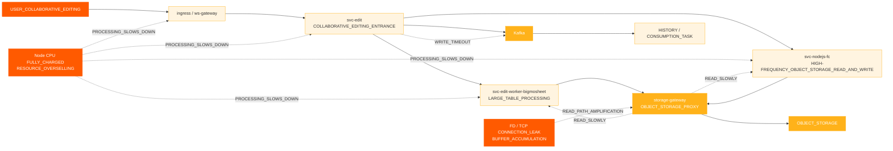
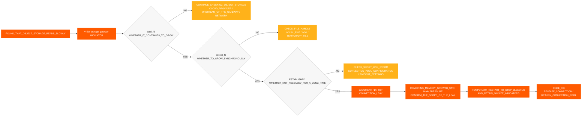
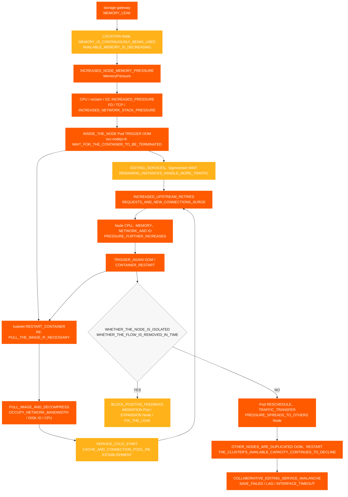

# 共同編集インシデント

[← ShimoDocs Suite デプロイメント文書](../README.md)

## 1. ケースの背景 

大手企業の環境において、共同編集の利用不可タイプのインシデントが発生し、一部のスプレッドシートやドキュメントにおけるユーザーの通常の編集および保存に影響が生じた。インシデント発生中、ユーザーは保存失敗、編集の遅延、 Kafka 書き込みタイムアウトなどの現象に直面し、サービス側ではオブジェクトストレージの読み取り遅延、ノードの異常使用、 CPU および異常な TCP/FD指標などの問題も発生した。 

このケースは、共同編集の利用不可が必ずしも編集サービス自体によって直接引き起こされるわけではないことを示している。それは、基盤リソースの過剰販売、ノードの集中スケジューリング、ミドルウェア書き込みの遅延、オブジェクトストレージ読み取りパスの異常、または接続漏れなどの問題によって集合的に増幅されることもあり得る。 

## 2. インシデントの現れ 

このインシデントの主な影響は以下の通りです： 

- 共同編集リンクが利用できなくなったり、遅延したり、インターフェースのタイムアウトが発生した。 
- 一部のスプレッドシートやドキュメントが正常に保存できなかった。 
- 編集側のポップアップが表示された。 `Kafka write timeout`. 
- オブジェクトストレージの読み取り時間が増加し、編集リンクの処理にさらに影響を与えた。 
- Podの監視は正常に見えたが、ユーザーは保存失敗、編集の遅延、インターフェースのタイムアウトを継続的に報告した。 

## 3. 予備調査プロセス 

### 3.1 ユーザー現象から編集リンクへ 

顧客はまず一部のドキュメントの異常を報告したため、初期調査は共同編集の問題に焦点を当てた： 
1. 編集および保存リンクを確認してください。 
2. 関連するサービスログを確認してください。 

3. サービス状況を確認 Kafka ステータスを書きます。 
4. オブジェクトストレージの読み取り/書き込み遅延を確認してください。 

調査中に、2つの大きな異常が見つかりました: 

- `Kafka write timeout` 編集リンクで発生しました。 
- オブジェクトストレージの読み取り遅延の異常。 

### 3.2 外部依存関係の予備確認 

調査中、外部依存関係の所有者に個別に確認しました: 

- オブジェクトストレージ側で確認しましたが、クラウドプロバイダー側には明らかな問題は見つかりませんでした。 
- 運用側で確認しましたが、 Kafka クラスター側には明らかな問題は見つかりませんでした。 Kafka  

したがって、その問題はオブジェクトストレージ自体に直接起因するものではありません Kafka サービス自体、さらに調査はローカルビジネスノード、ゲートウェイ、接続プール、ネットワーク、およびリソース層に向けて続ける必要があります。 

### 3.3 ポッド監視からノード監視への移行 

最初に、Podの監視を確認する際、両方 CPU とメモリは比較的安全な範囲内でしたが、顧客はノードのCPUが最大になっていると報告しました。 

これは現在の診断における重要な転換点でした： 

- リソースの過剰割り当て下では、Podの監視はノードの負荷を正確に反映しない場合があります。 
- ノードが CPU 最大化されると、コンテナ内の業務処理能力は低下します。 
- 業務処理が遅くなると、さらにオブジェクトストレージの読み取りが遅くなるなどの形で現れます Kafka は、書き込み、リクエストのバックログ、および保存失敗を示します。 

## 4. 障害影響チェーン 

## 5. 主な所見 

### 5.1 ノード CPU 異常 

複数のノードで順番に CPU 異常が発生しました： 
- '10.142.191.54' は18:20に例外を開始しました。 
- '10.76.176.65' は18:30に例外を開始しました。 
- '10.76.238.202' は18:40に例外を開始しました。 
- '10.142.206.216' は18:42に異常を開始しました。 
- '10.142.175.191' は18:45に異常を開始しました。 

最初の異常は '10.142.191.54' であり、その後他のノードに問題が発生していることが確認でき、これは単一ポイントのリソース異常が複数ノードに広がる特性と一致します。 CPU  

### 5.2 CPU およびメモリ過剰販売 

障害前後のリソース過剰販売は以下の通りです： 

| シナリオ | リソース | クラスタ容量 | 総リクエスト | リクエスト割合 | 制限合計 | 過剰販売 |
| --- | --- | --- | --- | --- | --- | --- |
| nodejs-fc pod 6 | CPU | 192 コア | 33.75 コア | 17.6% | 457 コア | 238.0% |
| nodejs-fc pod 6 | メモリ | 768 GiB | 57.24 GiB | 7.5% | 884 GiB | 115.1% |
| nodejs-fc pod 12 | CPU | 192 コア | 45.75 コア | 23.8% | 493 コア | 256.8% |
| nodejs-fc pod 12 | メモリ | 768 GiB | 81.24 GiB | 10.6% | 980 GiB | 127.6% |
| スケーリング後の nodejs-fc pod 12 | CPU | 320 コア | 45.75 コア | 14.3% | 493 コア | 154.1% |
| スケーリング後の nodejs-fc pod 12 | メモリ | 1280 GiB | 81.24 GiB | 6.3% | 980 GiB | 76.6% |

通常の状況では、 CPU オーバーサブスクリプションは、約150％で制御されている場合は比較的許容範囲です。このスケーリングの前に、 CPU オーバーサブスクリプションはすでに238％に達しており、スケールを倍にした後は256.8％に達し、トラフィック集中による急増の高いリスクをもたらします。 

### 5.3 Podスケジューリングの集中 

大企業の環境におけるデフォルトの K8s スケジューリング戦略は、残りのノードを使用する前に1つのノードを埋める傾向があります。サービスのローリングデプロイや一時的なスケーリングの間に、複数の高負荷サービスが少数のノードに集中しやすくなります。 

高リスクの組み合わせには以下が含まれます： 

- 複数 `svc-nodejs-fc` インスタンスが存在します。
- 同じノード上で `svc-edit-worker-bigmosheet` と `ingress` を同時に実行する。 
- オーバーレイ `storage-gateway` を使用すると、接続のリークやメモリの増加につながります。 

### 5.4 ストレージゲートウェイの接続とメモリリーク 

さらにノードの監視を確認した後 TCP および `storage-gateway` Pod のメトリクスでは、次のことが分かりました: 

- `total_fd` は増え続けています。 
- `socket_fd` は増え続けています。 
- TCP 接続が残っています `ESTABLISHED` 長時間。 
- 接続がタイムリーに解放されず、FDが接続プールに戻されません。 
- ポッド RSS / ワーキングセットが増え続け、リクレーム後も正常なレベルに戻らない場合。 

もし `total_fd`, `socket_fd`、およびメモリ使用量がすべて同時に継続的に増加する場合、それは接続が解放されず、メモリが継続的に増加していることを示しており、接続およびメモリリークとして対処すべきである。その際、ノードの `MemoryPressure` および OOM リスクに注意する。 

### 5.5 バージョン差異の影響 

旧バージョンでは、画像添付データは直接データテーブルに書き込まれていた。新しいバージョンでは、 MySQL 使用量とストレージコストを削減するために、画像添付情報はオブジェクトストレージのメタデータに書き込まれ、 `/x` オブジェクトストレージに直接アクセスする読み取りパスが使用される。 

プロキシモードでは、オブジェクトストレージキーの存在を判定する基盤関数が接続を正しく解放せず、接続リークを引き起こす。この問題は、リソースの過剰割り当てと集中スケジューリングと組み合わさることで、協調編集の利用不可の障害として拡大される。 

### 5.6 オブジェクトストレージおよびストレージゲートウェイの監視証拠 

問題がオブジェクトストレージ側にあるのか、ビジネスサービス側にあるのか、またはプロキシ層にあるのかを判断するために、オブジェクトストレージの比較調査を行う `storage-gateway` が実施されました: 

- オブジェクトストレージの読み取りレイテンシが増加しましたが、書き込みレイテンシは比較的正常なままで、異常は主に読み取り経路に集中していました。 
- CPU, RSS / ワーキングセット、およびメモリの増加率 `storage-gateway` ポッドは継続的に増加しました。 
- `total_fd` および `socket_fd` 成長し続け、 TCP 接続は `ESTABLISHED` しばらくの間その状態のままでした。 
- 接続がタイムリーに解放されず、FDが接続プールに戻されなかったため、メモリの圧迫や OOM ノード上でのリスクが発生しました。 
- オブジェクトストレージ側では、ビジネス異常の規模に見合うサーバー側の障害は見つからなかったため、調査の重点は次に優先された `storage-gateway` プロキシ読み取りパス。 

総合的な判断：オブジェクトストレージの読み取りが遅いのは、単にオブジェクトストレージサービスの障害によるものではなく、累積したFDの結果である。 TCP によって引き起こされる接続、メモリ、およびノードリソースの圧迫 `storage-gateway` 接続が解放されていません。 

### 5.7 FD/TCP リーク判定プロセス 

今回は、接続漏れがあることを確認するために、以下の判定チェーンが使用されました： `storage-gateway` 判定結論： 

の場合、 `total_fd`, `socket_fd`、数は `ESTABLISHED` 接続数およびPodのメモリ使用量が同じ時間帯に同期して増加する場合、主な原因は「接続が解放されずに発生するFD/TCP およびメモリリーク」と考えられます。オブジェクトストレージの読み取りが遅く、書き込みは正常で、上記の指標が同時に異常な場合は、まずプロキシの読み取りパスを確認するべきです。 

## 6. 根本原因の結論 

この故障の根本原因の連鎖は次のとおりです: 

1. そのクラスターは重要なものを持っています CPU オーバーコミット、付き CPU 特定のフェーズで250％を超えるオーバーコミット。 
2. サービスのローリングアップデートや一時的なスケーリングの際、Podのスケジューリングが集中し、単一ノードへのリソース負荷が過剰になる。 
3. 高負荷サービスは、例えば `svc-nodejs-fc`, `svc-edit-worker-bigmosheet`、および `ingress` のように、いくつかのノードに集中している。 
4. `storage-gateway` はオブジェクトストレージプロキシの読み取りパスで接続解放の問題があり、FD、 TCP 接続、およびメモリ使用量が継続的に増加している。 
5. メモリ圧迫後に OOM ノードで発生し、コンテナの再起動、イメージのプル、サービスのコールドスタート、および上流のリトライがさらに増加し、 CPU、ネットワーク、およびディスクI/Oの負荷を高め、オブジェクトストレージの読み取り遅延や Kafka 書き込み遅延を引き起こします。 
6. オブジェクトストレージの読み取り遅延および Kafka 書き込みタイムアウトは、最終的に共同編集の利用不可、保存失敗、編集遅延として現れます。 

## 7. ノードリソースアバランチ拡散図 

この障害に関係する業務サービスはすべて K8s クラスターで稼働しています。 `storage-gateway` のメモリリークは最初にそのノードの利用可能なメモリを消費し、その後、 OOMコンテナの再起動、イメージのプル、サービスのコールドスタート、および上流のリトライを通じて、リソース消費の正のフィードバックループを形成します。異常なPodが再スケジュールされるか、トラフィックが他のノードに移動すると、負荷は健全なノードへも広がり続け、最終的にクラスター全体でアバランチが発生します。 

図では、2つの増幅ループに注目する必要があります： 

1. **ノード内の正のフィードバックループ**: OOM → kubeletの再起動またはイメージのプル → コールドスタート → 上流リトライおよび新しい接続の増加 → CPU、メモリ、ネットワーク、およびディスクIOの負荷は引き続き上昇 → OOM 再び。 
2. **ノード間拡散ループ**：異常なノード上のPodは再スケジュールされ、Ingressトラフィックはシフトされるか、残りのインスタンスがリクエストを引き継ぐ → 正常なノードの負荷が増加 → 他のノードが OOM そして繰り返し再起動 → クラスターの利用可能容量は引き続き低下。 

## 8. 処理と修復 

### 8.1 短期的処理 

- 異常なIngressまたは異常ノードのゲートウェイトラフィックを削除し、高負荷経路への新たなトラフィックの流入を防止。 
- FDで異常サービスを再起動、 TCP、またはメモリが継続的に増大している。 
- 高負荷ノードから高負荷Podを移動または分散。 
- 完全に使用されているPodの追い出しまたはノードの隔離。 CPU. 
- ビジネスPodのスケールアップだけを避け、ノードリソースの補充を優先。 
- 迅速な障害対応能力を追加 `svc-edit` 同期インターフェースに対して、リクエストが長時間溜まるのを防止。 

### 8.2 長期的修復 

- オブジェクトストレージプロキシモードでKeyが存在するか確認する際に解放されない接続の問題を修正。 
- コアサービスのアンチアフィニティポリシーを設定し、高リスクサービスが同じノードに集中しないようにします。 
- リソースが枯渇した後もノードがコアサービスを実行し続けないよう、ノード退避ポリシーを設定します。 
- 確立 CPU およびメモリのオーバーサブスクリプション監視。 
- サービスをスケーリングする前に、顧客の環境リソースレベルを評価し、プロジェクトリーダーとスケーリング計画を確認する必要があります。 
- 以下のアラートを設定します。 OOM、FD、 TCP、遅いリクエスト、 Kafka バックログ、およびコアサービスのオブジェクトストレージ読み書き遅延。 

## 9. ケースレビュー結論 

この障害は、共同編集が利用できない場合、調査を編集サービスのログのみに限定すべきではないことを示しています。基盤となるノードのリソースがすでに完全に使用されている場合、業務サービス全体が遅くなり、書き込みタイムアウト、オブジェクトストレージ読み取りの遅延、保存失敗など、複数の上位レベルの症状として現れます。 Kafka 書き込みタイムアウト、オブジェクトストレージ読み取り遅延、および保存失敗。 

今後同様の問題を扱う際には、まずクラスタとノードのリソースを確認し、その後にミドルウェア、ビジネス監視、ログ、トレースリンクを順に確認するべきです。これにより、一つのサービスのログから調査を始めて局所的なトラブルシューティングのループに陥ることを避けられます。 

---
