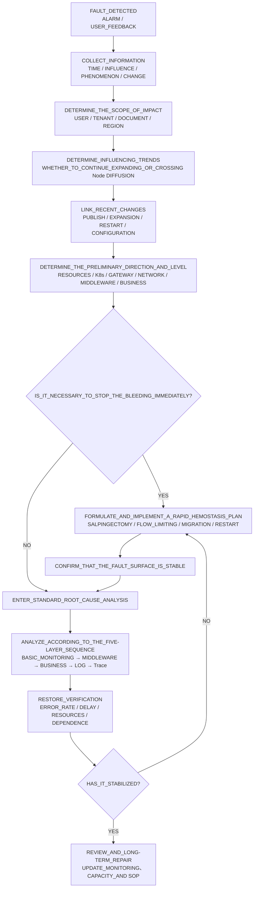
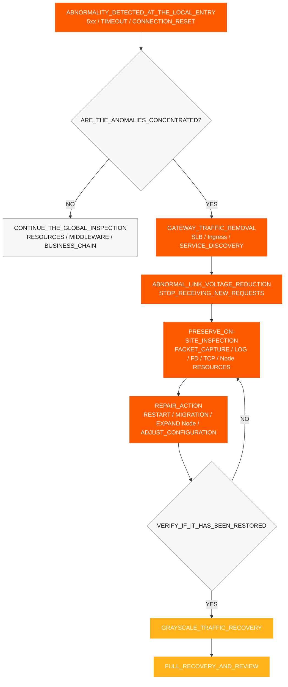
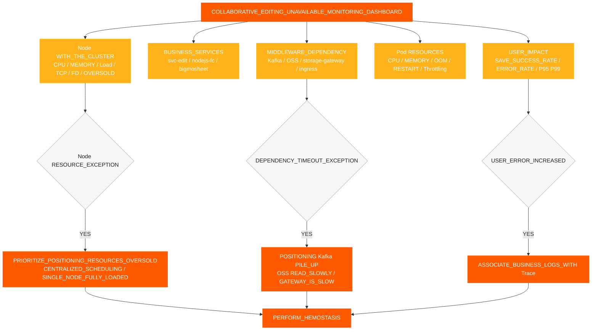
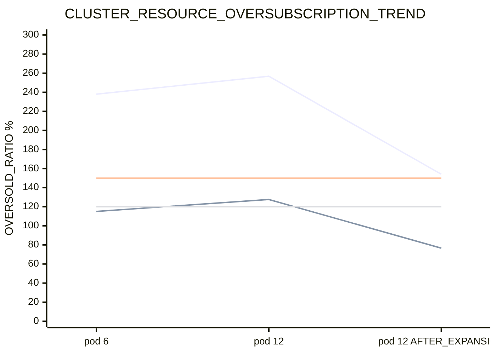
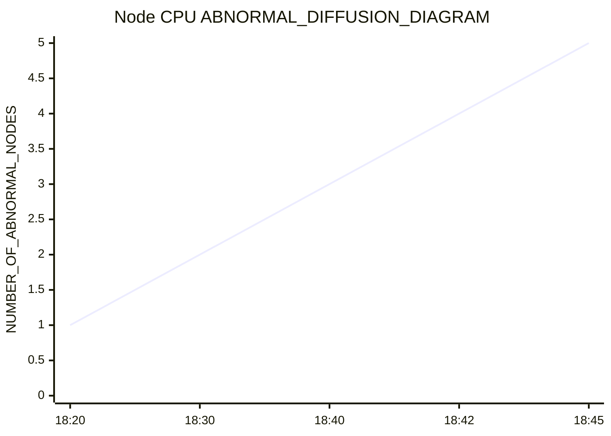
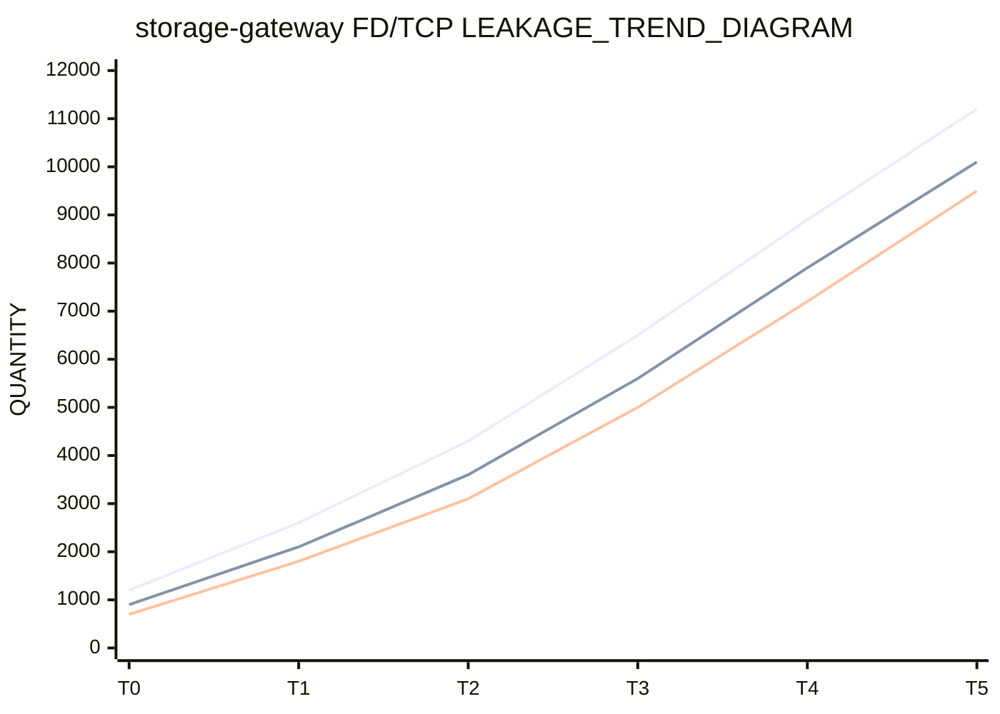
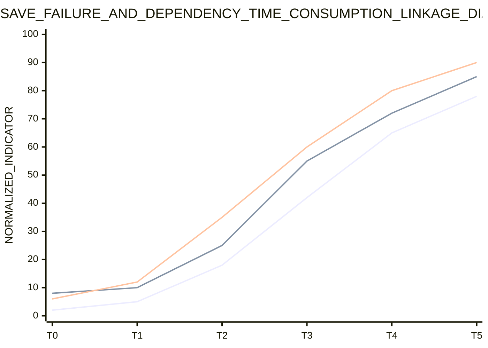
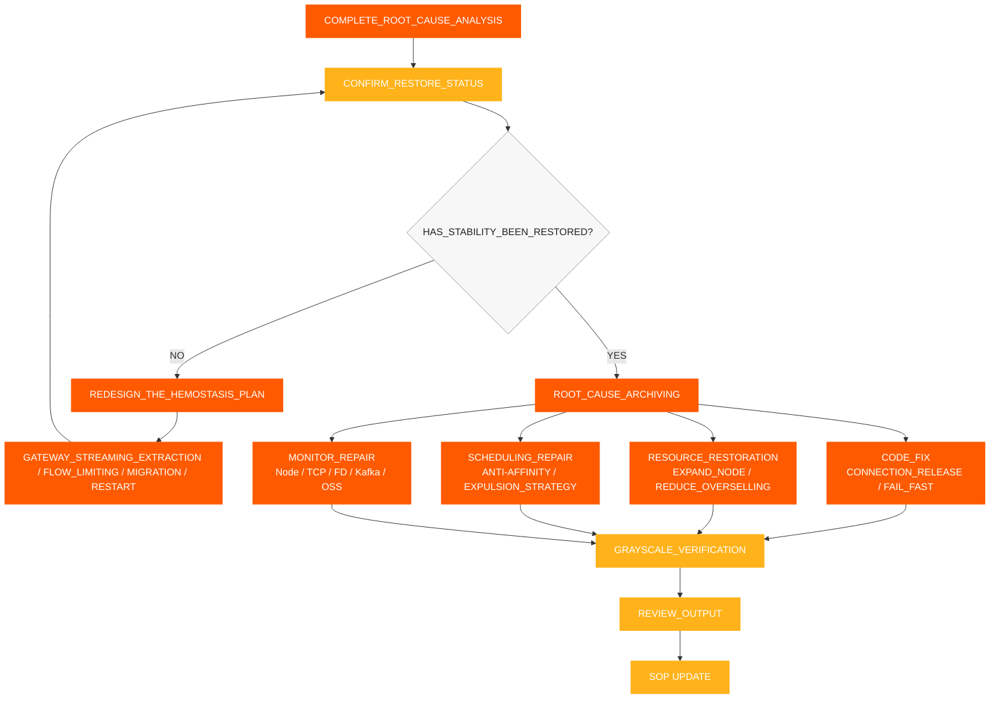

# インシデント対応 SOP

[← ShimoDocs Suite デプロイメント文書](../README.md)

## 1. 情報収集

故障を受け取った後、まず次の情報を記録してください:

- 発生時刻：最初の警告時間、最初の顧客からのフィードバック時間、リリースやスケーリングと重なるかどうか。
- 影響範囲: テナント、ドキュメントタイプ、ファイル数、ユーザー数、テーブルに集中しているか大きなテーブルか。
- 具体的な症状: 保存失敗、編集エラー、 Kafka タイムアウト、オブジェクトストレージ読み取りの遅延、 API タイムアウト。
- 最近の変更: サービスリリース、ローリング再起動、Podスケーリング、ノードスケーリング、ストレージまたは Kafka 変更。
- 主要サービス： `svc-nodejs-fc`, `svc-edit`, `svc-edit-worker-bigmosheet`, `storage-gateway`, `ingress`, `ws-gateway`.


## 2. 情報評価と障害分類

情報収集を完了した後、まず症状、指標、イベント、変更履歴に基づいて障害の範囲、発展傾向、および主な原因の方向性を判断し、その上で即時封じ込めが必要かどうかを決定します。判断結果は明確な結論として示されるべきであり、単一のPodや単一のログのみに依存してはなりません。

評価の主要ポイント:

- ユーザー影響範囲: ユーザー、テナント、文書タイプ、地域、影響を受けるサービス。
- 影響の現れ：保存の失敗、編集の遅延、 API タイムアウト、 Kafka 書き込みタイムアウト、オブジェクトストレージの読み取りの遅さ。
- 影響の傾向：拡大し続けるか、単一のPodまたはノードから複数のノードに広がるか。
- 変更の関連性: サービスリリース、Podのスケーリング、ノードのスケーリング、ローリング再起動、設定、またはミドルウェアの変更に関連しているかどうか。 
- 予備的な方向性: リソース、 K8s コントロールプレーン、ゲートウェイ、ネットワーク、ミドルウェア、ビジネスコード、またはデータの問題。 

判断結果に基づいて障害のレベルを決定する: 

| レベル | 判断基準 | 対応対象 | 
| --- | --- | --- | 
| P0 | 広範囲での編集不可、継続的な保存失敗、コアサービスでのバッチ異常 | 15分以内に影響を止め、30分以内に主原因の方向性を明確にする | 
| P1 | 一部のテナント、一部のドキュメント、一部のノードに異常、エラー率が大幅に増加 | 30分以内に異常リンクを特定し、60分以内に安定性を回復する | 
| P2 | 単一ポイントまたは小規模な遅延リクエスト、時折の保存失敗 | 1営業日以内に原因確認と修正計画を完了する | 

判断結論は少なくとも3つの質問に答えるべきである：現在の影響はどの程度か、障害は拡大しているか、まず応急処置を行うべきか、それとも直接根本原因分析に進むべきか。 




## 3. 迅速な止血

ユーザー側が引き続き障害を起こす場合、または判定結果が障害が拡大していることを示す場合、まず封じ込めの処置を行い、その後に詳細な分析を続けます。封じ込めの目的は、障害の範囲を縮小し、リソースの正のフィードバックを阻止しつつ、障害の現場を可能な限り保持することです。

1. 異常なゲートウェイからのトラフィックを削除する, SLB バックエンド、Ingress エントリ、サービスインスタンス、またはノードが、新しいリクエストが異常パスに進み続けるのをブロックします。
2. 異常なノードをスケジュール不可または隔離状態に設定して、Podが高負荷のノードにスケジュールされ続けるのを防ぎます。
3. ポッドを再起動して、 OOM、継続的なメモリ増加、または FD/ を経験している場合TCP リーク、優先して `storage-gateway`, `svc-nodejs-fc`、および `svc-edit-worker-bigmosheet`.
4. 高負荷のPodを分散して回避する `nodejs-fc`, `bigmosheet`, `ingress`、および `storage-gateway` 同じノードに集中していること。
5. 無効なビジネスポッドのスケーリングを一時停止し、ノードのスケーリングや利用可能なリソースの回復を優先する。
6. コールドスタート後に新しい接続の急増を防ぐため、上流の再試行、接続作成、およびリクエスト蓄積に対してレート制限または高速失敗を実装する。
7. ノードを記録する CPU、メモリ、 OOM、FD、 TCP、エラー率、およびインターフェースの遅延を出血停止前後で記録する。

### 3.1 ゲートウェイトラフィック除去

障害が異常なローカルノード、ローカルゲートウェイエントリ、またはローカルサービスインスタンスとして現れる場合、まず異常なエントリトラフィックを削除し、その後ノードとPodに対処する必要があります。トラフィック削除の目的は、障害のあるリンクへの負荷を軽減し、異常なインスタンスが新しいリクエストを受け続けるのを防ぐことです。 

トリガー条件: 

- 特定のIngress、 SLB バックエンド、ゲートウェイPod、またはノードのエラー率が他のインスタンスよりも著しく高い場合。 
- ゲートウェイの5xxエラー、アップストリームタイムアウト、接続リセットが特定のエントリポイントに集中している場合。 
- 特定のノード CPU、ロード、 TCP、およびFDメトリクスが明らかに異常で、新しいリクエストが引き続き送られている場合。 
- コアリンクインスタンスなど `svc-edit`, `ws-gateway`、および `storage-gateway` は既に減速しています。 

実行するアクション: 

1. 異常なバックエンドを削除する SLB、Ingress、ゲートウェイルーティング、またはサービスディスカバリから。 
2. 新しいPodがスケジュールされるのを防ぐために、異常なノードを一時的にスケジュール不可としてマークします。 
3. トラフィックが削除されたノードまたはインスタンスでパケットキャプチャ、ログ、FD/TCP、およびリソースチェックを実行します。 
4. 再起動、移行、スケーリング、または構成修復を完了した後、まず少量のトラフィックで復元し、その後完全に復元します。 
5. 復元前に、エラー率、インターフェース応答時間、ノード CPU、および TCP/FDメトリクスが正常に戻っていることを確認します。 




## 4. 標準的な根本原因分析プロセス

迅速な止血を完了し、障害面が安定していることを確認した後、根本原因分析を進めます。標準的なトラブルシューティングの手順は、『下から上へ、粗から細へ』の方法で行います。

1. 基本監視: クラスターリソース、ノード、Podリソース。
2. ミドルウェア監視: Kafkaオブジェクトストレージ、ゲートウェイ、ネットワーク。
3. ビジネス監視: 保存成功率、インターフェース応答時間、エラー率。
4. ログ監視: エラーログ、タイムアウトログ、 OOM/再起動ログ。
5. トレースリンク追跡: リクエストリンク、遅延呼び出し、例外スパン。

主要要件:

- 各レイヤーはまず判断結論を出力し、その後次のレイヤーに入ります。
- まずNodeを見てからPodを見る; まず全体のトレンドを見てから、単一サービスのログを見る。
- 特定のレイヤーで異常が検出されなかったからといって、後続のレベルをスキップしてはいけない。
- モニタリング、ログ、トレースは、同じ時間ウィンドウ、Pod、Node、トレースIDを使って相関させる必要がある。

各レイヤーは、1つの核心的な質問に答えるだけである:

- 基本モニタリング: リソースはすでに不足しているか、過剰販売、集中スケジューリング、ノード間分散が発生しているか？
- ミドルウェアモニタリング: 遅延、バックログ、リクエスト拒否、接続異常はあるか？
- ビジネスモニタリング: どのサービス、 API、または文書タイプがユーザーへの影響に対応しているか？
- ログ監視: エラー、タイムアウト、 OOM、再起動、または接続プールの枯渇の明確な証拠はありますか？
- トレースリンクの追跡: 失敗したリクエストは正確にどこで止まったのか—どのサービス、ノード、またはスパンでか？ 


### 4.1 基本的な監視トラブルシューティング 

Podの次元だけでなく、Nodeの次元を優先して確認します。リソースが過剰に割り当てられている場合、Pod監視は安全な範囲内の値を示すかもしれませんが、ノードはすでにフルに使用されている可能性があります。 

確認項目: 

- クラスター全体 CPU およびメモリ容量および利用可能容量。 
- ノード CPU、メモリ、負荷、ディスク、ネットワーク。 
- ポッド CPU、メモリ、再起動、 OOM, CPU スロットリング。 
- 複数の高 CPU または高IOサービスが単一ノードに集中しているかどうか。 
- ローリングリリース後に、Podが主に最初の数個のノードにスケジュールされるかどうか。 
- アンチアフィニティおよび退避ポリシーが欠如しているかどうか。 

主要な判断事項: 

- 合計が CPU クラスタあたりのリミット / CPU 容量が150％を超えるかどうか。 
- 合計メモリリミット / クラスタメモリ容量が120％を超えるかどうか。 
- あるノードが最初に障害を起こし、他のノードが徐々に使用量が増加するプロセスがあるかどうか。 CPU 使用量。 


### 4.2 ミドルウェア監視トラブルシューティング 

ミドルウェアのトラブルシューティングは主に Kafka、オブジェクトストレージ、ゲートウェイ、およびネットワークに焦点を当てる。 Kafka の具体的な判断は次の通りである; オブジェクトストレージの詳細な指標と判断項目、 `storage-gateway`、ゲートウェイ、およびネットワークは、セクション9.7および関連チェックリストに一律に記録されます。 

#### 4.2.1 Kafka 

確認項目: 

- プロデューサー書き込みのレイテンシーと失敗率。 
- トピックのバックログ。 
- ブローカー側 CPU、ディスク、ネットワーク、およびリクエストのレイテンシー。 
- クライアントからの再送、パケットロス、または接続の混雑があるか。 Kafka. 
- 業務側の書き込み時にのみタイムアウトが発生し、運用側に明らかな異常がないか。 Kafka 運用側。 

判定ロジック： 

- 運用側に異常がない場合、 Kafka 業務側で引き続き書き込みタイムアウトが発生する場合は、業務ノード、 CPUネットワークの混雑、およびクライアントの処理能力を確認することに注力する。 
- もし Kafka バックログや業務エラーが同時に発生する場合、まずバックログが上流サービスの処理遅延によって引き起こされているかどうかを確認します。 


### 4.3 業務モニタリング、ログ、およびトレース 

#### 4.3.1 業務モニタリング 

顧客の現象に基づき異常なリンクを確認します： 

1. 保存失敗が特定のテーブル、大きなテーブル、または特定の文書タイプに集中しているかどうか。 
2. 編集インターフェースでタイムアウト、リクエスト遅延、またはエラー率の増加が発生しているかどうか。 
3. 次のことを確認してください `Kafka write timeout` が発生するかどうか。 
4. オブジェクトストレージの読み取りが遅く、書き込みが正常かどうかを確認します。 
5. 次のことを確認してください `bigmosheet operation oss_get` が5秒を超えるかどうか。 
6. WebSocket、共同編集、履歴、オブジェクトストレージ関連サービスで同時にレイテンシが増加しているかどうかを確認します。 

#### 4.3.2 ログ監視 

確認すべきキーログ： 

- 編集保存失敗のログ。 
- のログ Kafka 書き込みタイムアウト。 
- 遅いオブジェクトストレージの読み書きのログ。 
- のログ OOM再起動、接続プールの枯渇、およびFD枯渇。 
- ゲートウェイの5xxエラー、アップストリームタイムアウト、および接続リセットのログ。 

#### 4.3.3 トレースリンク追跡 

トレースを使用して1つの失敗したリクエストを追跡する: 

- リクエストがゲートウェイ、協働編集、オブジェクトストレージ、 Kafkaまたは履歴消費チェーンで停滞しているか確認する。 
- 任意のスパンに異常な遅延がないか確認する。 
- 遅い呼び出しが特定のサービス、ノード、またはドキュメントの種類に集中しているか確認する。 
- 失敗したリクエストと通常のリクエストのリンクの違いを比較する。 


## 5. 回復確認 

止血作業を完了した後、次の指標を確認する必要があります: 

- 削除されたゲートウェイエントリ、 SLB バックエンド、または異常なインスタンスが新しいトラフィックを受信していないこと。 
- 保存成功率が正常に戻っていること。 
- 編集インターフェイスのエラー率が減少していること。 
- Kafka 書き込みレイテンシが正常に戻っていること。 
- Kafka バックログが減少していること。 
- オブジェクトストレージの読み取りレイテンシが正常に戻っていること。 
- ノード CPU、メモリ、およびロードが減少していること。 
- `storage-gateway` FDおよびソケットFDがもはや連続的に増加していないこと。 
- 異常ノードがもはや拡散していないこと。 
- グレースケールリリース中にトラフィックを復元した後、ゲートウェイの5xx、アップストリームタイムアウト、および接続リセットが再び増加していないこと。 


## 6. 監視およびアラート要件 

次のアラートを完了する必要があります: 

- ノード CPUメモリ、ロード、ディスク、およびネットワークアラート。 
- ノード TCP 接続数、再送、パケットロス、および `ESTABLISHED` 接続数の警告。 
- ポッド OOM、再起動、および CPU 制御の警告。 
- コアサービス OOM 警告。 
- CPU 過剰販売アラート: CPU 制限 / クラスター CPU 容量が150％を超えるかどうか。 
- メモリ過剰販売アラート: メモリ制限 / クラスターのメモリ容量が120％を超えています。 
- Kafka バックログアラート。 
- Kafka 書き込みタイムアウトアラート。 
- 編集保存失敗エラーログアラート。 
- `bigmosheet operation oss_get > 5s` アラート。 
- `storage-gateway` FDおよびソケットFDが継続的に増加しているアラート。 
- `storage-gateway` RSS / 作業セットが継続的に増加しており、ノード `MemoryPressure` アラート。 


## 7. 主要指標モニタリングダッシュボード 

このセクションは補助ツールであり、メインのプロセス順序を変更するものではありません。ダッシュボードは傾向を観察し方向性を特定するために使用され、 `kubectl`, `jq`や PromQL は具体的な証拠を取得するために使用されます。現場での調査は、第9章の詳細なチェックリストに従い、各項目を実行し結論を記録する必要があります。 

### 7.1 ダッシュボードの階層化 

協調編集が使用できない障害のダッシュボードは5層に分け、調査時には上から下に層ごとに確認することを推奨します。 

| 層 | ダッシュボード名 | 主要指標 | 目的 |
| --- | --- | --- | --- |
| L1 | ユーザー影響ダッシュボード | 保存成功率、編集エラー率、インターフェース P95/P99、オンライン協調接続 | ユーザーが実際に影響を受けているかを判断する |
| L2 | ビジネスサービスダッシュボード | QPSエラー率、レイテンシ、再起動回数 `svc-edit`, `svc-nodejs-fc`, `bigmosheet` | 異常が集中しているビジネスサービスを特定する |
| L3 | ミドルウェアダッシュボード | Kafka 書き込みレイテンシ Kafka バックログ、オブジェクトストレージの読み書きレイテンシ、上流ゲートウェイレイテンシ | 依存関係が遅延しているかを判断する |
| L4 | コンテナリソースダッシュボード | Pod CPU、メモリ、 OOM再起動 CPU スロットリング | コンテナ自体が異常かを判断する |
| L5 | ノードおよびクラスタダッシュボード | ノード CPUメモリ、負荷 TCPFD、過剰に割り当てられたリソース、Podの分布 | 基盤リソースがビジネス運用をサポートしているかを判断する |

### 7.2 主要指標概要チャート



### 7.3 リソース過剰割当のトレンドチャート

このチャートは、〜かどうかを観察するために使われます CPU およびメモリのオーバーコミットは、拡張前後のハイリスク領域に入ります。実際のダッシュボードでは、設定することが推奨されます CPU 150%のオーバーコミットメントおよびメモリオーバーコミットメント120%をアラート閾値線として設定。



### 7.4 ノード CPU 拡散傾向グラフ

このチャートは、単一のノードが最初に故障し、その後他のノードが徐々に影響を受ける拡散特性があるかどうかを観察するために使用されます。



### 7.5 FD/TCP リークトレンドチャート

このチャートは、 `storage-gateway` に接続やFDのリークがあるかどうかを確認するために使用されます。 `total_fd`, `socket_fd`、および数が `ESTABLISHED` すべての接続が同時に連続して増加する場合、接続のリークを優先的に対処する必要があります。



### 7.6 ビジネスエラーと依存関係遅延の相関チャート

このチャートは、ユーザー側の保存失敗が書き込み遅延やオブジェクトストレージの読み取り遅延の増加と相関しているかどうかを確認するために使用されます。 Kafka 同一の時間ウィンドウ内でこれら三つすべてが同時に増加する場合、ビジネスノードの処理能力と依存関係チェーンの混雑状況の確認を優先すべきです。



### 7.7 推奨アラーム閾値

| メトリック | 推奨しきい値 | トリガー後のアクション |
| --- | --- | --- |
| 成功率を保存 | 連続5分間99%未満 | 業務影響の確認、エラーログとトレースを関連付け |
| インターフェースを編集 P95 | ベースラインの2倍以上が5分連続 | 確認 `svc-edit`, `nodejs-fc`, `bigmosheet` |
| Kafka 書き込み遅延 | ベースラインの2倍以上または書き込みタイムアウトが発生 | 確認 Kafka バックログ、ビジネスノード CPU、ネットワーク再送 |
| Kafka バックログ | 10分間の継続的な増加 | コンシューマタスクと上流書き込み速度を確認 |
| OSS 読み取り遅延 | P95 5秒を超える | 確認 `storage-gateway`、ネットワーク、オブジェクトストレージ側 |
| ノード CPU | 90％を超える状況が5分連続 | Podの分布を確認、 CPU オーバーコミット、高負荷サービス |
| CPU オーバーコミット | 150％を超える | ビジネスPodのスケーリングを一時停止し、Nodeスケーリング評価を優先 |
| メモリオーバーコミット | 120％を超える | 確認 OOM、追放リスク、メモリリーク |
| `total_fd` / `socket_fd` | 10分間単調増加 | FDを確認/TCP 漏れがあれば必要に応じて再起動し出血を止める |
| TCP 再送信率 | ベースラインより2倍高い | パケットロス、輻輳、ウィンドウの問題を確認するためにパケットをキャプチャする |
| Podの再起動 / OOM | 任意のコアサービスが発生する | ログの即時関連付けと変更のリリース |

### 7.8 ノード CPU およびメモリオーバーサブスクリプションクエリコマンド

次のコマンドは、ビジネスが実行されるシナリオに適用されます K8s クラスタ。実行する前に、現在のkubeconfigが問題のあるクラスタに切り替わっていることを確認し、 `NODE_NAME` を対象ノード名に置き換えてください。

#### 7.8.1 ノード実際の確認 CPU およびメモリ使用量

```bash
# View the real-time CPU and memory usage of all Nodes
kubectl top nodes

# View the real-time usage of the specified Node
kubectl top node "$NODE_NAME"

# View the node's capacity, allocatable resources, and pressure status
kubectl describe node "$NODE_NAME" | sed -n '/Capacity:/,/Allocatable:/p'
kubectl describe node "$NODE_NAME" | sed -n '/Conditions:/,/Addresses:/p'

# Directly view the CPU/memory Requests, Limits, and usage ratio allocated to the Node
kubectl describe node "$NODE_NAME" | sed -n '/Allocated resources:/,/Events:/p'
```

主な焦点: `CPU%`, `MEMORY%`, `MemoryPressure`, `DiskPressure`, `PIDPressure`. 実際の使用率が90%を超えた場合、Podの分布やゲートウェイトラフィックの削除に基づいて、出血制御が必要かどうかを直ちに判断する必要があります。

#### 7.8.2 指定されたノードの統計、メモリRequestおよびLimit CPU

```bash
# Statistics of CPU/memory requests and limits for all Pod containers on the specified Node.
# Dependencies: kubectl, jq; memory is uniformly converted to MiB, CPU is uniformly converted to cores.
NODE_NAME="<TARGET_NODE_NAME>"

kubectl get pods -A --field-selector "spec.nodeName=${NODE_NAME}" -o json | jq '
  def cpu_core:
    if . == null then 0
    elif endswith("m") then (rtrimstr("m") | tonumber / 1000)
    else tonumber
    end;
  def mem_mib:
    if . == null then 0
    elif endswith("Ki") then (rtrimstr("Ki") | tonumber / 1024)
    elif endswith("Mi") then (rtrimstr("Mi") | tonumber)
    elif endswith("Gi") then (rtrimstr("Gi") | tonumber * 1024)
    elif endswith("Ti") then (rtrimstr("Ti") | tonumber * 1024 * 1024)
    elif endswith("K") then (rtrimstr("K") | tonumber / 1024)
    elif endswith("M") then (rtrimstr("M") | tonumber)
    elif endswith("G") then (rtrimstr("G") | tonumber * 1024)
    elif endswith("T") then (rtrimstr("T") | tonumber * 1024 * 1024)
    else (tonumber / 1024 / 1024)
    end;
  [ .items[]
    | ([(.spec.containers[]?, .spec.initContainers[]?) | .resources.requests.cpu? // "0"] | map(cpu_core) | add) as $cpu_req
    | ([(.spec.containers[]?, .spec.initContainers[]?) | .resources.limits.cpu? // "0"] | map(cpu_core) | add) as $cpu_limit
    | ([(.spec.containers[]?, .spec.initContainers[]?) | .resources.requests.memory? // "0"] | map(mem_mib) | add) as $mem_req
    | ([(.spec.containers[]?, .spec.initContainers[]?) | .resources.limits.memory? // "0"] | map(mem_mib) | add) as $mem_limit
    | {cpu_request: $cpu_req, cpu_limit: $cpu_limit, mem_request_mib: $mem_req, mem_limit_mib: $mem_limit}
  ]
  | {
      cpu_request_core: (map(.cpu_request) | add),
      cpu_limit_core: (map(.cpu_limit) | add),
      mem_request_mib: (map(.mem_request_mib) | add),
      mem_limit_mib: (map(.mem_limit_mib) | add)
    }'
```

注意: 公式のスケジューリング計算では、最大値を取るルールを使用します。 K8s . 上記のコマンドは現場での迅速な概要確認に使用され、明らかな過剰割り当てを検出するのに適しています。リソースダッシュボードやスケジューラのデータと照合する場合は、プラットフォームが提供するノードリソース統計を基準として使用する必要があります。 `initContainers` 

#### 7.8.3 クラスターの計算 CPU およびメモリ過剰割り当て比率 

```bash
# Get the total Allocatable resources of all nodes in the cluster
kubectl get nodes -o json | jq '
  [ .items[].status.allocatable
    | {
        cpu_core: (if (.cpu | endswith("m"))
                   then (.cpu | rtrimstr("m") | tonumber / 1000)
                   else (.cpu | tonumber)
                   end),
        memory_bytes: (.memory | rtrimstr("Ki") | tonumber * 1024)
      }
  ]
  | {
      cpu_allocatable_core: (map(.cpu_core) | add),
      memory_allocatable_gib: (map(.memory_bytes) | add / 1024 / 1024 / 1024)
    }'

# Summarize the CPU/memory limits of all Pods for calculating the overcommit ratio
kubectl get pods -A -o json | jq '
  def cpu_core:
    if . == null then 0
    elif endswith("m") then (rtrimstr("m") | tonumber / 1000)
    else tonumber
    end;
  def mem_gib:
    if . == null then 0
    elif endswith("Ki") then (rtrimstr("Ki") | tonumber / 1024 / 1024)
    elif endswith("Mi") then (rtrimstr("Mi") | tonumber / 1024)
    elif endswith("Gi") then (rtrimstr("Gi") | tonumber)
    else (tonumber / 1024 / 1024 / 1024)
    end;
  [ .items[] | .spec.containers[]?
    | {
        cpu_limit_core: (.resources.limits.cpu? // "0" | cpu_core),
        memory_limit_gib: (.resources.limits.memory? // "0" | mem_gib)
      }
  ]
  | {
      cpu_limit_core: (map(.cpu_limit_core) | add),
      memory_limit_gib: (map(.memory_limit_gib) | add)
    }'
```

計算式: `CPU overcommit ratio = Total CPU Limits of all Pods / Total CPU Allocatable of all Nodes × 100%`; `Memory overcommit ratio = Total Memory Limits of all Pods / Total Memory Allocatable of all Nodes × 100%`. 取得することを推奨します CPU 150% のオーバーコミットと 120% のメモリオーバーコミットを高リスクの参照ラインとして設定しますが、最終的な閾値は顧客の環境ベースラインに従って決定する必要があります。 

#### 7.8.4 Prometheus / Grafana クエリ文

```promql
# Cluster CPU Limit Oversubscription Rate
100 * sum(kube_pod_container_resource_limits{resource="cpu", unit="core"})
  / sum(kube_node_status_allocatable{resource="cpu", unit="core"})

# Cluster Memory Limit Overcommit Rate
100 * sum(kube_pod_container_resource_limits{resource="memory", unit="byte"})
  / sum(kube_node_status_allocatable{resource="memory", unit="byte"})

# View CPU Limit Overcommit Rate by Node
100 * sum by (node) (kube_pod_container_resource_limits{resource="cpu", unit="core"})
  / on (node) kube_node_status_allocatable{resource="cpu", unit="core"}

# View Memory Limit Oversubscription Rate by Node
100 * sum by (node) (kube_pod_container_resource_limits{resource="memory", unit="byte"})
  / on (node) kube_node_status_allocatable{resource="memory", unit="byte"}

# Node Actual CPU Usage
100 * (1 - avg by (instance) (rate(node_cpu_seconds_total{mode="idle"}[5m])))

# Node actual memory usage
100 * (1 - node_memory_MemAvailable_bytes / node_memory_MemTotal_bytes)

# K8s node memory pressure status, 1 indicates MemoryPressure=True
kube_node_status_condition{condition="MemoryPressure", status="true"}
```

リソースメトリック `unit` および `node` Prometheus のタグ名が上記の文と一致しない場合、調整を行う前にまずメトリック詳細で実際のタグを確認する必要があります。オーバーサブスクリプション比率はリソース宣言の潜在的リスクを示すことはできますが、Node の実際の評価に代わるものではありません。 CPU、メモリ、 OOM、および `MemoryPressure`.


## 8. レビューと長期的な是正ループ




## 9. 詳細検査チェックリスト 

このチェックリストは「ユーザー現象 → 基本リソース →」の順で実行されます K8s → ミドルウェア → ログとリンク → クローズドループ処理。各項目は、レビューなしで「正常/異常」だけを記録するのを避けるため、観察時間、異常対象、指標のスクリーンショットまたはクエリ結果を記録する必要があります。 

### 9.1 現象と影響範囲の確認 

| 検査対象 | 確認項目 | 異常判定 | 現場記録 / 結論 |
| --- | --- | --- | --- |
| ユーザー影響 | 共同編集不可、保存失敗、編集遅延、インターフェースタイムアウト | 複数ユーザー、テナント、またはドキュメントが同時に異常、業務障害と判断 | |
| 障害範囲 | テーブル、大きなスプレッドシート、特定のドキュメントタイプ、特定のテナント、または特定の地域に集中していますか？ | 明らかな集中がある場合は、サービスルート、データタイプ、またはノードでのグループ化を優先する | |
| エラーの現れ | 'kafka writes timeout'、ゲートウェイ5xx、接続リセット、上流タイムアウトが発生するかどうか | 同じ時間帯に複数種類のエラーが同時に発生する場合は、公共依存関係およびリソース層を優先する | |
| 時間の相関 | 最初のアラート、最初のフィードバック、指標異常の開始のタイミング | リリース、スケーリング、ローリング再起動、または構成変更と重なる場合は、変更の注文番号を記録する | |
| 影響の規模 | 失敗リクエストの量、失敗率、オンライン協調接続数、影響を受けたサービスおよびレプリカ | 衝撃が拡大し続ける場合は、障害レベルをアップグレードし、まず出血を止める | |

### 9.2 基本項目監視: ノード 

| 監視対象 | 主要指標 | 重要な判断 | 推奨アクション | 現場記録 / 結論 |
| --- | --- | --- | --- | --- |
| CPU 使用状況 | ノード CPU 使用率、Load 1/5/15 CPU steal、iowait、soft interrupt | CPU 常に >90%、ロードがコア数に近いまたは超えている、iowait/ソフト割り込みの異常増加 | 高負荷のPodを確認し、必要に応じてトラフィックを削除、Podを移動、またはノードをスケール | |
| メモリ使用量 | 使用済み、使用可能 RSS、ページフォルト、スワップ OOM 停止 | 使用可能量が継続的に減少、スワップ使用 OOM、メモリ再利用圧力の増加 | メモリリークと高メモリPodを確認、確認 `MemoryPressure`、必要に応じてノードを隔離 | |
| メモリの過剰割り当て | メモリ制限/割り当て可能量、メモリ要求/割り当て可能量 | メモリ制限が120％を超えている、または要求が過度に集中している | ビジネスのスケーリングを一時停止し、ノードの追加を優先、高リスク制限を減らすかPodを分散 | |
| CPU 過剰コミット | CPU 制限/割り当て可能量、 CPU 要求/割り当て可能量 | CPU 制限が150％を超えている、または高負荷Podが同じノードに集中している | リソース構成、アンチアフィニティ、レプリカ分布の調整 |  |
| TCP 接続 | 合計 TCP 接続、 `ESTABLISHED`, `TIME_WAIT`, `CLOSE_WAIT`再送率 | 接続数が継続的に増加、 `CLOSE_WAIT` 長時間解放されず、再送率が上昇 | 接続リーク、接続プール、ネットワーク輻輳、および異常クライアントを特定する |  |
| netstat / ソケット | ソケットの総数、リッスンポート、Recv-Q、Send-Q、接続失敗数 | Recv-Q / Send-Q が継続的に蓄積する、またはリッスンキューがオーバーフローする | パケットキャプチャ、サービス接続プール、カーネルパラメータでトラブルシュートする |  |
| FD | FD総数、ソケットFD、プロセスFD使用量 `file-nr` | `total_fd`, `socket_fd` 単調増加している、またはプロセス制限に近づいている | 現在の状態を保存し、リークしているサービスを再起動し、接続解放ロジックを修正する |  |
| ディスク | ファイルシステム使用量、inode、ディスクスループット IOPS、await、util、書き込みレイテンシ | ディスクフル、inodeフル、await / util が持続的に高い | 一時ファイルやログをクリーンアップし、ディスクを拡張し、イメージの抽出およびログの書き込みを確認する |  |
| ネットワーク | NIC 帯域幅、パケット損失、誤ったパケット、再送、ソフト割り込み、接続追跡テーブル | 帯域幅が完全に使用され、パケット損失/再送が増加、接続追跡が限界に近づく | イメージのプル、ノード間トラフィック、ゲートウェイトラフィック、ネットワークポリシーを確認する |  |
| ノードステータス | `Ready`, `MemoryPressure`, `DiskPressure`, `PIDPressure` | 任意のプレッシャーステータスがTrue、またはノードがNotReady | まずノードトラフィックを削除し、スケジューリングを禁止し、現在の状態を保持する |  |
| Podの分布 | 高いかどうか CPU/メモリサービスが同じノードに集中しているか | `svc-nodejs-fc`, `svc-edit-worker-bigmosheet`, `ingress`, `storage-gateway` 同じノード上で | ゲートウェイストリームの切り離し、移行、または再スケジューリングを実行する |  |

### 9.3 基本項目監視: Pod

| 監視対象 | 主要指標 | 主要判断ポイント | 推奨アクション | 現場記録 / 結論 |
| --- | --- | --- | --- | --- |
| CPU 使用状況 | Pod/コンテナ CPU 使用状況, CPU スロットリング、スロットルされた期間 | 高い CPU 使用率または継続的に増加するスロットリング | 確認 CPU 制限、ノードのオーバーコミット、リクエストのバックログ |  |
| メモリ使用量 | ワーキングセット, RSS、ヒープ、コンテナメモリ使用量、成長傾斜 | 再起動後に回復する継続的なメモリ増加、リーク疑い | ヒープ情報およびプロセスメトリクスを収集し、必要に応じて再起動して流出を止める |  |
| OOM および再起動 | `OOMKilled`、再起動回数、最終状態、再起動時間 | OOM ビジネスエラーやノードプレッシャーと同時に発生 | kubeletのイベント、コンテナログ、アップストリームの再試行を関連付ける |  |
| ネットワーク接続 | Pod TCP 接続、 `ESTABLISHED`, `TIME_WAIT`, `CLOSE_WAIT` | 新しい接続の急増や長時間解放されない接続 | 接続プール、タイムアウト、再試行、サーバー側の接続終了を確認 |  |
| netstat / ソケット | Recv-Q、Send-Q、リスニングポート、ソケットFD | キューの蓄積やメモリと同期したソケットFDの増加 | ネットワークの詰まりか接続リークを特定 |  |
| ネットワークトラフィック | 受信/送信トラフィック、エラーパケット、パケットロス、ノード間トラフィック | 急なトラフィックの急増、異常な再試行、または増幅されたノード間トラフィック | ゲートウェイルーティング、サービスディスカバリ、再試行ポリシーを確認 |  |
| 稼働状況 | 準備完了、コンテナ状態、プローブ失敗、起動時間 | プローブ失敗、CrashLoopBackOff、コールドスタートによる遅延 | まずトラフィックを除去し、依存関係とリソース回復を確認した後、徐々に復元します |  |
| レプリカおよびスケジューリング | 利用可能なレプリカ、希望レプリカ、保留中、ノード分布 | レプリカ不足または保留中のPodが継続的に増加している | リソース不足、テイント、アフィニティ/アンチアフィニティ、およびクォータを確認 |  |

### 9.4 K8s 監視

| 監視対象オブジェクト | 主要な指標 / 情報 | 主要な評価 | 推奨されるアクション | 現場記録 / 結論 |
| --- | --- | --- | --- | --- |
| イベント情報 | Pod OOM、強制終了、プローブ失敗、スケジューリング失敗、バックオフ、ノード未準備 | バッチ再起動、強制終了、スケジューリング失敗、またはプローブ失敗があるかを判定 | 時間で並べ替え、リリース、ノード、ビジネスエラーと関連付ける |  |
| スケジューリング状況 | 保留中のPodの数、スケジューリング時間、リソース不足の理由、クオータ使用状況 | Podがスケジュールできない理由を特定する CPU/メモリ不足、Taints、またはAffinityルール | ノードを拡張する、スケジューリング戦略を調整する、または一時的に非コアワークロードを削減する |  |
| kubelet | kubeletエラー、 PLEG 遅延、Podの起動/停止時間、イメージプル失敗 | 再起動とイメージプルがリソース増幅の原因になっているか | kubelet、コンテナランタイム、ディスク、ネットワークを確認する |  |
| API サーバー | リクエスト QPS, P95/P99、5xx、拒否数、作業キュー | コントロールプレーンが応答遅延またはスロットリングを受けているかどうか | APIServer、etcd、およびコントロールプレーンネットワークを確認する |  |
| etcd | コミット遅延、fsync遅延、リーダー変更、DBサイズ、プロポーザル失敗、バックエンドコミット、ディスク使用率 | 遅延、リーダー選出、スペース、またはディスクIOが異常かどうか | etcdのディスクとネットワークの安定性を確保し、障害時に盲目的な再起動を避ける |  |
| コントローラー / スケジューラー | ワークキューの深さ、スケジューリング失敗、リコンシル遅延、Pod作成速度 | コントローラーがバックログになっているか、レプリカの回復が遅れているか | コントロールプレーンの負荷とリソース割り当てを確認する |  |
| サービス / エンドポイント | エンドポイント数、準備完了アドレス、EndpointSliceの更新、サービスディスカバリー遅延 | Podが準備完了でないことにより、効果的なバックエンドが減少しているかどうか | プローブ、サービスセレクター、ゲートウェイバックエンドリストを確認 |  |
| ネットワークプラグイン | CNI エラー、Podのネットワークインターフェース、 DNS レイテンシ、CoreDNS QPS/エラーレート、NetworkPolicyによるドロップ | Pod、ノード、または DNS | 確認 CNICoreDNS、NetworkPolicy、conntrack間のネットワーク異常の有無 |  |
| ゲートウェイとトラフィック | Ingress/SLB 5xx、アップストリームタイムアウト、接続リセット、バックエンドのヘルスカウント、 QPS | 異常が特定のIngress、バックエンド、またはノードに集中しているか | 異常な SLB バックエンド、Ingressエントリ、またはゲートウェイインスタンスを削除し、回復時にグレーリリーストラフィックを行う |  |

### 9.5 ミドルウェア監視: MySQL

| 主要指標 | 重要な判断 | 推奨アクション | 現場記録 / 結論 |
| --- | --- | --- | --- |
| QPS, TPS接続数、アクティブ接続、接続失敗 | 接続のスパイク、接続プールの枯渇、または突然のリクエスト急増はありますか | アプリケーションの接続プール、リトライ、遅いリクエストを確認してください |  |
| CPU、メモリ、ディスクIO、ディスク容量、 IOPS、待機 | リソースが最大になり、原因で SQL が遅くなっていますか | まず異常なトラフィックを制限または削除し、その後スケーリングを評価してください |  |
| 遅いクエリの数、 P95/P99、ロック待ち、デッドロック、未コミットトランザクション | ロックや遅いものはありますか SQL ビジネス時間を増幅 | 場所を特定 SQL、トランザクション、インデックス；未確認トランザクションを直接終了することを避ける |  |
| バッファプールヒット率、行ロック、一時テーブル、スレッド数 | キャッシュが不足しているか、ソート/同時実行が高すぎるか | 確認 SQL およびインスタンスパラメータ |  |
| マスター・スレーブの遅延、レプリケーションスレッド、リレーログ、バイナリログ書き込み遅延 | 読み書き分離またはレプリケーションに異常があるか | レプリケーションリンクとトラフィックスイッチングを確認 |  |

### 9.6 ミドルウェア監視: Redis

| 主要指標 | 重要な判断 | 推奨アクション | 現場記録 / 結論 |
| --- | --- | --- | --- |
| QPS、コマンドレイテンシー P95/P99、スロークエリ | コマンド実行が遅くなっているか、リクエストが急増しているか | 遅いコマンド、バッチコマンド、ホットキーを特定 | |
| 使用メモリ RSS、メモリ断片化率、maxmemory、追い出された_キー | メモリが制限に近づいているか、追い出しや異常な断片化があるか | キーのライフサイクル、追い出しポリシー、大きなキーを確認 |  |
| 接続中のクライアント、ブロックされた_クライアント、接続拒否 | 接続プールが枯渇しているか、ブロックされたコマンドが蓄積しているか | 接続プール、ブロックされたコマンド、クライアントの再試行を確認する |  |
| ヒット率、キー空間ヒット/ミス、大きなキー、ホットキー | キャッシュの崩壊、突入、ホットスポット集中がバックエンドの負荷を増幅しているかどうか | 増加 TTL、ホットスポット保護、またはレート制限 |  |
| マスター・スレーブレプリケーション遅延、フェイルオーバー、クラスター・スロット、ネットワークトラフィック | マスター・スレーブスイッチまたはクラスターシャード例外が発生したかどうか | トポロジーとクライアントルーティングを確認する |  |

### 9.7 ミドルウェア監視：オブジェクトストレージとストレージゲートウェイ

| 主要指標 | 重要な判断 | 推奨アクション | 現場メモ / 結論 |
| --- | --- | --- | --- |
| GET/PUT/HEAD リクエスト量、成功率、4xx/5xx | 読み取り専用パスの例外か、特定の操作の失敗か | オブジェクトストレージ側とプロキシ側のエラーを区別する |  |
| 読み取り/書き込み P50/P95/P99、最初のバイトのレイテンシ、タイムアウト回数 | 「読み取り遅延、書き込み正常」の特性があるか | 優先的に確認する `storage-gateway` 読み取りパスとノードのリソース |  |
| Pod CPU、ワーキングセット RSS、GC、再起動/OOM | メモリリークやGC増幅があるか | インシデント状態を保存して再起動し、ヒープとGC情報を収集する |  |
| `total_fd`, `socket_fd`, `ESTABLISHED`, `CLOSE_WAIT` | 解放されていない接続や継続的に増加しているFDがあるか | 接続プール、タイムアウト、レスポンスのクローズロジックを確認する |  |
| 接続プールの使用量、待機数、接続作成/解放率 | 接続プールが枯渇しているか、接続ストームが発生しているか | リトライおよび接続作成を制限し、必要に応じてトラフィックを切り離す |  |
| ネットワーク再送、Recv-Q/Send-Q、オブジェクトストレージのエラー | ネットワーク混雑または上流依存の異常かどうか | パケットをキャプチャし、オブジェクトストレージの監視と比較する |  |

### 9.8 ミドルウェア監視: Elasticsearch

| 主要指標 | 重要な判断 | 推奨アクション | 現場記録 / 結論 |
| --- | --- | --- | --- |
| クラスタのヘルス、ノード数、シャードの状態、未割り当てシャード | Yellow/Redステータスの発生、シャードのリカバリまたはノードのオフライン | ノードおよびシャード割り当ての理由を確認 |  |
| JVM ヒープ、旧世代GC、GCの一時停止、サーキットブレーカー | ヒープ圧迫またはGCがリクエストタイムアウトの原因かどうか | クエリ負荷を減らし、集約および大きな結果セットを確認 |  |
| 検索/インデックス QPS, P95/P99、拒否、スレッドプールキュー | クエリまたは書き込みスレッドプールがバックログになっているかどうか | 遅いクエリ、バッチ書き込み、およびスレッドプールの拒否を特定する |  |
| ディスク容量、ディスクウォーターマーク、 IOPS、待機、セグメントマージ | ウォーターマーク保護またはIOボトルネックが発生しているかどうか | 無効なインデックスをクリーンアップする、ディスクを拡張する、または書き込み速度を調整する |  |
| リフレッシュ、フラッシュ、トランスログ、書き込み失敗 | 書き込みパスがブロックされているか、失敗しているかどうか | インデックス設定、バッチサイズ、およびノード負荷を確認する |  |

### 9.9 ミドルウェア監視: MongoDB

| 主要指標 | 重要な判断 | 推奨アクション | 現場記録 / 結論 |
| --- | --- | --- | --- |
| Ops、接続、接続使用率、接続失敗 | 接続プールが枯渇しているか、要求が急増しているかどうか | アプリケーション接続プールとリトライを確認 |  |
| クエリ/書き込みの待機時間、遅いクエリ、ロック、キュー | 遅いクエリ、ロック待ち、またはキューがあるか | クエリプラン、インデックス、および同時実行性を確認 |  |
| WiredTigerキャッシュ、ページフォルト、ダーティキャッシュ、追い出し | キャッシュ圧迫や追い出しによるI/O負荷があるか | ホットデータとインスタンスメモリを確認 |  |
| ディスク容量 IOPS、待機、ジャーナル、ディスク待機時間 | 永続的なI/Oが遅くなっているか | ディスクの拡張、I/O能力、および書き込みペースを評価 |  |
| レプリケーション遅延、Oplogウィンドウ、プライマリ選出、レプリケーション状況 | レプリケーション遅延や頻繁なプライマリ選出があるか | ネットワーク、ノードの状態、およびレプリカセットのステータスを確認 |  |

### 9.10 ログ監視とトレース

| チェック対象 | 主要内容 | 主要判断 | 現地記録 / 結論 |
| --- | --- | --- | --- |
| ゲートウェイログ | 5xx、アップストリームタイムアウト、接続リセット、バックエンドアドレス、リクエスト時間 | エラーが特定のエントリ、ノード、またはバックエンドに集中しているかどうか |  |
| 業務ログ | 保存失敗、編集インターフェースのタイムアウト `kafka write timeout`, `oss_get` 遅い呼び出し | ユーザー現象と依存関係異常を相関できるかどうか |  |
| コンテナログ | 前後のログ OOM起動ログ、接続プールの枯渇、リトライログ | 実行が成功したかどうか; 失敗した場合は、エラープロンプトと連携してトラブルシューティングを行います。 OOMコールドスタートやリトライが時間的なチェーンを形成するかどうか |  |
| K8s / kubelet ログ | 追い出し、スケジューリング失敗、イメージプル、プローブ失敗、コンテナ終了理由 | プラットフォーム層に増幅要因があるかどうか |  |
| ミドルウェアログ | MySQL/Redis/OSS/ES/Mongo タイムアウト、拒否、プライマリエレクション、レプリケーションおよびディスクエラー | 依存側に実際に例外があるかどうか |  |
| トレース | リクエストエントリ、サービスノード、遅延スパン、エラースパン、リトライ回数 | 遅い呼び出しがどの層で滞っているか、異常ノードに集中しているかどうか |  |
| ログ相関 | 時間、トレースID、Pod、ノード、テナント、ドキュメントタイプ | 単一の失敗したリクエストで特定のリソースを識別できるかどうか |  |

### 9.11 止血、回復、および事後解析ループ

| ステージ | 必須確認項目 | 完了基準 | 現場記録 / 結論 |
| --- | --- | --- | --- |
| トラフィック除去 | SLB バックエンド、Ingressエントリ、ゲートウェイインスタンス、異常ノード | 異常なインスタンスは新しいトラフィックの受信を停止し、エラー率はもはや増加しない |  |
| リソースの恒常化 | 高負荷ノード、 OOM ポッド、リークするサービス、イメージプルの負荷 | ノード CPU/メモリ/IOが低下し、 OOM もはや連続して発生しない |  |
| サービスの回復 | レプリカ数、Readyステータス、プローブ、コールドスタート時間、コネクションプール | コアサービスのレプリカが安定し、 API 成功率が回復する |  |
| 依存関係の回復 | Kafka, MySQL, Redis, OSS、ES、Mongo | レイテンシ、エラー率、キュー/バックログが基準値に戻る |  |
| 段階的なトラフィック増加 | エントリ、ノード、テナント、またはインスタンス別に徐々に復元 | 各段階でエラー率を観察し、 P95リソースおよびリトライを確認する |  |
| 根本原因の確認 | メトリクス、ログ、トレース、変更記録、および現場の証拠 | 根本原因はユーザーへの影響、伝播プロセス、および回復結果を説明します |  |
| 長期的な修正 | コード、リソース、スケジューリング、監視、アラート、および容量計画 | 修正は段階的な展開やストレステストを通じて完了および検証されます |  |
| ドキュメンテーション | インシデントタイムライン、影響範囲、対応、メトリクスのスクリーンショット、責任範囲 | 事後報告書を作成し、これを更新します SOP |  |
