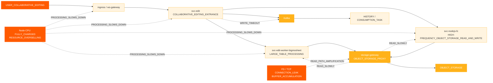
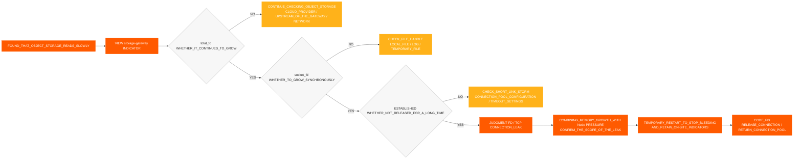
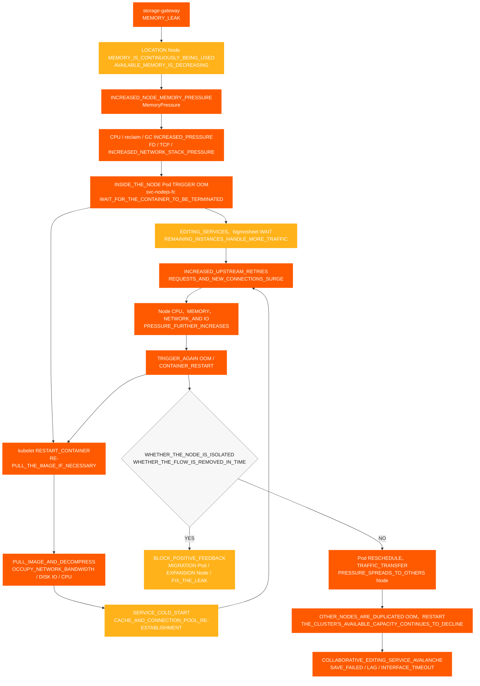

# 협업 편집 사건

[← ShimoDocs Suite 배포 문서](../README.md)

## 1. 사례 배경 

대기업 환경에서 협업 편집 불가 유형의 사고가 발생하여 일부 스프레드시트와 문서의 정상 편집 및 저장에 영향을 미쳤습니다. 사고 동안 사용자들은 저장 실패, 편집 지연 및 Kafka 쓰기 시간 초과 등의 현상을 경험했고; 서비스 측에서는 오브젝트 스토리지 읽기 지연, 비정상적인 노드 CPU 사용량 및 비정상적인 TCP/FD 지표 등의 문제도 발생했습니다. 

이 사례는 협업 편집 불가가 반드시 편집 서비스 자체에 의해 직접적으로 발생하는 것은 아님을 보여줍니다. 이는 기저 자원의 과도한 판매, 집중된 노드 스케줄링, 느려진 미들웨어 쓰기, 비정상적인 오브젝트 스토리지 읽기 경로 또는 연결 누수와 같은 문제들에 의해 집합적으로 증폭될 수도 있습니다. 

## 2. 사고 현상 

이 사건의 주요 영향은 다음과 같습니다: 

- 협업 편집 링크가 사용 불가능하거나, 느리거나, 인터페이스 타임아웃이 발생했습니다. 
- 일부 스프레드시트나 문서가 정상적으로 저장되지 않았습니다. 
- 편집 측 팝업이 표시되었습니다. `Kafka write timeout`. 
- 객체 스토리지 읽기 시간이 증가하여 편집 링크 처리에 추가적으로 영향을 미쳤습니다. 
- 포드 모니터링은 정상적으로 보였으나, 사용자는 지속적으로 저장 실패, 편집 지연, 인터페이스 타임아웃을 보고했습니다. 

## 3. 예비 조사 과정 

### 3.1 사용자 현상에서 편집 링크로 시작 

고객은 일부 문서에서 이상을 먼저 보고했으므로, 초기 조사는 협업 편집 문제에 집중되었습니다: 
1. 편집 및 저장 링크 확인. 
2. 관련 서비스 로그 확인. 

3. 확인 Kafka 쓰기 상태 확인. 
4. 객체 스토리지 읽기/쓰기 지연 확인. 

조사 중 두 가지 주요 이상이 발견되었습니다: 

- `Kafka write timeout` 편집 링크에서 발생. 
- 비정상적인 객체 스토리지 읽기 지연. 

### 3.2 외부 의존성 예비 확인 

조사 중 외부 의존성 소유자와 개별적으로 확인하였습니다: 

- 객체 스토리지 측과 확인한 결과, 클라우드 제공자 측에서 명백한 문제는 발견되지 않았습니다. 
- 운영팀과 확인한 결과 Kafka 클러스터 측에서 명백한 문제는 발견되지 않았습니다. Kafka  

따라서, 문제는 객체 저장소나 Kafka 서비스 자체뿐만 아니라, 지역 비즈니스 노드, 게이트웨이, 연결 풀, 네트워크 및 리소스 계층에 대한 추가 조사가 계속되어야 합니다. 

### 3.3 포드 모니터링에서 노드 모니터링으로 전환 

초기에, Pod 모니터링을 확인할 때, 둘 다 CPU 과 메모리는 상대적으로 안전한 범위 내에 있었지만, 고객은 노드 CPU가 최대치에 도달했다고 보고했습니다. 

이것이 현재 진단의 중요한 전환점이었습니다: 

- 자원 과다 할당 시, Pod 모니터링은 노드 압력을 정확하게 반영하지 않을 수 있습니다. 
- 노드가 CPU 최대치에 도달하면, 컨테이너 내부의 비즈니스 처리 능력이 감소합니다. 
- 비즈니스 처리가 느려진 후, 이는 다시 느린 객체 저장소 읽기, 느린 쓰기, 요청 대기 및 저장 실패로 나타납니다. Kafka  

## 4. 장애 영향 체인 

## 5. 주요 발견 사항 

### 5.1 노드 CPU 이상 

여러 노드가 CPU 순서대로 이상을 경험했습니다: 
- '10.142.191.54'가 18:20에 예외를 시작했습니다. 
- '10.76.176.65'가 18:30에 예외를 시작했습니다. 
- '10.76.238.202'가 18:40에 예외를 시작했습니다. 
- '10.142.206.216'가 18:42에 이상을 시작했습니다. 
- '10.142.175.191'가 18:45에 이상을 시작했습니다. 

첫 번째 이상 현상은 '10.142.191.54'였고, 그 다음으로 CPU 다른 노드에서의 문제는 단일 지점 자원 이상이 여러 노드로 확산되는 특성과 일치합니다. 

### 5.2 CPU 및 메모리 과매도 

장애 전후의 자원 과매도는 다음과 같습니다: 

| 시나리오 | 자원 | 클러스터 용량 | 총 요청 | 요청 비율 | 총 한도 | 과매도 |
| --- | --- | --- | --- | --- | --- | --- |
| nodejs-fc 포드 6 | CPU | 192 코어 | 33.75 코어 | 17.6% | 457 코어 | 238.0% |
| nodejs-fc 포드 6 | 메모리 | 768 GiB | 57.24 GiB | 7.5% | 884 GiB | 115.1% |
| nodejs-fc 포드 12 | CPU | 192 코어 | 45.75 코어 | 23.8% | 493 코어 | 256.8% |
| nodejs-fc 포드 12 | 메모리 | 768 GiB | 81.24 GiB | 10.6% | 980 GiB | 127.6% |
| 스케일링 후 nodejs-fc 포드 12 | CPU | 320 코어 | 45.75 코어 | 14.3% | 493 코어 | 154.1% |
| 스케일링 후 nodejs-fc 포드 12 | 메모리 | 1280 GiB | 81.24 GiB | 6.3% | 980 GiB | 76.6% |

정상적인 상황에서는, CPU 과-가입률이 약 150%로 제어되는 것은 상대적으로 허용 가능합니다. 이 스케일링 이전에, CPU 과-가입률은 이미 238%에 도달했었고, 스케일을 두 배로 늘린 후에는 256.8%에 도달하여 폭주 트래픽 폭발 위험이 높았습니다. 

### 5.3 포드 스케줄링 집중 

기본 K8s 대기업 환경에서 기본 스케줄링 전략은 남은 노드를 사용하기 전에 하나의 노드를 먼저 채우는 경향이 있습니다. 서비스 롤링 배포나 임시 확장 시, 여러 고부하 서비스가 몇 개의 노드에 쉽게 집중될 수 있습니다. 

고위험 조합에는 다음이 포함됩니다: 

- 여러 개 `svc-nodejs-fc` 인스턴스가 단일 노드에 존재합니다. 
- 동시에 같은 노드에서 실행 중입니다. `svc-edit-worker-bigmosheet` 그리고 `ingress`  
- 오버레이 `storage-gateway` 은 연결 누수 또는 메모리 증가로 이어집니다. 

### 5.4 스토리지 게이트웨이 연결 및 메모리 누수 

노드 모니터링을 추가로 확인한 후 TCP 및 `storage-gateway` Pod 메트릭에서, 다음과 같이 발견되었습니다: 

- `total_fd` 계속 증가하고 있습니다. 
- `socket_fd` 계속 증가하고 있습니다. 
- TCP 연결이 남아 있습니다 `ESTABLISHED` 오래 동안. 
- 연결이 제때 해제되지 않고 FD가 연결 풀로 반환되지 않습니다. 
- Pod RSS / Working Set이 계속 증가하며, 회수(reclamation) 후에도 정상 수준으로 돌아오지 않습니다. 

설치 중 `total_fd`, `socket_fd`, 그리고 메모리 사용량이 모두 동시에 계속 증가하면, 이는 연결이 해제되지 않고 메모리가 계속 증가하고 있음을 나타내며, 연결 및 메모리 누수로 처리해야 하며, 동시에 노드(Node)의 `MemoryPressure` 그리고 OOM 위험에 주의를 기울여야 합니다. 

### 5.5 버전 차이 영향 

이전 버전에서는 이미지 첨부 데이터가 데이터 테이블에 직접 기록되었습니다. 새로운 버전에서는 MySQL 사용량 및 저장 비용을 줄이기 위해 이미지 첨부 정보가 객체 저장소 Metadata에 기록되며, `/x` 객체 저장소에 직접 접근하는 읽기 경로(read path)가 사용됩니다. 

프록시 모드에서 객체 저장소 키가 존재하는지 확인하는 기본 함수가 연결을 올바르게 해제하지 않아 연결 누수가 발생합니다. 이 문제는 리소스 과다 할당(over-allocation)과 집중 스케줄링과 결합되어 협업 편집 불가 장애로 확대됩니다. 

### 5.6 객체 저장소 및 스토리지 게이트웨이 모니터링 증거 

문제가 객체 스토리지 측에 있는지, 비즈니스 서비스 측에 있는지, 아니면 프록시 계층에 있는지를 판단하기 위해, 객체 스토리지와 `storage-gateway` 의 비교 조사가 수행되었습니다: 

- 객체 스토리지 읽기 지연 시간이 증가한 반면, 쓰기 지연 시간은 상대적으로 정상 수준을 유지했으며, 이상 현상은 주로 읽기 경로에 집중되었습니다. 
- CPU, RSS / 운영 세트, 그리고 `storage-gateway` Pods의 메모리 증가율이 계속 증가했습니다. 
- `total_fd` 그리고 `socket_fd` 계속 증가했고, TCP 연결은 `ESTABLISHED` 상태로 장시간 유지되었습니다. 
- 연결이 제때 해제되지 않아 FD가 연결 풀로 반환되지 않아 메모리 압박이 발생하고 OOM 노드에 위험이 있습니다. 
- 객체 스토리지 측에서 비즈니스 이상 현상의 규모에 맞는 서버 측 오류는 발견되지 않아, 조사의 초점은 `storage-gateway` 프록시 읽기 경로에 우선적으로 두었습니다. 

종합 판단: 느린 객체 저장소 읽기는 단순히 객체 저장소 서비스 결함 때문이 아니라, TCP 연결이 해제되지 않음으로 인해 누적된 FD, `storage-gateway` 연결, 메모리 및 노드 자원 압박 때문임. 

### 5.7 FD/TCP 누수 판단 과정 

이번에는 다음 판단 체인을 사용하여 `storage-gateway` 에 연결 누수가 있는지 확인했습니다: 

판단 결론: `total_fd`, `socket_fd`, 수량은 `ESTABLISHED` 연결과 Pod 메모리 사용량이 같은 시간 창 내에서 동기적으로 증가한다면, 주요 근본 원인은 'FD/'}TCP 해제되지 않은 연결로 인한 메모리 누수”; 객체 스토리지 읽기가 느리고 쓰기가 정상이며 위 지표들이 동시에 비정상인 경우, 프록시 읽기 경로를 먼저 확인해야 합니다. 

## 6. 근본 원인 결론 

이 고장의 근본 원인 체인은 다음과 같습니다: 

1. 그 클러스터는 중요하다 CPU 과잉 할당, 함께 CPU 일부 단계에서 250%를 초과하는 오버커밋. 
2. 서비스 롤링 업데이트 또는 임시 스케일링 동안 Pod 스케줄링이 집중되어 단일 노드에 과도한 자원 압력이 발생합니다. 
3.  `svc-nodejs-fc`, `svc-edit-worker-bigmosheet`, 및 `ingress` 와 같은 고부하 서비스가 일부 노드에 집중되어 있습니다. 
4. `storage-gateway` 는 오브젝트 스토리지 프록시 읽기 경로에서 연결 해제 문제가 있어 FD, TCP 연결 및 메모리 사용량이 지속적으로 증가합니다. 
5. 메모리 압력이 발생한 후 OOM 노드에서 발생하며, 컨테이너 재시작, 이미지 풀, 서비스 콜드 스타트, 업스트림 재시도로 인해 CPU, 네트워크, 디스크 IO 압력이 증가하여 느린 오브젝트 스토리지 읽기 및 느린 Kafka 쓰기를 초래합니다. 
6. 느린 오브젝트 스토리지 읽기 및 Kafka 쓰기 타임아웃은 궁극적으로 협업 편집 중 서비스 불가, 저장 실패 및 편집 지연으로 나타납니다. 

## 7. 노드 리소스 눈사태 확산 다이어그램 

이 결함과 관련된 비즈니스 서비스는 모두 K8s 클러스터에서 실행됩니다. `storage-gateway` 메모리 누수는 먼저 해당 노드의 사용 가능한 메모리를 소모한 후, OOM컨테이너 재시작, 이미지 풀, 서비스 콜드 스타트 및 업스트림 재시도를 통해 리소스 소비의 양성 피드백 루프를 형성합니다. 비정상적인 포드가 재배치되거나 트래픽이 다른 노드로 이동할 때 압력은 여전히 정상 노드로 확산되어 결국 클러스터 수준의 눈사태를 유발합니다. 

다이어그램은 다음 두 가지 증폭 루프에 초점을 맞출 필요가 있습니다: 

1. **노드 내부 양성 피드백 루프**: OOM → kubelet 재시작 또는 이미지 풀 → 콜드 스타트 → 업스트림 재시도 및 새로운 연결 증가 → CPU, 메모리, 네트워크 및 디스크 IO 압력이 계속 증가 → OOM 다시. 
2. **노드 간 확산 루프**: 비정상 노드의 파드는 재스케줄되고, 인그레스 트래픽이 이동되거나 남은 인스턴스가 요청을 인계 → 정상 노드 부하 증가 → 다른 노드는 OOM 반복적으로 재시작 → 클러스터의 사용 가능한 용량 지속적 감소. 

## 8. 처리 및 복구 

### 8.1 단기 처리 

- 비정상 인그레스 또는 비정상 노드의 게이트웨이 트래픽을 제거하여 고부하 경로로 새로운 트래픽이 들어오지 않도록 방지. 
- FD로 비정상 서비스를 재시작, TCP또는 지속적으로 증가하는 메모리. 
- 고부하 노드에서 고부하 파드 이동 또는 분산. 
- 완전히 사용된 노드에서 파드 퇴출 또는 격리. CPU. 
- 비즈니스 파드만 확장하지 말고, 노드 자원 보충을 우선시. 
- 를 위한 빠른 실패 기능 추가 `svc-edit` 요청이 오랫동안 쌓이지 않도록 동기화 인터페이스. 

### 8.2 장기 복구 

- 객체 스토리지 프록시 모드에서 Key 존재 여부를 확인할 때 연결이 해제되지 않는 문제 해결. 
- 핵심 서비스에 대한 고위험 서비스가 동일한 노드에 집중되지 않도록 반-친화 정책을 구성합니다. 
- 리소스가 소진된 후에도 노드가 핵심 서비스를 계속 실행하지 않도록 노드 추방 정책을 구성합니다. 
- 설정 CPU 및 메모리 오버서브스크립션 모니터링을 구축합니다. 
- 서비스를 확장하기 전에 고객 환경의 리소스 수준을 평가하고 확장 계획을 프로젝트 리더와 확인해야 합니다. 
- 다음에 대한 알림을 설정합니다. OOM, FD, TCP, 느린 요청, Kafka 백로그 및 핵심 서비스의 객체 저장소 읽기/쓰기 지연 시간. 

## 9. 사례 검토 결론 

이 실패는 협업 편집 기능이 사용할 수 없을 때 조사 범위를 편집 서비스 로그에만 국한하지 않아야 함을 나타냅니다. 기본 노드 리소스가 이미 완전히 사용 중인 경우, 비즈니스 서비스 전체가 느려져 여러 상위 수준의 증상으로 나타날 수 있습니다. Kafka 쓰기 시간 초과, 느린 객체 저장소 읽기, 저장 실패 등. 

향후 유사한 문제를 처리할 때, 클러스터와 노드 자원을 먼저 확인한 후, 미들웨어, 비즈니스 모니터링, 로그, 트레이스 링크 순으로 점검하여 단일 서비스 로그에서 조사를 시작하고 국소화된 문제 해결 루프에 빠지는 것을 방지해야 합니다. 

---
