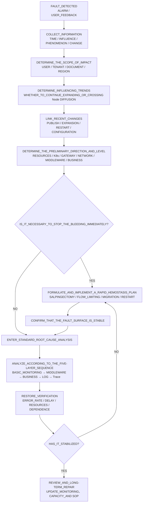
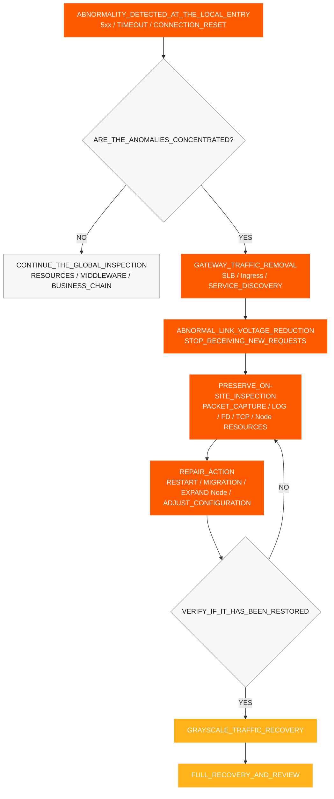
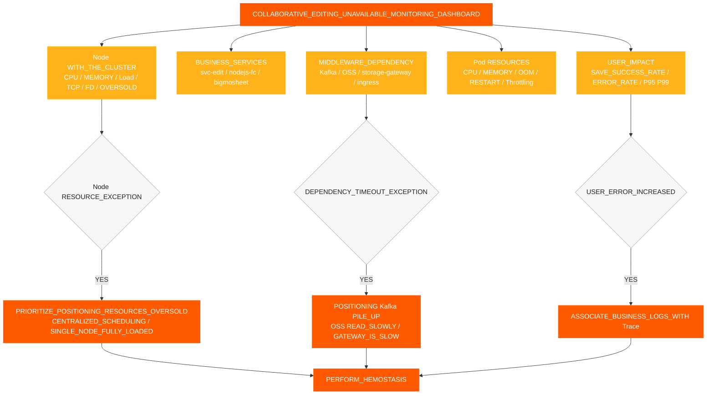
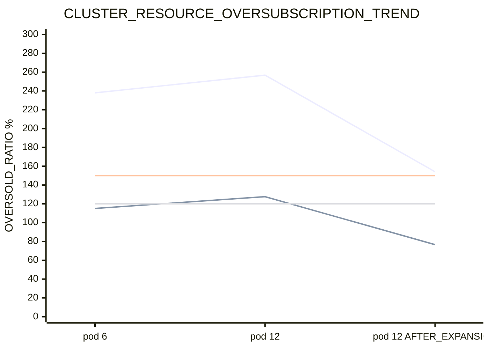
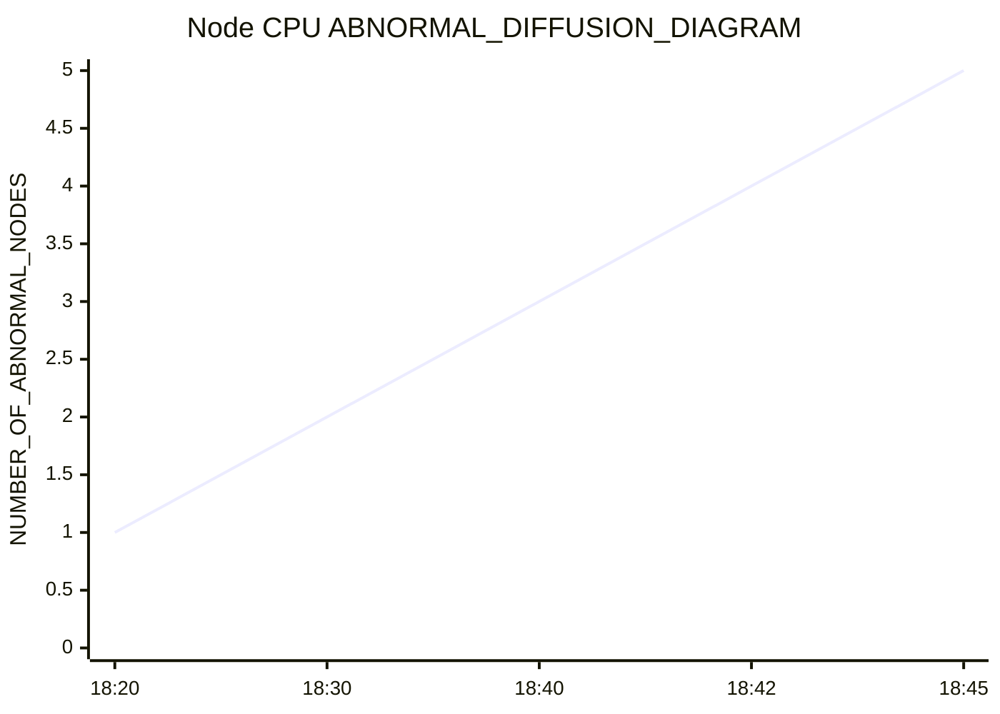
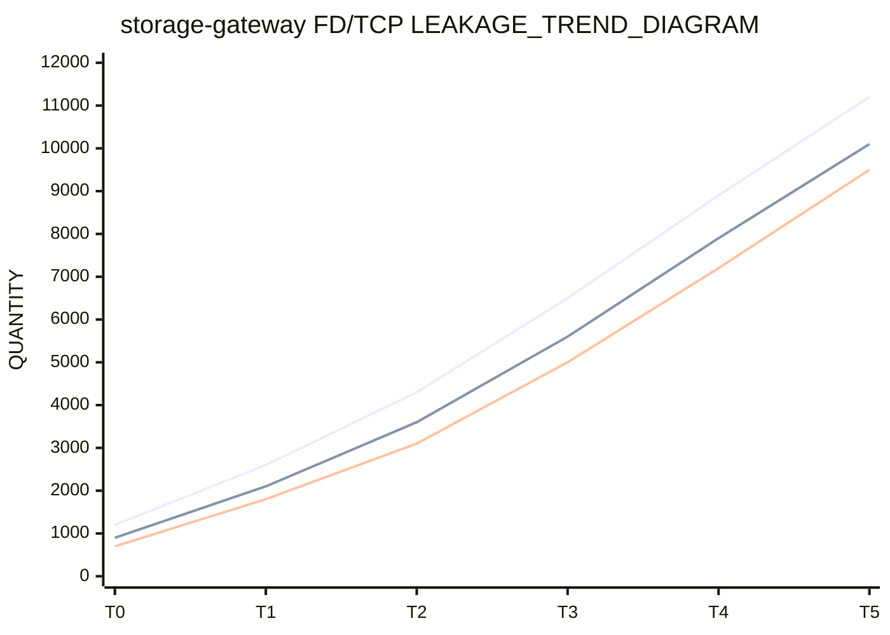
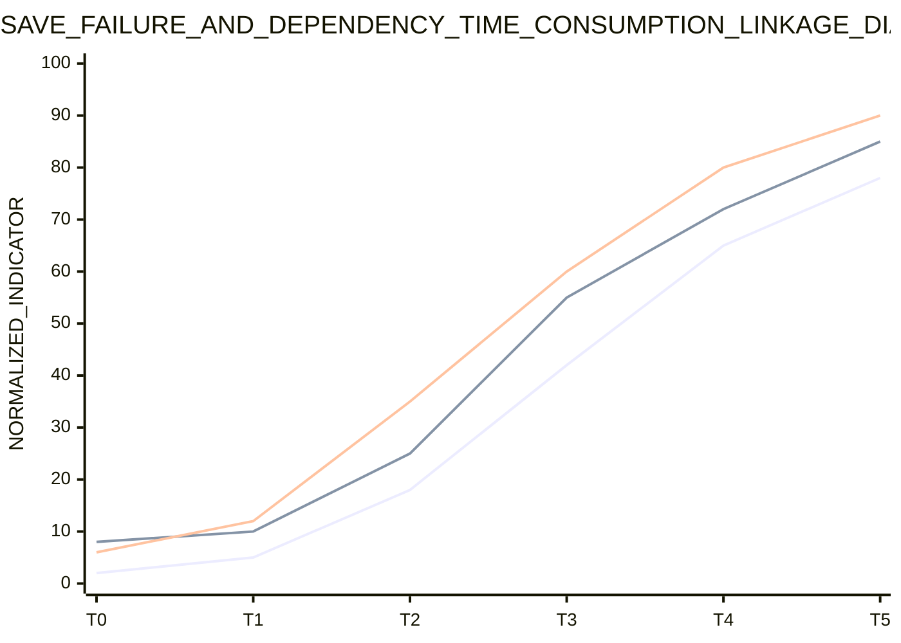
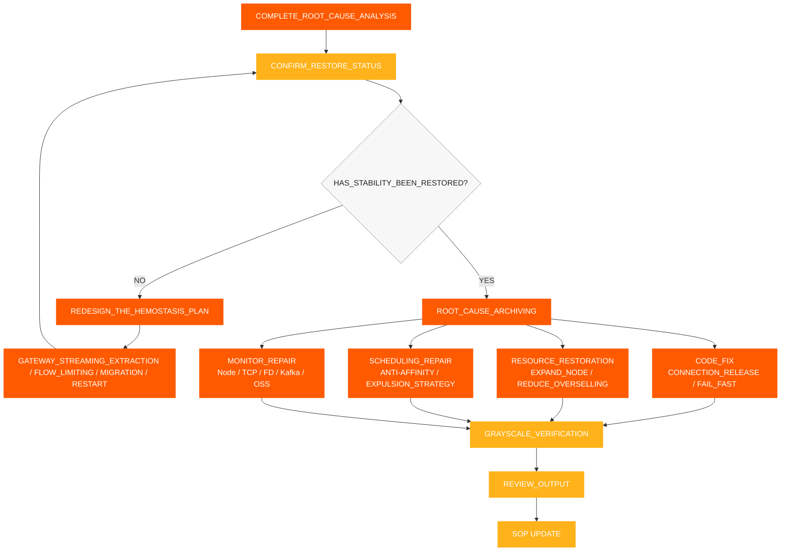

# 사고 대응 SOP

[← ShimoDocs Suite 배포 문서](../README.md)

## 1. 정보 수집

장애를 접수한 후 먼저 다음 정보를 기록합니다:

- 발생 시간: 첫 번째 알림 시간, 첫 번째 고객 피드백 시간, 릴리스 또는 스케일링과 일치 여부
- 영향 범위: 테넌트, 문서 종류, 파일 수, 사용자 수, 테이블 또는 대규모 테이블 집중 여부
- 구체적 증상: 저장 실패, 편집 오류 Kafka 타임아웃, 객체 저장소 읽기 지연 API 타임아웃
- 최근 변경 사항: 서비스 릴리스, 롤링 재시작, Pod 스케일링, 노드 스케일링, 스토리지 또는 변경 사항 Kafka 변경 사항
- 핵심 서비스: `svc-nodejs-fc`, `svc-edit`, `svc-edit-worker-bigmosheet`, `storage-gateway`, `ingress`, `ws-gateway`.


## 2. 정보 평가 및 장애 분류

정보 수집을 완료한 후, 먼저 증상, 지표, 이벤트 및 변경 기록을 기반으로 결함 범위, 개발 추세 및 주요 원인 방향을 판단한 다음 즉각적인 대응이 필요한지 여부를 결정합니다. 판단 결과는 명확한 결론을 형성해야 하며 단일 Pod나 단일 로그에만 의존해서는 안 됩니다.

평가 핵심 사항:

- 사용자 영향 범위: 사용자, 테넌트, 문서 유형, 지역 및 영향을 받는 서비스.
- 영향 나타남: 저장 실패, 편집 지연, API 타임아웃, Kafka 쓰기 타임아웃, 느린 객체 스토리지 읽기.
- 영향 추세: 지속적으로 확장되는지 여부, 단일 Pod 또는 Node에서 여러 Node로 확산되는지 여부.
- 연관 변경: 서비스 릴리스, Pod 스케일링, 노드 스케일링, 롤링 재시작, 구성 또는 미들웨어 변경과 관련이 있는지 여부. 
- 예비 방향: 리소스, K8s 컨트롤 플레인, 게이트웨이, 네트워크, 미들웨어, 비즈니스 코드 또는 데이터 문제. 

판단 결과를 기반으로 장애 수준 결정: 

| 수준 | 판단 기준 | 대응 대상 | 
| --- | --- | --- | 
| P0 | 광범위한 편집 불가, 지속적인 저장 실패, 핵심 서비스 배치 이상 | 15분 이내 출혈을 멈추고, 30분 이내 주요 원인 방향 명확화 | 
| P1 | 부분 테넌트, 부분 문서, 부분 노드 이상, 오류율 크게 증가 | 30분 이내 이상 링크 위치 확인, 60분 이내 안정성 복구 | 
| P2 | 단일 지점 또는 소규모 느린 요청, 가끔 발생하는 저장 실패 | 1근무일 이내 원인 확인 및 수정 계획 완료 | 

판단 결론은 최소한 세 가지 질문에 답해야 함: 현재 영향 범위는 얼마나 큰가, 장애가 확산되고 있는가, 먼저 출혈을 멈춰야 하는가 아니면 바로 근본 원인 분석을 진행해야 하는가. 




## 3. 신속한 지혈

사용자 측에서 계속 실패가 발생하거나 판단 결과 장애가 확산되고 있음을 나타낼 경우, 먼저 격리 조치를 수행한 후 깊이 있는 분석을 계속함. 격리의 목표는 장애 범위를 줄이고, 자원의 양성 피드백을 차단하며, 가능한 한 장애 현장을 보존하는 것임.

1. 이상 게이트웨이에서 트래픽 제거 SLB 백엔드, Ingress 항목, 서비스 인스턴스 또는 노드에서 새 요청이 비정상 경로로 계속 들어가는 것을 차단합니다.
2. 비정상 노드를 스케줄 불가 또는 격리 상태로 설정하여 Pod가 고부하 노드에 계속 스케줄되는 것을 방지합니다.
3. 문제가 발생한 Pod를 재시작합니다 OOM, 지속적인 메모리 증가 또는 FD/TCP 누수, 우선 순위를 두고 `storage-gateway`, `svc-nodejs-fc`, 및 `svc-edit-worker-bigmosheet`.
4. 고부하 Pod를 분산하여 배치하여 `nodejs-fc`, `bigmosheet`, `ingress`, 및 `storage-gateway` 같은 노드에 집중됨.
5. 유효하지 않은 비즈니스 파드의 확장 일시 중지, 노드 확장 또는 사용 가능한 리소스 복원 우선.
6. 콜드 스타트 후 새로운 연결이 계속 급증하는 것을 방지하기 위해 업스트림 재시도, 연결 생성 및 요청 누적에 대해 속도 제한 또는 빠른 실패 구현.
7. 노드 기록 CPU, 메모리, OOM, FD, TCP, 오류율 및 인터페이스 지연, 누수 중지 전후.

### 3.1 게이트웨이 트래픽 제거

장애가 비정상적인 로컬 노드, 로컬 게이트웨이 항목 또는 로컬 서비스 인스턴스로 나타날 경우, 먼저 비정상적인 항목 트래픽을 제거한 후 노드와 Pod를 처리해야 합니다. 트래픽 제거의 목표는 장애 링크에 대한 부담을 줄이고 비정상 인스턴스가 계속 새로운 요청을 받는 것을 방지하는 것입니다. 

트리거 조건: 

- 특정 Ingress, SLB 백엔드, 게이트웨이 Pod 또는 노드의 오류율이 다른 인스턴스보다 현저히 높을 때. 
- 게이트웨이 5xx 오류, 업스트림 타임아웃 및 연결 재설정이 일부 진입점에 집중될 때. 
- 특정 노드 CPU, 부하, TCP및 FD 지표가 명백히 비정상이며 새로운 요청이 계속 들어올 때. 
- 이미 코어 링크 인스턴스와 같은 `svc-edit`, `ws-gateway`, 및 `storage-gateway` 속도가 느려졌을 때. 

실행할 조치: 

1. 비정상 백엔드를 SLBIngress, 게이트웨이 라우팅 또는 서비스 디스커버리에서 제거합니다. 
2. 비정상 노드를 일시적으로 스케줄 불가로 표시하여 새로운 Pod가 배치되지 않도록 합니다. 
3. 패킷 캡처, 로그, FD/TCP, 그리고 트래픽이 제거된 노드나 인스턴스에 대한 리소스 점검입니다. 
4. 재시작, 마이그레이션, 확장 또는 구성 수리를 완료한 후에는 먼저 소규모 트래픽으로 복원한 다음 전체 복원합니다. 
5. 복원 전에 오류율, 인터페이스 응답 시간, Node CPU, 및 TCP/FD 지표가 정상으로 돌아왔는지 확인합니다. 




## 4. 표준 근본 원인 분석 프로세스

신속한 지혈을 완료하고 결함 면이 안정되었음을 확인한 후 근본 원인 분석을 진행합니다. 표준 문제 해결 순서는 '하향식, 거칠게부터 세밀하게' 방식으로 수행됩니다:

1. 기본 모니터링: 클러스터 리소스, Node 노드, Pod 리소스.
2. 미들웨어 모니터링: Kafka, 오브젝트 스토리지, 게이트웨이, 네트워크.
3. 비즈니스 모니터링: 저장 성공률, 인터페이스 응답 시간, 오류율.
4. 로그 모니터링: 오류 로그, 타임아웃 로그, OOM/재시작 로그.
5. 트레이스 링크 추적: 요청 링크, 느린 호출, 예외 스팬.

핵심 요구 사항:

- 각 계층은 먼저 판단 결론을 출력한 후 다음 계층으로 들어갑니다.
- 먼저 Node를 보고, 그 다음 Pod를 봅니다; 먼저 글로벌 추세를 보고, 그 다음 단일 서비스의 로그를 봅니다.
- 특정 레이어에서 이상이 발견되지 않았다고 해서 이후 레벨을 건너뛰지 마십시오.
- 모니터링, 로그, 트레이스는 동일한 시간 창, Pod, Node, Trace ID를 사용하여 상관관계가 있어야 합니다.

각 레이어는 하나의 핵심 질문만 답합니다:

- 기본 모니터링: 리소스가 이미 부족한가요? 오버셀링, 중앙 집중식 스케줄링 또는 노드 간 분산이 발생하고 있나요?
- 미들웨어 모니터링: 지연, 백로그, 요청 거부 또는 연결 이상이 있나요?
- 비즈니스 모니터링: 사용자 영향은 어느 서비스, API또는 문서 유형에 해당하나요?
- 로그 모니터링: 오류, 타임아웃, OOM재시작 또는 연결 풀 고갈의 명확한 증거가 있나요?
- 트레이스 링크 추적: 실패한 요청이 정확히 어디에서 멈췄나요—어느 서비스, 노드, 또는 스팬에서인가요? 


### 4.1 기본 모니터링 문제 해결 

Pod 차원만 보는 것보다 Node 차원을 우선적으로 확인하세요. 리소스가 초과 예약된 경우, Pod 모니터링은 안전 범위 내 값을 보여줄 수 있지만 Node는 이미 완전히 사용 중일 수 있습니다. 

점검 항목: 

- 클러스터 총 CPU 및 메모리 용량과 사용 가능한 용량. 
- 노드 CPU, 메모리, 부하, 디스크, 네트워크. 
- Pod CPU, 메모리, 재시작, OOM, CPU 스로틀링. 
- 여러 고부하 CPU 또는 고 IO 서비스가 단일 노드에 집중되어 있는지 여부. 
- 롤링 릴리스 후, Pod가 대부분 처음 몇 개 노드에 스케줄 되었는지 여부. 
- 안티 어피니티와 퇴출 정책이 없는지 여부. 

주요 판단: 

- 총 CPU 한도 / 클러스터 CPU 용량이 150%를 초과하는지 여부. 
- 총 메모리 한도 / 클러스터 메모리 용량이 120%를 초과하는지 여부. 
- 한 노드가 먼저 실패하고 나머지 노드가 점차적으로 사용량이 증가하는 과정이 있는지 여부. CPU 사용량. 


### 4.2 미들웨어 모니터링 문제해결 

미들웨어 문제해결은 주로 Kafka, 오브젝트 스토리지, 게이트웨이, 네트워크에 중점을 둡니다. 구체적인 판단은 Kafka 는 다음과 같습니다; 객체 스토리지, `storage-gateway`, 게이트웨이 및 네트워크에 대한 상세 지표와 판단 항목은 모두 9.7절과 관련 체크리스트에 기록됩니다. 

#### 4.2.1 Kafka 

점검 항목: 

- 생산자 쓰기 지연 시간 및 실패율. 
- 토픽 백로그. 
- 브로커 측 CPU, 디스크, 네트워크 및 요청 지연 시간. 
- 클라이언트에서 발생하는 재전송, 패킷 손실 또는 연결 혼잡 여부 Kafka. 
- 업무 측 쓰기에서만 타임아웃이 발생하고 운영 측에는 뚜렷한 이상이 없는지 여부. Kafka 운영 측. 

판단 논리: 

- 운영 측에 이상이 없지만 Kafka 업무 측에서 계속 쓰기 타임아웃이 발생하면, 업무 노드, 네트워크 혼잡 및 클라이언트 처리 능력 확인에 집중합니다. CPU 
- 설치 중 Kafka 백로그와 업무 오류가 동시에 발생하면 먼저 백로그가 상위 서비스 처리 지연으로 인한 것인지 확인합니다. 


### 4.3 업무 모니터링, 로그 및 추적 

#### 4.3.1 업무 모니터링 

고객 현상을 기반으로 비정상 링크를 확인: 

1. 저장 실패가 테이블, 대형 테이블 또는 특정 문서 유형에 집중되는지 여부. 
2. 편집 인터페이스가 시간 초과, 요청 지연 또는 오류율 증가를 경험하는지 여부. 
3. 발생 여부 확인 `Kafka write timeout` 발생. 
4. 객체 저장소 읽기가 느리고 쓰기가 정상인지 확인. 
5. 발생 여부 확인 `bigmosheet operation oss_get` 5초를 초과합니다. 
6. WebSocket, 협업 편집, 히스토리 및 객체 저장소 관련 서비스가 동시에 지연 증가를 경험하는지 확인. 

#### 4.3.2 로그 모니터링 

확인할 주요 로그: 

- 편집 저장 실패 로그. 
- 로그 Kafka 쓰기 시간 초과. 
- 느린 객체 저장소 읽기 및 쓰기 로그. 
- 로그 OOM, 재시작, 연결 풀 소진 및 FD 소진. 
- 게이트웨이 5xx 오류, 업스트림 시간 초과 및 연결 재설정 로그. 

#### 4.3.3 추적 링크 추적 

Trace를 사용하여 단일 실패한 요청 추적: 

- 요청이 게이트웨이, 협업 편집, 객체 저장소, Kafka또는 히스토리 처리 체인에 갇혀 있는지 확인. 
- 어떤 Span이 비정상적인 지연을 갖는지 확인. 
- 느린 호출이 특정 서비스, 노드 또는 문서 유형에 집중되어 있는지 확인. 
- 실패한 요청과 정상 요청 간의 링크 차이를 비교합니다. 


## 5. 복구 검증 

출혈 중지 작업을 완료한 후에는 다음 지표를 확인해야 합니다: 

- 제거된 게이트웨이 엔트리, SLB 백엔드 또는 비정상 인스턴스가 더 이상 새로운 트래픽을 수신하지 않는지 확인합니다. 
- 저장 성공률이 정상으로 돌아왔는지 확인합니다. 
- 편집 인터페이스 오류율이 감소했는지 확인합니다. 
- Kafka 쓰기 지연(latency)이 정상으로 돌아왔는지 확인합니다. 
- Kafka 백로그가 감소했는지 확인합니다. 
- 객체 저장소 읽기 지연(latency)이 정상으로 돌아왔는지 확인합니다. 
- 노드 CPU, 메모리, 부하가 감소했는지 확인합니다. 
- `storage-gateway` FD 및 소켓 FD가 더 이상 지속적으로 증가하지 않는지 확인합니다. 
- 비정상 노드가 더 이상 확산되지 않는지 확인합니다. 
- 그레이스케일 릴리스 중 트래픽을 복원한 후에도 게이트웨이 5xx, 업스트림 타임아웃 및 연결 재설정이 다시 증가하지 않았는지 확인합니다. 


## 6. 모니터링 및 알람 요구 사항 

다음 알람을 완료해야 합니다: 

- 노드 CPU, 메모리, 부하, 디스크 및 네트워크 알람. 
- 노드 TCP 연결 수, 재전송, 패킷 손실 및 `ESTABLISHED` 연결 수 알람. 
- Pod OOM, 재시작 및 CPU 스로틀링(throttling) 알람. 
- 핵심 서비스 OOM 알람. 
- CPU 초과 판매 경고: CPU 제한 / 클러스터 CPU 용량이 150%를 초과하는지 여부. 
- 메모리 초과 판매 경고: 메모리 제한 / 클러스터 메모리 용량이 120%를 초과합니다. 
- Kafka 백로그 경고. 
- Kafka 쓰기 시간 초과 경고. 
- 편집 저장 실패 오류 로그 경고. 
- `bigmosheet operation oss_get > 5s` 경고. 
- `storage-gateway` FD 및 소켓 FD 지속적 증가 경고. 
- `storage-gateway` RSS / 작업 집합 지속적 증가 및 노드 `MemoryPressure` 경고. 


## 7. 주요 지표 모니터링 대시보드 

이 섹션은 보조 도구로 주요 프로세스 순서를 변경하지 않습니다. 대시보드는 추세를 관찰하고 방향을 찾는 데 사용되며, `kubectl`, `jq`및 PromQL은 특정 증거를 얻는 데 사용됩니다; 현장 조사는 9장에 있는 상세 체크리스트를 따라 각 항목을 실행하고 결론을 기록해야 합니다. 

### 7.1 대시보드 계층 

협업 편집 불가 장애 대시보드는 5계층으로 나누어 위에서 아래로 계층별로 확인할 것을 권장합니다: 

| 계층 | 대시보드 이름 | 핵심 지표 | 목적 |
| --- | --- | --- | --- |
| L1 | 사용자 영향 대시보드 | 저장 성공률, 편집 오류율, 인터페이스 P95/P99, 온라인 협업 연결 | 사용자가 실제로 영향을 받는지 결정 |
| L2 | 비즈니스 서비스 대시보드 | QPS, 오류율, 지연 시간 및 재시작 횟수 `svc-edit`, `svc-nodejs-fc`, `bigmosheet` | 이상이 집중된 비즈니스 서비스를 결정 |
| L3 | 미들웨어 대시보드 | Kafka 쓰기 지연 시간, Kafka 백로그, 객체 저장소 읽기/쓰기 지연 시간, 상위 게이트웨이 지연 시간 | 종속성이 느려지고 있는지 결정 |
| L4 | 컨테이너 리소스 대시보드 | Pod CPU, 메모리, OOM, 재시작, CPU 제한 | 컨테이너 자체가 비정상인지 결정 |
| L5 | 노드 및 클러스터 대시보드 | 노드 CPU, 메모리, 부하, TCP, FD, 과다 할당된 리소스, Pod 분포 | 기저 자원이 비즈니스 운영을 지원하는지 결정 |

### 7.2 주요 지표 개요 차트



### 7.3 리소스 오버커밋 추세 차트

이 차트는 다음을 관찰하는 데 사용 CPU 확장 전후의 CPU 및 메모리 오버커밋이 고위험 영역에 들어가는지. 실제 대시보드에서는 CPU 오버커밋을 150%, 메모리 오버커밋을 120%로 경고 임계선 설정을 권장



### 7.4 노드 CPU 확산 추세 차트

이 차트는 단일 노드가 먼저 실패하고 이후 다른 노드들이 점진적으로 영향을 받는 확산 특성이 있는지 관찰하는 데 사용됩니다.



### 7.5 FD/TCP 누수 추세 차트

이 차트는 연결 또는 FD 누수가 있는지 확인하는 데 사용됩니다. `storage-gateway` 만약 `total_fd`, `socket_fd`, 그리고 연결 수가 `ESTABLISHED` 모두 동시에 지속적으로 증가하면, 연결 누수를 우선적으로 처리해야 합니다.



### 7.6 비즈니스 오류와 종속 지연 상관 차트

이 차트는 사용자 측 저장 실패가 증가된 Kafka 쓰기 지연 및 객체 저장소 읽기 지연과 관련이 있는지 확인하는 데 사용됩니다. 같은 시간 창 내에서 이 세 가지가 모두 동시에 증가하면, 비즈니스 노드 처리 용량 및 종속 체인 혼잡을 우선적으로 점검해야 합니다.



### 7.7 권장 알람 임계값

| 지표 | 권장 임계값 | 트리거 후 조치 |
| --- | --- | --- |
| 저장 성공률 | 연속 5분 동안 99% 이하 | 비즈니스 영향 확인, 오류 로그 및 트레이스 상관 |
| 인터페이스 편집 P95 | 연속 5분 동안 기준치 대비 2배 이상 | 점검 `svc-edit`, `nodejs-fc`, `bigmosheet` |
| Kafka 쓰기 지연 | 기준보다 2배 높거나 쓰기 타임아웃 발생 | 점검 Kafka 백로그, 비즈니스 노드 CPU, 네트워크 재전송 |
| Kafka 백로그 | 10분 동안 연속 증가 | 컨슈머 작업과 상위 쓰기 속도 확인 |
| OSS 읽기 지연 | P95 5초 초과 | 점검 `storage-gateway`, 네트워크, 객체 저장소 측 |
| 노드 CPU | 연속 5분 동안 90% 이상 | Pod 분포 확인, CPU 과도한 예약, 고부하 서비스 |
| CPU 과도한 예약 | 150% 초과 | 비즈니스 Pod 스케일링 중단, 노드 스케일링 평가 우선 |
| 메모리 과다 예약 | 120% 초과 | 점검 OOM, 축출 위험, 메모리 누수 |
| `total_fd` / `socket_fd` | 10분 동안 단조롭게 증가 | FD/ 확인TCP 누수, 필요 시 재시작하여 손실 방지 |
| TCP 재전송 비율 | 기준보다 2배 높음 | 패킷 캡처하여 패킷 손실, 혼잡, 윈도우 문제 확인 |
| Pod 재시작/ OOM | 주요 서비스 중 하나 발생 | 즉시 로그 연계 및 변경 사항 릴리즈 |

### 7.8 노드 CPU 및 메모리 과다 할당 쿼리 명령

다음 명령은 비즈니스가 클러스터에서 실행되는 시나리오에 적용됩니다. K8s 실행 전에 현재 kubeconfig가 문제 있는 클러스터로 전환되었는지 확인하고, `NODE_NAME` 대상 노드 이름으로 교체하십시오.

#### 7.8.1 노드 실제 상태 확인 CPU 및 메모리 사용량

```bash
# View the real-time CPU and memory usage of all Nodes
kubectl top nodes

# View the real-time usage of the specified Node
kubectl top node "$NODE_NAME"

# View the node's capacity, allocatable resources, and pressure status
kubectl describe node "$NODE_NAME" | sed -n '/Capacity:/,/Allocatable:/p'
kubectl describe node "$NODE_NAME" | sed -n '/Conditions:/,/Addresses:/p'

# Directly view the CPU/memory Requests, Limits, and usage ratio allocated to the Node
kubectl describe node "$NODE_NAME" | sed -n '/Allocated resources:/,/Events:/p'
```

주요 포커스: `CPU%`, `MEMORY%`, `MemoryPressure`, `DiskPressure`, `PIDPressure`. 실제 사용량이 90%를 초과하면, Pod 분포 및 게이트웨이 트래픽 제거를 기반으로 블리딩 제어가 필요한지 즉시 판단해야 합니다.

#### 7.8.2 통계 CPU, 지정된 노드에 대한 메모리 요청 및 제한

```bash
# Statistics of CPU/memory requests and limits for all Pod containers on the specified Node.
# Dependencies: kubectl, jq; memory is uniformly converted to MiB, CPU is uniformly converted to cores.
NODE_NAME="<TARGET_NODE_NAME>"

kubectl get pods -A --field-selector "spec.nodeName=${NODE_NAME}" -o json | jq '
  def cpu_core:
    if . == null then 0
    elif endswith("m") then (rtrimstr("m") | tonumber / 1000)
    else tonumber
    end;
  def mem_mib:
    if . == null then 0
    elif endswith("Ki") then (rtrimstr("Ki") | tonumber / 1024)
    elif endswith("Mi") then (rtrimstr("Mi") | tonumber)
    elif endswith("Gi") then (rtrimstr("Gi") | tonumber * 1024)
    elif endswith("Ti") then (rtrimstr("Ti") | tonumber * 1024 * 1024)
    elif endswith("K") then (rtrimstr("K") | tonumber / 1024)
    elif endswith("M") then (rtrimstr("M") | tonumber)
    elif endswith("G") then (rtrimstr("G") | tonumber * 1024)
    elif endswith("T") then (rtrimstr("T") | tonumber * 1024 * 1024)
    else (tonumber / 1024 / 1024)
    end;
  [ .items[]
    | ([(.spec.containers[]?, .spec.initContainers[]?) | .resources.requests.cpu? // "0"] | map(cpu_core) | add) as $cpu_req
    | ([(.spec.containers[]?, .spec.initContainers[]?) | .resources.limits.cpu? // "0"] | map(cpu_core) | add) as $cpu_limit
    | ([(.spec.containers[]?, .spec.initContainers[]?) | .resources.requests.memory? // "0"] | map(mem_mib) | add) as $mem_req
    | ([(.spec.containers[]?, .spec.initContainers[]?) | .resources.limits.memory? // "0"] | map(mem_mib) | add) as $mem_limit
    | {cpu_request: $cpu_req, cpu_limit: $cpu_limit, mem_request_mib: $mem_req, mem_limit_mib: $mem_limit}
  ]
  | {
      cpu_request_core: (map(.cpu_request) | add),
      cpu_limit_core: (map(.cpu_limit) | add),
      mem_request_mib: (map(.mem_request_mib) | add),
      mem_limit_mib: (map(.mem_limit_mib) | add)
    }'
```

참고: 공식 K8s 스케줄링 계산은 `initContainers`에 대해 "최대값을 취하는" 규칙을 사용합니다. 위 명령은 빠른 현장 요약에 사용되며 명백한 과다 할당을 감지하는 데 적합합니다. 리소스 대시보드나 스케줄러 데이터와 대조할 때는 플랫폼에서 제공하는 노드 리소스 통계를 기준으로 사용해야 합니다. 

#### 7.8.3 클러스터 계산 CPU 및 메모리 오버커밋 비율 

```bash
# Get the total Allocatable resources of all nodes in the cluster
kubectl get nodes -o json | jq '
  [ .items[].status.allocatable
    | {
        cpu_core: (if (.cpu | endswith("m"))
                   then (.cpu | rtrimstr("m") | tonumber / 1000)
                   else (.cpu | tonumber)
                   end),
        memory_bytes: (.memory | rtrimstr("Ki") | tonumber * 1024)
      }
  ]
  | {
      cpu_allocatable_core: (map(.cpu_core) | add),
      memory_allocatable_gib: (map(.memory_bytes) | add / 1024 / 1024 / 1024)
    }'

# Summarize the CPU/memory limits of all Pods for calculating the overcommit ratio
kubectl get pods -A -o json | jq '
  def cpu_core:
    if . == null then 0
    elif endswith("m") then (rtrimstr("m") | tonumber / 1000)
    else tonumber
    end;
  def mem_gib:
    if . == null then 0
    elif endswith("Ki") then (rtrimstr("Ki") | tonumber / 1024 / 1024)
    elif endswith("Mi") then (rtrimstr("Mi") | tonumber / 1024)
    elif endswith("Gi") then (rtrimstr("Gi") | tonumber)
    else (tonumber / 1024 / 1024 / 1024)
    end;
  [ .items[] | .spec.containers[]?
    | {
        cpu_limit_core: (.resources.limits.cpu? // "0" | cpu_core),
        memory_limit_gib: (.resources.limits.memory? // "0" | mem_gib)
      }
  ]
  | {
      cpu_limit_core: (map(.cpu_limit_core) | add),
      memory_limit_gib: (map(.memory_limit_gib) | add)
    }'
```

계산 공식: `CPU overcommit ratio = Total CPU Limits of all Pods / Total CPU Allocatable of all Nodes × 100%`; `Memory overcommit ratio = Total Memory Limits of all Pods / Total Memory Allocatable of all Nodes × 100%`. 권장 사항은 다음과 같이 하는 것입니다 CPU 메모리 오버커밋 150% 및 리소스 오버커밋 120%를 고위험 기준선으로 설정하지만, 최종 임계값은 고객 환경 기준에 따라 결정해야 합니다. 

#### 7.8.4 Prometheus / Grafana 쿼리 명령문

```promql
# Cluster CPU Limit Oversubscription Rate
100 * sum(kube_pod_container_resource_limits{resource="cpu", unit="core"})
  / sum(kube_node_status_allocatable{resource="cpu", unit="core"})

# Cluster Memory Limit Overcommit Rate
100 * sum(kube_pod_container_resource_limits{resource="memory", unit="byte"})
  / sum(kube_node_status_allocatable{resource="memory", unit="byte"})

# View CPU Limit Overcommit Rate by Node
100 * sum by (node) (kube_pod_container_resource_limits{resource="cpu", unit="core"})
  / on (node) kube_node_status_allocatable{resource="cpu", unit="core"}

# View Memory Limit Oversubscription Rate by Node
100 * sum by (node) (kube_pod_container_resource_limits{resource="memory", unit="byte"})
  / on (node) kube_node_status_allocatable{resource="memory", unit="byte"}

# Node Actual CPU Usage
100 * (1 - avg by (instance) (rate(node_cpu_seconds_total{mode="idle"}[5m])))

# Node actual memory usage
100 * (1 - node_memory_MemAvailable_bytes / node_memory_MemTotal_bytes)

# K8s node memory pressure status, 1 indicates MemoryPressure=True
kube_node_status_condition{condition="MemoryPressure", status="true"}
```

리소스 메트릭이 `unit` 그리고 `node` Prometheus의 태그 이름이 위 명령문과 일치하지 않는 경우, 조정을 하기 전에 메트릭 세부 사항에서 실제 태그를 먼저 확인해야 합니다. 과다 구독 비율은 리소스 선언에서 잠재적 위험만을 나타낼 수 있으며, Node의 실제 평가를 대체할 수 없습니다. CPU, 메모리, OOM, 및 `MemoryPressure`.


## 8. 검토 및 장기 개선 루프




## 9. 상세 점검 체크리스트 

이 체크리스트는 "사용자 현상 → 기본 리소스 → K8s → 미들웨어 → 로그 및 링크 → 처리 완료 루프" 순서로 실행됩니다. 각 항목은 검토 없이 단순히 "정상/비정상"만 기록하는 것을 피하기 위해 관찰 시간, 이상 객체, 지표 스크린샷 또는 쿼리 결과를 기록해야 합니다. 

### 9.1 현상 및 영향 범위 확인 

| 점검 대상 | 확인할 항목 | 이상 판단 | 현장 기록 / 결론 |
| --- | --- | --- | --- |
| 사용자 영향 | 협업 편집 사용 불가, 저장 실패, 편집 지연, 인터페이스 시간 초과 | 여러 사용자, 테넌트 또는 문서가 동시에 비정상인 경우, 이를 비즈니스 실패로 판단 | |
| 장애 범위 | 표, 대형 스프레드시트, 특정 문서 유형, 특정 테넌트 또는 특정 지역에 집중되어 있는가? | 명확한 집중이 있을 경우, 서비스 경로, 데이터 유형 또는 노드별 그룹화를 우선적으로 수행 | |
| 오류 발생 양상 | 'kafka writes timeout', 게이트웨이 5xx, 연결 재설정, 업스트림 타임아웃이 발생하는지 여부 | 같은 시간대에 여러 유형의 오류가 동시에 발생할 경우, 공용 종속성과 리소스 계층을 우선 고려 | |
| 시간 상의 상관관계 | 첫 알림, 첫 피드백, 지표 이상 시작 시점 | 릴리스, 스케일링, 롤링 재시작 또는 구성 변경과 일치할 경우 변경 주문 번호 기록 | |
| 영향 범위 | 장애 요청량, 장애율, 온라인 협업 연결 수, 영향을 받는 서비스와 복제본 | 영향이 계속 확대될 경우 장애 수준을 상향 조정하고 우선적으로 손실 방지 수행 | |

### 9.2 기본 항목 모니터링: 노드 

| 모니터링 대상 | 핵심 지표 | 핵심 판단 | 권장 조치 | 현장 기록 / 결론 |
| --- | --- | --- | --- | --- |
| CPU 사용법 | 노드 CPU 사용량, 부하 1/5/15, CPU steal, iowait, 소프트 인터럽트 | CPU 항상 >90%, 부하가 코어 수에 접근하거나 초과, iowait/소프트 인터럽트 비정상 증가 | 고부하 Pod 확인, 필요 시 트래픽 제거, Pod 마이그레이션 또는 노드 확장 | |
| 메모리 사용량 | 사용, 사용 가능, RSS, 페이지 폴트, 스왑, OOM 종료 | 사용 가능 지속적 감소, 스왑 사용, OOM, 증가한 메모리 회수 압력 | 메모리 누수 및 고메모리 Pod 확인, 확인 `MemoryPressure`, 필요 시 노드 격리 | |
| 메모리 오버서브스크립션 | 메모리 제한/할당 가능, 메모리 요청/할당 가능 | 메모리 제한이 120% 초과 또는 요청이 과도하게 집중 | 비즈니스 스케일링 일시 중지, 노드 추가 우선, 고위험 제한 감소 또는 Pod 분산 | |
| CPU 오버커밋 | CPU 제한/할당 가능, CPU 요청/할당 가능 | CPU 제한이 150% 초과 또는 고부하 Pod가 동일 노드에 집중 | 리소스 구성, 안티 어피니티 및 복제본 분포 조정 |  |
| TCP 연결 | 총 TCP 연결, `ESTABLISHED`, `TIME_WAIT`, `CLOSE_WAIT`, 재전송률 | 연결 수가 계속 증가하고 있으며, `CLOSE_WAIT` 오랫동안 해제되지 않고 재전송률 상승 | 연결 누수, 연결 풀, 네트워크 혼잡 및 비정상 클라이언트 위치 확인 |  |
| netstat / 소켓 | 소켓 총 수, 리슨 포트, Recv-Q, Send-Q, 실패한 연결 수 | Recv-Q/Send-Q가 지속적으로 누적되거나 리슨 큐 오버플로우 | 패킷 캡처, 서비스 연결 풀 및 커널 매개변수로 문제 해결 |  |
| FD | 총 FD, 소켓 FD, 프로세스 FD 사용량, `file-nr` | `total_fd`, `socket_fd` 단조롭게 증가하거나 프로세스 한계에 접근 | 현재 상태 저장, 누수 서비스 재시작, 연결 해제 로직 수정 |  |
| 디스크 | 파일시스템 사용량, inode, 디스크 처리량, IOPS, 대기 시간(await), 사용률(util), 쓰기 지연 | 디스크 가득 참, inode 가득 참, await/util 지속적으로 높음 | 임시 파일 또는 로그 정리, 디스크 확장, 이미지 추출 및 로그 작성 확인 |  |
| 네트워크 | NIC 대역폭, 패킷 손실, 잘못된 패킷, 재전송, 소프트 인터럽트, 연결 추적 테이블 | 대역폭 완전 사용, 패킷 손실/재전송 증가, conntrack 한계에 가까움 | 이미지 풀링, 노드 간 트래픽, 게이트웨이 트래픽 및 네트워크 정책 확인 |  |
| 노드 상태 | `Ready`, `MemoryPressure`, `DiskPressure`, `PIDPressure` | 압력 상태가 True이거나 Node NotReady | 먼저 노드 트래픽 제거, 스케줄링 금지, 현재 상태 유지 |  |
| 포드 분포 | 높음 CPU/메모리 서비스가 동일 노드에 집중됨 | `svc-nodejs-fc`, `svc-edit-worker-bigmosheet`, `ingress`, `storage-gateway` 동일 노드에 | 게이트웨이 스트림 분리, 마이그레이션 또는 재스케줄링 수행 |  |

### 9.3 기본 항목 모니터링: 포드

| 모니터링 객체 | 주요 지표 | 주요 판단 포인트 | 권장 조치 | 현장 기록 / 결론 |
| --- | --- | --- | --- | --- |
| CPU 사용법 | 포드/컨테이너 CPU 사용량, CPU 제한, 제한된 기간 | 높음 CPU 사용량 또는 지속적으로 증가하는 제한 | 점검 CPU 제한, 노드 과다 할당, 요청 대기 |  |
| 메모리 사용량 | 워킹 세트, RSS힙, 컨테이너 메모리 사용량, 증가 경사 | 재시작 후 회복되는 지속적인 메모리 증가, 메모리 누수 의심 | 힙 정보와 프로세스 지표 수집, 필요 시 멈추기 위해 재시작 |  |
| OOM 재시작 | `OOMKilled`재시작 횟수, 마지막 상태, 재시작 시간 | OOM 비즈니스 오류나 노드 부하와 함께 발생 | kubelet 이벤트, 컨테이너 로그 및 상위 재시도 상관관계 분석 |  |
| 네트워크 연결 | Pod TCP 연결, `ESTABLISHED`, `TIME_WAIT`, `CLOSE_WAIT` | 새로운 연결 급증 또는 해제되지 않은 장시간 연결 | 연결 풀, 타임아웃, 재시도 및 서버 측 연결 종료 확인 |  |
| netstat / 소켓 | Recv-Q, Send-Q, 리스닝 포트, 소켓 FD | 큐 누적 또는 메모리와 동기화된 소켓 FD 증가 | 네트워크 차단 또는 연결 누수 확인 |  |
| 네트워크 트래픽 | 들어오고 나가는 트래픽, 오류 패킷, 패킷 손실, 노드 간 트래픽 | 갑작스러운 트래픽 급증, 비정상 재시도 또는 증폭된 노드 간 트래픽 | 게이트웨이 라우팅, 서비스 디스커버리 및 재시도 정책 확인 |  |
| 실행 상태 | Ready, 컨테이너 상태, 프로브 실패, 시작 시간 | 프로브 실패, CrashLoopBackOff, 콜드 스타트 지연 | 먼저 트래픽 제거, 그런 다음 종속성과 리소스 회복 확인 후 점진적으로 복원 |  |
| 복제본 및 스케줄링 | 사용 가능한 복제본, 원하는 복제본, 대기 중, 노드 분포 | 복제본 부족 또는 지속적으로 증가하는 대기 중 Pod | 자원 부족, 테인트, 친화성/비친화성, 쿼터 확인 |  |

### 9.4 K8s 모니터링

| 모니터링 객체 | 핵심 메트릭 / 정보 | 핵심 평가 | 권장 조치 | 현장 기록 / 결론 |
| --- | --- | --- | --- | --- |
| 이벤트 정보 | Pod OOM, 강제 종료됨, 프로브 실패, 스케줄링 실패, 백오프, 노드 준비되지 않음 | 배치 재시작, 강제 종료, 스케줄링 실패, 또는 프로브 실패 여부 확인 | 시간순 정렬 후 릴리스, 노드, 비즈니스 오류와 연관성 분석 |  |
| 스케줄링 상태 | 대기 중 Pod 수, 스케줄링 시간, 자원 부족 사유, 쿼터 사용량 | Pod가 스케줄링되지 않는 원인 확인 CPUCPU/메모리 부족, 테인트 또는 친화성 규칙 | 노드 확장, 스케줄링 전략 조정, 또는 비핵심 워크로드 일시 감소 |  |
| kubelet | kubelet 오류, PLEG 지연, Pod 시작/종료 시간, 이미지 가져오기 실패 | 재시작 및 이미지 풀링이 리소스 증폭의 원인이 되었는지 여부 | kubelet, 컨테이너 런타임, 디스크, 네트워크 확인 |  |
| API 서버 | 요청 QPS, P95/P99, 5xx, 거부 수, 작업 큐 | 컨트롤 플레인이 느리게 응답하거나 스로틀링이 발생하고 있는지 여부 | APIServer, etcd, 컨트롤 플레인 네트워크 확인 |  |
| etcd | 커밋 지연, fsync 지연, 리더 변경, DB 크기, 제안 실패, 백엔드 커밋, 디스크 사용량 | 지연, 리더 선출, 공간, 디스크 IO가 비정상인지 여부 | etcd 디스크 및 네트워크 안정성 확보, 장애 시 무작정 재시작 피하기 |  |
| 컨트롤러 / 스케줄러 | 작업 큐 깊이, 스케줄링 실패, 조정 지연, Pod 생성 속도 | 컨트롤러가 뒤처져 있는지, 복제본 복구가 지연되고 있는지 여부 | 컨트롤 플레인 부하 및 리소스 쿼터 확인 |  |
| 서비스 / 엔드포인트 | 엔드포인트 수, 준비된 주소, EndpointSlice 업데이트, 서비스 디스커버리 지연 | Pod 준비 상태 불량으로 인해 유효한 백엔드가 줄어드는지 여부 | 프로브, 서비스 선택자, 게이트웨이 백엔드 목록 확인 |  |
| 네트워크 플러그인 | CNI 오류, Pod 네트워크 인터페이스, DNS 지연 시간, CoreDNS QPS/오류율, NetworkPolicy 드롭 | Pods, Nodes 간이나 DNS | 점검 CNI, CoreDNS, NetworkPolicy, conntrack 간 네트워크 이상 여부 |  |
| 게이트웨이 및 트래픽 | 인그레스/SLB 5xx, 업스트림 타임아웃, 연결 재설정, 백엔드 상태 수, QPS | 이상이 특정 인그레스, 백엔드, 또는 Node에 집중되어 있는지 여부 | 이상 제거 SLB 백엔드, 인그레스 항목, 게이트웨이 인스턴스를 제거하고 복구 중 그레이 릴리스 트래픽 |  |

### 9.5 미들웨어 모니터링: MySQL

| 주요 지표 | 핵심 판단 | 권장 조치 | 현장 기록 / 결론 |
| --- | --- | --- | --- |
| QPS, TPS연결 수, 활성 연결, 연결 실패 | 연결 급증, 연결 풀 소진, 갑작스러운 요청 급증이 있는지 여부 | 애플리케이션 연결 풀, 재시도, 느린 요청 확인 |  |
| CPU, 메모리, 디스크 IO, 디스크 공간, IOPS, 대기 | 리소스가 최대치로 사용되어 발생하는지 여부 SQL 속도 저하 | 먼저 이상 트래픽을 제한하거나 제거하고, 그 후 스케일링 평가 |  |
| 느린 쿼리 수, P95/P99, 잠금 대기, 교착 상태, 미커밋 트랜잭션 | 잠금 또는 느린 현상이 있는지 여부 SQL 업무 시간을 증폭 | 위치 찾기 SQL, 트랜잭션, 그리고 인덱스; 확인되지 않은 트랜잭션을 직접 종료하지 않도록 주의 |  |
| 버퍼 풀 히트율, 로우 잠금, 임시 테이블, 스레드 수 | 캐시가 부족한지 또는 정렬/동시성이 너무 높은지 | 점검 SQL 그리고 인스턴스 파라미터 |  |
| 마스터-슬레이브 지연, 복제 스레드, 리레이 로그, 바이너리 로그 쓰기 지연 | 읽기-쓰기가 분리되었거나 복제가 비정상인지 | 복제 링크와 트래픽 전환 확인 |  |

### 9.6 미들웨어 모니터링: Redis

| 주요 지표 | 핵심 판단 | 권장 조치 | 현장 기록 / 결론 |
| --- | --- | --- | --- |
| QPS, 명령 지연, P95/P99, 느린 쿼리 | 명령 실행 속도가 느려지거나 요청이 급증하는지 | 느린 명령, 배치 명령, 그리고 핫 키 찾아내기 | |
| 사용된 메모리, RSS, 메모리 단편화율, 최대 메모리, 추방됨_키 | 메모리가 한계에 다다르거나, 추방 또는 비정상적인 단편화 발생 여부 | 키 수명 주기, 추방 정책, 대용량 키 확인 |  |
| 연결된 클라이언트, 차단된_클라이언트, 연결 거부 | 연결 풀 소진 여부 또는 차단된 명령이 누적되는지 | 연결 풀, 차단된 명령, 클라이언트 재시도 확인 |  |
| 히트율, Keyspace 히트/미스, 대용량 키, 핫 키 | 캐시 붕괴, 침투, 또는 핫스팟 집중이 백엔드 압력을 증가시키는지 여부 | 증가 TTL, 핫스팟 보호 또는 속도 제한 |  |
| 마스터-슬레이브 복제 지연, 장애 조치(failover), 클러스터 슬롯, 네트워크 트래픽 | 마스터-슬레이브 전환 또는 클러스터 샤드 예외 발생 여부 | 토폴로지 및 클라이언트 라우팅 확인 |  |

### 9.7 미들웨어 모니터링: 객체 저장소 및 저장소 게이트웨이

| 핵심 지표 | 핵심 판단 | 권장 조치 | 현장 메모 / 결론 |
| --- | --- | --- | --- |
| GET/PUT/HEAD 요청량, 성공률, 4xx/5xx | 읽기 전용 경로 예외인지, 또는 특정 작업 실패인지 여부 | 객체 저장소 측 오류와 프록시 측 오류 구분 |  |
| 읽기/쓰기 P50/P95/P99, 첫 바이트 지연, 타임아웃 수 | '느린 읽기, 정상 쓰기' 특성이 있는지 여부 | 우선 확인 `storage-gateway` 읽기 경로 및 노드 리소스 |  |
| Pod CPU, 워킹 세트(Working Set) RSS, GC, 재시작/OOM | 메모리 누수 또는 GC 증폭 여부 | 사고 상태 저장 후 재시작, 힙과 GC 정보 수집 |  |
| `total_fd`, `socket_fd`, `ESTABLISHED`, `CLOSE_WAIT` | 해제되지 않은 연결이나 계속 증가하는 FD 존재 여부 | 연결 풀, 타임아웃 및 응답 종료 로직 확인 |  |
| 연결 풀 사용량, 대기 수, 연결 생성/해제 비율 | 연결 풀이 소진되었는지 또는 연결 폭증이 있는지 여부 | 재시도 및 연결 생성 제한, 필요 시 트래픽 분리 |  |
| 네트워크 재전송, Recv-Q/Send-Q, 객체 스토리지 오류 | 네트워크 혼잡 또는 상위 시스템 의존성 이상 여부 | 패킷 캡처 및 객체 스토리지 모니터링과 비교 |  |

### 9.8 미들웨어 모니터링: Elasticsearch

| 주요 지표 | 핵심 판단 | 권장 조치 | 현장 기록 / 결론 |
| --- | --- | --- | --- |
| 클러스터 상태, 노드 수, 샤드 상태, 할당되지 않은 샤드 | Yellow/Red 상태 발생 여부, 샤드 복구 또는 노드 오프라인 | 노드 및 샤드 할당 이유 확인 |  |
| JVM 힙, Old GC, GC 일시정지, 서킷 브레이커 | 힙 압력 또는 GC가 요청 타임아웃을 유발하는지 여부 | 쿼리 부담 감소, 집계 및 대용량 결과셋 확인 |  |
| 검색/인덱스 QPS, P95/P99, 거부됨, 스레드 풀 큐 | 쿼리 또는 쓰기 스레드 풀이 백로그에 있는지 여부 | 느린 쿼리, 배치 쓰기 및 스레드 풀 거부 위치 확인 |  |
| 디스크 공간, 디스크 워터마크, IOPS, 대기, 세그먼트 병합 | 워터마크 보호나 IO 병목 현상이 발생했는지 여부 | 잘못된 인덱스 정리, 디스크 확대, 또는 쓰기 속도 조정 |  |
| 리프레시, 플러시, 트랜스로그, 쓰기 실패 | 쓰기 경로가 차단되었는지 또는 실패하는지 여부 | 인덱스 설정, 배치 크기, 노드 부하 확인 |  |

### 9.9 미들웨어 모니터링: MongoDB

| 주요 지표 | 핵심 판단 | 권장 조치 | 현장 기록 / 결론 |
| --- | --- | --- | --- |
| 운영, 연결, 연결 사용, 연결 실패 | 연결 풀 소진 여부 또는 요청 폭증 여부 | 애플리케이션 연결 풀 및 재시도 확인 |  |
| 쿼리/쓰기 지연, 느린 쿼리, 잠금, 대기열 | 느린 쿼리, 잠금 대기 또는 대기열 존재 여부 | 쿼리 계획, 인덱스, 동시성 확인 |  |
| WiredTiger 캐시, 페이지 폴트, 더티 캐시, 퇴출 | 캐시 압력 및 퇴출 증폭 IO 여부 | 핫 데이터 및 인스턴스 메모리 확인 |  |
| 디스크 공간, IOPS대기, 저널, 디스크 지연 | 지속적인 IO 느려짐 여부 | 디스크 확장, IO 성능, 쓰기 속도 평가 |  |
| 복제 지연, Oplog 창, 프라이머리 선출, 복제 상태 | 복제 지연이 있는지 또는 잦은 기본(primary) 선거가 있는지 | 네트워크, 노드 상태, 레플리카 세트 상태 확인 |  |

### 9.10 로그 모니터링 및 추적

| 확인 대상 | 핵심 내용 | 핵심 판단 | 현장 기록 / 결론 |
| --- | --- | --- | --- |
| 게이트웨이 로그 | 5xx, 업스트림 타임아웃, 연결 재설정, 백엔드 주소, 요청 지속 시간 | 오류가 특정 엔트리, 노드 또는 백엔드에 집중되는지 여부 |  |
| 비즈니스 로그 | 저장 실패, 편집 인터페이스 타임아웃, `kafka write timeout`, `oss_get` 지연 호출 | 사용자 현상과 의존성 예외를 연관 지을 수 있는지 여부 |  |
| 컨테이너 로그 | 전후 로그 OOM, 시작 로그, 연결 풀 소진, 재시도 로그 | 실행 여부 OOM, 콜드 스타트 또는 재시도가 시간 체인을 형성하는지 여부 |  |
| K8s / kubelet 로그 | 퇴출(Evicted), 실패 스케줄(FailedScheduling), 이미지 풀, 프로브 실패, 컨테이너 종료 이유 | 플랫폼 계층에서 증폭 요인이 있는지 여부 |  |
| 미들웨어 로그 | MySQL/Redis/OSS/ES/Mongo 타임아웃, 거부, 기본 선거, 복제 및 디스크 오류 | 의존성 측에 실제로 예외가 있는지 여부 |  |
| 추적 | 요청 항목, 서비스 노드, 느린 Span, 오류 Span, 재시도 횟수 | 느린 호출이 멈춘 계층, 이상 노드에 집중되는지 여부 |  |
| 로그 상관 관계 | 시간, 트레이스 ID, 포드, 노드, 테넌트, 문서 유형 | 단일 실패 요청으로 특정 리소스를 식별할 수 있는지 여부 |  |

### 9.11 지혈, 복구 및 사후 분석 루프

| 단계 | 필수 점검 항목 | 완료 기준 | 현장 기록 / 결론 |
| --- | --- | --- | --- |
| 트래픽 제거 | SLB 백엔드, Ingress 진입, 게이트웨이 인스턴스, 이상 노드 | 이상 인스턴스가 새로운 트래픽을 받지 않고, 오류율이 더 이상 증가하지 않음 |  |
| 리소스 지혈 | 고압 노드, OOM 포드, 누수 서비스, 이미지 풀 압력 | 노드 CPU/메모리/IO 감소, OOM 더 이상 연속적으로 발생하지 않음 |  |
| 서비스 복구 | 복제 수, 준비 상태, 프로브, 콜드 스타트 시간, 연결 풀 | 핵심 서비스 복제본 안정화, API 성공률 회복 |  |
| 종속성 복구 | Kafka, MySQL, Redis, OSS, ES, Mongo | 지연, 오류율, 대기열/백로그가 기준선으로 돌아옴 |  |
| 점진적 트래픽 증가 | 진입, 노드, 테넌트 또는 인스턴스별로 점진적으로 복원 | 오류율을 관찰하십시오, P95, 각 단계에서의 자원 및 재시도 |  |
| 근본 원인 확인 | 측정값, 로그, 추적, 변경 기록 및 현장 증거 | 근본 원인은 사용자 영향, 전파 과정 및 복구 결과를 설명합니다 |  |
| 장기 해결책 | 코드, 리소스, 일정 관리, 모니터링, 알림, 및 용량 계획 | 점진적 배포 또는 스트레스 테스트를 통해 수정 완료 및 검증 |  |
| 문서화 | 사건 타임라인, 영향 범위, 조치, 지표 스크린샷, 책임 | 사후 분석 보고서를 작성하고 이를 업데이트 SOP |  |
