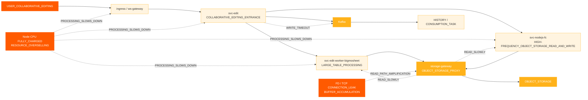
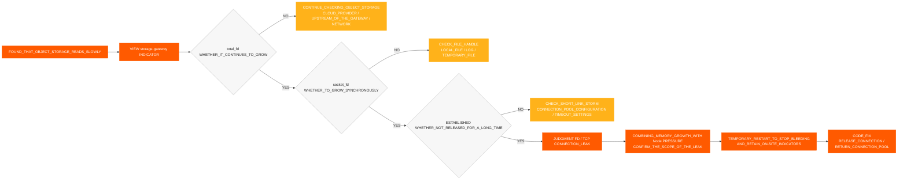
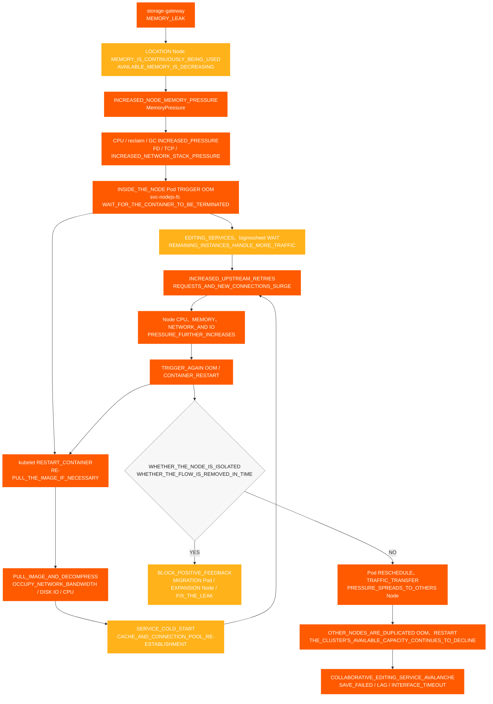

# เหตุการณ์การแก้ไขร่วมกัน

[← ShimoDocs Suite เอกสารการติดตั้ง](../README.md)

## 1. พื้นหลังของกรณี 

สภาพแวดล้อมของบริษัทขนาดใหญ่ประสบเหตุการณ์ไม่สามารถแก้ไขร่วมกันได้ ส่งผลต่อผู้ใช้ในการแก้ไขและบันทึกสเปรดชีตและเอกสารบางส่วนตามปกติ ในระหว่างเกิดเหตุ ผู้ใช้พบปัญหาเช่น การบันทึกล้มเหลว ความหน่วงในการแก้ไข และ Kafka การหมดเวลาการเขียน; ในฝั่งบริการเกิดปัญหา เช่น อ่านที่เก็บวัตถุช้าลง การใช้งานโหนดผิดปกติ และ CPU เมตริก /FD ไม่ปกติ TCP 

กรณีนี้แสดงให้เห็นว่าการไม่สามารถแก้ไขร่วมกันได้ ไม่จำเป็นต้องเกิดจากบริการแก้ไขโดยตรงเพียงอย่างเดียว มันอาจเกิดจากปัญหารวมกัน เช่น ทรัพยากรพื้นฐานถูกใช้งานเกิน, การจัดสรรโหนดรวมศูนย์, การเขียนของซอฟต์แวร์ตัวกลางช้าลง, เส้นทางการอ่านที่เก็บวัตถุผิดปกติ, หรือการรั่วไหลของการเชื่อมต่อ 

## 2. ลักษณะของเหตุการณ์ 

ผลกระทบหลักของเหตุการณ์นี้มีดังนี้: 

- ลิงก์การแก้ไขร่วมกันไม่สามารถใช้งานได้, ช้าลง, หรือมีการหมดเวลาของอินเทอร์เฟซ 
- บางสเปรดชีตหรือเอกสารไม่สามารถบันทึกได้ตามปกติ 
- แสดงป๊อปอัปข้างแก้ไข `Kafka write timeout`. 
- เวลาการอ่านข้อมูลในที่เก็บวัตถุเพิ่มขึ้น ส่งผลกระทบต่อการประมวลผลลิงก์การแก้ไขเพิ่มเติม 
- การตรวจสอบ Pod ดูปกติ แต่ผู้ใช้งานยังคงรายงานการบันทึกล้มเหลว การแก้ไขหน่วง และการหมดเวลาของอินเทอร์เฟซ 

## 3. กระบวนการตรวจสอบเบื้องต้น 

### 3.1 เริ่มจากปรากฏการณ์ของผู้ใช้งานในลิงก์การแก้ไข 

ลูกค้ารายงานความผิดปกติกับเอกสารบางรายการเป็นครั้งแรก ดังนั้นการสอบสวนเบื้องต้นจึงมุ่งไปที่ปัญหาการแก้ไขร่วม: 
1. ตรวจสอบลิงก์การแก้ไขและการบันทึก 
2. ตรวจสอบบันทึกบริการที่เกี่ยวข้อง 

3. ตรวจสอบ Kafka เขียนสถานะ 
4. ตรวจสอบความหน่วงเวลาในการอ่าน/เขียนของการจัดเก็บวัตถุ 

ระหว่างการสืบสวน พบความผิดปกติหลักสองประการ 

- `Kafka write timeout` เกิดขึ้นในลิงก์การแก้ไข 
- ความหน่วงเวลาในการอ่านของการจัดเก็บวัตถุผิดปกติ 

### 3.2 การยืนยันเบื้องต้นของการพึ่งพาภายนอก 

ระหว่างการสืบสวน เราได้ยืนยันโดยตรงกับเจ้าของการพึ่งพาภายนอกแต่ละราย: 

- ยืนยันกับฝั่งการจัดเก็บวัตถุแล้ว ไม่พบปัญหาเด่นชัดใด ๆ บนฝั่งผู้ให้บริการคลาวด์ 
- ยืนยันกับ Kafka ฝ่ายปฏิบัติการแล้ว ไม่พบปัญหาเด่นชัดบน Kafka ฝั่งคลัสเตอร์ 

ดังนั้นปัญหาไม่สามารถระบุได้โดยตรงว่ามาจากการจัดเก็บวัตถุหรือ Kafka ตัวบริการเอง และจำเป็นต้องตรวจสอบเพิ่มเติมไปยังโหนดธุรกิจภายใน, เกตเวย์, การเชื่อมต่อพูล, เครือข่าย, และชั้นทรัพยากร 

### 3.3 การเปลี่ยนจากการตรวจสอบ Pod เป็นการตรวจสอบ Node 

ในตอนแรก เมื่อเช็คการตรวจสอบ Pod ทั้ง CPU และหน่วยความจำอยู่ในขอบเขตที่ค่อนข้างปลอดภัย แต่ลูกค้ารายงานว่า CPU ของ Node ใช้งานเต็มที่ 

นี่คือจุดเปลี่ยนสำคัญในวินิจฉันปัจจุบัน: 

- ภายใต้การใช้ทรัพยากรเกินกำลัง การตรวจสอบ Pod อาจไม่สะท้อนความกดดันของโหนดอย่างถูกต้อง 
- เมื่อ Node CPU ถูกใช้งานเต็มที่ ความสามารถในการประมวลผลธุรกิจภายในคอนเทนเนอร์จะลดลง 
- หลังจากการประมวลผลธุรกิจช้าลง มันจะแสดงออกต่อไปเป็นการอ่านการเก็บวัตถุที่ช้า Kafka เขียน, คำขอที่ค้างอยู่, และการบันทึกที่ล้มเหลว. 

## 4. โซ่ผลกระทบของข้อบกพร่อง 

## 5. ข้อค้นพบสำคัญ 

### 5.1 โหนด CPU ความผิดปกติ 

หลายโหนดได้ประสบกับ CPU ความผิดปกติเรียงลำดับดังนี้: 
- '10.142.191.54' เริ่มมีข้อยกเว้นเวลา 18:20 
- '10.76.176.65' เริ่มมีข้อยกเว้นเวลา 18:30 
- '10.76.238.202' เริ่มมีข้อยกเว้นเวลา 18:40 
- '10.142.206.216' เริ่มความผิดปกติเวลา 18:42 
- '10.142.175.191' เริ่มความผิดปกติเวลา 18:45 

สามารถเห็นได้ว่าความผิดปกติแรกคือ '10.142.191.54' ตามด้วย CPU ปัญหาที่โหนดอื่น ซึ่งตรงกับลักษณะของความผิดปกติของทรัพยากรจุดเดียวที่แพร่ไปยังหลายโหนด 

### 5.2 CPU และหน่วยความจำขายเกิน 

การขายเกินของทรัพยากรก่อนและหลังความล้มเหลวมีดังนี้: 

| สถานการณ์ | ทรัพยากร | ความจุของคลัสเตอร์ | คำร้องขอรวม | สัดส่วนคำร้องขอ | ขีดจำกัดรวม | ขายเกิน |
| --- | --- | --- | --- | --- | --- | --- |
| โหนด nodejs-fc 6 | CPU | 192 คอร์ | 33.75 คอร์ | 17.6% | 457 คอร์ | 238.0% |
| โหนด nodejs-fc 6 | หน่วยความจำ | 768 กิกะไบต์ | 57.24 กิกะไบต์ | 7.5% | 884 กิกะไบต์ | 115.1% |
| โหนด nodejs-fc 12 | CPU | 192 คอร์ | 45.75 คอร์ | 23.8% | 493 คอร์ | 256.8% |
| โหนด nodejs-fc 12 | หน่วยความจำ | 768 กิกะไบต์ | 81.24 กิกะไบต์ | 10.6% | 980 กิกะไบต์ | 127.6% |
| โหนด nodejs-fc 12 หลังจากการปรับขนาด | CPU | 320 คอร์ | 45.75 คอร์ | 14.3% | 493 คอร์ | 154.1% |
| โหนด nodejs-fc 12 หลังจากการปรับขนาด | หน่วยความจำ | 1280 กิกะไบต์ | 81.24 กิกะไบต์ | 6.3% | 980 กิกะไบต์ | 76.6% |

ภายใต้สถานการณ์ปกติ, CPU การควบคุมการ over-subscription ประมาณ 150% ถือว่าเป็นที่ยอมรับได้ เมื่อเทียบกับมาตรฐาน ก่อนการปรับขนาดนี้, CPU over-subscription ได้ถึง 238% และหลังจากการเพิ่มขนาดเป็นสองเท่า, มันถึง 256.8% ซึ่งสร้างความเสี่ยงสูงของการเกิด traffic avalanche. 

### 5.3 การรวมตัวของการจัดตาราง Pod 

กลยุทธ์การจัดตารางค่าเริ่มต้น K8s ในสภาพแวดล้อมของบริษัทขนาดใหญ่ มักจะเติมเต็มหนึ่งโหนดก่อนที่จะใช้โหนดที่เหลือ ระหว่างการปรับใช้บริการแบบ rolling หรือการปรับขนาดชั่วคราว บริการที่มีโหลดสูงหลายตัวมักรวมตัวกันอยู่บนไม่กี่โหนด 

การรวมตัวที่มีความเสี่ยงสูงรวมถึง: 

- มีหลาย `svc-nodejs-fc` instance อยู่บนโหนดเดียว 
- การทำงาน `svc-edit-worker-bigmosheet` และ `ingress` บนโหนดเดียวกันพร้อมกัน 
- การซ้อนทับ `storage-gateway` บนโหนดเดียวกันส่งผลให้เกิดการรั่วไหลของการเชื่อมต่อหรือการเพิ่มของหน่วยความจำ 

### 5.4 การเชื่อมต่อ Storage Gateway และการรั่วไหลของหน่วยความจำ 

หลังจากตรวจสอบเพิ่มเติม โหนด TCP การตรวจสอบและ `storage-gateway` เมตริกของ Pod พบว่า: 

- `total_fd` ยังคงเพิ่มขึ้น 
- `socket_fd` ยังคงเพิ่มขึ้น 
- TCP การเชื่อมต่อยังคงอยู่ `ESTABLISHED` เป็นระยะเวลานาน 
- การเชื่อมต่อไม่ได้ถูกปล่อยทันเวลา และ FDs ไม่ถูกส่งกลับไปยังพูลการเชื่อมต่อ 
- Pod RSS / เซตการทำงานยังคงเติบโต และหลังจากการคืนทรัพยากรไม่สามารถกลับไปยังระดับปกติได้ 

ถ้า `total_fd`, `socket_fd`และการใช้หน่วยความจำทั้งหมดเพิ่มขึ้นต่อเนื่องพร้อมกัน ซึ่งบ่งชี้ว่าการเชื่อมต่อไม่ได้ถูกปล่อยและหน่วยความจำยังคงเติบโต ซึ่งควรจัดการเป็นการรั่วไหลของการเชื่อมต่อและหน่วยความจำ พร้อมทั้งให้ความสนใจกับความเสี่ยงของ Node `MemoryPressure` และ OOM  

### ผลกระทบจากความแตกต่างของเวอร์ชัน 5.5 

ในเวอร์ชันเก่า ข้อมูลไฟล์แนบรูปภาพถูกเขียนโดยตรงลงในตารางข้อมูล ในเวอร์ชันใหม่ เพื่อลด MySQL การใช้งานและค่าใช้จ่ายในการจัดเก็บ ข้อมูลไฟล์แนบรูปภาพจะถูกเขียนลงใน Metadata ของ object storage และ `/x` ใช้เส้นทางการอ่านที่เข้าถึง object storage โดยตรง 

ในโหมดพร็อกซี ฟังก์ชันพื้นฐานสำหรับการตรวจสอบว่าคีย์ของ object storage มีอยู่หรือไม่ ไม่ได้ปล่อยการเชื่อมต่ออย่างถูกต้อง ทำให้เกิดการรั่วไหลของการเชื่อมต่อ ปัญหานี้ ร่วมกับการจัดสรรทรัพยากรเกินและการจัดตารางงานที่รวมศูนย์ ทำให้เกิดความล้มเหลวในการใช้งานการแก้ไขร่วมกัน 

### หลักฐานการตรวจสอบ Object Storage และ Storage Gateway เวอร์ชัน 5.6 

เพื่อกำหนดว่าปัญหาเกิดขึ้นที่ฝั่งการจัดเก็บวัตถุ ฝั่งบริการธุรกิจ หรือชั้นพร็อกซี การสืบสวนเปรียบเทียบการจัดเก็บวัตถุและ `storage-gateway` ได้ถูกดำเนินการ: 

- ความหน่วงในการอ่านของการจัดเก็บวัตถุเพิ่มขึ้น ในขณะที่ความหน่วงในการเขียนยังคงปกติ โดยความผิดปกติส่วนใหญ่เกิดขึ้นบนเส้นทางการอ่าน 
- CPU, RSS / Working Set และอัตราการเติบโตของหน่วยความจำของ `storage-gateway` Pods เพิ่มขึ้นอย่างต่อเนื่อง 
- `total_fd` และ `socket_fd` ยังคงเติบโต และ TCP การเชื่อมต่อยังคงอยู่ใน `ESTABLISHED` สถานะเป็นเวลานาน 
- การเชื่อมต่อไม่ได้ถูกปล่อยทันเวลา FDs ไม่ถูกส่งคืนไปยังพูลการเชื่อมต่อ ทำให้เกิดความกดดันของหน่วยความจำและ OOM ความเสี่ยงต่อ Node 
- ไม่พบข้อผิดพลาดฝั่งเซิร์ฟเวอร์ที่ตรงกับขนาดของความผิดปกติทางธุรกิจบนฝั่งการจัดเก็บวัตถุ ดังนั้นการสืบสวนจึงถูกเน้นไปที่ `storage-gateway` เส้นทางการอ่านของพร็อกซี 

การตัดสินโดยรวม: การอ่านการจัดเก็บวัตถุช้าไม่ได้เกิดจากข้อผิดพลาดของบริการการจัดเก็บวัตถุเพียงอย่างเดียว แต่เกิดจากความกดดันของ FD TCP การเชื่อมต่อ หน่วยความจำ และทรัพยากรของ Node ที่สะสมจาก `storage-gateway` การเชื่อมต่อที่ไม่ได้ถูกปล่อย 

### 5.7 FD/TCP กระบวนการกำหนดรั่วไหล 

ครั้งนี้ ใช้ห่วงโซ่การตัดสินใจดังต่อไปนี้เพื่อยืนยันว่า `storage-gateway` มีการรั่วไหลของการเชื่อมต่อ: 

ข้อสรุปของคำพิพากษา: เมื่อ `total_fd`, `socket_fd`, จำนวนของ `ESTABLISHED` การเชื่อมต่อ และการใช้งานหน่วยความจำของ Pod เพิ่มขึ้นพร้อมกันภายในหน้าต่างเวลาเดียวกัน สาเหตุหลักสามารถพิจารณาได้ว่าเป็น “FD/TCP และการรั่วไหลของหน่วยความจำที่เกิดจากการเชื่อมต่อที่ไม่ถูกปล่อย”; หากการอ่านจาก Object Storage ช้าในขณะที่การเขียนเป็นปกติและตัวชี้วัดข้างต้นมีความผิดปกติพร้อมกัน ควรตรวจสอบเส้นทางการอ่านของ Proxy ก่อน 

## 6. สรุปสาเหตุหลัก 

ห่วงโซ่สาเหตุของความล้มเหลวนี้คือ: 

1. กลุ่มมีความสำคัญ CPU overcommit, กับ CPU การมอบเกิน 250% ในบางขั้นตอน 
2. ในระหว่างการอัปเดตแบบเลื่อนของบริการหรือการปรับขนาดชั่วคราว การจัดตาราง Pod จะมีความหนาแน่น ทำให้เกิดแรงกดดันของทรัพยากรเกินไปบนโหนดเดียว 
3. บริการที่มีโหลดสูง เช่น `svc-nodejs-fc`, `svc-edit-worker-bigmosheet`, และ `ingress` ถูกเน้นไปที่โหนดบางตัว 
4. `storage-gateway` มีปัญหาการปล่อยการเชื่อมต่อในเส้นทางการอ่านพร็อกซีการจัดเก็บวัตถุ ทำให้ FD, TCP การเชื่อมต่อ และการใช้งานหน่วยความจำเพิ่มขึ้นอย่างต่อเนื่อง 
5. หลังจากเกิดความกดดันของหน่วยความจำ และ OOM เกิดขึ้นบนโหนด การรีสตาร์ตคอนเทนเนอร์ การดึงอิมเมจ การเริ่มต้นบริการใหม่ และการลองใหม่จากต้นทางเพิ่มขึ้น CPUความกดดันของเครือข่ายและดิสก์ IO นำไปสู่การอ่านข้อมูลจาก object storage ช้าและการเขียนข้อมูลช้า Kafka การเขียนข้อมูลช้า 
6. การอ่านข้อมูลจาก object storage ช้าและ Kafka เวลาเกินกำหนดในการเขียนข้อมูล สุดท้ายจะแสดงออกมาในรูปการไม่สามารถใช้งานร่วมกันได้ในการแก้ไข เอกสารบันทึกไม่สำเร็จ และการแก้ไขล่าช้า 

## 7. แผนภาพการแพร่กระจายทรัพยากร Node Avalanche 

บริการธุรกิจที่เกี่ยวข้องกับความผิดพลาดนี้ทั้งหมดรันอยู่ใน K8s คลัสเตอร์ การรั่วไหลของหน่วยความจำใน `storage-gateway` ครั้งแรกจะใช้หน่วยความจำที่มีอยู่ของโหนด จากนั้นผ่าน OOMการรีสตาร์ตคอนเทนเนอร์ การดึงอิมเมจ การเริ่มต้นบริการใหม่ และการลองใหม่จากต้นทาง จะสร้างวงจรย้อนกลับเชิงบวกของการใช้ทรัพยากร เมื่อ Pod ที่ผิดปกติถูกกำหนดใหม่หรือต้องโอนไปยังโหนดอื่น ความกดดันจะเริ่มแพร่ไปยังโหนดที่ปกติ จนในที่สุดทำให้เกิด avalanche ระดับคลัสเตอร์ 

แผนภาพนี้ต้องเน้นไปที่สองวงจรขยาย: 

1. **วงจรย้อนกลับเชิงบวกภายในโหนด**: OOM → kubelet รีสตาร์ตหรือดึงอิมเมจ → เริ่มต้นเย็น → การลองใหม่จากต้นทางและการเชื่อมต่อใหม่เพิ่มขึ้น → CPU, ความกดดันของหน่วยความจำ, เครือข่าย, และดิสก์ IO ยังคงเพิ่มขึ้น → OOM อีกครั้ง 
2. **ลูปการแพร่กระจายข้ามโหนด**: Pods บนโหนดที่ผิดปกติถูกจัดตารางใหม่, การจราจรเข้า (ingress) ถูกย้าย, หรืออินสแตนซ์ที่เหลือรับผิดชอบคำขอ → โหลดโหนดที่มีสุขภาพดีเพิ่มขึ้น → โหนดอื่นประสบ OOM และรีสตาร์ทซ้ำแล้วซ้ำเล่า → ความสามารถที่พร้อมใช้งานของคลัสเตอร์ยังคงลดลง 

## 8. การจัดการและซ่อมแซม 

### 8.1 การจัดการระยะสั้น 

- ลบการจราจรของเกตเวย์สำหรับ ingress หรือโหนดที่ผิดปกติเพื่อป้องกันไม่ให้การจราจรใหม่เข้าสู่เส้นทางแรงดันสูง 
- รีสตาร์ทบริการที่ผิดปกติโดยใช้ FD, TCP, หรือหน่วยความจำที่เติบโตอย่างต่อเนื่อง 
- โยกย้ายหรือกระจาย Pods ที่มีโหลดสูงออกจากโหนดแรงดันสูง 
- ขับไล่ Pods หรือแยกโหนดที่ใช้ CPU. 
- หลีกเลี่ยงการปรับขนาดเฉพาะ Pods ทางธุรกิจ, ให้ความสำคัญกับการเสริมทรัพยากรของโหนด 
- เพิ่มความสามารถ quick-fail สำหรับ `svc-edit` ซิงค์อินเทอร์เฟซเพื่อป้องกันคำขอสะสมเป็นเวลานาน 

### 8.2 การซ่อมแซมระยะยาว 

- แก้ไขปัญหาการเชื่อมต่อที่ไม่ได้ปล่อยเมื่อทำการตรวจสอบว่า Key มีอยู่ในโหมดพร็อกซีเก็บข้อมูลวัตถุ 
- กำหนดนโยบายป้องกันความเข้ากันไม่ได้สำหรับบริการหลักเพื่อหลีกเลี่ยงการรวมบริการที่มีความเสี่ยงสูงบนโหนดเดียวกัน 
- กำหนดนโยบายการขับออกโหนดเพื่อป้องกันไม่ให้โหนดยังคงรันบริการหลักหลังจากทรัพยากรถูกใช้หมด 
- จัดตั้ง CPU และการตรวจสอบการใช้งานเกินของหน่วยความจำ 
- ก่อนการขยายบริการ ต้องประเมินระดับทรัพยากรในสภาพแวดล้อมของลูกค้า และยืนยันแผนการขยายกับหัวหน้าโครงการ 
- ตั้งค่าการแจ้งเตือนสำหรับ OOM, FD, TCP, คำขอล่าช้า, Kafka ค้างสะสม และความหน่วงในการอ่าน/เขียนของการจัดเก็บวัตถุสำหรับบริการหลัก 

## 9. ข้อสรุปการทบทวนกรณี 

ความล้มเหลวนี้บ่งชี้ว่าเมื่อฟีเจอร์แก้ไขร่วมกันไม่สามารถใช้งานได้ การตรวจสอบไม่ควรมุ่งเน้นเฉพาะแค่บันทึกบริการแก้ไข หากทรัพยากรโหนดพื้นฐานถูกใช้เต็มแล้ว บริการธุรกิจจะช้าลงโดยรวม ซึ่งแสดงออกเป็นอาการหลายอย่างระดับบนเช่น Kafka การเขียนหมดเวลา, การอ่านการจัดเก็บวัตถุช้า และการบันทึกล้มเหลว 

เมื่อจัดการปัญหาที่คล้ายกันในอนาคต ควรยืนยันทรัพยากรของคลัสเตอร์และโหนดก่อน จากนั้นจึงดำเนินการตรวจสอบผ่านมิดเดิลแวร์ การตรวจสอบธุรกิจ บันทึก และลิงก์การติดตาม เพื่อหลีกเลี่ยงการเริ่มการสืบสวนจากบันทึกบริการเดียวและตกอยู่ในวงจรการแก้ปัญหาแบบเฉพาะเจาะจง 

---
