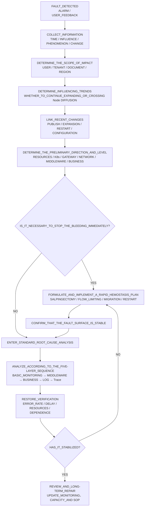
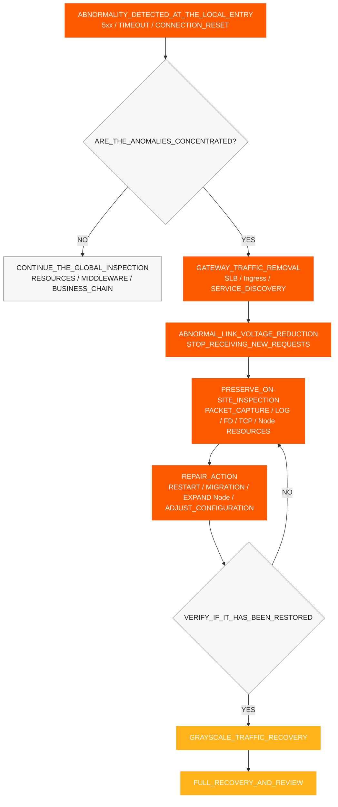
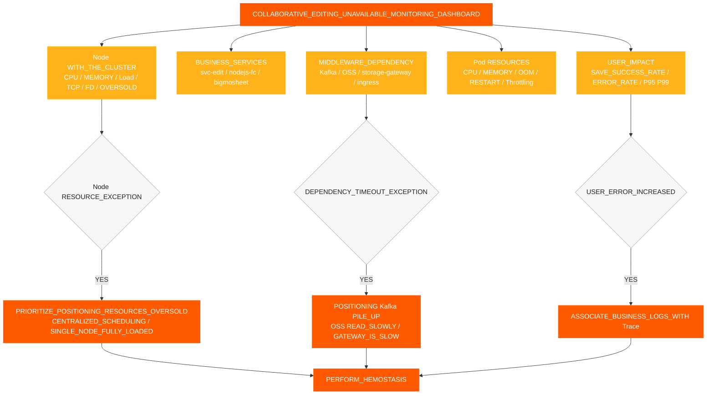
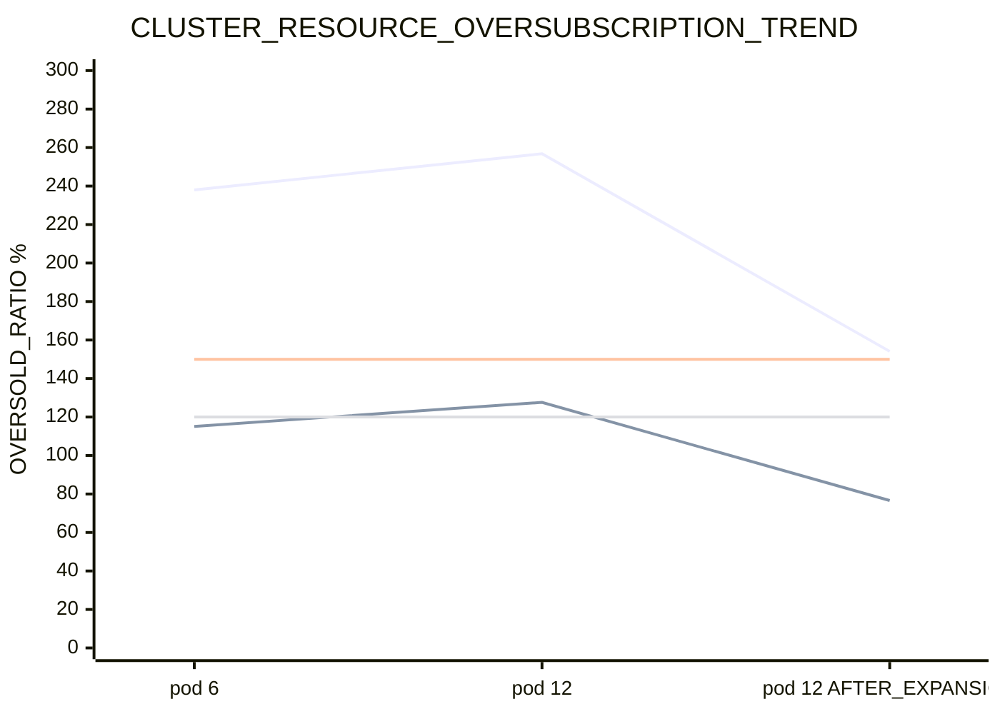
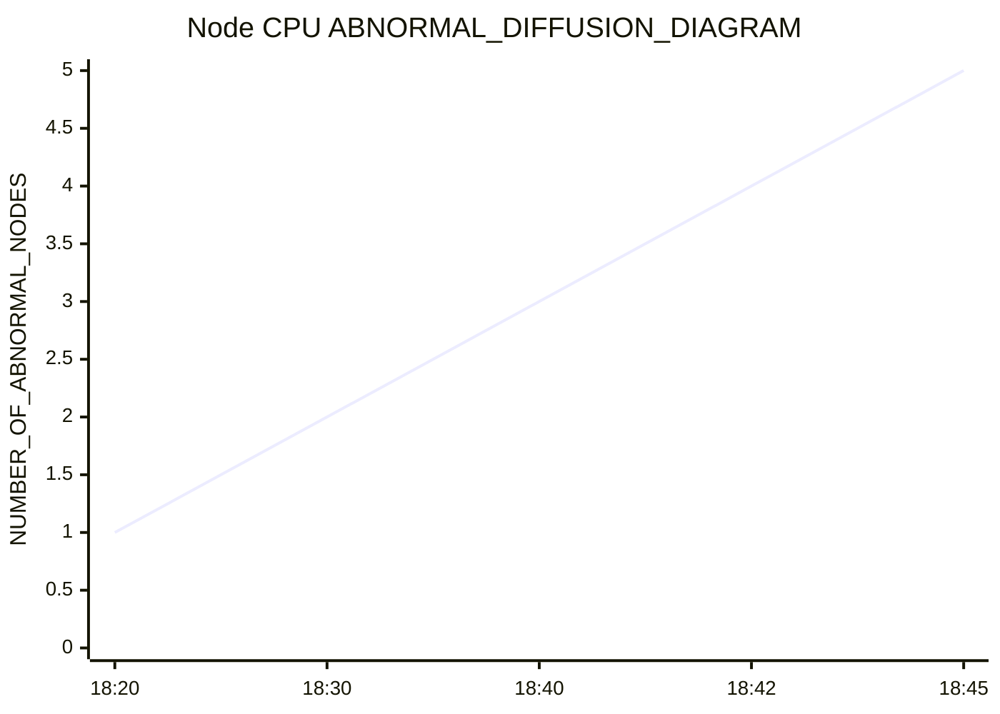
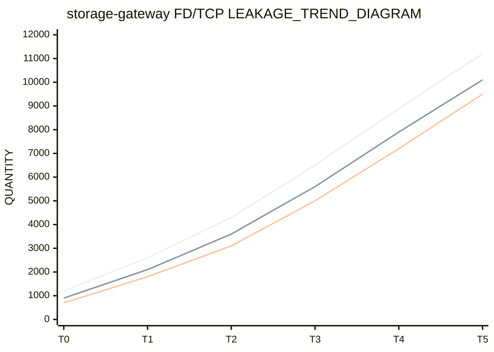
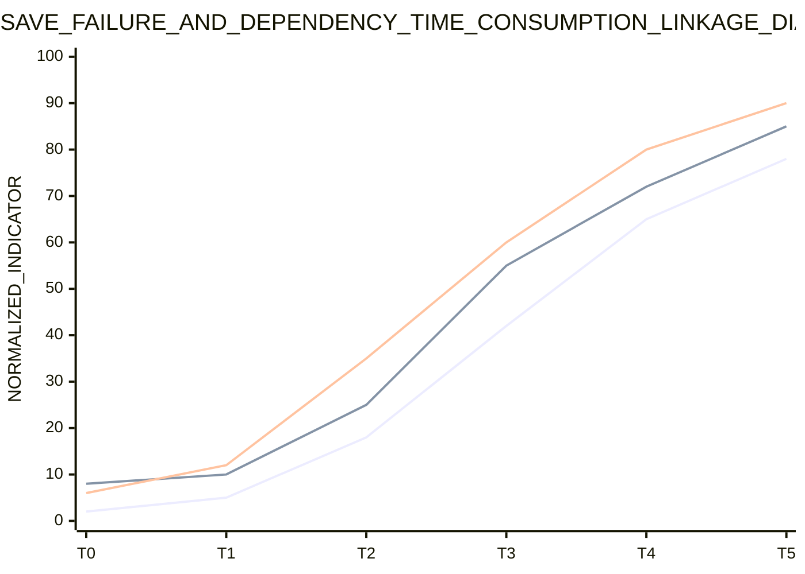
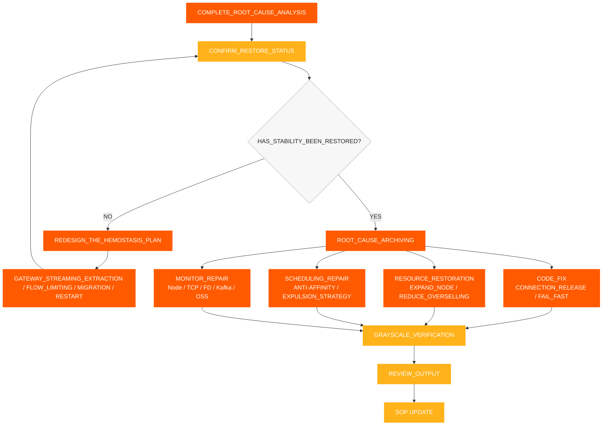

# การตอบสนองต่อเหตุการณ์ SOP

[← ShimoDocs Suite เอกสารการติดตั้ง](../README.md)

## 1. การเก็บรวบรวมข้อมูล

หลังจากได้รับข้อผิดพลาด ให้บันทึกข้อมูลดังต่อไปนี้ก่อน:

- เวลาที่เกิดเหตุ: เวลาการแจ้งเตือนครั้งแรก, เวลาที่ลูกค้าตอบกลับครั้งแรก, ว่าตรงกับการปล่อยหรือปรับขนาดหรือไม่
- ขอบเขตผลกระทบ: เช่า, ประเภทเอกสาร, จำนวนไฟล์, จำนวนผู้ใช้, ว่ามุ่งเน้นไปที่ตารางหรือโต๊ะขนาดใหญ่
- อาการเฉพาะ: การบันทึกล้มเหลว, การแก้ไขผิดพลาด Kafka หมดเวลา, การอ่านออบเจ็กต์สตอเรจช้า API หมดเวลา
- การเปลี่ยนแปลงล่าสุด: การปล่อยบริการ, การรีสตาร์ทแบบโรลลิ่ง, การปรับขนาด Pod, การปรับขนาดโหนด, การจัดเก็บหรือ Kafka การเปลี่ยนแปลง
- บริการสำคัญ: `svc-nodejs-fc`, `svc-edit`, `svc-edit-worker-bigmosheet`, `storage-gateway`, `ingress`, `ws-gateway`.


## 2. การประเมินข้อมูลและการจำแนกประเภทความผิดพลาด

หลังจากรวบรวมข้อมูลเสร็จแล้ว ให้ประเมินขอบเขตความผิดพลาด แนวโน้มการพัฒนา และทิศทางสาเหตุหลักตามอาการ ตัวชี้วัด เหตุการณ์ และบันทึกการเปลี่ยนแปลง จากนั้นจึงตัดสินใจว่าจำเป็นต้องควบคุมทันทีหรือไม่ ผลการประเมินควรสร้างข้อสรุปที่ชัดเจน และไม่ควรพึ่งพาเพียง Pod หรือบันทึกเดียวเท่านั้น

ประเด็นสำคัญสำหรับการประเมิน:

- ขอบเขตผลกระทบต่อผู้ใช้: ผู้ใช้ ผู้เช่า ประเภทเอกสาร ภูมิภาค และบริการที่ได้รับผลกระทบ
- ลักษณะผลกระทบ: การบันทึกล้มเหลว ความล่าช้าในการแก้ไข API หมดเวลา Kafka หมดเวลาการเขียน การอ่านวัตถุเก็บข้อมูลช้า
- แนวโน้มผลกระทบ: ว่ามีการขยายตัวต่อเนื่องหรือไม่ ว่ามีการแพร่กระจายจาก Pod หรือ Node เดียวไปยังหลาย Node หรือไม่
- เปลี่ยนความสัมพันธ์: ว่ามีความเกี่ยวข้องกับการปล่อยบริการ การปรับขนาด Pod การปรับขนาดโหนด การรีสตาร์ทแบบหมุนเวียน การกำหนดค่า หรือการเปลี่ยนแปลงซอฟต์แวร์กลางหรือไม่ 
- ทิศทางเบื้องต้น: ทรัพยากร, K8s เครื่องควบคุม, เกตเวย์, เครือข่าย, ซอฟต์แวร์กลาง, รหัสธุรกิจ, หรือปัญหาข้อมูล 

กำหนดระดับความผิดพลาดตามผลการพิจารณา: 

| ระดับ | เกณฑ์การพิจารณา | เป้าหมายการตอบสนอง | 
| --- | --- | --- | 
| P0 | การแก้ไขแพร่หลายไม่สามารถใช้ได้ เกิดข้อผิดพลาดในการบันทึกอย่างต่อเนื่อง มีความผิดปกติของชุดบริการหลัก | หยุดการสูญเสียภายใน 15 นาที ชี้แจงทิศทางสาเหตุหลักภายใน 30 นาที | 
| P1 | ผู้เช่าบางส่วน เอกสารบางส่วน โหนดบางส่วนผิดปกติ อัตราความผิดพลาดเพิ่มขึ้นอย่างมาก | ระบุลิงก์ผิดปกติภายใน 30 นาที ฟื้นฟูความเสถียรภายใน 60 นาที | 
| P2 | คำขอช้าเพียงจุดเดียวหรือขนาดเล็ก เกิดข้อผิดพลาดในการบันทึกเป็นครั้งคราว | ยืนยันสาเหตุและแผนแก้ไขภายใน 1 วันทำการ | 

ข้อสรุปการตัดสินใจควรตอบอย่างน้อยสามคำถาม: ผลกระทบปัจจุบันใหญ่แค่ไหน ความผิดพลาดกำลังขยายหรือไม่ เราควรหยุดการสูญเสียก่อนหรือทำการวิเคราะห์สาเหตุรากโดยตรง 




## 3. การห้ามเลือดอย่างรวดเร็ว

หากฝั่งผู้ใช้ล้มเหลวต่อเนื่อง หรือผลการตัดสินใจแสดงว่าความผิดพลาดกำลังขยาย ให้ดำเนินการควบคุมก่อน จากนั้นทำการวิเคราะห์เชิงลึกต่อ เป้าหมายของการควบคุมคือเพื่อลดขอบเขตความผิดพลาด ปิดกั้นปฏิกิริยาตอบสนองเชิงบวกของทรัพยากร ในขณะเดียวกันยังคงรักษาสถานที่เกิดความผิดพลาดให้มากที่สุด

1. ลบทราฟฟิกออกจากเกตเวย์ผิดปกติ SLB แบ็กเอนด์ รายการ Ingress อินสแตนซ์ของบริการ หรือ Node ที่ปิดกั้นการร้องขอใหม่ไม่ให้เข้าสู่เส้นทางที่ผิดปกติต่อ
2. ตั้งค่า Node ที่ผิดปกติให้ไม่สามารถจัดตารางหรือแยกออกเพื่อป้องกันไม่ให้ Pods ถูกจัดตารางไปยัง Node ที่มีความกดดันสูงต่อ
3. รีสตาร์ท Pods ที่ประสบปัญหา OOMการเติบโตของหน่วยความจำอย่างต่อเนื่อง หรือ การรั่วไหลของ FD/TCP โดยให้ความสำคัญกับ `storage-gateway`, `svc-nodejs-fc`, และ `svc-edit-worker-bigmosheet`.
4. กระจาย Pods ที่มีโหลดสูงเพื่อหลีกเลี่ยง `nodejs-fc`, `bigmosheet`, `ingress`, และ `storage-gateway` การรวมตัวบน Node เดียวกัน
5. หยุดการปรับขนาดของ Pods ธุรกิจที่ไม่ถูกต้อง ให้ความสำคัญกับการปรับขนาด Node หรือการคืนทรัพยากรที่พร้อมใช้งาน
6. ดำเนินการจำกัดอัตราหรือล้มเหลวอย่างรวดเร็วสำหรับการลองใหม่ของ upstream การสร้างการเชื่อมต่อ และการสะสมคำขอเพื่อป้องกันไม่ให้การเชื่อมต่อใหม่พุ่งสูงหลังจากการเริ่มต้นเย็น
7. บันทึก Node CPUหน่วยความจำ OOM, FD, TCPอัตราความผิดพลาด และความหน่วงของอินเทอร์เฟซ ก่อนและหลังการหยุดการรั่วไหล

### 3.1 การลบทราฟฟิก Gateway

เมื่อข้อบกพร่องปรากฏเป็นโหนดท้องถิ่นที่ผิดปกติ, การเข้าเกตเวย์ท้องถิ่น หรืออินสแตนซ์บริการท้องถิ่น การลบทราฟฟิกที่เข้าข้อผิดปกตินั้นควรทำก่อน จากนั้นจึงจัดการโหนดและ Pods เป้าหมายของการลบทราฟฟิกคือเพื่อลดความกดดันบนลิงก์ที่มีข้อบกพร่องและป้องกันไม่ให้อินสแตนซ์ที่ผิดปกติยังคงรับคำขอใหม่ต่อไป 

เงื่อนไขตัวกระตุ้น: 

- อัตราความผิดพลาดของ Ingress บางประเภท, SLB backend, gateway Pod, หรือ Node มีมากกว่าตัวอื่นอย่างมีนัยสำคัญ 
- ข้อผิดพลาด Gateway 5xx, การหมดเวลาของ upstream, และการรีเซ็ตการเชื่อมต่อมีความเข้มข้นที่จุดเข้าเพียงไม่กี่จุด 
- Node บางตัว CPU, การโหลด, TCPและเมทริกซ์ FD ชัดเจนว่าไม่ปกติ และคำขอใหม่ยังคงเข้ามาอย่างต่อเนื่อง 
- ตัวอย่างลิงก์หลัก เช่น `svc-edit`, `ws-gateway`, และ `storage-gateway` ได้เริ่มช้าลงแล้ว 

การดำเนินการที่ต้องทำ: 

1. ลบแบ็กเอนด์ที่ไม่ปกติออกจาก SLB, Ingress, gateway routing, หรือ service discovery 
2. ทำเครื่องหมายชั่วคราวโหนดที่ไม่ปกติว่าไม่สามารถกำหนดได้ เพื่อป้องกันไม่ให้ Pod ใหม่ถูกกำหนดเข้ามา 
3. ทำการจับแพ็กเก็ต, บันทึก, FD/TCPและตรวจสอบทรัพยากรบนโหนดหรือตัวอย่างที่ได้เอาการจราจรออกแล้ว 
4. หลังจากทำการรีสตาร์ท การย้ายระบบ การปรับขนาด หรือการซ่อมแซมการตั้งค่า ให้เริ่มด้วยการคืนค่าด้วยโหลดการจราจรขนาดเล็กก่อน แล้วจึงคืนค่าเต็มรูปแบบ 
5. ก่อนการคืนค่า ให้ยืนยันว่าอัตราความผิดพลาด เวลาในการตอบสนองของอินเทอร์เฟซ เมตริก Node/FD กลับสู่ปกติแล้ว CPU, และ TCP 




## 4. กระบวนการวิเคราะห์สาเหตุรากฐานมาตรฐาน

หลังจากทำการหยุดเลือดอย่างรวดเร็วแล้วและยืนยันว่าผิวหน้าความผิดปกติคงที่ ให้ดำเนินการวิเคราะห์สาเหตุรากฐาน ลำดับการแก้ไขปัญหามาตรฐานจะดำเนินการในลักษณะ 'จากล่างขึ้นบน จากหยาบไปละเอียด'

1. การตรวจสอบพื้นฐาน: ทรัพยากรคลัสเตอร์ โหนด Node ทรัพยากร Pod
2. การเฝ้าระวังมิดเดิลแวร์: Kafka, การจัดเก็บวัตถุ, เกตเวย์, เครือข่าย.
3. การเฝ้าระวังธุรกิจ: อัตราความสำเร็จในการบันทึก, เวลาตอบสนองของอินเทอร์เฟซ, และอัตราข้อผิดพลาด.
4. การเฝ้าระวังบันทึก: บันทึกข้อผิดพลาด, บันทึกหมดเวลา, OOM/บันทึกการรีสตาร์ท.
5. การติดตามลิงก์ติดตาม: ลิงก์คำขอ, การเรียกช้าที่ช้า, การยืดออกข้อยกเว้น.

ข้อกำหนดหลัก:

- แต่ละชั้นจะแสดงผลข้อสรุปการตัดสินก่อน จากนั้นจึงเข้าสู่ชั้นถัดไป.
- ดู Node ก่อน แล้วดู Pod; ดูแนวโน้มทั่วโลกก่อน แล้วค่อยดูบันทึกของบริการเดียว
- อย่าข้ามระดับถัดไปเพียงเพราะไม่พบความผิดปกติในชั้นใดชั้นหนึ่ง
- การตรวจสอบ บันทึก และการติดตามจำเป็นต้องสัมพันธ์กันโดยใช้หน้าต่างเวลาเดียวกัน, Pod, Node และ Trace ID

แต่ละชั้นตอบคำถามหลักเพียงข้อเดียว:

- การตรวจสอบพื้นฐาน: ทรัพยากรมีไม่เพียงพอแล้วหรือไม่ และเกิดการขายเกิน, การกำหนดตารางแบบรวมศูนย์, หรือการกระจายข้าม Node หรือไม่?
- การตรวจสอบ Middleware: มีความล่าช้า, งานค้าง, การปฏิเสธคำขอ, หรือความผิดปกติของการเชื่อมต่อหรือไม่?
- การตรวจสอบธุรกิจ: บริการใด, APIหรือประเภทเอกสารใดที่ผลกระทบของผู้ใช้สอดคล้องกับ?
- การตรวจสอบบันทึก: มีหลักฐานชัดเจนของข้อผิดพลาด, การหมดเวลา, OOMการรีสตาร์ท, หรือการหมดสระว่ายน้ำการเชื่อมต่อหรือไม่?
- การติดตาม Trace Link: คำขอล้มเหลวติดขัดอยู่ที่ใดแน่—ที่บริการ, node, หรือ span ใด? 


### 4.1 การแก้ไขปัญหาการตรวจสอบพื้นฐาน 

ให้ความสำคัญกับการตรวจสอบมิติของ Node มากกว่ามิติของ Pod เพียงอย่างเดียว เมื่อทรัพยากรถูกใช้งานเกินขีดจำกัด การตรวจสอบ Pod อาจแสดงค่าภายในขอบเขตที่ปลอดภัย แต่ Node อาจถูกใช้งานเต็มแล้ว 

รายการตรวจสอบ: 

- รวมทั้งหมดของ Cluster CPU และความจุหน่วยความจำและความจุที่สามารถใช้ได้ 
- Node CPU, หน่วยความจำ, โหลด, ดิสก์, เครือข่าย 
- Pod CPU, หน่วยความจำ, การรีสตาร์ท OOM, CPU การจำกัดความเร็ว (throttling) 
- ว่ามีหลายบริการความเข้มสูง CPU หรือบริการ IO สูง ถูกรวมอยู่บน Node เดียวหรือไม่ 
- หลังจากการปล่อยแบบ Rolling release, Pods ถูกกำหนดบน Node แรก ๆ เป็นส่วนใหญ่หรือไม่ 
- มีการขาดนโยบาย anti-affinity และ eviction หรือไม่ 

การตัดสินใจหลัก: 

- ว่าผลรวมทั้งหมด CPU ขีดจำกัด / cluster CPU ความจุเกิน 150% หรือไม่ 
- ว่าผลรวมขีดจำกัดหน่วยความจำ / ความจุหน่วยความจำของ cluster เกิน 120% หรือไม่ 
- ว่ามีกระบวนการที่ Node หนึ่งล้มเหลวก่อน แล้ว Node อื่น ๆ ค่อย ๆ ประสบกับการใช้งานเพิ่มขึ้นหรือไม่ CPU  


### 4.2 การแก้ไขปัญหาการตรวจสอบ Middleware 

การแก้ไขปัญหา Middleware มุ่งเน้นไปที่ Kafka, การจัดเก็บวัตถุ, เกตเวย์, และเครือข่าย การตัดสินใจโดยเฉพาะสำหรับ Kafka มีดังนี้; เมตริกละเอียดและรายการตัดสินสำหรับการจัดเก็บวัตถุ, `storage-gateway`เกตเวย์ และเครือข่าย จะถูกบันทึกอย่างเป็นมาตรฐานในมาตรา 9.7 และรายการตรวจสอบที่เกี่ยวข้อง 

#### 4.2.1 Kafka 

รายการตรวจสอบ: 

- ความหน่วงเวลาในการเขียนของผู้ผลิตและอัตราความล้มเหลว 
- คิวงานของหัวข้อ 
- ฝั่งโบรกเกอร์ CPUดิสก์ เครือข่าย และความหน่วงของคำร้อง 
- ว่ามีการส่งซ้ำ การสูญเสียแพ็กเก็ต หรือความหนาแน่นของการเชื่อมต่อจากลูกค้าหรือไม่ Kafka. 
- ว่ามีเวลาเกินเพียงแต่การเขียนของฝั่งธุรกิจในขณะที่ไม่มีความผิดปกติที่ชัดเจนบน Kafka ฝั่งปฏิบัติการ 

ตรรกะการตัดสิน: 

- หากไม่มีความผิดปกติบน Kafka ฝั่งปฏิบัติการ แต่ฝั่งธุรกิจยังคงพบเวลาเกินในการเขียน ให้เน้นตรวจสอบโหนดธุรกิจ CPUความหนาแน่นของเครือข่าย และความสามารถในการประมวลผลของลูกค้า 
- ถ้า Kafka คิวงานค้างและข้อผิดพลาดของธุรกิจเกิดขึ้นพร้อมกัน ให้ตรวจสอบก่อนว่าคิวงานค้างเกิดจากการประมวลผลบริการด้านบนที่ช้า 


### 4.3 การตรวจสอบธุรกิจ, บันทึก และการติดตาม 

#### 4.3.1 การตรวจสอบธุรกิจ 

ยืนยันลิงก์ที่ผิดปกติตามปรากฏการณ์ของลูกค้า: 

1. ว่าความล้มเหลวในการบันทึกเกิดขึ้นในตาราง, ตารางขนาดใหญ่, หรือประเภทเอกสารเฉพาะหรือไม่ 
2. ว่าอินเทอร์เฟซการแก้ไขพบการหมดเวลา, การร้องขอช้า, หรืออัตราข้อผิดพลาดเพิ่มขึ้นหรือไม่ 
3. ตรวจสอบว่า `Kafka write timeout` เกิดขึ้นหรือไม่ 
4. ตรวจสอบว่าการอ่านจากการจัดเก็บวัตถุช้าและการเขียนเป็นปกติหรือไม่ 
5. ตรวจสอบว่า `bigmosheet operation oss_get` เกิน 5 วินาทีหรือไม่ 
6. ตรวจสอบว่าบริการที่เกี่ยวข้องกับ WebSocket, การแก้ไขร่วมกัน, ประวัติ และการจัดเก็บวัตถุมีความล่าช้าเพิ่มขึ้นพร้อมกันหรือไม่ 

#### 4.3.2 การตรวจสอบบันทึก 

บันทึกสำคัญที่ต้องตรวจสอบ: 

- บันทึกสำหรับความล้มเหลวในการบันทึกการแก้ไข 
- บันทึกสำหรับ Kafka ไทม์เอาต์การเขียน 
- บันทึกสำหรับการอ่านและเขียนที่ช้าในที่เก็บวัตถุ 
- บันทึกสำหรับ OOM, การรีสตาร์ท, การใช้พูลการเชื่อมต่อหมด, และการใช้ FD หมด 
- บันทึกสำหรับข้อผิดพลาด 5xx ของเกตเวย์, ไทม์เอาต์ต้นทาง, และการรีเซ็ตการเชื่อมต่อ 

#### 4.3.3 การติดตามลิงก์ Trace 

ใช้ Trace เพื่อติดตามคำขอที่ล้มเหลวเพียงรายการเดียว: 

- ตรวจสอบว่าคำขอติดอยู่ในเกตเวย์, การแก้ไขร่วม, ที่เก็บวัตถุ, Kafkaหรือโซ่การใช้ประวัติ 
- ตรวจสอบว่า Span ใดมีความหน่วงผิดปกติหรือไม่ 
- ตรวจสอบว่าการเรียกที่ช้ากระจุกตัวอยู่ในบริการ, โหนด, หรือประเภทเอกสารใด ๆ 
- เปรียบเทียบความแตกต่างของลิงก์ระหว่างคำขอล้มเหลวและคำขอปกติ 


## 5. การตรวจสอบการฟื้นฟู 

หลังจากดำเนินการหยุดเลือดเสร็จสิ้น ต้องตรวจสอบตัวชี้วัดต่อไปนี้: 

- รายการเกตเวย์ที่ถูกลบ, SLB แบ็กเอนด์ หรืออินสแตนซ์ที่ผิดปกติได้หยุดรับทราฟฟิกใหม่แล้ว 
- อัตราความสำเร็จในการบันทึกกลับคืนเป็นปกติ 
- อัตราความผิดพลาดของอินเทอร์เฟซแก้ไขลดลง 
- Kafka ความหน่วงเวลาในการเขียนกลับคืนเป็นปกติ 
- Kafka คิวงานค้างลดลง 
- ความหน่วงเวลาในการอ่านจากการจัดเก็บวัตถุกลับคืนเป็นปกติ 
- Node CPU, หน่วยความจำ และโหลดลดลง 
- `storage-gateway` FD และ socket FD ไม่เพิ่มขึ้นอย่างต่อเนื่องอีกต่อไป 
- โหนดผิดปกติไม่แพร่กระจายอีกต่อไป 
- หลังจากกู้คืนทราฟฟิกในระหว่างการปล่อยแบบเกรย์สเกล เกตเวย์ 5xx, upstream timeout และการรีเซ็ตการเชื่อมต่อไม่ได้เพิ่มขึ้นอีก 


## 6. ข้อกำหนดการตรวจสอบและแจ้งเตือน 

ต้องดำเนินการแจ้งเตือนดังต่อไปนี้: 

- Node CPUแจ้งเตือน , หน่วยความจำ, โหลด, ดิสก์ และเครือข่าย 
- Node TCP การนับการเชื่อมต่อ, การส่งซ้ำ, การสูญเสียแพ็กเก็ต และ `ESTABLISHED` การนับการเชื่อมต่อ 
- Pod OOMแจ้งเตือน , การรีสตาร์ท, และ CPU การจำกัดการใช้งาน 
- บริการหลัก OOM แจ้งเตือน 
- CPU การแจ้งเตือนการขายเกิน: CPU ข้อจำกัด / คลัสเตอร์ CPU ความจุเกิน 150% หรือไม่ 
- การแจ้งเตือนการขายหน่วยความจำเกิน: ข้อจำกัดหน่วยความจำ / ความจุหน่วยความจำของคลัสเตอร์เกิน 120% 
- Kafka การแจ้งเตือนคิวงานค้าง 
- Kafka การแจ้งเตือนหมดเวลาเขียน 
- การแก้ไขบันทึกความล้มเหลวในการบันทึกข้อผิดพลาด 
- `bigmosheet operation oss_get > 5s` การแจ้งเตือน 
- `storage-gateway` การแจ้งเตือน FD และ socket FD เพิ่มขึ้นอย่างต่อเนื่อง 
- `storage-gateway` RSS / ชุดงานกำลังเพิ่มขึ้นอย่างต่อเนื่องและ Node `MemoryPressure` การแจ้งเตือน 


## 7. แดชบอร์ดการติดตามตัวชี้วัดสำคัญ 

ส่วนนี้เป็นเครื่องมือเสริมและไม่เปลี่ยนลำดับกระบวนการหลัก แดชบอร์ดใช้สังเกตแนวโน้มและหาทิศทาง ในขณะที่ `kubectl`, `jq`และ PromQL ใช้เพื่อให้ได้หลักฐานเฉพาะ; การตรวจสอบในสถานที่ควรทำตามรายการตรวจสอบรายละเอียดใน ส่วนที่ 9 ดำเนินการแต่ละรายการและบันทึกข้อสรุป 

### 7.1 การแบ่งชั้นแดชบอร์ด 

แนะนำให้แบ่งแดชบอร์ดข้อผิดพลาดการแก้ไขร่วมที่ไม่สามารถใช้งานได้ออกเป็น 5 ชั้น และตรวจสอบทีละชั้นจากบนลงล่างในระหว่างการสอบสวน: 

| ชั้น | ชื่อแดชบอร์ด | ตัวชี้วัดหลัก | วัตถุประสงค์ |
| --- | --- | --- | --- |
| L1 | แดชบอร์ดผลกระทบผู้ใช้ | อัตราความสำเร็จในการบันทึก, อัตราข้อผิดพลาดในการแก้ไข, อินเตอร์เฟซ P95/P99, การเชื่อมต่อการทำงานร่วมออนไลน์ | กำหนดว่าผู้ใช้ได้รับผลกระทบจริงหรือไม่ |
| L2 | แดชบอร์ดบริการธุรกิจ | QPS, อัตราความผิดพลาด, ความหน่วงเวลา, และจำนวนการรีสตาร์ทของ `svc-edit`, `svc-nodejs-fc`, `bigmosheet` | กำหนดว่าบริการธุรกิจใดที่ความผิดปกติโฟกัสอยู่ |
| L3 | แดชบอร์ดมิดเดิลแวร์ | Kafka ความหน่วงเวลาในการเขียน, Kafka ความค้าง, ความหน่วงเวลาในการอ่าน/เขียนของการจัดเก็บวัตถุ, ความหน่วงเวลาของเกตเวย์ขาเข้า | กำหนดว่าการพึ่งพาต่างๆ ทำให้ช้าลงหรือไม่ |
| L4 | แดชบอร์ดทรัพยากรคอนเทนเนอร์ | Pod CPUหน่วยความจำ OOM, การรีสตาร์ท, CPU การจำกัดอัตรา | ตรวจสอบว่าภาชนะเองผิดปกติหรือไม่ |
| L5 | แดชบอร์ดโหนดและคลัสเตอร์ | โหนด CPU, หน่วยความจำ, โหลด, TCP, FD, ทรัพยากรที่จัดเกิน, การกระจาย Pod | ตรวจสอบว่าทรัพยากรพื้นฐานรองรับการดำเนินธุรกิจหรือไม่ |

### 7.2 แผนภูมิภาพรวมตัวชี้วัดสำคัญ



### 7.3 แผนภูมิแนวโน้มการจัดเกินทรัพยากร

แผนภูมินี้ใช้เพื่อสังเกตว่า CPU และการจัดเกินหน่วยความจำเข้าสู่พื้นที่ความเสี่ยงสูงก่อนและหลังการขยาย ในแดชบอร์ดจริง แนะนำให้ตั้ง CPU การจัดเกินที่ 150% และการจัดเกินหน่วยความจำที่ 120% เป็นเส้นเกณฑ์แจ้งเตือน



### 7.4 โหนด CPU แผนภูมิเชิงแนวโน้มการแพร่กระจาย

แผนภูมินี้ใช้เพื่อสังเกตว่ามีลักษณะการแพร่กระจายหรือไม่ โดยที่โหนดเดียวล้มเหลวก่อน จากนั้นโหนดอื่น ๆ ค่อย ๆ ถูกดึงลงมา



### 7.5 FD/TCP แผนภูมิแนวโน้มการรั่ว

แผนภูมินี้ใช้เพื่อตรวจสอบว่า `storage-gateway` มีการเชื่อมต่อหรือรั่ว FD หาก `total_fd`, `socket_fd`และจำนวน `ESTABLISHED` การเชื่อมต่อเพิ่มขึ้นอย่างต่อเนื่องพร้อมกัน ควรแก้ไขการรั่วของการเชื่อมต่อเป็นลำดับแรก



### 7.6 แผนภูมิเชื่อมโยงระหว่างข้อผิดพลาดทางธุรกิจและความหน่วงของการพึ่งพิง

แผนภูมินี้ใช้เพื่อตรวจสอบว่าความล้มเหลวในการบันทึกของผู้ใช้มีความสัมพันธ์กับการเพิ่มของ Kafka ความหน่วงในการเขียนและความหน่วงในการอ่านของการเก็บข้อมูลแบบวัตถุหรือไม่ หากทั้งสามเพิ่มขึ้นพร้อมกันในช่วงเวลาหน้าเดียวกัน ควรให้ความสำคัญกับการตรวจสอบความสามารถในการประมวลผลของโหนดธุรกิจและความหนาแน่นของโซ่พึ่งพิง



### 7.7 เกณฑ์เตือนที่แนะนำ

| ตัวชี้วัด | เกณฑ์ที่แนะนำ | การดำเนินการหลังจากเกิดเหตุ |
| --- | --- | --- |
| อัตราความสำเร็จในการบันทึก | ต่ำกว่า 99% ติดต่อกัน 5 นาที | เข้าสู่การยืนยันผลกระทบทางธุรกิจ เชื่อมโยงบันทึกข้อผิดพลาดและ Traces |
| แก้ไขอินเตอร์เฟซ P95 | สูงกว่าพื้นฐาน 2 เท่า ติดต่อกัน 5 นาที | ตรวจสอบ `svc-edit`, `nodejs-fc`, `bigmosheet` |
| Kafka ความหน่วงเวลาในการเขียน | สูงกว่าค่าฐาน 2 เท่าหรือเกิดเวลาเขียนหมด | ตรวจสอบ Kafka งานค้าง, โหนดธุรกิจ CPU, การส่งซ้ำเครือข่าย |
| Kafka งานค้าง | เติบโตต่อเนื่องเป็นเวลา 10 นาที | ตรวจสอบงานผู้บริโภคและความเร็วการเขียนของต้นทาง |
| OSS ความหน่วงเวลาในการอ่าน | P95 เกิน 5 วินาที | ตรวจสอบ `storage-gateway`, เครือข่าย, ฝั่งจัดเก็บวัตถุ |
| โหนด CPU | สูงกว่า 90% ติดต่อกัน 5 นาที | ตรวจสอบการกระจาย Pod, CPU การใช้เกิน, บริการที่มีโหลดสูง |
| CPU การใช้เกิน | เกิน 150% | ระงับการปรับขนาด Pod ธุรกิจ, ให้ความสำคัญกับการประเมินการปรับขนาด Node |
| การใช้หน่วยความจำเกิน | เกิน 120% | ตรวจสอบ OOM, ความเสี่ยงในการไล่ออกจากระบบ, และการรั่วของหน่วยความจำ |
| `total_fd` / `socket_fd` | เพิ่มขึ้นอย่างต่อเนื่องเป็นเวลา 10 นาที | ตรวจสอบ FD/TCP รั่ว, รีสตาร์ทหากจำเป็นเพื่อหยุดการสูญเสีย |
| TCP อัตราการส่งซ้ำ | สูงกว่าค่าฐาน 2 เท่า | จับแพ็กเก็ตเพื่อตรวจสอบการสูญหายของแพ็กเก็ต, การคับคั่ง, ปัญหาของหน้าต่าง |
| การรีสตาร์ท Pod / OOM | เกิดกับบริการหลักใดๆ | เชื่อมโยงบันทึกทันทีและปล่อยการเปลี่ยนแปลง |

### 7.8 Node CPU และคำสั่งสอบถามการใช้หน่วยความจำเกิน

คำสั่งต่อไปนี้ใช้กับสถานการณ์ที่ธุรกิจดำเนินการใน K8s คลัสเตอร์ ก่อนการดำเนินการ ให้ยืนยันว่า kubeconfig ปัจจุบันได้สลับไปยังคลัสเตอร์ที่มีปัญหาแล้ว และทำการแทนที่ `NODE_NAME` กับชื่อโหนดเป้าหมาย

#### 7.8.1 ตรวจสอบโหนดจริง CPU และการใช้หน่วยความจำ

```bash
# View the real-time CPU and memory usage of all Nodes
kubectl top nodes

# View the real-time usage of the specified Node
kubectl top node "$NODE_NAME"

# View the node's capacity, allocatable resources, and pressure status
kubectl describe node "$NODE_NAME" | sed -n '/Capacity:/,/Allocatable:/p'
kubectl describe node "$NODE_NAME" | sed -n '/Conditions:/,/Addresses:/p'

# Directly view the CPU/memory Requests, Limits, and usage ratio allocated to the Node
kubectl describe node "$NODE_NAME" | sed -n '/Allocated resources:/,/Events:/p'
```

จุดสนใจหลัก: `CPU%`, `MEMORY%`, `MemoryPressure`, `DiskPressure`, `PIDPressure`. เมื่อการใช้งานจริงเกิน 90% จำเป็นต้องกำหนดทันทีว่าจำเป็นต้องควบคุมการรั่วไหลหรือไม่โดยพิจารณาจากการกระจาย Pod และการลบทราฟฟิกของเกตเวย์

#### 7.8.2 สถิติของ CPU, การร้องขอหน่วยความจำ และขีดจำกัดสำหรับโหนดที่ระบุ

```bash
# Statistics of CPU/memory requests and limits for all Pod containers on the specified Node.
# Dependencies: kubectl, jq; memory is uniformly converted to MiB, CPU is uniformly converted to cores.
NODE_NAME="<TARGET_NODE_NAME>"

kubectl get pods -A --field-selector "spec.nodeName=${NODE_NAME}" -o json | jq '
  def cpu_core:
    if . == null then 0
    elif endswith("m") then (rtrimstr("m") | tonumber / 1000)
    else tonumber
    end;
  def mem_mib:
    if . == null then 0
    elif endswith("Ki") then (rtrimstr("Ki") | tonumber / 1024)
    elif endswith("Mi") then (rtrimstr("Mi") | tonumber)
    elif endswith("Gi") then (rtrimstr("Gi") | tonumber * 1024)
    elif endswith("Ti") then (rtrimstr("Ti") | tonumber * 1024 * 1024)
    elif endswith("K") then (rtrimstr("K") | tonumber / 1024)
    elif endswith("M") then (rtrimstr("M") | tonumber)
    elif endswith("G") then (rtrimstr("G") | tonumber * 1024)
    elif endswith("T") then (rtrimstr("T") | tonumber * 1024 * 1024)
    else (tonumber / 1024 / 1024)
    end;
  [ .items[]
    | ([(.spec.containers[]?, .spec.initContainers[]?) | .resources.requests.cpu? // "0"] | map(cpu_core) | add) as $cpu_req
    | ([(.spec.containers[]?, .spec.initContainers[]?) | .resources.limits.cpu? // "0"] | map(cpu_core) | add) as $cpu_limit
    | ([(.spec.containers[]?, .spec.initContainers[]?) | .resources.requests.memory? // "0"] | map(mem_mib) | add) as $mem_req
    | ([(.spec.containers[]?, .spec.initContainers[]?) | .resources.limits.memory? // "0"] | map(mem_mib) | add) as $mem_limit
    | {cpu_request: $cpu_req, cpu_limit: $cpu_limit, mem_request_mib: $mem_req, mem_limit_mib: $mem_limit}
  ]
  | {
      cpu_request_core: (map(.cpu_request) | add),
      cpu_limit_core: (map(.cpu_limit) | add),
      mem_request_mib: (map(.mem_request_mib) | add),
      mem_limit_mib: (map(.mem_limit_mib) | add)
    }'
```

หมายเหตุ: การคำนวณการจัดกำหนดการอย่างเป็นทางการ K8s ใช้กฎ "เอาค่าสูงสุด" สำหรับ `initContainers`คำสั่งข้างต้นใช้สำหรับสรุปแบบรวดเร็วในสถานที่ เหมาะสำหรับตรวจจับการใช้เกินชัดเจน; เมื่อเทียบกับแดชบอร์สทรัพยากรหรือข้อมูลของตัวจัดกำหนดการ ควรใช้สถิติทรัพยากรโหนดที่ระบบให้มาเป็นมาตรฐาน 

#### 7.8.3 การคำนวณคลัสเตอร์ CPU และอัตราส่วนการใช้หน่วยความจำเกิน 

```bash
# Get the total Allocatable resources of all nodes in the cluster
kubectl get nodes -o json | jq '
  [ .items[].status.allocatable
    | {
        cpu_core: (if (.cpu | endswith("m"))
                   then (.cpu | rtrimstr("m") | tonumber / 1000)
                   else (.cpu | tonumber)
                   end),
        memory_bytes: (.memory | rtrimstr("Ki") | tonumber * 1024)
      }
  ]
  | {
      cpu_allocatable_core: (map(.cpu_core) | add),
      memory_allocatable_gib: (map(.memory_bytes) | add / 1024 / 1024 / 1024)
    }'

# Summarize the CPU/memory limits of all Pods for calculating the overcommit ratio
kubectl get pods -A -o json | jq '
  def cpu_core:
    if . == null then 0
    elif endswith("m") then (rtrimstr("m") | tonumber / 1000)
    else tonumber
    end;
  def mem_gib:
    if . == null then 0
    elif endswith("Ki") then (rtrimstr("Ki") | tonumber / 1024 / 1024)
    elif endswith("Mi") then (rtrimstr("Mi") | tonumber / 1024)
    elif endswith("Gi") then (rtrimstr("Gi") | tonumber)
    else (tonumber / 1024 / 1024 / 1024)
    end;
  [ .items[] | .spec.containers[]?
    | {
        cpu_limit_core: (.resources.limits.cpu? // "0" | cpu_core),
        memory_limit_gib: (.resources.limits.memory? // "0" | mem_gib)
      }
  ]
  | {
      cpu_limit_core: (map(.cpu_limit_core) | add),
      memory_limit_gib: (map(.memory_limit_gib) | add)
    }'
```

สูตรการคำนวณ: `CPU overcommit ratio = Total CPU Limits of all Pods / Total CPU Allocatable of all Nodes × 100%`; `Memory overcommit ratio = Total Memory Limits of all Pods / Total Memory Allocatable of all Nodes × 100%`. แนะนำให้ใช้ CPU การ overcommit ที่ 150% และการ overcommit ของหน่วยความจำที่ 120% เป็นเส้นอ้างอิงความเสี่ยงสูง แต่ค่าขีดสุดสุดท้ายควรกำหนดตามฐานข้อมูลสภาพแวดล้อมของลูกค้า 

#### 7.8.4 คำสั่งสอบถาม Prometheus / Grafana

```promql
# Cluster CPU Limit Oversubscription Rate
100 * sum(kube_pod_container_resource_limits{resource="cpu", unit="core"})
  / sum(kube_node_status_allocatable{resource="cpu", unit="core"})

# Cluster Memory Limit Overcommit Rate
100 * sum(kube_pod_container_resource_limits{resource="memory", unit="byte"})
  / sum(kube_node_status_allocatable{resource="memory", unit="byte"})

# View CPU Limit Overcommit Rate by Node
100 * sum by (node) (kube_pod_container_resource_limits{resource="cpu", unit="core"})
  / on (node) kube_node_status_allocatable{resource="cpu", unit="core"}

# View Memory Limit Oversubscription Rate by Node
100 * sum by (node) (kube_pod_container_resource_limits{resource="memory", unit="byte"})
  / on (node) kube_node_status_allocatable{resource="memory", unit="byte"}

# Node Actual CPU Usage
100 * (1 - avg by (instance) (rate(node_cpu_seconds_total{mode="idle"}[5m])))

# Node actual memory usage
100 * (1 - node_memory_MemAvailable_bytes / node_memory_MemTotal_bytes)

# K8s node memory pressure status, 1 indicates MemoryPressure=True
kube_node_status_condition{condition="MemoryPressure", status="true"}
```

หากตัวชี้วัดทรัพยากร `unit` และ `node` ชื่อแท็กใน Prometheus ไม่สอดคล้องกับคำสั่งด้านบน คุณควรยืนยันแท็กจริงในรายละเอียดเมตริกก่อนทำการปรับเปลี่ยน อัตรา oversubscription สามารถบ่งบอกถึงความเสี่ยงที่อาจเกิดขึ้นในการประกาศทรัพยากรเท่านั้นและไม่สามารถแทนการประเมิน Node จริงได้ CPUหน่วยความจำ OOM, และ `MemoryPressure`.


## 8. การตรวจสอบและวงรอบการแก้ไขระยะยาว




## 9. รายการตรวจสอบโดยละเอียด 

รายการตรวจสอบนี้ดำเนินการตามลำดับ "ปรากฏการณ์ผู้ใช้ → ทรัพยากรพื้นฐาน → K8s → กลางซอฟต์แวร์ → บันทึกและลิงก์ → การประมวลผลวงรอบปิด" แต่ละรายการควรบันทึกเวลาสังเกตวัตถุผิดปกติ ภาพหน้าจอตัวชี้วัด หรือผลลัพธ์คำสั่งสอบถาม เพื่อหลีกเลี่ยงการบันทึกเพียงว่า "ปกติ/ผิดปกติ" โดยไม่มีการตรวจสอบ 

### 9.1 การยืนยันปรากฏการณ์และขอบเขตผลกระทบ 

| เป้าหมายการตรวจสอบ | รายการที่ต้องยืนยัน | การตัดสินความผิดปกติ | บันทึก / ข้อสรุป ณ สถานที่ |
| --- | --- | --- | --- |
| ผลกระทบต่อผู้ใช้ | การแก้ไขร่วมกันไม่พร้อมใช้งาน, การบันทึกล้มเหลว, การแก้ไขล่าช้า, การหมดเวลาของอินเทอร์เฟซ | ผู้ใช้, ผู้เช่า หรือเอกสารหลายรายการมีความผิดปกติพร้อมกัน, พิจารณาเป็นความล้มเหลวทางธุรกิจ | |
| ขอบเขตของความล้มเหลว | เกิดการรวมตัวอย่างเด่นในตาราง, ตารางคำนวณขนาดใหญ่, ประเภทเอกสารเฉพาะ, ผู้เช่าบางราย หรือภูมิภาคเฉพาะหรือไม่? | เมื่อมีการรวมตัวอย่างเด่น ให้จัดลำดับความสำคัญโดยการจัดกลุ่มตามเส้นทางบริการ, ประเภทข้อมูล หรือโหนด | |
| ลักษณะของข้อผิดพลาด | เกิด 'kafka writes timeout', gateway 5xx, การรีเซ็ตการเชื่อมต่อ, หรือการหมดเวลาของ upstream หรือไม่ | หลายประเภทของข้อผิดพลาดเกิดขึ้นพร้อมกันภายในช่วงเวลาเดียวกัน, จัดลำดับความสำคัญของการพึ่งพาสาธารณะและชั้นทรัพยากร | |
| ความสัมพันธ์ทางเวลา | เวลาของการแจ้งเตือนครั้งแรก, ป้อนกลับครั้งแรก, และจุดเริ่มต้นของความผิดปกติของตัวชี้วัด | เมื่อเกิดขึ้นพร้อมกับการปล่อย, การปรับขนาด, การรีสตาร์ทแบบหมุน หรือการเปลี่ยนแปลงการกำหนดค่า, บันทึกหมายเลขคำสั่งเปลี่ยนแปลง | |
| ขนาดผลกระทบ | ปริมาณคำขอล้มเหลว, อัตราความล้มเหลว, จำนวนการเชื่อมต่อร่วมใช้งานออนไลน์, บริการและสำเนาที่ได้รับผลกระทบ | เพิ่มระดับความรุนแรงของความผิดพลาดและดำเนินการหยุดการสูญเสียก่อนเมื่อผลกระทบยังคงขยายต่อไป | |

### 9.2 การตรวจสอบรายการพื้นฐาน: โหนด 

| วัตถุประสงค์การตรวจสอบ | ตัวชี้วัดสำคัญ | การประเมินสำคัญ | คำแนะนำที่แนะนำ | บันทึก / ข้อสรุป ณ สถานที่ |
| --- | --- | --- | --- | --- |
| CPU การใช้งาน | โหนด CPU การใช้งาน, โหลด 1/5/15, CPU steal, iowait, การหยุดชั่วคราวของซอฟต์แวร์ | CPU สม่ำเสมอ >90%, โหลดเข้าใกล้หรือเกินจำนวนคอร์, การเพิ่มขึ้นผิดปกติของ iowait/การหยุดชั่วคราวของซอฟต์แวร์ | ตรวจสอบ Pods ที่มีโหลดสูง, หากจำเป็นให้ลดการรับส่งข้อมูล, ย้าย Pods, หรือปรับขนาดโหนด | |
| การใช้งานหน่วยความจำ | ที่ใช้, ที่ว่าง, RSS, Page Fault, Swap, OOM Kill | ที่ว่างลดลงอย่างต่อเนื่อง, การใช้ Swap, OOM, การเพิ่มแรงกดดันในการกู้คืนหน่วยความจำ | ตรวจสอบข้อผิดพลาดหน่วยความจำและ Pods ที่ใช้หน่วยความจำสูง, ยืนยัน `MemoryPressure`, แยกโหนดหากจำเป็น | |
| การใช้หน่วยความจำเกินกำหนด | ขีดจำกัดหน่วยความจำ/ที่จัดสรรได้, คำขอหน่วยความจำ/ที่จัดสรรได้ | ขีดจำกัดหน่วยความจำเกิน 120% หรือคำขอรวมตัวมากเกินไป | หยุดการปรับขนาดธุรกิจ, ให้ความสำคัญกับการเพิ่มโหนด, ลดขีดจำกัดที่มีความเสี่ยงสูงหรือแจกจ่าย Pods | |
| CPU การใช้เกินกำหนด | CPU ขีดจำกัด/ที่จัดสรรได้, CPU คำขอ/ที่จัดสรรได้ | CPU ขีดจำกัดเกิน 150%, หรือ Pods ที่มีโหลดสูงรวมตัวอยู่บนโหนดเดียวกัน | ปรับการกำหนดค่าทรัพยากร, การต่อต้านความเป็นเอกภาพ, และการกระจายตัวของสำเนา |  |
| TCP การเชื่อมต่อ | รวม TCP การเชื่อมต่อ, `ESTABLISHED`, `TIME_WAIT`, `CLOSE_WAIT`, อัตราการส่งซ้ำ | จำนวนการเชื่อมต่อเพิ่มขึ้นอย่างต่อเนื่อง, `CLOSE_WAIT` ไม่ถูกปล่อยออกมานาน, อัตราการส่งซ้ำเพิ่มขึ้น | หาตำแหน่งการรั่วไหลของการเชื่อมต่อ, pool การเชื่อมต่อ, การติดขัดของเครือข่าย, และไคลเอนต์ผิดปกติ |  |
| netstat / socket | จำนวน socket ทั้งหมด, พอร์ตที่ฟัง, Recv-Q, Send-Q, จำนวนการเชื่อมต่อล้มเหลว | Recv-Q/Send-Q สะสมอย่างต่อเนื่องหรือคิวการฟังล้น | แก้ไขปัญหาด้วยการจับแพ็กเก็ต, pool การเชื่อมต่อบริการ, และพารามิเตอร์เคอร์เนล |  |
| FD | FD ทั้งหมด, socket FD, การใช้ FD ของกระบวนการ, `file-nr` | `total_fd`, `socket_fd` เพิ่มขึ้นอย่างต่อเนื่องหรือเข้าใกล้ขีดจำกัดของกระบวนการ | บันทึกสถานะปัจจุบัน, รีสตาร์ทบริการที่รั่วไหล, แก้ไขตรรกะการปล่อยการเชื่อมต่อ |  |
| ดิสก์ | การใช้งานระบบไฟล์, inodes, ความสามารถในการส่งข้อมูลของดิสก์, IOPS, await, util, ความล่าช้าในการเขียน | ดิสก์เต็ม, inodes เต็ม, await/util ยังคงสูงอยู่ | ลบไฟล์ชั่วคราวหรือบันทึก, ขยายดิสก์, และตรวจสอบการสกัดภาพและการเขียนบันทึก |  |
| เครือข่าย | NIC แบนด์วิดท์, การสูญเสียแพ็กเก็ต, แพ็กเก็ตผิดพลาด, การส่งซ้ำ, การขัดจังหวะซอฟต์, ตารางติดตามการเชื่อมต่อ | แบนด์วิดท์ใช้เต็มที่แล้ว, การสูญเสียแพ็กเก็ต/การส่งซ้ำเพิ่มขึ้น, conntrack ใกล้ถึงขีดจำกัด | ตรวจสอบการดึงอิมเมจ, การรับส่งข้อมูลข้ามโหนด, การรับส่งข้อมูลเกตเวย์, และนโยบายเครือข่าย |  |
| สถานะของโหนด | `Ready`, `MemoryPressure`, `DiskPressure`, `PIDPressure` | มีสถานะความกดดันใด ๆ เป็นจริง หรือ Node ไม่พร้อม | เริ่มจากการลบการรับส่งข้อมูลของโหนด, ห้ามการจัดสรรงาน, และรักษาสถานะปัจจุบัน |  |
| การกระจาย Pod | สูง CPU/หน่วยความจำ บริการรวมอยู่ในโหนดเดียวกัน | `svc-nodejs-fc`, `svc-edit-worker-bigmosheet`, `ingress`, `storage-gateway` ในโหนดเดียวกัน | ทำการแยกสตรีมเกตเวย์, ย้าย, หรือจัดตารางใหม่ |  |

### 9.3 การตรวจสอบรายการพื้นฐาน: Pod

| วัตถุที่ตรวจสอบ | เมตริกหลัก | จุดตัดสินใจสำคัญ | คำแนะนำที่แนะนำ | บันทึก / ข้อสรุป ณ สถานที่ |
| --- | --- | --- | --- | --- |
| CPU การใช้งาน | Pod/คอนเทนเนอร์ CPU การใช้, CPU การจำกัด, ช่วงเวลาที่ถูกจำกัด | สูง CPU การใช้หรือการจำกัดที่เพิ่มขึ้นต่อเนื่อง | ตรวจสอบ CPU ขีดจำกัด, การทำงานเกินขีดจำกัดของโหนด, และคิวคำขอสะสม |  |
| การใช้งานหน่วยความจำ | ชุดงาน RSS, Heap, การใช้หน่วยความจำคอนเทนเนอร์, แนวโน้มการเติบโต | การเพิ่มขึ้นของหน่วยความจำต่อเนื่องที่ฟื้นตัวหลังรีสตาร์ท, สงสัยว่ามีการรั่ว | รวบรวมข้อมูล heap และเมตริกของกระบวนการ รีสตาร์ทหากจำเป็นเพื่อหยุดการรั่วไหล |  |
| OOM และรีสตาร์ท | `OOMKilled`, จำนวนการรีสตาร์ท, สถานะล่าสุด, เวลาการรีสตาร์ท | OOM เกิดขึ้นพร้อมกับข้อผิดพลาดธุรกิจหรือความกดดันของโหนด | เชื่อมโยงเหตุการณ์ kubelet, บันทึกคอนเทนเนอร์ และการลองใหม่แบบ up-stream |  |
| การเชื่อมต่อเครือข่าย | Pod TCP การเชื่อมต่อ, `ESTABLISHED`, `TIME_WAIT`, `CLOSE_WAIT` | การเพิ่มขึ้นอย่างฉับพลันของการเชื่อมต่อใหม่หรือการเชื่อมต่อยาวที่ไม่ได้ถูกปล่อย | ตรวจสอบ connection pool, เวลาหมดอายุ, การลองใหม่ และการปิดการเชื่อมต่อฝั่งเซิร์ฟเวอร์ |  |
| netstat / socket | Recv-Q, Send-Q, พอร์ตที่กำลังฟัง, socket FD | การสะสมคิวหรือ socket FD ที่เติบโตสอดคล้องกับหน่วยความจำ | ระบุการอุดตันเครือข่ายหรือการรั่วไหลของการเชื่อมต่อ |  |
| ปริมาณการรับส่งเครือข่าย | การรับ/ส่งข้อมูล, แพ็กเก็ตผิดพลาด, การสูญเสียแพ็กเก็ต, การรับส่งข้อมูลข้ามโหนด | การเพิ่มขึ้นของปริมาณจราจรอย่างฉับพลัน, การลองใหม่ผิดปกติ, หรือการรับส่งข้อมูลข้ามโหนดที่เพิ่มขึ้น | ตรวจสอบการกำหนดเส้นทางเกตเวย์, การค้นหาบริการ และนโยบายการลองใหม่ |  |
| สถานะการทำงาน | พร้อมใช้งาน, สถานะคอนเทนเนอร์, การตรวจสอบล้มเหลว, เวลาเริ่มต้น | การตรวจสอบล้มเหลว, CrashLoopBackOff, การเริ่มต้นเย็นช้าลง | ลบปริมาณการรับส่งก่อน จากนั้นยืนยันความสัมพันธ์และการคืนทรัพยากรก่อนค่อยๆ ฟื้นฟู |  |
| สำเนาและการจัดตารางเวลา | สำเนาที่มีอยู่, สำเนาที่ต้องการ, รอดำเนินการ, การกระจายโหนด | สำเนาไม่เพียงพอหรือ Pod รอดำเนินการเพิ่มขึ้นอย่างต่อเนื่อง | ตรวจสอบทรัพยากรไม่เพียงพอ, taints, affinity/anti-affinity และ quotas |  |

### 9.4 K8s การตรวจสอบ

| วัตถุที่ตรวจสอบ | ตัวชี้วัด / ข้อมูลสำคัญ | การประเมินสำคัญ | คำแนะนำการดำเนินการ | บันทึก / ข้อสรุปภาคสนาม |
| --- | --- | --- | --- | --- |
| ข้อมูลเหตุการณ์ | Pod OOM, Evicted, Probe failed, FailedScheduling, BackOff, NodeNotReady | กำหนดว่ามีการรีสตาร์ทเป็นชุด, การย้ายออก, ความล้มเหลวในการจัดตารางหรือความล้มเหลวของ probe หรือไม่ | จัดเรียงตามเวลาและเชื่อมโยงกับ releases, โหนด และข้อผิดพลาดทางธุรกิจ |  |
| สถานะการจัดตาราง | จำนวน Pod รอดำเนินการ, เวลาในการจัดตาราง, เหตุผลที่ทรัพยากรไม่เพียงพอ, การใช้โควต้า | กำหนดว่า Pod ไม่สามารถจัดตารางได้เนื่องจาก CPU/ ขาดแคลนหน่วยความจำ, taints หรือกฎ affinity | ขยายโหนด, ปรับกลยุทธ์การจัดตาราง, หรือชั่วคราวลดภาระงานที่ไม่ใช่แกนหลัก |  |
| kubelet | ข้อผิดพลาด kubelet, PLEG ความล่าช้า, เวลาเริ่ม/หยุด Pod, การดึง image ล้มเหลว | ว่าการรีสตาร์ทและการดึงอิมเมจกลายเป็นแหล่งเพิ่มทรัพยากรหรือไม่ | ตรวจสอบ kubelet, container runtime, ดิสก์, และเครือข่าย |  |
| API เซิร์ฟเวอร์ | คำขอ QPS, P95/P99, 5xx, จำนวนการปฏิเสธ, คิวงาน | ว่าควบคุมแพลนตอบสนองช้าหรือเกิด throttling หรือไม่ | ตรวจสอบ APIServer, etcd, และเครือข่ายควบคุมแพลน |  |
| etcd | commit latency, fsync latency, การเปลี่ยนแปลง leader, ขนาด DB, ความล้มเหลวของ proposal, backend commits, การใช้งานดิสก์ | ว่าความหน่วง, การเลือก leader, พื้นที่, หรือการ IO ของดิสก์ผิดปกติหรือไม่ | ตรวจสอบความเสถียรของดิสก์และเครือข่าย etcd, หลีกเลี่ยงการรีสตาร์ทแบบไม่ตรวจสอบในช่วงเกิดความล้มเหลว |  |
| Controller / Scheduler | ความลึกของคิวงาน, ความล้มเหลวของการจัดตาราง, ความล่าช้าของการ reconcile, อัตราการสร้าง Pod | ว่าคอนโทรลเลอร์มี backlog หรือไม่, การฟื้นฟู replica ล่าช้าหรือไม่ | ตรวจสอบโหลดควบคุมแพลนและโควต้าทรัพยากร |  |
| Service / Endpoint | จำนวน endpoints, addresses ที่พร้อม, การอัปเดต EndpointSlice, ความหน่วงของ service discovery | ว่าหลังบ้านที่มีประสิทธิภาพลดลงเนื่องจาก Pods ไม่พร้อมหรือไม่ | ตรวจสอบ probes, Service selector, และรายการ backend ของ gateway |  |
| ปลั๊กอินเครือข่าย | CNI ข้อผิดพลาด, อินเทอร์เฟซเครือข่ายของ Pod, DNS ความหน่วง, CoreDNS QPS/อัตราข้อผิดพลาด, การปฏิเสธ NetworkPolicy | ว่ามีความผิดปกติของเครือข่ายระหว่าง Pods, Nodes, หรือ DNS | ตรวจสอบ CNI, CoreDNS, NetworkPolicy, และ conntrack |  |
| เกตเวย์และทราฟฟิก | Ingress/SLB 5xx, หมดเวลาของ upstream, การรีเซ็ตการเชื่อมต่อ, จำนวนสุขภาพของ backend, QPS | ความผิดปกติมุ่งไปที่ ingress, backend, หรือ Node เฉพาะหรือไม่ | ลบความผิดปกติ SLB backend, รายการ Ingress, หรืออินสแตนซ์เกตเวย์ที่ผิดปกติ และปล่อยทราฟฟิกแบบ gray ระหว่างการกู้คืน |  |

### 9.5 การติดตาม Middleware: MySQL

| เมตริกหลัก | การประเมินสำคัญ | คำแนะนำที่แนะนำ | บันทึก / ข้อสรุป ณ สถานที่ |
| --- | --- | --- | --- |
| QPS, TPS, จำนวนการเชื่อมต่อ, การเชื่อมต่อที่ใช้งานอยู่, ความล้มเหลวของการเชื่อมต่อ | มีการพุ่งขึ้นของการเชื่อมต่อ, การหมดของพูลการเชื่อมต่อ, หรือการเพิ่มขึ้นอย่างกะทันหันของคำขอหรือไม่ | ตรวจสอบพูลการเชื่อมต่อของแอปพลิเคชัน, การลองใหม่, และคำขอล่าช้า |  |
| CPU, หน่วยความจำ, การอ่าน/เขียนดิสก์, พื้นที่ดิสก์, IOPS, รอ | ทรัพยากรถูกใช้งานเต็มที่ทำให้ SQL ช้าลงหรือไม่ | จำกัดหรือเอาทราฟฟิกผิดปกติออกก่อน จากนั้นประเมินการปรับขนาด |  |
| จำนวนคำสั่งช้า, P95/P99, รอการล็อก, deadlocks, ธุรกรรมที่ยังไม่ถูกยืนยัน | มีการล็อกหรือช้าหรือไม่ SQL ขยายเวลาธุรกิจ | ระบุ SQL, ธุรกรรม, และดัชนี; หลีกเลี่ยงการฆ่าธุรกรรมที่ยังไม่ได้ยืนยันโดยตรง |  |
| อัตราการเข้าถึง Buffer Pool, ล็อคแถว, ตารางชั่วคราว, จำนวนเธรด | แคชไม่เพียงพอหรือการจัดเรียง/ความพร้อมกันสูงเกินไป | ตรวจสอบ SQL และพารามิเตอร์ของอินสแตนซ์ |  |
| ความล่าช้าของมาสเตอร์-สเลฟ, เธรดการทำสำเนา, Relay Log, ความล่าช้าในการเขียน Binlog | การแยกอ่าน-เขียนหรือการทำสำเนาผิดปกติหรือไม่ | ตรวจสอบการเชื่อมโยงการทำสำเนาและการสลับทราฟฟิก |  |

### 9.6 การตรวจสอบ Middleware: Redis

| เมตริกหลัก | การประเมินสำคัญ | คำแนะนำที่แนะนำ | บันทึก / ข้อสรุป ณ สถานที่ |
| --- | --- | --- | --- |
| QPS, ความหน่วงของคำสั่ง, P95/P99, คำสั่งช้า | การดำเนินการคำสั่งช้าหรือคำขอเพิ่มขึ้นหรือไม่ | ระบุตำแหน่งคำสั่งช้า, คำสั่งกลุ่ม, และคีย์ร้อน | |
| หน่วยความจำที่ใช้, RSS, อัตราการแตกหักของหน่วยความจำ, maxmemory, คีย์ที่ถูกไล่ออก_คีย์ | หน่วยความจำใกล้ถึงขีดจำกัด การไล่ออก หรือการแตกหักผิดปกติหรือไม่ | ตรวจสอบวงจรชีวิตคีย์, นโยบายการไล่ออก, และคีย์ขนาดใหญ่ |  |
| ลูกค้าที่เชื่อมต่อ, การบล็อก_ลูกค้า, การปฏิเสธการเชื่อมต่อ | การจัดสระการเชื่อมต่อเต็มหรือคำสั่งที่ถูกบล็อกสะสมหรือไม่ | ตรวจสอบพูลการเชื่อมต่อ, คำสั่งที่ถูกบล็อก, และการลองใหม่ของลูกค้า |  |
| อัตราการเข้าถึง, Keyspace hits/misses, คีย์ใหญ่, คีย์ร้อน | ไม่ว่าการเสื่อมของแคช การเจาะ หรือการรวมตัวของจุดร้อนจะเพิ่มแรงกดดันต่อแบ็กเอนด์ | เพิ่มขึ้น TTL, การป้องกันจุดร้อน หรือการจำกัดอัตรา |  |
| ความล่าช้าการทำซ้ำแบบมาสเตอร์-สเลฟ, การสลับล้มเหลว, ช่องของคลัสเตอร์, ปริมาณการรับส่งข้อมูลเครือข่าย | ไม่ว่าการสลับมาสเตอร์-สเลฟ หรือข้อยกเว้นของคลัสเตอร์ชาร์ดเกิดขึ้นหรือไม่ | ตรวจสอบโทโพลีและการกำหนดเส้นทางของไคลเอนต์ |  |

### 9.7 การตรวจสอบมิดเดิลแวร์: Object Storage และ Storage Gateway

| ตัวชี้วัดสำคัญ | การประเมินสำคัญ | คำแนะนำที่แนะนำ | บันทึก / ข้อสรุป ณ สถานที่ |
| --- | --- | --- | --- |
| GET/PUT/HEAD ปริมาณคำขอ, อัตราความสำเร็จ, 4xx/5xx | ไม่ว่ามีข้อยกเว้นเส้นทางอ่านอย่างเดียว หรือความล้มเหลวของการดำเนินการเฉพาะ | แยกความแตกต่างระหว่างข้อผิดพลาดฝั่ง Object Storage และฝั่ง Proxy |  |
| การอ่าน/เขียน P50/P95/P99, ความหน่วงของไบต์แรก, จำนวนการหมดเวลา | ไม่ว่ามีลักษณะ 'อ่านช้า, เขียนปกติ' หรือไม่ | ให้ความสำคัญกับการตรวจสอบ `storage-gateway` เส้นทางการอ่านและทรัพยากรของ Node |  |
| Pod CPU, Working Set, RSS, GC, การเริ่มใหม่/OOM | ไม่ว่ามีการรั่วของหน่วยความจำหรือการขยายตัวของ GC | บันทึกสถานะเหตุการณ์และเริ่มใหม่, รวบรวมข้อมูล heap และ GC |  |
| `total_fd`, `socket_fd`, `ESTABLISHED`, `CLOSE_WAIT` | ไม่ว่ามีการเชื่อมต่อที่ไม่ได้ปล่อยหรือ FD ที่เติบโตอย่างต่อเนื่อง | ตรวจสอบพูลการเชื่อมต่อ, เวลาหมดเวลา, และตรรกะการปิดการตอบสนอง |  |
| การใช้งานพูลการเชื่อมต่อ, จำนวนการรอ, อัตราการสร้าง/ปล่อยการเชื่อมต่อ | ว่าพูลการเชื่อมต่อถูกใช้หมดหรือมีการเชื่อมต่อจำนวนมากเกิดขึ้นหรือไม่ | จำกัดการลองใหม่และการสร้างการเชื่อมต่อ, ตัดการจราจรหากจำเป็น |  |
| การส่งซ้ำของเครือข่าย, Recv-Q/Send-Q, ข้อผิดพลาดในการเก็บวัตถุ | ว่ามีความแออัดของเครือข่ายหรือความผิดปกติของการพึ่งพา upstream หรือไม่ | จับแพ็กเก็ตและเปรียบเทียบกับการตรวจสอบการเก็บวัตถุ |  |

### 9.8 การตรวจสอบมิดเดิลแวร์: Elasticsearch

| เมตริกหลัก | การประเมินสำคัญ | คำแนะนำที่แนะนำ | บันทึก / ข้อสรุป ณ สถานที่ |
| --- | --- | --- | --- |
| สุขภาพของคลัสเตอร์, จำนวนโหนด, สถานะ shard, shard ที่ไม่ได้กำหนด | ว่ามีสถานะสีเหลือง/สีแดงเกิดขึ้นหรือไม่, การกู้คืน shard หรือโหนดออฟไลน์ | ตรวจสอบโหนดและเหตุผลในการจัดสรร shard |  |
| JVM Heap, Old GC, GC Pause, Circuit Breaker | ว่าความกดดันของ Heap หรือ GC ทำให้คำขอหมดเวลาหรือไม่ | ลดความกดดันของการค้นหา, ตรวจสอบการรวมกลุ่มและชุดผลลัพธ์ขนาดใหญ่ |  |
| การค้นหา/ดัชนี QPS, P95/P99, ถูกปฏิเสธ, คิวของ Thread Pool | ว่าการค้นหาหรือ Thread Pool การเขียนมีภาระงานสะสมหรือไม่ | ระบุการค้นหาช้าที่สุด, การเขียนแบบกลุ่ม, และการปฏิเสธจาก Thread Pool |  |
| พื้นที่ดิสก์, สัญลักษณ์เตือนดิสก์, IOPS, รอ, การรวม segment | ไม่ว่าจะมีการป้องกันลายน้ำหรือเกิดคอขวด IO | ทำความสะอาดดัชนีที่ไม่ถูกต้อง ขยายดิสก์ หรือปรับความเร็วการเขียน |  |
| รีเฟรช, ฟลัช, Translog, การเขียนล้มเหลว | ไม่ว่าจะเส้นทางการเขียนถูกบล็อกหรือล้มเหลว | ตรวจสอบการตั้งค่าดัชนี ขนาดแบตช์ และโหลดของโหนด |  |

### 9.9 การตรวจสอบ Middleware: MongoDB

| เมตริกหลัก | การประเมินสำคัญ | คำแนะนำที่แนะนำ | บันทึก / ข้อสรุปในสถานที่ |
| --- | --- | --- | --- |
| Ops, การเชื่อมต่อ, การใช้งานการเชื่อมต่อ, การเชื่อมต่อล้มเหลว | ไม่ว่าจะพูลการเชื่อมต่อถูกใช้หมดหรือคำขอเพิ่มขึ้น | ตรวจสอบพูลการเชื่อมต่อแอปพลิเคชันและการลองใหม่ |  |
| ความหน่วงในการสืบค้น/การเขียน, คำสืบค้นช้า, การล็อก, คิว | ไม่ว่าจะมีคำสืบค้นช้า การรอการล็อก หรือการรอคิว | ตรวจสอบแผนการสืบค้น ดัชนี และความพร้อมกัน |  |
| แคช WiredTiger, Page Faults, แคชสกปรก, การไล่ออก | ไม่ว่าจะมีแรงกดดันทางแคชและ IO ทำให้การไล่ออกเพิ่มขึ้น | ตรวจสอบข้อมูลร้อนและหน่วยความจำของอินสแตนซ์ |  |
| พื้นที่ดิสก์, IOPS, await, Journal, ความหน่วงของดิสก์ | ไม่ว่าจะ IO คงที่ช้าลง | ประเมินการขยายดิสก์ ความสามารถของ IO และความเร็วในการเขียน |  |
| Replication Lag, หน้าต่าง Oplog, การเลือก Primary, สถานะการทำสำเนา | ไม่ว่าจะมีความหน่วงในการทำสำเนาหรือการเลือกตั้งหลักที่เกิดขึ้นบ่อย | ตรวจสอบเครือข่าย สุขภาพของโหนด และสถานะชุดสำเนา |  |

### 9.10 การตรวจสอบบันทึกและการติดตาม

| วัตถุที่ต้องตรวจสอบ | เนื้อหาหลัก | การตัดสินใจหลัก | บันทึก / ข้อสรุป ณ สถานที่ |
| --- | --- | --- | --- |
| บันทึกเกตเวย์ | 5xx, หมดเวลาการเชื่อมต่อจากต้นทาง, การรีเซ็ตการเชื่อมต่อ, ที่อยู่แบ็คเอนด์, ระยะเวลาคำขอ | ข้อผิดพลาดกระจุกตัวอยู่ที่รายการ โหนด หรือแบ็คเอนด์ใดหรือไม่ |  |
| บันทึกธุรกิจ | ความล้มเหลวในการบันทึก, เวลาหมดของการแก้ไขอินเทอร์เฟซ `kafka write timeout`, `oss_get` การเรียกช้า | ปรากฏการณ์ของผู้ใช้และข้อยกเว้นของการพึ่งพาสามารถเชื่อมโยงกันได้หรือไม่ |  |
| บันทึกคอนเทนเนอร์ | บันทึกก่อนและหลัง OOM, บันทึกการเริ่มต้น, การหมดสระการเชื่อมต่อ, บันทึกการลองใหม่ | ไม่ว่า OOM, การเริ่มเย็น, หรือการลองใหม่สร้างโซ่เวลา |  |
| K8s / บันทึก kubelet | ถูกไล่ออก, การจัดกำหนดการล้มเหลว, การดึงภาพ, การตรวจสอบล้มเหลว, เหตุผลการสิ้นสุดคอนเทนเนอร์ | มีปัจจัยที่ขยายในชั้นแพลตฟอร์มหรือไม่ |  |
| บันทึกมิดเดิลแวร์ | MySQL/Redis/OSS/ES/Mongo หมดเวลา, การปฏิเสธ, การเลือกตั้งหลัก, การทำซ้ำและข้อผิดพลาดดิสก์ | ฝั่งพึ่งพาจริง ๆ มีข้อยกเว้นหรือไม่ |  |
| ติดตาม | ขอเข้าถึง, โหนดบริการ, สแปนช้า, สแปนมีข้อผิดพลาด, จำนวนครั้งที่ลองใหม่ | ชั้นที่การเรียกใช้ช้าเกิดติดขัด, ว่ามุ่งไปที่โหนดที่ผิดปกติหรือไม่ |  |
| การเชื่อมโยงบันทึก | เวลา, รหัสติดตาม, พ็อด, โหนด, ผู้เช่า, ประเภทเอกสาร | การร้องขอที่ล้มเหลวเพียงครั้งเดียวสามารถระบุทรัพยากรเฉพาะได้หรือไม่ |  |

### 9.11 การควบคุมเลือด, การฟื้นตัว, และรอบหลังเหตุการณ์

| ขั้นตอน | รายการที่ต้องตรวจสอบ | เกณฑ์การเสร็จสมบูรณ์ | บันทึก / ข้อสรุปในสถานที่ |
| --- | --- | --- | --- |
| การลบการจราจร | SLB เบื้องหลัง, จุดเข้าของ Ingress, อินสแตนซ์ของเกตเวย์, โหนดผิดปกติ | อินสแตนซ์ผิดปกติหยุดรับการจราจรใหม่, อัตราข้อผิดพลาดไม่เพิ่มขึ้นอีก |  |
| การควบคุมทรัพยากร | โหนดความดันสูง, OOM พ็อด, บริการรั่วไหล, ความกดดันจากการดึงอิมเมจ | โหนด CPU/หน่วยความจำ/IO ลดลง, OOM ไม่เกิดขึ้นต่อเนื่องอีกต่อไป |  |
| การกู้คืนบริการ | จำนวนสำเนา, สถานะพร้อม, การตรวจสอบ, เวลาเริ่มต้นเย็น, พูลการเชื่อมต่อ | สำเนาบริการหลักคงที่, API อัตราความสำเร็จฟื้นตัว |  |
| การกู้คืนการพึ่งพา | Kafka, MySQL, Redis, OSS, ES, Mongo | ความหน่วง, อัตราข้อผิดพลาด, คิว/ภาระงานกลับสู่ค่าเบื้องต้น |  |
| การเพิ่มปริมาณการจราจรอย่างค่อยเป็นค่อยไป | ค่อย ๆ ฟื้นฟูตามทางเข้า, โหนด, ผู้เช่า, หรืออินสแตนซ์ | สังเกตอัตราความผิดพลาด, P95, ทรัพยากร และการลองซ้ำในแต่ละขั้นตอน |  |
| ยืนยันสาเหตุหลัก | เมตริก, บันทึก, การติดตาม, บันทึกการเปลี่ยนแปลง และหลักฐานหน้างาน | สาเหตุหลักอธิบายผลกระทบต่อผู้ใช้, กระบวนการแพร่กระจาย และผลลัพธ์การกู้คืน |  |
| การแก้ไขระยะยาว | โค้ด, ทรัพยากร, ตารางเวลา, การตรวจสอบ, การแจ้งเตือน และการวางแผนความจุ | การแก้ไขเสร็จสมบูรณ์และยืนยันผ่านการเปิดตัวแบบค่อยเป็นค่อยไปหรือการทดสอบความเครียด |  |
| เอกสาร | ไทม์ไลน์เหตุการณ์, ขอบเขตผลกระทบ, การดำเนินการ, ภาพหน้าจอเมตริก, ความรับผิดชอบ | สร้างรายงานหลังเหตุการณ์และอัปเดตสิ่งนี้ SOP |  |
