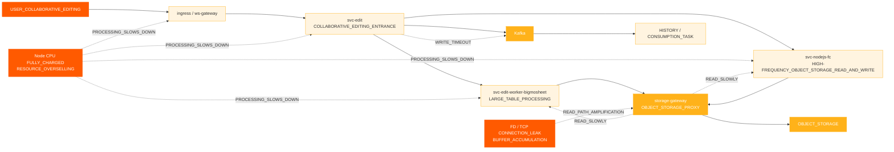
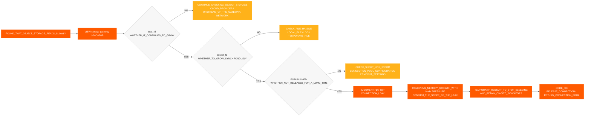
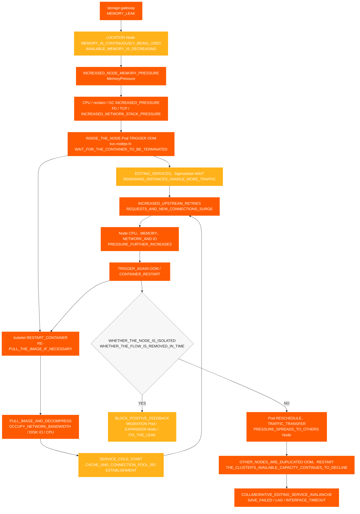

# Sự cố Chỉnh sửa Hợp tác

[← ShimoDocs Suite Tài liệu triển khai](../README.md)

## 1. Bối cảnh trường hợp 

Môi trường của một công ty lớn đã trải qua sự cố không thể chỉnh sửa phối hợp, ảnh hưởng đến việc chỉnh sửa và lưu một số bảng tính và tài liệu bình thường của người dùng. Trong sự cố, người dùng gặp các hiện tượng như lưu thất bại, chỉnh sửa bị chậm và Kafka hết thời gian ghi; về phía dịch vụ, các vấn đề như đọc lưu trữ đối tượng chậm, sử dụng nút bất thường và CPU bất thường TCP/FD metrics cũng xuất hiện. 

Trường hợp này minh họa rằng việc không khả dụng của chỉnh sửa hợp tác không nhất thiết phải do dịch vụ chỉnh sửa gây ra trực tiếp. Nó cũng có thể được khuếch đại tập thể bởi các vấn đề như tài nguyên cơ sở bị bán quá mức, lập lịch nút tập trung, ghi phần mềm trung gian bị chậm, đường đọc lưu trữ đối tượng bất thường, hoặc rò rỉ kết nối. 

## 2. Biểu hiện của sự cố 

Các tác động chính của sự cố này là: 

- Các liên kết chỉnh sửa hợp tác trở nên không khả dụng, bị trễ, hoặc giao diện bị hết thời gian chờ. 
- Một số bảng tính hoặc tài liệu không thể lưu bình thường. 
- Hiển thị các cửa sổ bật lên phía chỉnh sửa `Kafka write timeout`. 
- Thời gian đọc lưu trữ đối tượng tăng, làm ảnh hưởng thêm đến xử lý liên kết chỉnh sửa. 
- Giám sát Pod có vẻ bình thường, nhưng người dùng liên tục báo cáo việc lưu thất bại, chỉnh sửa bị trễ và giao diện hết thời gian chờ. 

## 3. Quy trình điều tra sơ bộ 

### 3.1 Bắt đầu từ hiện tượng người dùng đến liên kết chỉnh sửa 

Khách hàng đầu tiên báo cáo bất thường với một số tài liệu, vì vậy điều tra ban đầu tập trung vào các vấn đề chỉnh sửa hợp tác: 
1. Kiểm tra liên kết chỉnh sửa và lưu. 
2. Kiểm tra nhật ký dịch vụ liên quan. 

3. Kiểm tra Kafka Trạng thái ghi. 
4. Kiểm tra độ trễ đọc/ghi lưu trữ đối tượng. 

Trong quá trình điều tra, đã phát hiện hai bất thường chính: 

- `Kafka write timeout` Xuất hiện trong liên kết chỉnh sửa. 
- Độ trễ đọc lưu trữ đối tượng bất thường. 

### 3.2 Xác nhận sơ bộ các phụ thuộc bên ngoài 

Trong quá trình điều tra, chúng tôi đã xác nhận riêng lẻ với các chủ sở hữu phụ thuộc bên ngoài: 

- Xác nhận với bên lưu trữ đối tượng, không phát hiện vấn đề rõ ràng từ nhà cung cấp đám mây. 
- Xác nhận với Kafka hoạt động, không phát hiện vấn đề rõ ràng từ phía Kafka cụm. 

Do đó, vấn đề không thể được quy trực tiếp cho bộ nhớ đối tượng hoặc Kafka các dịch vụ, và cần tiếp tục khảo sát đối với các nút kinh doanh địa phương, cổng, nhóm kết nối, mạng và các lớp tài nguyên. 

### 3.3 Chuyển từ giám sát Pod sang giám sát Node 

Ban đầu, khi kiểm tra giám sát Pod, cả CPU và bộ nhớ đều nằm trong phạm vi tương đối an toàn, nhưng khách hàng báo cáo CPU của Node đã đạt mức tối đa. 

Đây là điểm ngoặt quan trọng trong chẩn đoán hiện tại: 

- Dưới tình trạng sử dụng quá mức tài nguyên, giám sát Pod có thể không phản ánh chính xác áp lực trên nút. 
- Khi Node CPU đạt mức tối đa, khả năng xử lý kinh doanh bên trong các container giảm. 
- Sau khi xử lý kinh doanh chậm lại, điều này tiếp tục biểu hiện dưới dạng đọc bộ nhớ đối tượng chậm, ghi chậm, Kafka các yêu cầu tồn đọng, và lưu thất bại. 

## 4. Chuỗi tác động lỗi 

## 5. Phát hiện chính 

### 5.1 Node CPU Bất thường 

Nhiều nút đã gặp phải CPU các bất thường theo thứ tự: 
- '10.142.191.54' bắt đầu một ngoại lệ lúc 18:20. 
- '10.76.176.65' bắt đầu một ngoại lệ lúc 18:30. 
- '10.76.238.202' bắt đầu một ngoại lệ lúc 18:40. 
- '10.142.206.216' bắt đầu bất thường lúc 18:42. 
- '10.142.175.191' bắt đầu bất thường lúc 18:45. 

Có thể thấy rằng bất thường đầu tiên là '10.142.191.54', tiếp theo là CPU các sự cố trên các nút khác, điều này phù hợp với đặc trưng của các bất thường tài nguyên một điểm lan sang nhiều nút. 

### 5.2 CPU và Bộ nhớ Bán quá mức 

Bán quá mức tài nguyên trước và sau khi lỗi như sau: 

| Tình huống | Tài nguyên | Dung lượng Cụm | Tổng Yêu cầu | Tỷ lệ Yêu cầu | Tổng Giới hạn | Bán quá mức |
| --- | --- | --- | --- | --- | --- | --- |
| nodejs-fc pod 6 | CPU | 192 lõi | 33,75 lõi | 17.6% | 457 lõi | 238.0% |
| nodejs-fc pod 6 | Bộ nhớ | 768 GiB | 57,24 GiB | 7.5% | 884 GiB | 115.1% |
| nodejs-fc pod 12 | CPU | 192 lõi | 45,75 lõi | 23.8% | 493 lõi | 256.8% |
| nodejs-fc pod 12 | Bộ nhớ | 768 GiB | 81,24 GiB | 10.6% | 980 GiB | 127.6% |
| nodejs-fc pod 12 sau khi mở rộng | CPU | 320 lõi | 45,75 lõi | 14.3% | 493 lõi | 154.1% |
| nodejs-fc pod 12 sau khi mở rộng | Bộ nhớ | 1280 GiB | 81,24 GiB | 6.3% | 980 GiB | 76.6% |

Trong điều kiện bình thường, CPU việc sử dụng vượt mức được kiểm soát ở khoảng 150% là tương đối chấp nhận được. Trước khi mở rộng này, CPU việc sử dụng vượt mức đã đạt 238%, và sau khi tăng gấp đôi quy mô, nó đạt 256,8%, gây ra rủi ro cao về hiện tượng bùng nổ lưu lượng. 

### 5.3 Sự tập trung lập lịch Pod 

Mặc định K8s Chiến lược lập lịch trong môi trường của một công ty lớn có xu hướng lấp đầy một nút trước khi sử dụng các nút còn lại. Trong quá trình triển khai dịch vụ theo cuộn hoặc mở rộng tạm thời, nhiều dịch vụ tải cao dễ bị tập trung trên một vài nút. 

Các kết hợp có nguy cơ cao bao gồm: 

- Nhiều `svc-nodejs-fc` thể hiện tồn tại trên một nút duy nhất. 
- Chạy `svc-edit-worker-bigmosheet` và `ingress` trên cùng một nút đồng thời. 
- Chồng lên nhau `storage-gateway` trên cùng một node dẫn đến rò rỉ kết nối hoặc tăng bộ nhớ. 

### 5.4 Kết nối Storage Gateway và rò rỉ bộ nhớ 

Sau khi kiểm tra thêm Node TCP giám sát và `storage-gateway` số liệu Pod, đã phát hiện: 

- `total_fd` giữ nguyên tăng. 
- `socket_fd` giữ nguyên tăng. 
- TCP kết nối vẫn còn `ESTABLISHED` trong thời gian dài. 
- Kết nối không được giải phóng kịp thời, và FDs không được trả về pool kết nối. 
- Pod RSS / Bộ làm việc tiếp tục tăng, và sau khi thu hồi không thể trở về mức bình thường. 

Nếu `total_fd`, `socket_fd`, và việc sử dụng bộ nhớ đều tăng liên tục cùng lúc, điều này cho thấy các kết nối không được giải phóng và bộ nhớ tiếp tục tăng, vấn đề này nên được xử lý như rò rỉ kết nối và bộ nhớ, đồng thời chú ý đến `MemoryPressure` và OOM rủi ro của Node. 

### 5.5 Tác động của Sự khác biệt Phiên bản 

Trong các phiên bản cũ, dữ liệu đính kèm hình ảnh được ghi trực tiếp vào bảng dữ liệu. Trong phiên bản mới, để giảm MySQL việc sử dụng và chi phí lưu trữ, thông tin đính kèm hình ảnh được ghi vào Metadata lưu trữ đối tượng, và `/x` đường đọc truy cập trực tiếp lưu trữ đối tượng được sử dụng. 

Trong chế độ proxy, chức năng cơ sở để xác định liệu khóa lưu trữ đối tượng tồn tại không giải phóng kết nối đúng cách, gây ra rò rỉ kết nối. Vấn đề này, kết hợp với việc phân bổ quá mức tài nguyên và lập lịch tập trung, được khuếch đại thành lỗi không khả dụng trong chỉnh sửa hợp tác. 

### 5.6 Bằng chứng Giám sát Lưu trữ Đối tượng và Cổng Lưu trữ 

Để xác định xem vấn đề nằm ở phía lưu trữ đối tượng, phía dịch vụ kinh doanh, hay lớp proxy, cần một cuộc điều tra so sánh giữa lưu trữ đối tượng và `storage-gateway` đã được tiến hành: 

- Độ trễ đọc của bộ nhớ đối tượng tăng, trong khi độ trễ ghi vẫn tương đối bình thường, với các bất thường chủ yếu tập trung trên đường dẫn đọc. 
- CPU, RSS / Bộ làm việc (Working Set), và tốc độ tăng trưởng bộ nhớ của `storage-gateway` Pods liên tục tăng. 
- `total_fd` và `socket_fd` tiếp tục tăng, và TCP kết nối vẫn giữ ở trạng thái `ESTABLISHED` trong thời gian dài. 
- Các kết nối không được giải phóng kịp thời, FDs không được trả về nhóm kết nối, gây áp lực bộ nhớ và OOM rủi ro trên Node. 
- Không phát hiện lỗi phía máy chủ nào tương ứng với quy mô bất thường kinh doanh trên phía lưu trữ đối tượng, vì vậy trọng tâm điều tra đã được ưu tiên vào `storage-gateway` đường đọc proxy. 

Đánh giá tổng thể: việc đọc lưu trữ đối tượng chậm không chỉ đơn giản là do lỗi dịch vụ lưu trữ đối tượng, mà là kết quả của sự tích tụ áp lực FD, TCP kết nối, bộ nhớ và tài nguyên nút gây ra bởi `storage-gateway` kết nối không được giải phóng. 

### 5.7 Xác định rò rỉ FD/TCP Quy trình Xác định 

Lần này, chuỗi đánh giá sau đã được sử dụng để xác nhận rằng `storage-gateway` có rò rỉ kết nối: 

Kết luận đánh giá: Khi `total_fd`, `socket_fd`, số lượng `ESTABLISHED` kết nối và mức sử dụng bộ nhớ Pod tăng đồng bộ trong cùng một khoảng thời gian, nguyên nhân gốc rễ chính có thể được coi là “FD/TCP và rò rỉ bộ nhớ do các kết nối không được giải phóng”; nếu việc đọc từ lưu trữ đối tượng chậm trong khi ghi bình thường và các chỉ số nêu trên bất thường cùng lúc, đường đọc proxy nên được kiểm tra trước. 

## 6. Kết luận Nguyên nhân Gốc rễ 

Chuỗi nguyên nhân gốc rễ của lỗi này là: 

1. Cụm có hiện tượng CPU quá tải đáng kể, CPU với mức quá tải vượt quá 250% ở một số giai đoạn. 
2. Trong quá trình cập nhật luân phiên dịch vụ hoặc mở rộng tạm thời, việc lập lịch Pod tập trung, dẫn đến áp lực tài nguyên quá mức trên các nút đơn lẻ. 
3. Các dịch vụ tải cao như `svc-nodejs-fc`, `svc-edit-worker-bigmosheet`và `ingress` tập trung trên một số nút. 
4. `storage-gateway` có vấn đề giải phóng kết nối trong đường dẫn đọc của proxy lưu trữ đối tượng, gây ra sự tăng liên tục FD, TCP kết nối, và sử dụng bộ nhớ. 
5. Sau khi xảy ra áp lực bộ nhớ và OOM trên Node, việc khởi động lại container, kéo hình ảnh, khởi động lạnh dịch vụ và thử lại từ upstream càng làm tăng thêm CPU, mạng, và áp lực IO đĩa, dẫn đến việc đọc dữ liệu từ bộ nhớ đối tượng chậm và ghi Kafka chậm. 
6. Đọc bộ nhớ đối tượng chậm và Kafka hết thời gian ghi cuối cùng biểu hiện dưới dạng không khả dụng trong chỉnh sửa cộng tác, thất bại khi lưu và độ trễ khi chỉnh sửa. 

## 7. Sơ đồ lan truyền tuyết lở tài nguyên Node 

Các dịch vụ kinh doanh liên quan đến lỗi này đều chạy trong một K8s cụm. Rò rỉ bộ nhớ trong `storage-gateway` đầu tiên tiêu thụ bộ nhớ khả dụng của Node, sau đó thông qua OOM, khởi động lại container, kéo image, khởi động lạnh dịch vụ, và thử lại upstream, hình thành vòng phản hồi tích cực của việc tiêu thụ tài nguyên. Khi Pod bất thường được lập lịch lại hoặc lưu lượng được chuyển sang các node khác, áp lực tiếp tục lan ra các node khỏe mạnh, cuối cùng gây ra tuyết lở trên cấp cụm. 

Sơ đồ yêu cầu tập trung vào hai vòng khuếch đại: 

1. **Vòng phản hồi tích cực trong node**: OOM → kubelet khởi động lại hoặc kéo image → khởi động lạnh → thử lại upstream và kết nối mới tăng → CPU, áp lực bộ nhớ, mạng và IO đĩa tiếp tục tăng → OOM lại. 
2. **Vòng khuếch tán qua các node**: Pods trên các node bất thường được lập lịch lại, lưu lượng ingress được chuyển, hoặc các phiên bản còn lại nhận yêu cầu → tải trên node khỏe mạnh tăng → các node khác trải qua OOM và khởi động lại nhiều lần → khả năng sẵn có của cụm tiếp tục giảm. 

## 8. Xử lý và Sửa chữa 

### 8.1 Xử lý ngắn hạn 

- Loại bỏ lưu lượng gateway cho ingress bất thường hoặc node bất thường để ngăn lưu lượng mới vào con đường áp lực cao. 
- Khởi động lại các dịch vụ bất thường với FD, TCP, hoặc bộ nhớ liên tục tăng. 
- Di chuyển hoặc phân tán Pods tải cao từ các node áp lực cao. 
- Trục xuất Pods hoặc cô lập các node đã sử dụng hết tài nguyên CPU. 
- Tránh chỉ mở rộng các Pods kinh doanh, ưu tiên bổ sung tài nguyên cho Node. 
- Thêm khả năng thất bại nhanh cho `svc-edit` giao diện đồng bộ để ngăn các yêu cầu tích tụ quá lâu. 

### 8.2 Sửa chữa dài hạn 

- Sửa lỗi các kết nối không được giải phóng khi kiểm tra sự tồn tại của Key trong chế độ proxy object storage. 
- Cấu hình chính sách chống đồng sở hữu cho các dịch vụ cốt lõi để tránh tập trung dịch vụ rủi ro cao trên cùng một node. 
- Cấu hình chính sách trục xuất node để ngăn node tiếp tục chạy các dịch vụ cốt lõi sau khi tài nguyên đã cạn kiệt. 
- Thiết lập CPU và giám sát vượt đăng ký bộ nhớ. 
- Trước khi mở rộng một dịch vụ, cần đánh giá mức độ tài nguyên của môi trường khách hàng và xác nhận kế hoạch mở rộng với trưởng dự án. 
- Thiết lập cảnh báo cho OOM, FD, TCP, yêu cầu chậm, Kafka tồn đọng và độ trễ đọc/ghi object storage cho các dịch vụ cốt lõi. 

## 9. Kết luận xem xét trường hợp 

Sự cố này cho thấy khi chỉnh sửa hợp tác không khả dụng, việc điều tra không nên chỉ tập trung vào log của dịch vụ chỉnh sửa. Nếu tài nguyên node cơ bản đã được sử dụng hết, các dịch vụ kinh doanh sẽ chậm lại tổng thể, biểu hiện dưới dạng nhiều triệu chứng ở cấp cao hơn như Kafka timeout ghi, đọc object storage chậm, và thất bại khi lưu. 

Khi xử lý các vấn đề tương tự trong tương lai, trước tiên nên xác nhận tài nguyên cluster và Node, sau đó tuần tự kiểm tra middleware, giám sát kinh doanh, log, và liên kết theo dõi, để tránh bắt đầu điều tra từ một log dịch vụ duy nhất và rơi vào vòng lặp xử lý sự cố cục bộ. 

---
