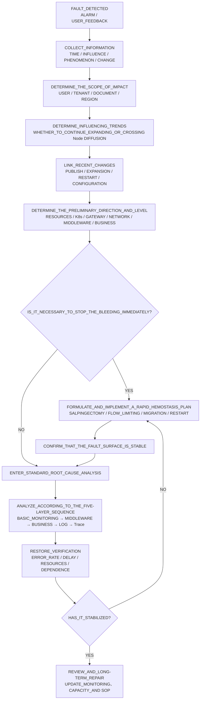
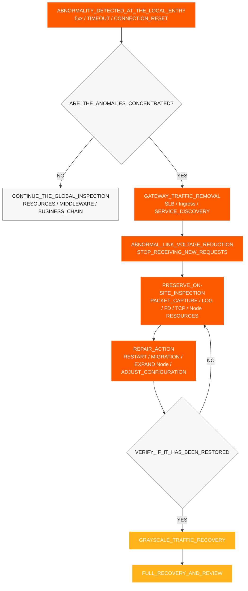
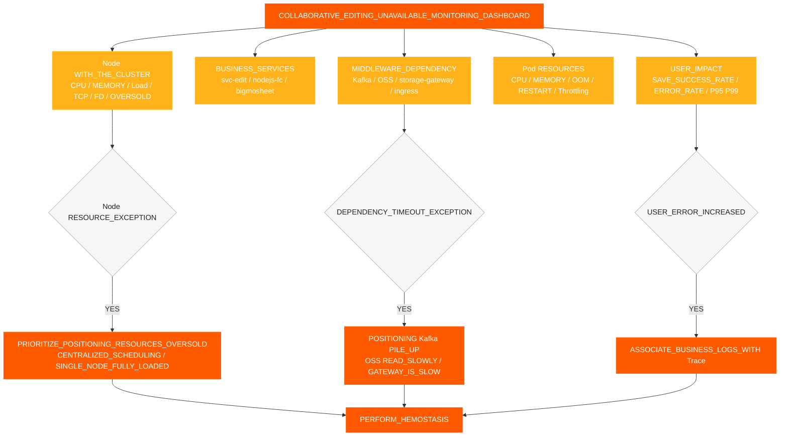
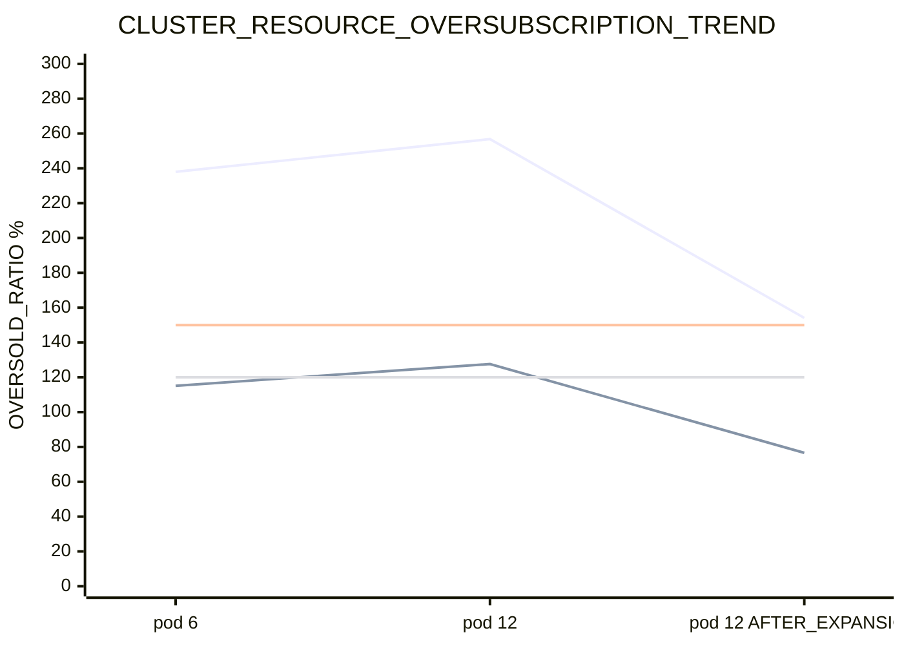
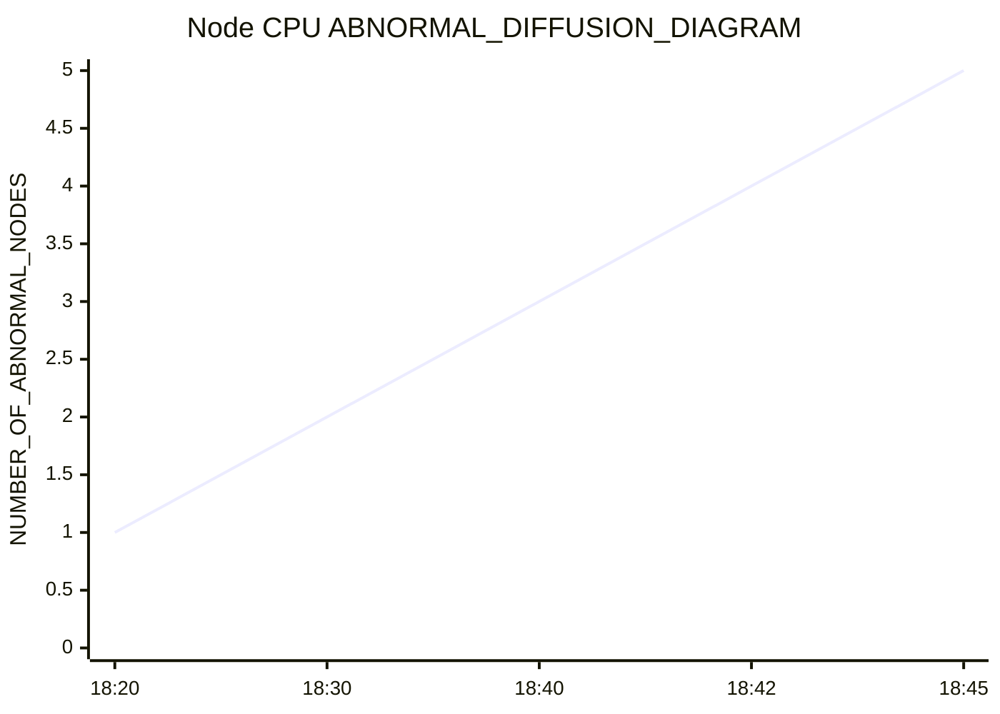
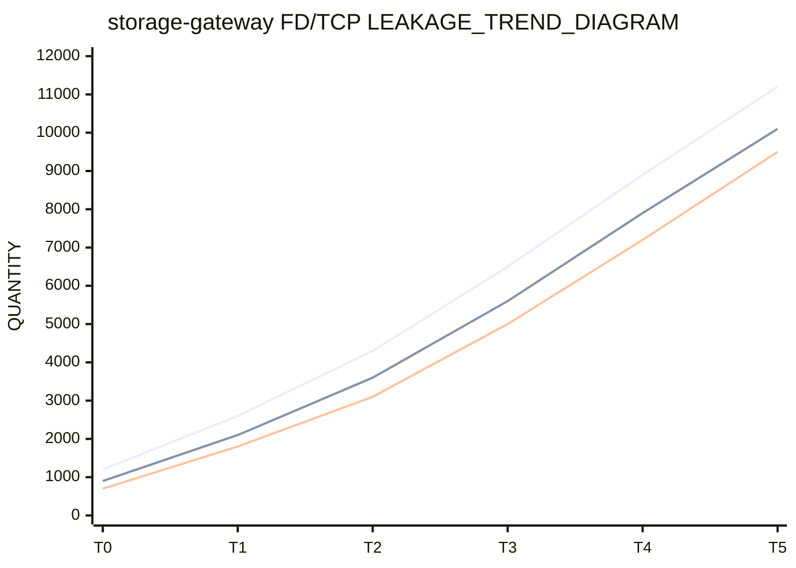
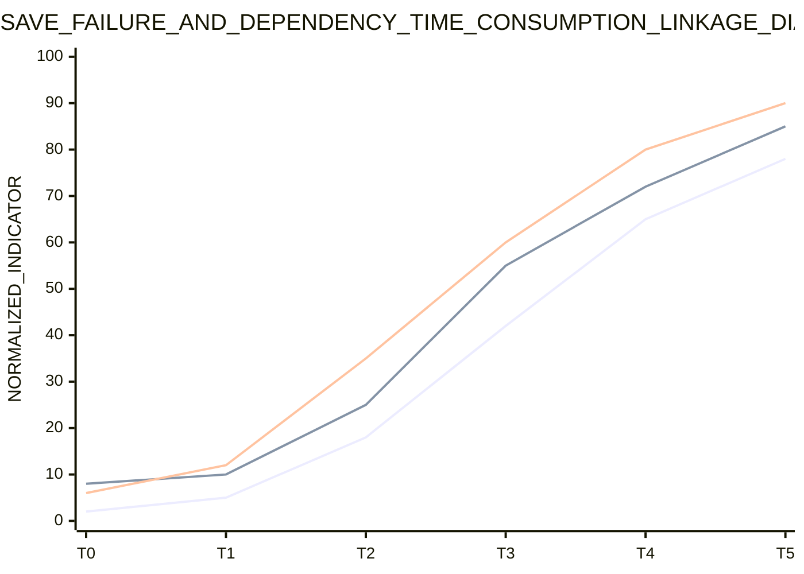
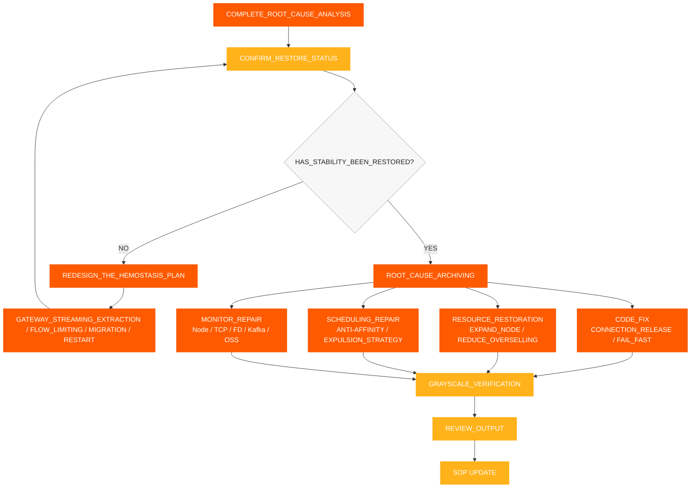

# Phản hồi Sự cố SOP

[← ShimoDocs Suite Tài liệu triển khai](../README.md)

## 1. Thu thập thông tin

Sau khi nhận được lỗi, đầu tiên ghi lại các thông tin sau:

- Thời gian xảy ra: thời gian cảnh báo đầu tiên, thời gian phản hồi khách hàng đầu tiên, có trùng với thời gian phát hành hoặc mở rộng hay không.
- Phạm vi ảnh hưởng: người thuê, loại tài liệu, số lượng tệp, số lượng người dùng, có tập trung trong các bảng hay bảng lớn không.
- Triệu chứng cụ thể: lỗi lưu, lỗi chỉnh sửa, Kafka hết thời gian chờ, đọc lưu trữ đối tượng chậm, API hết thời gian chờ.
- Các thay đổi gần đây: phát hành dịch vụ, khởi động lại luân phiên, mở rộng Pod, mở rộng node, thay đổi lưu trữ hoặc Kafka thay đổi.
- Các dịch vụ chính: `svc-nodejs-fc`, `svc-edit`, `svc-edit-worker-bigmosheet`, `storage-gateway`, `ingress`, `ws-gateway`.


## 2. Đánh giá thông tin và phân loại lỗi

Sau khi hoàn thành thu thập thông tin, đầu tiên đánh giá phạm vi lỗi, xu hướng phát triển và hướng nguyên nhân chính dựa trên triệu chứng, chỉ số, sự kiện và ghi nhận thay đổi, sau đó quyết định liệu có cần ngăn chặn ngay lập tức hay không. Kết quả đánh giá nên hình thành kết luận rõ ràng và không chỉ dựa vào một Pod hoặc một bản ghi log duy nhất.

Các điểm chính để đánh giá:

- Phạm vi ảnh hưởng của người dùng: người dùng, người thuê, loại tài liệu, khu vực và dịch vụ bị ảnh hưởng.
- Biểu hiện ảnh hưởng: lỗi lưu, chỉnh sửa chậm, API hết thời gian chờ, Kafka lỗi ghi, đọc lưu trữ đối tượng chậm.
- Xu hướng ảnh hưởng: liệu nó có tiếp tục mở rộng, liệu nó lan từ một Pod hoặc Node đơn lẻ sang nhiều Node.
- Liên quan thay đổi: liệu có liên quan đến phát hành dịch vụ, mở rộng Pod, mở rộng node, khởi động lại luân phiên, cấu hình hoặc thay đổi phần mềm trung gian. 
- Hướng sơ bộ: tài nguyên, K8s bảng điều khiển, cổng, mạng, phần mềm trung gian, mã kinh doanh hoặc vấn đề dữ liệu. 

Xác định mức độ lỗi dựa trên kết quả đánh giá: 

| Mức độ | Tiêu chí đánh giá | Mục tiêu phản ứng | 
| --- | --- | --- | 
| P0 | Lỗi chỉnh sửa rộng rãi không khả dụng, lỗi lưu liên tục, bất thường theo lô trong các dịch vụ cốt lõi | Dừng sự mất mát trong vòng 15 phút, làm rõ hướng nguyên nhân chính trong vòng 30 phút | 
| P1 | Một phần người thuê, một phần tài liệu, một phần các nút bất thường, tỷ lệ lỗi tăng đáng kể | Xác định liên kết bất thường trong vòng 30 phút, khôi phục ổn định trong vòng 60 phút | 
| P2 | Yêu cầu chậm điểm đơn hoặc quy mô nhỏ, thỉnh thoảng lưu thất bại | Xác nhận nguyên nhân hoàn chỉnh và kế hoạch khắc phục trong vòng 1 ngày làm việc | 

Kết luận đánh giá ít nhất nên trả lời ba câu hỏi: tác động hiện tại lớn đến mức nào, lỗi có đang lan rộng không, nên dừng chảy máu trước hay tiến thẳng đến phân tích nguyên nhân gốc. 




## 3. Cầm máu nhanh

Nếu phía người dùng tiếp tục thất bại, hoặc kết quả đánh giá cho thấy lỗi đang lan rộng, trước tiên thực hiện các hành động kiểm soát, sau đó tiếp tục phân tích sâu. Mục tiêu của việc kiểm soát là giảm phạm vi lỗi, chặn phản hồi tích cực của tài nguyên, đồng thời bảo tồn cảnh hài lỗi càng nhiều càng tốt.

1. Loại bỏ lưu lượng từ các cổng bất thường, SLB hậu phương, mục nhập Ingress, các instance dịch vụ, hoặc Node, ngăn yêu cầu mới tiếp tục đi vào đường dẫn bất thường.
2. Đặt các Node bất thường thành không thể lập lịch hoặc cách ly để ngăn Pods tiếp tục được lập lịch trên các Node chịu áp lực cao.
3. Khởi động lại Pods gặp phải OOM, tăng bộ nhớ liên tục, hoặc rò rỉ FD/TCP , ưu tiên `storage-gateway`, `svc-nodejs-fc`và `svc-edit-worker-bigmosheet`.
4. Phân phối các Pods tải cao để tránh `nodejs-fc`, `bigmosheet`, `ingress`và `storage-gateway` tập trung trên cùng một Node.
5. Tạm dừng việc mở rộng Pods kinh doanh không hợp lệ, ưu tiên mở rộng Node hoặc khôi phục tài nguyên khả dụng.
6. Thực hiện giới hạn tốc độ hoặc thất bại nhanh cho các lần thử lại upstream, tạo kết nối và tích tụ yêu cầu để ngăn chặn kết nối mới tiếp tục tăng sau khi khởi động nguội.
7. Ghi lại Node CPU, bộ nhớ, OOM, FD, TCP, tỷ lệ lỗi và độ trễ giao diện trước và sau khi ngăn chặn sự cố.

### 3.1 Loại bỏ lưu lượng Gateway

Khi một lỗi biểu hiện dưới dạng nút cục bộ bất thường, mục nhập gateway cục bộ hoặc phiên dịch vụ cục bộ bất thường, lưu lượng vào bất thường nên được loại bỏ trước, sau đó mới xử lý các nút và Pod. Mục tiêu của việc loại bỏ lưu lượng là giảm áp lực lên liên kết bị lỗi và ngăn các phiên bản bất thường tiếp tục nhận yêu cầu mới. 

Điều kiện kích hoạt: 

- Tỷ lệ lỗi của một Ingress nhất định, SLB backend, gateway Pod hoặc Node cao hơn đáng kể so với các phiên bản khác. 
- Lỗi 5xx của Gateway, thời gian chờ upstream và reset kết nối tập trung ở một vài điểm vào. 
- Một số Node CPU, Load, TCP, và các chỉ số FD rõ ràng là bất thường, và các yêu cầu mới vẫn tiếp tục đến. 
- Các phiên bản liên kết lõi như `svc-edit`, `ws-gateway`và `storage-gateway` đã bắt đầu chậm lại. 

Các hành động cần thực hiện: 

1. Loại bỏ các backend bất thường khỏi SLB, Ingress, định tuyến gateway hoặc phát hiện dịch vụ. 
2. Tạm thời đánh dấu các nút bất thường là không thể lập lịch để ngăn các Pod mới được lập lịch lên chúng. 
3. Thực hiện bắt gói, ghi log, kiểm tra FD/TCP, và kiểm tra tài nguyên trên các nút hoặc phiên bản đã bị loại bỏ lưu lượng. 
4. Sau khi hoàn thành việc khởi động lại, di chuyển, mở rộng hoặc sửa chữa cấu hình, trước tiên khôi phục với lưu lượng nhỏ, sau đó khôi phục toàn bộ. 
5. Trước khi khôi phục, xác nhận rằng tỷ lệ lỗi, thời gian phản hồi giao diện, Node CPUvà TCP/ các chỉ số FD đã trở lại bình thường. 




## 4. Quy trình phân tích nguyên nhân gốc chuẩn

Sau khi hoàn tất cầm máu nhanh và xác nhận rằng bề mặt lỗi ổn định, tiến hành phân tích nguyên nhân gốc rễ. Trình tự xử lý sự cố tiêu chuẩn được thực hiện theo cách 'từ dưới lên, từ tổng quát đến chi tiết':

1. Giám sát cơ bản: tài nguyên cụm, Node, tài nguyên Pod.
2. Giám sát middleware: Kafka, lưu trữ đối tượng, gateway, mạng.
3. Giám sát kinh doanh: Tỷ lệ lưu thành công, thời gian phản hồi giao diện, và tỷ lệ lỗi.
4. Giám sát nhật ký: Nhật ký lỗi, nhật ký thời gian chờ, OOM/nhật ký khởi động lại.
5. Theo dõi liên kết Trace: liên kết yêu cầu, các cuộc gọi chậm, các đoạn ngoại lệ.

Yêu cầu cốt lõi:

- Mỗi tầng trước tiên xuất kết luận đánh giá, sau đó mới vào tầng tiếp theo.
- Xem Node trước, Pod sau; xem xu hướng tổng quan trước, sau đó là nhật ký của một dịch vụ riêng lẻ.
- Không bỏ qua các tầng tiếp theo chỉ vì không phát hiện bất thường ở một tầng nào đó.
- Giám sát, nhật ký và trace cần được liên kết sử dụng cùng cửa sổ thời gian, Pod, Node và Trace ID.

Mỗi tầng chỉ trả lời một câu hỏi cốt lõi:

- Giám sát cơ bản: Tài nguyên đã thiếu hụt chưa, và có đang xảy ra overselling, lập lịch tập trung, hay phân tán qua nhiều node không?
- Giám sát middleware: Có chậm lại, tồn đọng, từ chối yêu cầu, hay bất thường kết nối không?
- Giám sát kinh doanh: Dịch vụ, API, hay loại tài liệu nào mà ảnh hưởng người dùng liên quan đến?
- Giám sát nhật ký: Có bằng chứng rõ ràng về lỗi, thời gian chờ, OOM, khởi động lại, hay cạn kiệt kết nối không?
- Theo dõi liên kết Trace: Yêu cầu thất bại kẹt chính xác ở đâu — tại dịch vụ, node, hay span nào? 


### 4.1 Xử lý sự cố Giám sát cơ bản 

Ưu tiên kiểm tra kích thước Node thay vì chỉ kích thước Pod. Khi tài nguyên bị sử dụng quá mức, việc giám sát Pod có thể hiển thị giá trị trong giới hạn an toàn, nhưng node có thể đã bị sử dụng hết. 

Các mục cần kiểm tra: 

- Tổng cộng cluster CPU và dung lượng bộ nhớ và dung lượng có sẵn. 
- Node CPU, bộ nhớ, tải, đĩa, mạng. 
- Pod CPU, bộ nhớ, khởi động lại, OOM, CPU hạn chế. 
- Liệu có nhiều dịch vụ cao CPU hoặc IO cao tập trung trên một node duy nhất. 
- Liệu sau khi phát hành từng bước, Pods chủ yếu được lên lịch trên vài node đầu tiên. 
- Liệu có thiếu chính sách chống kết hợp và trục xuất. 

Các đánh giá chính: 

- Liệu tổng CPU Giới hạn / cluster CPU dung lượng vượt quá 150%. 
- Liệu tổng giới hạn bộ nhớ / dung lượng bộ nhớ cụm có vượt quá 120% hay không. 
- Liệu có quá trình nào trong đó một nút thất bại trước, sau đó các nút khác dần dần trải qua mức sử dụng tăng lên hay không. CPU  


### 4.2 Giám sát và Xử lý sự cố Middleware 

Việc xử lý sự cố middleware tập trung chủ yếu vào Kafka, lưu trữ đối tượng, cổng kết nối, và mạng. Việc đánh giá cụ thể cho Kafka như sau; các chỉ số chi tiết và mục đánh giá cho lưu trữ đối tượng, `storage-gateway`, cổng kết nối và mạng được ghi nhận thống nhất trong Mục 9.7 và danh sách kiểm tra liên quan. 

#### 4.2.1 Kafka 

Các mục cần kiểm tra: 

- Độ trễ ghi của nhà sản xuất và tỷ lệ thất bại. 
- Tồn đọng chủ đề. 
- Phía máy chủ môi giới CPU, đĩa, mạng, và độ trễ yêu cầu. 
- Liệu có sự truyền lại, mất gói, hoặc tắc nghẽn kết nối từ khách hàng tới Kafka. 
- Liệu chỉ xảy ra hết thời gian ở phía ghi kinh doanh trong khi không có bất thường rõ ràng ở Kafka phía vận hành. 

Logic đánh giá: 

- Nếu không có bất thường trên Kafka , nhưng phía kinh doanh vẫn tiếp tục gặp tình trạng hết thời gian ghi, tập trung kiểm tra nút kinh doanh CPU, tắc nghẽn mạng, và khả năng xử lý của khách hàng. 
- Nếu Kafka tồn đọng và lỗi kinh doanh xảy ra đồng thời, trước tiên hãy xác nhận xem tồn đọng có phải do xử lý dịch vụ thượng nguồn chậm hay không. 


### 4.3 Giám sát kinh doanh, Nhật ký và Truy vết 

#### 4.3.1 Giám sát kinh doanh 

Xác nhận các liên kết bất thường dựa trên hiện tượng của khách hàng: 

1. Liệu các lỗi lưu có tập trung trong các bảng, bảng lớn, hay các loại tài liệu cụ thể hay không. 
2. Liệu giao diện chỉnh sửa có gặp phải tình trạng hết thời gian chờ, yêu cầu chậm, hoặc tỉ lệ lỗi tăng hay không. 
3. Kiểm tra xem `Kafka write timeout` có xảy ra hay không. 
4. Kiểm tra xem việc đọc từ lưu trữ đối tượng có chậm không và việc ghi có bình thường không. 
5. Kiểm tra xem `bigmosheet operation oss_get` vượt quá 5 giây. 
6. Kiểm tra xem các dịch vụ liên quan đến WebSocket, chỉnh sửa hợp tác, lịch sử và lưu trữ đối tượng có đồng thời trải qua độ trễ tăng hay không. 

#### 4.3.2 Giám sát nhật ký 

Nhật ký cần kiểm tra: 

- Nhật ký cho các lỗi lưu chỉnh sửa. 
- Nhật ký cho các lỗi ghi quá thời gian. Kafka Nhật ký cho các lỗi ghi quá thời gian. 
- Nhật ký cho các lần đọc và ghi lưu trữ đối tượng chậm. 
- Nhật ký cho các lỗi ghi quá thời gian. OOM, khởi động lại, cạn kiệt kết nối trong pool, và cạn kiệt FD. 
- Nhật ký cho lỗi gateway 5xx, hết thời gian chờ upstream và thiết lập lại kết nối. 

#### 4.3.3 Theo dõi Liên kết Trace 

Sử dụng Trace để theo dõi một yêu cầu thất bại: 

- Kiểm tra xem yêu cầu có bị kẹt trong gateway, chỉnh sửa hợp tác, lưu trữ đối tượng, Kafka, hoặc chuỗi tiêu thụ lịch sử. 
- Kiểm tra xem có Span nào có độ trễ bất thường. 
- Kiểm tra xem các cuộc gọi chậm có tập trung vào một dịch vụ, nút hoặc loại tài liệu cụ thể không. 
- So sánh sự khác biệt liên kết giữa các yêu cầu thất bại và các yêu cầu bình thường. 


## 5. Xác minh phục hồi 

Sau khi hoàn tất hành động cầm máu, các chỉ số sau phải được xác minh: 

- Mục gateway đã bị loại bỏ, SLB backend hoặc các instance bất thường đã ngừng nhận lưu lượng mới. 
- Tỷ lệ lưu thành công đã trở lại bình thường. 
- Tỷ lệ lỗi giao diện chỉnh sửa đã giảm. 
- Kafka Độ trễ ghi đã trở lại bình thường. 
- Kafka Số lượng backlog đã giảm. 
- Độ trễ đọc bộ nhớ đối tượng đã trở lại bình thường. 
- Node CPU, bộ nhớ, và tải đã giảm. 
- `storage-gateway` FD và socket FD không còn tăng liên tục. 
- Các nút bất thường không còn lan ra. 
- Sau khi khôi phục lưu lượng trong quá trình phát hành grayscale, gateway 5xx, timeout upstream và reset kết nối không tăng trở lại. 


## 6. Yêu cầu giám sát và cảnh báo 

Các cảnh báo sau phải được hoàn tất: 

- Node CPU, bộ nhớ, tải, đĩa, và mạng. 
- Node TCP số lượng kết nối, truyền lại, mất gói, và `ESTABLISHED` cảnh báo số lượng kết nối. 
- Pod OOM, khởi động lại, và CPU cảnh báo điều tiết. 
- Dịch vụ lõi OOM cảnh báo. 
- CPU Cảnh báo bán quá mức: CPU Giới hạn / cụm CPU dung lượng vượt quá 150%. 
- Cảnh báo bán quá mức bộ nhớ: giới hạn bộ nhớ / dung lượng bộ nhớ cụm vượt quá 120%. 
- Kafka Cảnh báo backlog. 
- Kafka Cảnh báo timeout ghi. 
- Cảnh báo log lỗi lưu chỉnh sửa thất bại. 
- `bigmosheet operation oss_get > 5s` cảnh báo. 
- `storage-gateway` Cảnh báo FD và socket FD tăng liên tục. 
- `storage-gateway` RSS / Working Set tăng liên tục và Node `MemoryPressure` cảnh báo. 


## 7. Bảng điều khiển giám sát các chỉ số chính 

Phần này là công cụ phụ trợ và không thay đổi thứ tự quy trình chính. Bảng điều khiển được sử dụng để quan sát xu hướng và định vị hướng đi, trong khi `kubectl`, `jq`, và PromQL được sử dụng để thu thập bằng chứng cụ thể; điều tra tại chỗ nên theo danh sách kiểm tra chi tiết ở Mục 9, thực hiện từng mục và ghi nhận kết luận. 

### 7.1 Phân lớp Bảng điều khiển 

Khuyến nghị chia bảng điều khiển lỗi không thể chỉnh sửa hợp tác thành 5 lớp và kiểm tra từng lớp từ trên xuống dưới trong quá trình điều tra: 

| Lớp | Tên Bảng điều khiển | Chỉ số cốt lõi | Mục đích |
| --- | --- | --- | --- |
| L1 | Bảng điều khiển Tác động Người dùng | Tỷ lệ lưu thành công, tỷ lệ lỗi chỉnh sửa, giao diện P95/P99, kết nối cộng tác trực tuyến | Xác định xem người dùng có thực sự bị ảnh hưởng hay không |
| L2 | Bảng điều khiển Dịch vụ Kinh doanh | QPS, tỷ lệ lỗi, độ trễ và số lần khởi động lại của `svc-edit`, `svc-nodejs-fc`, `bigmosheet` | Xác định dịch vụ kinh doanh nào mà sự bất thường tập trung |
| L3 | Bảng điều khiển Phần mềm Trung gian | Kafka độ trễ ghi, Kafka danh sách chờ, độ trễ đọc/ghi bộ nhớ đối tượng, độ trễ cổng lên | Xác định liệu các phụ thuộc có làm chậm hay không |
| L4 | Bảng điều khiển Tài nguyên Container | Pod CPU, bộ nhớ, OOM, khởi động lại, CPU giới hạn băng thông | Xác định liệu container bản thân có bất thường hay không |
| L5 | Bảng điều khiển Node và Cluster | Node CPU, bộ nhớ, tải, TCP, FD, tài nguyên cấp dư, phân phối Pod | Xác định liệu tài nguyên cơ sở có hỗ trợ hoạt động kinh doanh hay không |

### 7.2 Biểu đồ Tổng quan Chỉ số Chính



### 7.3 Biểu đồ Xu hướng Tăng quá tải Tài nguyên

Biểu đồ này được sử dụng để quan sát liệu CPU và bộ nhớ tăng quá tải có vào khu vực rủi ro cao trước và sau khi mở rộng hay không. Trong bảng điều khiển thực tế, khuyến nghị đặt CPU tăng quá tải ở mức 150% và tăng quá tải bộ nhớ ở mức 120% làm đường ngưỡng cảnh báo.



### 7.4 Node CPU Biểu đồ Xu hướng Phân tán

Biểu đồ này được sử dụng để quan sát xem có đặc tính lan tỏa hay không, nơi một nút đơn bị lỗi trước, sau đó các nút khác dần bị kéo xuống.



### 7.5 FD/TCP Biểu đồ Xu hướng Rò rỉ

Biểu đồ này được sử dụng để xác định xem `storage-gateway` có rò rỉ kết nối hoặc FD không. Nếu `total_fd`, `socket_fd`, và số lượng `ESTABLISHED` kết nối đều tăng liên tục đồng thời, rò rỉ kết nối nên được ưu tiên xử lý.



### 7.6 Biểu đồ Tương quan Lỗi Kinh doanh và Độ trễ Phụ thuộc

Biểu đồ này được sử dụng để xác minh xem thất bại khi lưu phía người dùng có liên quan đến việc tăng Kafka độ trễ ghi và độ trễ đọc bộ nhớ đối tượng hay không. Nếu cả ba đều tăng đồng thời trong cùng một khung thời gian, nên ưu tiên kiểm tra năng lực xử lý của nút kinh doanh và tắc nghẽn chuỗi phụ thuộc.



### 7.7 Ngưỡng Báo động Đề xuất

| Chỉ số | Ngưỡng Đề xuất | Hành động Sau Khi Kích hoạt |
| --- | --- | --- |
| Tỷ lệ Thành công Lưu | Dưới 99% trong 5 phút liên tiếp | Vào xác nhận tác động kinh doanh, đối chiếu nhật ký lỗi và Traces |
| Giao diện Chỉnh sửa P95 | Cao hơn mức cơ bản 2 lần trong 5 phút liên tiếp | Kiểm tra `svc-edit`, `nodejs-fc`, `bigmosheet` |
| Kafka Độ trễ Ghi | Cao hơn mức cơ bản 2 lần hoặc xảy ra hết thời gian ghi | Kiểm tra Kafka tồn đọng, nút kinh doanh CPU, truyền lại mạng |
| Kafka Tồn đọng | Tăng liên tục trong 10 phút | Kiểm tra các tác vụ người tiêu thụ và tốc độ ghi của nguồn cấp |
| OSS Độ trễ Đọc | P95 vượt quá 5 giây | Kiểm tra `storage-gateway`, mạng, bộ nhớ đối tượng |
| Node CPU | Trên 90% trong 5 phút liên tiếp | Kiểm tra phân bổ Pod, CPU quá tải, dịch vụ tải cao |
| CPU Quá tải | Vượt quá 150% | Tạm dừng mở rộng Pod kinh doanh, ưu tiên đánh giá mở rộng Nút |
| Quá tải bộ nhớ | Vượt quá 120% | Kiểm tra OOM, nguy cơ bị tống ra, và rò rỉ bộ nhớ |
| `total_fd` / `socket_fd` | Tăng liên tục trong 10 phút | Kiểm tra FD/TCP rò rỉ, khởi động lại nếu cần để ngăn chảy máu |
| TCP Tỷ lệ truyền lại | Cao hơn mức cơ bản 2 lần | Bắt gói tin để xác nhận mất gói, tắc nghẽn, vấn đề cửa sổ |
| Khởi động lại Pod / OOM | Bất kỳ dịch vụ lõi nào xảy ra | Liên kết ngay lập tức nhật ký và phát hành thay đổi |

### 7.8 Node CPU và Lệnh truy vấn Quá tải bộ nhớ

Các lệnh sau áp dụng cho các tình huống khi doanh nghiệp chạy trong một K8s cluster. Trước khi thực thi, xác nhận rằng kubeconfig hiện tại đã chuyển sang cluster bị lỗi, và thay thế `NODE_NAME` bằng tên node mục tiêu.

#### 7.8.1 Kiểm tra Node Thực tế CPU và Sử dụng Bộ nhớ

```bash
# View the real-time CPU and memory usage of all Nodes
kubectl top nodes

# View the real-time usage of the specified Node
kubectl top node "$NODE_NAME"

# View the node's capacity, allocatable resources, and pressure status
kubectl describe node "$NODE_NAME" | sed -n '/Capacity:/,/Allocatable:/p'
kubectl describe node "$NODE_NAME" | sed -n '/Conditions:/,/Addresses:/p'

# Directly view the CPU/memory Requests, Limits, and usage ratio allocated to the Node
kubectl describe node "$NODE_NAME" | sed -n '/Allocated resources:/,/Events:/p'
```

Điểm trọng tâm: `CPU%`, `MEMORY%`, `MemoryPressure`, `DiskPressure`, `PIDPressure`. Khi mức sử dụng thực tế vượt quá 90%, cần ngay lập tức xác định liệu có cần kiểm soát rò rỉ dựa trên phân bố Pod và loại bỏ lưu lượng của gateway hay không.

#### 7.8.2 Thống kê CPU, yêu cầu bộ nhớ và giới hạn cho một Node cụ thể

```bash
# Statistics of CPU/memory requests and limits for all Pod containers on the specified Node.
# Dependencies: kubectl, jq; memory is uniformly converted to MiB, CPU is uniformly converted to cores.
NODE_NAME="<TARGET_NODE_NAME>"

kubectl get pods -A --field-selector "spec.nodeName=${NODE_NAME}" -o json | jq '
  def cpu_core:
    if . == null then 0
    elif endswith("m") then (rtrimstr("m") | tonumber / 1000)
    else tonumber
    end;
  def mem_mib:
    if . == null then 0
    elif endswith("Ki") then (rtrimstr("Ki") | tonumber / 1024)
    elif endswith("Mi") then (rtrimstr("Mi") | tonumber)
    elif endswith("Gi") then (rtrimstr("Gi") | tonumber * 1024)
    elif endswith("Ti") then (rtrimstr("Ti") | tonumber * 1024 * 1024)
    elif endswith("K") then (rtrimstr("K") | tonumber / 1024)
    elif endswith("M") then (rtrimstr("M") | tonumber)
    elif endswith("G") then (rtrimstr("G") | tonumber * 1024)
    elif endswith("T") then (rtrimstr("T") | tonumber * 1024 * 1024)
    else (tonumber / 1024 / 1024)
    end;
  [ .items[]
    | ([(.spec.containers[]?, .spec.initContainers[]?) | .resources.requests.cpu? // "0"] | map(cpu_core) | add) as $cpu_req
    | ([(.spec.containers[]?, .spec.initContainers[]?) | .resources.limits.cpu? // "0"] | map(cpu_core) | add) as $cpu_limit
    | ([(.spec.containers[]?, .spec.initContainers[]?) | .resources.requests.memory? // "0"] | map(mem_mib) | add) as $mem_req
    | ([(.spec.containers[]?, .spec.initContainers[]?) | .resources.limits.memory? // "0"] | map(mem_mib) | add) as $mem_limit
    | {cpu_request: $cpu_req, cpu_limit: $cpu_limit, mem_request_mib: $mem_req, mem_limit_mib: $mem_limit}
  ]
  | {
      cpu_request_core: (map(.cpu_request) | add),
      cpu_limit_core: (map(.cpu_limit) | add),
      mem_request_mib: (map(.mem_request_mib) | add),
      mem_limit_mib: (map(.mem_limit_mib) | add)
    }'
```

Lưu ý: Chính thức K8s tính toán lịch trình sử dụng quy tắc "lấy giá trị lớn nhất" cho `initContainers`. Lệnh trên được sử dụng để tóm tắt nhanh tại chỗ, phù hợp để phát hiện tình trạng phân bổ vượt quá rõ ràng; khi đối chiếu với bảng điều khiển tài nguyên hoặc dữ liệu của bộ lập lịch, thống kê tài nguyên Node do nền tảng cung cấp nên được sử dụng làm tiêu chuẩn. 

#### 7.8.3 Tính toán Cluster CPU và Tỷ lệ Quá mức Bộ nhớ 

```bash
# Get the total Allocatable resources of all nodes in the cluster
kubectl get nodes -o json | jq '
  [ .items[].status.allocatable
    | {
        cpu_core: (if (.cpu | endswith("m"))
                   then (.cpu | rtrimstr("m") | tonumber / 1000)
                   else (.cpu | tonumber)
                   end),
        memory_bytes: (.memory | rtrimstr("Ki") | tonumber * 1024)
      }
  ]
  | {
      cpu_allocatable_core: (map(.cpu_core) | add),
      memory_allocatable_gib: (map(.memory_bytes) | add / 1024 / 1024 / 1024)
    }'

# Summarize the CPU/memory limits of all Pods for calculating the overcommit ratio
kubectl get pods -A -o json | jq '
  def cpu_core:
    if . == null then 0
    elif endswith("m") then (rtrimstr("m") | tonumber / 1000)
    else tonumber
    end;
  def mem_gib:
    if . == null then 0
    elif endswith("Ki") then (rtrimstr("Ki") | tonumber / 1024 / 1024)
    elif endswith("Mi") then (rtrimstr("Mi") | tonumber / 1024)
    elif endswith("Gi") then (rtrimstr("Gi") | tonumber)
    else (tonumber / 1024 / 1024 / 1024)
    end;
  [ .items[] | .spec.containers[]?
    | {
        cpu_limit_core: (.resources.limits.cpu? // "0" | cpu_core),
        memory_limit_gib: (.resources.limits.memory? // "0" | mem_gib)
      }
  ]
  | {
      cpu_limit_core: (map(.cpu_limit_core) | add),
      memory_limit_gib: (map(.memory_limit_gib) | add)
    }'
```

Công thức tính: `CPU overcommit ratio = Total CPU Limits of all Pods / Total CPU Allocatable of all Nodes × 100%`; `Memory overcommit ratio = Total Memory Limits of all Pods / Total Memory Allocatable of all Nodes × 100%`. Đề xuất lấy CPU quá mức ở 150% và quá mức bộ nhớ ở 120% làm đường tham chiếu rủi ro cao, nhưng ngưỡng cuối cùng nên được xác định theo cơ sở môi trường của khách hàng. 

#### 7.8.4 Các câu lệnh truy vấn Prometheus / Grafana

```promql
# Cluster CPU Limit Oversubscription Rate
100 * sum(kube_pod_container_resource_limits{resource="cpu", unit="core"})
  / sum(kube_node_status_allocatable{resource="cpu", unit="core"})

# Cluster Memory Limit Overcommit Rate
100 * sum(kube_pod_container_resource_limits{resource="memory", unit="byte"})
  / sum(kube_node_status_allocatable{resource="memory", unit="byte"})

# View CPU Limit Overcommit Rate by Node
100 * sum by (node) (kube_pod_container_resource_limits{resource="cpu", unit="core"})
  / on (node) kube_node_status_allocatable{resource="cpu", unit="core"}

# View Memory Limit Oversubscription Rate by Node
100 * sum by (node) (kube_pod_container_resource_limits{resource="memory", unit="byte"})
  / on (node) kube_node_status_allocatable{resource="memory", unit="byte"}

# Node Actual CPU Usage
100 * (1 - avg by (instance) (rate(node_cpu_seconds_total{mode="idle"}[5m])))

# Node actual memory usage
100 * (1 - node_memory_MemAvailable_bytes / node_memory_MemTotal_bytes)

# K8s node memory pressure status, 1 indicates MemoryPressure=True
kube_node_status_condition{condition="MemoryPressure", status="true"}
```

Nếu số liệu tài nguyên `unit` và `node` trong Prometheus không nhất quán với các tuyên bố trên, bạn nên xác nhận các thẻ thực tế trong chi tiết số liệu trước khi thực hiện điều chỉnh. Tỷ lệ vượt đăng ký chỉ có thể chỉ ra một nguy cơ tiềm ẩn trong việc khai báo tài nguyên và không thể thay thế việc đánh giá thực tế của Node CPU, bộ nhớ, OOMvà `MemoryPressure`.


## 8. Xem xét và Vòng lặp Khắc phục Lâu dài




## 9. Danh sách kiểm tra chi tiết 

Danh sách kiểm tra này được thực hiện theo thứ tự 'Hiện tượng người dùng → Tài nguyên cơ bản → K8s → Phần mềm trung gian → Nhật ký và Liên kết → Xử lý vòng lặp đóng.' Mỗi mục nên ghi lại thời gian quan sát, đối tượng bất thường, ảnh chụp màn hình chỉ số hoặc kết quả truy vấn để tránh chỉ ghi 'bình thường/bất thường' mà không có đánh giá. 

### 9.1 Xác nhận Hiện tượng và Phạm vi Ảnh hưởng 

| Đối tượng Kiểm tra | Các Mục cần Xác nhận | Phán đoán Bất thường | Ghi chép / Kết luận tại chỗ |
| --- | --- | --- | --- |
| Tác động đến người dùng | Không thể chỉnh sửa cùng lúc, Lưu thất bại, Lag khi chỉnh sửa, Hết thời gian giao diện | Nhiều người dùng, thuê bao, hoặc tài liệu gặp bất thường cùng lúc, xác định là thất bại kinh doanh | |
| Phạm vi thất bại | Có tập trung ở bảng, bảng tính lớn, loại tài liệu cụ thể, thuê bao cụ thể, hay khu vực cụ thể không? | Khi có sự tập trung rõ ràng, ưu tiên nhóm theo tuyến dịch vụ, loại dữ liệu, hoặc nút | |
| Biểu hiện lỗi | Có xảy ra 'kafka writes timeout', gateway 5xx, kết nối bị đặt lại, quá thời gian upstream không | Nhiều loại lỗi tăng đồng thời trong cùng một khoảng thời gian, ưu tiên các phụ thuộc công khai và lớp tài nguyên | |
| Tương quan thời gian | Thời điểm cảnh báo đầu tiên, phản hồi đầu tiên và bắt đầu bất thường của chỉ số | Khi trùng với việc phát hành, mở rộng, khởi động lại luân phiên hoặc thay đổi cấu hình, ghi lại số thứ tự thay đổi | |
| Quy mô tác động | Khối lượng yêu cầu thất bại, tỷ lệ thất bại, số kết nối hợp tác trực tuyến, dịch vụ và bản sao bị ảnh hưởng | Nâng cấp mức độ lỗi và thực hiện dừng rò rỉ trước khi tác động tiếp tục mở rộng | |

### 9.2 Giám sát Mục Cơ bản: Node 

| Đối tượng giám sát | Chỉ số chính | Đánh giá chính | Hành động đề xuất | Ghi chép / Kết luận tại chỗ |
| --- | --- | --- | --- | --- |
| CPU Sử dụng | Node CPU sử dụng, Tải 1/5/15, CPU steal, iowait, ngắt mềm | CPU liên tục >90%, Tải tiến gần hoặc vượt số lõi, tăng bất thường iowait/ngắt mềm | Kiểm tra các Pod tải cao, nếu cần loại bỏ lưu lượng, di chuyển Pod hoặc mở rộng Node | |
| Sử dụng bộ nhớ | Đã dùng, Có sẵn, RSS, Lỗi trang, Swap, OOM Kill | Có sẵn liên tục giảm, sử dụng Swap, OOM, tăng áp lực thu hồi bộ nhớ | Kiểm tra rò rỉ bộ nhớ và Pod nhiều bộ nhớ, xác nhận `MemoryPressure`, cô lập Node nếu cần | |
| Bộ nhớ quá mức | Giới hạn/Bộ nhớ khả dụng, Yêu cầu bộ nhớ/Bộ nhớ khả dụng | Giới hạn bộ nhớ vượt 120% hoặc Yêu cầu tập trung quá mức | Tạm dừng mở rộng dịch vụ, ưu tiên thêm Node, giảm Giới hạn rủi ro cao hoặc phân phối lại Pod | |
| CPU quá giao | CPU Giới hạn/Bộ nhớ khả dụng, CPU Yêu cầu/Bộ nhớ khả dụng | CPU Giới hạn vượt 150%, hoặc Pod tải cao tập trung trên cùng Node | Điều chỉnh cấu hình tài nguyên, chống gắn kết và phân phối bản sao |  |
| TCP Kết nối | Tổng số TCP kết nối, `ESTABLISHED`, `TIME_WAIT`, `CLOSE_WAIT`, tỷ lệ gửi lại | Số lượng kết nối liên tục tăng, `CLOSE_WAIT` không được giải phóng trong thời gian dài, tỉ lệ truyền lại tăng | Xác định rò rỉ kết nối, pool kết nối, tắc nghẽn mạng và client bất thường |  |
| netstat / socket | Tổng số socket, cổng lắng nghe, Recv-Q, Send-Q, số kết nối thất bại | Recv-Q/Send-Q tích lũy liên tục hoặc hàng đợi lắng nghe bị tràn | Khắc phục sự cố bằng cách bắt gói, pool kết nối dịch vụ và tham số kernel |  |
| FD | Tổng FD, socket FD, sử dụng FD của tiến trình, `file-nr` | `total_fd`, `socket_fd` liên tục tăng hoặc gần tới giới hạn tiến trình | Lưu trạng thái hiện tại, khởi động lại dịch vụ bị rò rỉ, sửa logic giải phóng kết nối |  |
| Ổ đĩa | Sử dụng hệ thống tệp, inode, thông lượng đĩa, IOPS, await, util, độ trễ ghi | Đĩa đầy, inode đầy, await/util duy trì cao | Dọn file tạm hoặc log, mở rộng đĩa, và kiểm tra trích xuất hình ảnh và ghi log |  |
| Mạng | NIC băng thông, mất gói, gói lỗi, truyền lại, soft interrupts, bảng theo dõi kết nối | Băng thông sử dụng đầy, mất gói/truyền lại tăng, conntrack gần tới giới hạn | Kiểm tra kéo image, lưu lượng qua node, lưu lượng gateway và chính sách mạng |  |
| Trạng thái Node | `Ready`, `MemoryPressure`, `DiskPressure`, `PIDPressure` | Bất kỳ trạng thái áp lực nào là True, hoặc Node NotReady | Đầu tiên loại bỏ lưu lượng node, cấm lập lịch, và bảo lưu trạng thái hiện tại |  |
| Phân bố Pod | Có mức cao CPU/dịch vụ bộ nhớ tập trung trên cùng một Node | `svc-nodejs-fc`, `svc-edit-worker-bigmosheet`, `ingress`, `storage-gateway` trên cùng một node | Thực hiện tách luồng gateway, di chuyển hoặc lập lịch lại |  |

### 9.3 Giám sát mục cơ bản: Pod

| Đối tượng giám sát | Chỉ số chính | Điểm đánh giá chính | Hành động đề xuất | Ghi chép / Kết luận tại chỗ |
| --- | --- | --- | --- | --- |
| CPU Sử dụng | Pod/Container CPU sử dụng, CPU giới hạn băng thông, các khoảng thời gian bị giới hạn | Cao CPU sử dụng hoặc giới hạn băng thông tăng liên tục | Kiểm tra CPU giới hạn, overcommit node, và tồn đọng yêu cầu |  |
| Sử dụng bộ nhớ | Working Set, RSS, Heap, sử dụng bộ nhớ container, độ dốc tăng trưởng | Tăng bộ nhớ liên tục nhưng phục hồi sau khi khởi động lại, nghi ngờ rò rỉ | Thu thập thông tin heap và số liệu tiến trình, khởi động lại nếu cần để ngăn rò rỉ |  |
| OOM và Khởi động lại | `OOMKilled`, Số lần khởi động lại, Trạng thái cuối cùng, Thời gian khởi động lại | OOM xảy ra cùng với lỗi nghiệp vụ hoặc áp lực node | Tương quan sự kiện kubelet, log container, và thử lại từ upstream |  |
| Kết nối mạng | Pod TCP kết nối, `ESTABLISHED`, `TIME_WAIT`, `CLOSE_WAIT` | Tăng đột ngột kết nối mới hoặc kết nối dài không được giải phóng | Kiểm tra connection pool, timeout, retry, và đóng kết nối phía server |  |
| netstat / socket | Recv-Q, Send-Q, cổng nghe, socket FD | Tồn đọng hàng đợi hoặc socket FD tăng đồng bộ với bộ nhớ | Xác định tắc nghẽn mạng hoặc rò rỉ kết nối |  |
| Lưu lượng mạng | Lưu lượng đến/đi, gói lỗi, mất gói, lưu lượng qua node | Tăng lưu lượng đột ngột, retry bất thường, hoặc lưu lượng qua node tăng mạnh | Kiểm tra định tuyến gateway, service discovery, và chính sách retry |  |
| Trạng thái chạy | Ready, trạng thái container, probe thất bại, thời gian khởi động | Probe thất bại, CrashLoopBackOff, khởi động lạnh chậm lại | Trước tiên loại bỏ lưu lượng, sau đó xác nhận phụ thuộc và phục hồi tài nguyên trước khi dần phục hồi |  |
| Bản sao và lập lịch | Bản sao sẵn có, bản sao mong muốn, Pending, phân bố node | Bản sao không đủ hoặc Pod Pending tăng liên tục | Kiểm tra tài nguyên không đủ, taints, affinity/anti-affinity, và quota |  |

### 9.4 K8s Giám sát

| Các đối tượng giám sát | Chỉ số / thông tin chính | Đánh giá chính | Hành động được đề xuất | Bản ghi / kết luận tại chỗ |
| --- | --- | --- | --- | --- |
| Thông tin sự kiện | Pod OOM, Bị trục xuất, Kiểm tra thất bại, Lập lịch thất bại, Lỗi lặp lại, Node không sẵn sàng | Xác định xem có sự khởi động lại hàng loạt, trục xuất, lỗi lập lịch hay kiểm tra thất bại không | Sắp xếp theo thời gian và liên kết với các bản phát hành, node và lỗi kinh doanh |  |
| Trạng thái lập lịch | Số lượng Pod đang chờ, thời gian lập lịch, lý do thiếu tài nguyên, sử dụng hạn mức | Xác định xem Pod không thể lập lịch do CPU/thiếu bộ nhớ, taints, hoặc quy tắc affinity | Mở rộng node, điều chỉnh chiến lược lập lịch, hoặc tạm thời giảm tải các công việc không cốt lõi |  |
| kubelet | lỗi kubelet, PLEG trì hoãn, thời gian khởi động/dừng Pod, thất bại khi kéo ảnh | Xem liệu khởi động lại và kéo ảnh có trở thành nguồn khuếch đại tài nguyên không | Kiểm tra kubelet, runtime container, đĩa và mạng |  |
| API Máy chủ | Yêu Cầu QPS, P95/P99, 5xx, số lần từ chối, hàng đợi công việc | Xem liệu plane điều khiển có phản hồi chậm hoặc gặp hạn chế không | Kiểm tra APIServer, etcd và mạng của plane điều khiển |  |
| etcd | độ trễ commit, độ trễ fsync, thay đổi leader, kích thước DB, thất bại đề xuất, commit backend, sử dụng đĩa | Xem liệu độ trễ, bầu cử leader, không gian, hoặc IO đĩa có bất thường không | Đảm bảo ổn định đĩa và mạng của etcd, tránh khởi động lại mù quáng khi xảy ra thất bại |  |
| Controller / Scheduler | Độ sâu hàng đợi công việc, thất bại lập lịch, trì hoãn hòa giải, tốc độ tạo Pod | Xem liệu các controller có bị tồn đọng, liệu phục hồi bản sao có bị trì hoãn không | Kiểm tra tải plane điều khiển và hạn mức tài nguyên |  |
| Dịch vụ / Endpoint | Số lượng điểm đầu cuối, địa chỉ sẵn sàng, cập nhật EndpointSlice, độ trễ khám phá dịch vụ | Liệu các backend hiệu quả có giảm do các Pod chưa sẵn sàng | Kiểm tra các probe, bộ chọn Service và danh sách backend của gateway |  |
| Plugin mạng | CNI lỗi, giao diện mạng Pod, DNS độ trễ, CoreDNS QPStỷ lệ lỗi, NetworkPolicy drops | Liệu có bất thường mạng giữa các Pod, Node, hoặc DNS | Kiểm tra CNI, CoreDNS, NetworkPolicy và conntrack |  |
| Gateway và Lưu lượng | Ingress/SLB 5xx, thời gian chờ upstream, kết nối bị reset, số lượng sức khỏe backend, QPS | Các bất thường có tập trung ở một ingress, backend hoặc Node cụ thể không | Xóa các bất thường SLB backend, mục Ingress hoặc các instance gateway, và lưu lượng phát hành xám trong quá trình phục hồi |  |

### 9.5 Giám sát Middleware: MySQL

| Chỉ số chính | Đánh giá chính | Hành động đề xuất | Ghi chép / Kết luận tại chỗ |
| --- | --- | --- | --- |
| QPS, TPS, số lượng kết nối, kết nối đang hoạt động, lỗi kết nối | Có sự tăng đột biến về kết nối, cạn kiệt pool kết nối, hoặc sự tăng đột ngột về yêu cầu không | Kiểm tra pool kết nối ứng dụng, thử lại và các yêu cầu chậm |  |
| CPU, bộ nhớ, IO đĩa, dung lượng đĩa, IOPS, chờ | Liệu tài nguyên có bị tối đa hóa gây ra SQL chậm lại | Đầu tiên giới hạn hoặc loại bỏ lưu lượng bất thường, sau đó đánh giá việc mở rộng |  |
| Số lượng truy vấn chậm, P95/P99, chờ khóa, deadlock, giao dịch chưa cam kết | Liệu có khóa hoặc truy vấn chậm SQL làm tăng thời gian xử lý nghiệp vụ | Xác định SQL, giao dịch và chỉ mục; tránh trực tiếp hủy các giao dịch chưa xác nhận |  |
| Tỷ lệ hit Buffer Pool, khóa hàng, bảng tạm thời, số lượng luồng | Liệu cache có đủ hay việc sắp xếp/đồng thời quá cao | Kiểm tra SQL và các tham số instance |  |
| Độ trễ master-slave, luồng sao chép, Relay Log, độ trễ ghi Binlog | Có phải tách đọc-ghi hoặc sao chép bị bất thường không | Kiểm tra liên kết sao chép và chuyển đổi lưu lượng |  |

### 9.6 Giám sát Middleware: Redis

| Chỉ số chính | Đánh giá chính | Hành động đề xuất | Ghi chép / Kết luận tại chỗ |
| --- | --- | --- | --- |
| QPS, độ trễ lệnh, P95/P99, các truy vấn chậm | Có phải thực thi lệnh chậm lại hoặc số lượng yêu cầu tăng đột biến không | Xác định lệnh chậm, lệnh hàng loạt và khóa nóng | |
| Bộ nhớ đã sử dụng, RSS, tỷ lệ phân mảnh bộ nhớ, maxmemory, khóa bị trục xuất_các khóa | Có phải bộ nhớ đang tiến gần đến giới hạn, bị trục xuất hoặc phân mảnh bất thường không | Kiểm tra vòng đời Key, chính sách trục xuất và các Key lớn |  |
| Khách hàng kết nối, bị chặn_khách hàng, kết nối bị từ chối | Có phải pool kết nối bị cạn kiệt hoặc các lệnh bị chặn đang tích tụ không | Kiểm tra pool kết nối, lệnh bị chặn và thử lại của khách hàng |  |
| Tỉ lệ trúng, Keyspace trúng/nhỡ, Key lớn, Key nóng | Dù sự cố bộ nhớ đệm, xâm nhập, hay tập trung điểm nóng có làm tăng áp lực cho backend | Tăng TTL, bảo vệ điểm nóng, hoặc giới hạn tốc độ |  |
| Độ trễ sao chép chủ-phụ, chuyển dự phòng, khe cụm, lưu lượng mạng | Liệu đã xảy ra chuyển chủ-phụ hay ngoại lệ phân mảnh cụm | Kiểm tra topo và định tuyến client |  |

### 9.7 Giám sát Middleware: Lưu trữ đối tượng và Cổng lưu trữ

| Chỉ số chính | Đánh giá chính | Hành động đề xuất | Ghi chú / Kết luận tại chỗ |
| --- | --- | --- | --- |
| GET/PUT/HEAD lưu lượng yêu cầu, tỷ lệ thành công, 4xx/5xx | Cho dù đó là ngoại lệ đường dẫn chỉ đọc, hay thất bại trong thao tác cụ thể | Phân biệt giữa lỗi phía lưu trữ đối tượng và lỗi phía proxy |  |
| Đọc/Ghi P50/P95/P99, độ trễ byte đầu tiên, số lần hết thời gian chờ | Có đặc điểm 'đọc chậm, ghi bình thường' hay không | Ưu tiên kiểm tra `storage-gateway` đường dẫn đọc và tài nguyên Node |  |
| Pod CPU, Bộ làm việc (Working Set), RSS, GC, khởi động lại/OOM | Có rò rỉ bộ nhớ hay khuếch đại GC không | Lưu trạng thái sự cố và khởi động lại, thu thập thông tin heap và GC |  |
| `total_fd`, `socket_fd`, `ESTABLISHED`, `CLOSE_WAIT` | Có kết nối chưa được giải phóng hoặc FD liên tục tăng không | Kiểm tra connection pool, timeout, và logic đóng phản hồi |  |
| Sử dụng connection pool, số lượng chờ, tốc độ tạo/giải phóng kết nối | Connection pool có bị cạn kiệt hoặc có bão kết nối không | Hạn chế thử lại và tạo kết nối, tách lưu lượng nếu cần |  |
| Truyền lại mạng, Recv-Q/Send-Q, lỗi lưu trữ đối tượng | Có tắc nghẽn mạng hoặc bất thường phụ thuộc upstream không | Bắt gói tin và so sánh với giám sát lưu trữ đối tượng |  |

### 9.8 Giám sát Middleware: Elasticsearch

| Chỉ số chính | Đánh giá chính | Hành động đề xuất | Ghi chép / Kết luận tại chỗ |
| --- | --- | --- | --- |
| Tình trạng cluster, số lượng node, trạng thái shard, shard chưa chỉ định | Có xảy ra trạng thái Vàng/Đỏ, phục hồi shard hay node offline không | Kiểm tra node và lý do phân bổ shard |  |
| JVM Heap, Old GC, GC Pause, Circuit Breaker | Có áp lực heap hoặc GC gây timeout request không | Giảm áp lực truy vấn, kiểm tra aggregations và tập kết quả lớn |  |
| Search/Index QPS, P95/P99, Bị từ chối, Thread Pool Queue | Query hoặc write thread pool có bị tắc nghẽn không | Xác định truy vấn chậm, ghi theo lô, và thread pool bị từ chối |  |
| Dung lượng đĩa, mốc nước đĩa, IOPS, await, gộp segment | Có kích hoạt bảo vệ mốc nước hoặc nút thắt IO không | Dọn dẹp chỉ mục không hợp lệ, mở rộng đĩa, hoặc điều chỉnh tốc độ ghi |  |
| Làm mới, Flush, Translog, lỗi ghi | Đường ghi có bị chặn hoặc lỗi không | Kiểm tra cài đặt index, kích thước lô, và tải node |  |

### 9.9 Giám sát Middleware: MongoDB

| Chỉ số chính | Đánh giá chính | Hành động đề xuất | Ghi nhận/ Kết luận tại chỗ |
| --- | --- | --- | --- |
| Hoạt động, Kết nối, Sử dụng kết nối, Lỗi kết nối | Cho dù pool kết nối đã đầy hay yêu cầu tăng đột biến | Kiểm tra pool kết nối của ứng dụng và các lần thử |  |
| Độ trễ Truy vấn/Ghi, Truy vấn chậm, Khóa, Hàng đợi | Cho dù có truy vấn chậm, chờ khóa, hoặc xếp hàng | Kiểm tra Kế hoạch Truy vấn, chỉ mục và độ đồng thời |  |
| Bộ nhớ đệm WiredTiger, Lỗi trang, Bộ nhớ đệm bẩn, Trượt bộ nhớ đệm | Cho dù có áp lực bộ nhớ đệm và IO khuếch đại khi trượt | Kiểm tra dữ liệu nóng và bộ nhớ instance |  |
| Dung lượng đĩa, IOPS, chờ, Nhật ký, độ trễ đĩa | Cho dù IO ổn định bị chậm | Đánh giá mở rộng đĩa, khả năng IO, và tốc độ ghi |  |
| Độ trễ sao chép, Cửa sổ Oplog, Bầu cử Primary, Trạng thái sao chép | Cho dù có độ trễ sao chép hoặc bầu cử primary thường xuyên | Kiểm tra mạng, sức khỏe node, và trạng thái replica set |  |

### 9.10 Giám sát nhật ký và theo dõi

| Đối tượng cần kiểm tra | Nội dung chính | Đánh giá chính | Ghi chép tại chỗ / Kết luận |
| --- | --- | --- | --- |
| Nhật ký Gateway | 5xx, hết thời gian upstream, kết nối đặt lại, địa chỉ backend, thời lượng yêu cầu | Cho dù lỗi tập trung vào một entry, Node, hoặc backend nhất định |  |
| Nhật ký kinh doanh | Lưu thất bại, giao diện chỉnh sửa hết thời gian, `kafka write timeout`, `oss_get` gọi chậm | Cho dù hiện tượng người dùng và ngoại lệ phụ thuộc có thể liên kết |  |
| Nhật ký Container | Nhật ký trước và sau OOM, nhật ký khởi động, pool kết nối hết, nhật ký thử lại | Có OOM, khởi động lạnh, hoặc các lần thử tạo thành chuỗi thời gian |  |
| K8s / nhật ký kubelet | Bị đẩy ra, FailedScheduling, kéo ảnh, probe thất bại, lý do kết thúc container | Cho dù có yếu tố khuếch đại ở tầng nền tảng |  |
| Nhật ký Middleware | MySQL/Redis/OSS/ES/Mongo hết thời gian, từ chối, bầu cử chính, sao chép và lỗi đĩa | Liệu phía phụ thuộc có thực sự có ngoại lệ |  |
| Theo dõi | Nhập yêu cầu, nút dịch vụ, Span chậm, Span lỗi, số lần thử lại | Lớp nào lời gọi chậm bị kẹt, có tập trung vào Nút bất thường không |  |
| Tương quan nhật ký | Thời gian, Trace ID, Pod, Nút, Tenant, Loại tài liệu | Liệu một yêu cầu thất bại đơn lẻ có thể xác định tài nguyên cụ thể |  |

### 9.11 Kiểm soát chảy máu, Phục hồi, và Vòng lặp Hậu tử vong

| Giai đoạn | Các mục phải kiểm tra | Tiêu chí hoàn thành | Ghi nhận/ Kết luận tại chỗ |
| --- | --- | --- | --- |
| Loại bỏ lưu lượng | SLB backend, nhập Ingress, các phiên bản gateway, Nút bất thường | Các phiên bản bất thường ngừng nhận lưu lượng mới, tỷ lệ lỗi không tăng nữa |  |
| Kiểm soát tài nguyên | Nút áp lực cao, OOM Pods, dịch vụ rò rỉ, áp lực kéo hình ảnh | Node CPU/bộ nhớ/IO lui lại, OOM không còn xảy ra liên tục |  |
| Khôi phục dịch vụ | Số lượng bản sao, trạng thái Sẵn sàng, probes, thời gian khởi động lạnh, pool kết nối | Các bản sao dịch vụ cốt lõi ổn định, API tỷ lệ thành công phục hồi |  |
| Khôi phục phụ thuộc | Kafka, MySQL, Redis, OSS, ES, Mongo | Độ trễ, tỷ lệ lỗi, hàng đợi/lỗi tồn đọng trở về mức cơ bản |  |
| Tăng dần lưu lượng | Khôi phục dần theo entry, Node, tenant hoặc instance | Quan sát tỷ lệ lỗi, P95tài nguyên và thử lại ở mỗi giai đoạn |  |
| Xác nhận nguyên nhân gốc rễ | Số liệu, nhật ký, traces, hồ sơ thay đổi và bằng chứng tại chỗ | Nguyên nhân gốc rễ giải thích ảnh hưởng đến người dùng, quá trình lan truyền và kết quả khôi phục |  |
| Sửa chữa dài hạn | Mã, tài nguyên, lập lịch, giám sát, cảnh báo và quy hoạch năng lực | Sửa chữa hoàn tất và được xác minh thông qua triển khai dần hoặc kiểm tra áp lực |  |
| Tài liệu | Dòng thời gian sự cố, phạm vi ảnh hưởng, các hành động, ảnh chụp màn hình số liệu, trách nhiệm | Tạo báo cáo hậu sự cố và cập nhật mục này SOP |  |
